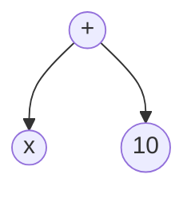
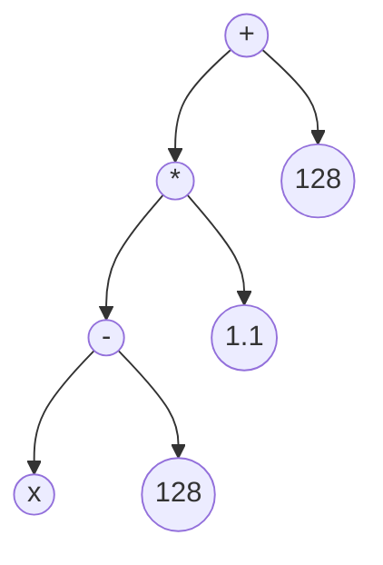

# 第三十章 Expr与后缀表达式

## 1. 后缀表达式

在前半学期的学习中，我们学到了各种各样的 VS 滤镜，以及许多瑕疵处理操作。
然而，到目前为止，我们还不知道如何进行哪怕最简单的像素运算。
比如，现在我想将一个视频的亮度提高 10，色度增强 10%，这该如何做到？

在 VS 里，对视频进行逐像素的运算操作，是通过 `Expr` 滤镜来实现的。
上述操作可以通过下面的代码实现：

```python
res = core.akarin.Expr(src, ["x 10 +", "x 128 - 1.1 * 128 +"])
```

观察结果，亮度确实增加了 10，色度也按我们的预期增强。
顺带一提，通过这个例子你就应该知道，如果我们想要造出 M2 那样的“鲜艳颜色”，应该如何实现了。

关于 `Expr` 的使用，我们暂且不做解释，不过能够注意到的是，这里使用的表达式与通常见到的有所不同。
实际上，这里使用的是后缀表达式，而我们平时见到的都是中缀表达式。

### (1). 计算的“树”

为了解释后缀和中缀的区别，我们还得从计算的“树”说起。

x + 10



(x - 128) * 1.1 + 128



计算的“树”，数据位于叶子节点，计算符号位于中间节点。计算的顺序是从下往上的，根节点是最终的结果。  
求解这个结果的过程，就是对树的遍历。

树的遍历有三种方式：先序、中序、后序。
   1. 先序是先访问当前节点，再访问左右子树。
   2. 中序是先访问左子树，再访问当前节点，最后访问右子树。
   3. 后序是先访问左右子树，再访问当前节点。

按照如上定义，前面两个树的遍历结果为：

```
先 + x 10  
中 x + 10  
后 x 10 +

先 + * - x 128 1.1 128  
中 x - 128 * 1.1 + 128  
后 x 128 - 1.1 * 128 +
```

不难发现，这三种遍历方式的最终的计算符号分别位于，数据的前、中、后位置，因此称为前缀、中缀、后缀表达式。


显然，后缀表达式不易于人的理解，那么为什么还要这样设计呢。经验告诉我们，在计算机中，凡是不利于人使用的，多半就是易于机器使用。
后缀表达式就是如此，它便于机器进行运算。

为什么后缀便于机器的运算，这还要再回到计算的“树”。  
我们知道树上的计算是自下而上的，也就是要得到某个节点的值，需要先算出它的所有子节点的值。  
中缀的方式，取得当前节点，也就是计算符号时，只获得了左子树，还必须等右子树计算完，这样日后必须再回溯过来，需要记录大量的中间状态。  
只有后缀的方式，取得计算符号时，所有子树都已经计算完，可以直接进行计算而不保留之前的状态。

也可以直接从表达式上理解，中缀方式必须要添加一定的括号以表示计算的优先级，而有了括号之后，必须先解析后面的括号确定计算顺序，再回溯过来完成计算。像这样需要向后面查找和向前回溯的方式，不合适计算机机械化的计算，因此我们使用后缀表达式来代替中缀表达式。

### (2). 后缀表达式的计算

下面我们通过一个例子来演示后缀表达式的计算。

```
x 0.3 * y 0.7 * +
```

我们使用“栈”来维护计算过程。“栈”是一种特殊的数据结构，它自下而上生长，满足先进后出的原则。你可以想象成搭积木，你只能从最上层加入或者移走一个积木，而下层的积木只能在上层都移走后才能移动。

我们创建一个空的栈，然后从左开始遍历表达式：遇到数据，就把它入栈，遇到计算符号，就根据符号需求，出栈需要的数据个数进行计算，然后把计算结果入栈。

首先是 x，是数据，入栈
```
[x]                     |   0.3 * y 0.7 * +
```
下一个元素，0.3，是数据，入栈
```
[x] [0.3]               |       * y 0.7 * +
```
下一个元素，乘法，是计算符号，它需要两个元素参与计算，我们弹出 [x] [0.3]，计算得到 [x * 0.3]，重新入栈
```
[x * 0.3]               |         y 0.7 * +
```
下一个，y，是数据，入栈
```
[x * 0.3] [y]           |           0.7 * +
```
再下一个，0.7，是数据，入栈
```
[x * 0.3] [y] [0.7]     |               * +
```
下一个，乘法，弹出顶层两个元素，计算得到 [y * 0.7]，重新入栈
```
[x * 0.3] [y * 0.7]     |                 +
```
最后，加法，弹出顶层两个元素，计算得到 [(x * 0.3) + (y * 0.7)]，重新入栈
```
[(x * 0.3) + (y * 0.7)] |
```

这时右边没有元素了，左边只剩一个 []，其中的元素就是后缀表达式的计算结果。

整理一下：
```
                        | x 0.3 * y 0.7 * +
[x]                     |   0.3 * y 0.7 * +
[x] [0.3]               |       * y 0.7 * +
[x * 0.3]               |         y 0.7 * +
[x * 0.3] [y]           |           0.7 * +
[x * 0.3] [y] [0.7]     |               * +
[x * 0.3] [y * 0.7]     |                 +
[(x * 0.3) + (y * 0.7)] |
```

不难发现，这个过程实际上也是转换得到中缀表达式的过程。

从后缀表达式转中缀表达式有个工具：`mvf.postfix2infix`。可以在命令行里使用它
```
>>> import mvsfunc as mvf
>>> mvf.postfix2infix('x y * z +')
'(x * y) + z'
>>> mvf.postfix2infix('x 0.3 * y 0.7 * +')
'(x * 0.3) + (y * 0.7)'
>>> mvf.postfix2infix('x 128 - 224 / 1023 *')
'((x - 128) / 224) * 1023'
>>> mvf.postfix2infix('x 40 - dup * 32 *')
'((x - 40) * (x - 40)) * 32'
```

### (3). 中缀表达式转为后缀表达式

在实际使用中，如何从 "x + 10" 这样的中缀表达式转化为 "x 10 +" 这样的后缀表达式呢？

一般而言有这样 4 步流程：

1. 将表达式转为函数调用

    即将形如 x + 10 的表达式，转为形如 Add(x, 10) 的函数调用形式

2. 将每个运算符，从括号的左边移到右边，而运算元保持不变

    Add(x, 10) => (10, x)Add

3. 将所有括号和逗号 '('、')'、',' 换成空格

    (x, 10)Add => x 10 Add

4. 将运算符改回符号形式 

    x 10 Add => x 10 +

这样就完成了中缀表达式转为后缀表达式。

换一个难一点的例子：
```
    x * y + z
=> （转换为函数调用形式）
    Add(Mul(x, y), z)
=> （把运算符从括号左边移到右边）
    ((x, y)Mul, z)Add
=> （把括号、逗号替换为空格）
    x y Mul z +
=> （把运算符替换为符号）
    x y * z +
```

这里强调一个特殊的运算符，也是目前常用运算符中唯一会遇到的 3 元运算符，`Mux`。
```
Mux(condition, true_value, false_value) / Mux(cond, x, y)
```

在 python 里，一般写为 `res = x if (cond) else y`。

在 C 语言里，一般写为 `res = (cond) ? x : y`。

在后缀表达式中，我们记为 `Conditional(cond, x, y)`，转为后缀形式是 `cond x y ?`。

练习：`(x > y) ? x : y`
```
=> (函数调用形式)
    Conditional(Greater(x, y), x, y)
=> （移动运算符）
    ((x, y)Greater, x, y)Conditional
=> （符号替换）
    x y > x y ?
```

下面是几个练习：
```
x * 0.3 + y * 0.7
(x - 128) / 224 * 1023 + 512
(x - 40) * (x - 40) * 32
```

最后一个例子，实际上我们会写为 `x 40 - dup * 32 *`
`dup` 这个操作是一个在栈上的操作，它会复制栈顶的元素，然后压栈。

类似的栈上操作还有 `swap`，它会交换栈顶的两个元素。

更一般地，有 `dupN` 和 `swapN`。
`dupN` 复制从栈顶往下数第 N 个元素，从 0 开始计数，有 `dup0 = dup`。
`swapN` 交换栈顶和从栈顶往下数第 N 个元素，也是从 0 开始计数，但 `swap0` 相当于自己和自己交换，因此不存在，最低从 `swap1` 开始，有 `swap1 = swap`。


## 2. Expr

### (1). Expr的使用

现在我们来看 `Expr` 滤镜，它有 `std.Expr` 和 `akarin.Expr` 两个版本。前者是 VS 内置滤镜，功能较少；后者是总监阿卡林重新实现的版本，除了支持原版的全部功能，还增加了大量高级功能，并且拥有更强的性能，因此现在我们直接使用阿卡林版。

https://github.com/AkarinVS/vapoursynth-plugin#expr

`Expr` 有 3 个关键参数：`clips`、`expr`、`format`。

`clips` 支持一个 clip 列表，提供在表达式中作为输入的 clip。一般来说要求这些 clip 的格式相同，除了 depth 可以不同。

`expr` 支持一个表达式列表，表达式的数量与输出的平面数相同。如果指定的表达式数量比平面少，后续平面都采用最后一个表达式。也就是说，如果只有一个表达式，意味着同时对所有平面处理。

`clips` 中的 clip 可以在 `expr` 中使用，按照 `clips` 出现的顺序，依次为 `x y z a b c ... w`，最多共 26 个。`akarin.Expr` 还提供了另一种别名，`srcN`。也就是说 `src0` 相当于 `x`, `src25` 相当于 `w`，这样就可以不限制输入的个数了。

`format` 指定输出 clip 的格式，在默认情况下，输出格式与输入的第一个 clip 相同。注意，虽然 format 可以指定 css，但实际不起作用，输出 clip 的 css 只取决于输入 clip。


对于整数 clip 输入，它们在 expr 中的取值就是整数值本身，计算过程中会变为浮点数来保持计算精度。即对于 8bit 输入，在 expr 值就是 `0~255`，对于 10bit 输入就是 `0~1023`。  
对于浮点 clip 输入，则大部分平面视为 `0~1`，而UV平面视为 `-0.5~0.5`。  
对于整数 clip 输出，值会 clamp 到 `[0, 2^bits_per_sample - 1]`。注意，这里并不会自动处理 full/limited range。  
对于浮点 clip 输出，不会有任何 clamp。这意味着浮点输出可能会有超过 1 的情况。  

对于空表达式，即 `expr=""`，会从第一个输入 clip 中复制数据，如果输入格式能够符合输出格式的话。如果不符合，输出数据会是未定值。

一个例子是：
```python
std.Expr(clips=[clipa16bit, clipb10bit, clipa8bit], expr=["x y 64 * + z 256 * + 3 /", ""])
```
这里允许不同 depth 的 clip 一起输入，输出默认为第一个 clip 的格式，也就是 16bit，由于第一个 clip 就是 16bit，那么空表达式的 UV 会复制 clip16bit 的 UV。

```python
std.Expr(clips=[clipa10bit, clipb16bit, clipa8bit], expr=["x 64 * y + z 256 * + 3 /", ""], format=vs.YUV420P16)
```
这里调整了一下顺序，输出指定为 16bit，而第一个 clip 是 10bit，无法直接复制，因此结果 UV 为垃圾数据。

### (2). Expr的简单用例

对比函数，检测两个 clip 是否完全相同，相同的给最大值，不同的给最小值。  
注意指定输出的 format 以满足不同 depth 的输入。

```python
cmp = core.akarin.Expr([res, ref], "x y = 255 0 ?", format=vs.YUV420P8)
```

现在尝试可以写一下 8-bit 和 16-bit 的 `MakeDiff`，`MergeDiff`，`Merge` 函数，并与 `std` 中函数的输出对比来验证你的实现。

```python
# MakeDiff
bit_depth = src.format.bits_per_sample
res = core.akarin.Expr([src, rg], f"x y - {1 << (bit_depth - 1)} +")

# MergeDiff
bit_depth = src.format.bits_per_sample
res = core.akarin.Expr([src, diff], f"x y + {1 << (bit_depth - 1)} -")

# Merge
weight = 0.8
res = core.akarin.Expr([src, rg], f"x {1 - weight} * y {weight} * +")
```

更复杂的例子，实现 8-bit `LimitFilter`，可以对着文档/课件之类的资料写，简单起见只用实现 `thr`, `elast` 参数就行。


## 3. 复杂 Expr 用法

`akarin.Expr` 提供了一些复杂但实用的高级功能，这里介绍一些常用的案例。

### (1). 像素坐标

我们可以在表达式里使用像素的坐标，用 `X` 和 `Y` 分别代表横、纵坐标。注意图像坐标轴原点是在左上角。  
每帧的宽高可以通过 `width` 和 `height` 来表示。

有了坐标，我们就可以灵活地框选区域。  
现在尝试框选，中央 `960 x 540` 的区域，将这个区域设为最大值，其他设为最小值。

```python
left = 480
right = 1920 - 480
top = 270
bottom = 1080 - 270
res = core.akarin.Expr(src, [f"X {left} >= X {right} < and Y {top} >= and Y {bottom} < and 65535 0 ?", f"X {left // 2} >= X {right // 2} < and Y {top // 2} >= and Y {bottom // 2} < and 65535 0 ?"], format=vs.YUV420P16)
```

现在我们就知道如果遇到画中画的情况，要怎么框选不同区域分别处理了。

利用坐标，我们还可以实现渐变的效果。  
比如我们现在想让图像从左到右从最小值渐变到最大值。

```python
res = core.akarin.Expr(src, ["X 235 256 * 16 256 * - width / * 16 256 * +", "X 240 256 * 16 256 * - width / * 16 256 * +"], format=vs.YUV420P16)
```

### (2). 当前帧数

可以使用 `N` 获取当前帧数。这可以让我们做一些时域的操作。  
比如现在我们想在两个 clip 连接处，做一段长度为 n 的渐变。

```python
src_a = src1
src_b = src2
n = 48

src_a_end = src_a[-n:]
src_b_begin = src_b[:n]

fade = core.akarin.Expr([src_a_end, src_b_begin], f"N {n-1} / y * 1 N {n-1} / - x * +")

res = src_a[:-n] + fade + src_b[n:]
```

### (3). props

可以在表达式中使用 props 数据，用法是 `clip.props_name`。  
比如获取 x 的 PlaneStatsAverage 数值，可以写为 `x.PlaneStatsAverage`。

### (4). 变量

可以在表达式使用变量，这样可以复用结果，简化表达式。  
使用 `var!` 保存栈顶元素并弹栈，命名为 var。  
之后使用该变量时，通过 `var@` 来调用，可以多次使用。

### (5). 多元操作符

expr 支持两个多元操作符：`dropN`、`sortN`。  
前者丢弃栈顶的 N 个元素。  
后者对栈顶的 N 个元素进行排序，最小的放到栈顶。

### (6). 相对像素访问

expr 支持除像素本身外的其他像素访问，相对像素访问允许访问该像素领域的其他像素。  
写法为 `x[relX,relY]`，这里要求 `-width < relX < width` 且 `-height < relY < height`。

在边界区域的邻域像素会出现超过图像大小的情况，expr 支持镜像（mirrored）和复制边缘（clamped）两种方式。可以通过添加后缀 `:m` 或者 `:c` 来指定，也可以通过滤镜的 `boundary` 参数统一指定。`0 = clamped`，`1 = mirrored`。

有了相对像素的邻域访问，我们就可以实现诸如 `RemoveGrain` 之类的滤镜。  
现在可以实现一下 `RG(4)` 和 `RG(20)`，并用 `std` 滤镜验证你的实现。

```python
# RG(20)
matrix = [f'x[{x},{y}] ' for x in range(-1, 2) for y in range(-1, 2)]
res = core.akarin.Expr(src, f"{''.join(matrix)} " + "+ " * 8 + "9 /")

# RG(4)
matrix = [f'x[{x},{y}] ' for x in range(-1, 2) for y in range(-1, 2)]
res = core.akarin.Expr(src, f"{''.join(matrix)} sort9 dup4 mid! drop9 mid@")

# RG(4) another
matrix = [f'x[{x},{y}] ' for x in range(-1, 2) for y in range(-1, 2)]
matrix.pop(4)
res = core.akarin.Expr(src, f"{''.join(matrix)} sort8 dup4 ma! dup3 mi! drop8 x mi@ ma@ clip")
```

## 4. Select

akarin 还提供了一个 `Select` 滤镜，他与 Expr 有一定相似之处。不同在于 Select 处理的不是每个像素，而是视频的每帧。

`clip_src` 是输入 clip 列表，结果的每帧会从这些 clip 里选择。  
`prop_src` 提供 props 的 clip 列表，它们只用于在后面 `expr` 中提供 props 数据。  
`expr` 是用于选择的表达式，与 Expr 不同，这里的结果不是像素值，而是一个 index，决定每帧选择 `clip_src` 列表里的哪个，index 从 0 开始计数。

除了 expr 的基本功能外，这里额外支持 `argminN`、`argmaxN`、`argsortN`。  
`argminN` 和 `argmaxN` 选取栈顶的 N 个元素，计算出最小/最大值的位置（index）。  
比如 `2 1 0 3 argmin4` 结果返回 `2`。这里 0 是最小的，位于第 3 个，相对坐标为 2。

`argsortN` 对栈顶 N 个元素排序，返回排序结果的位置，而不是值。
一般用于选取中间位置元素的情况。

Select 一般用于复杂的处理流程中，比如根据 descale 的误差动态的选取 ds 算法，这在后续课程会讲到。

另一个用处是代替 `std.FrameEval` 滤镜，FrameEval 的使用比较复杂，通过 Select 可以更直观的实现。
比如下面方式可以代替 30fps 处理中常见的 `mvsfunc.FilterIf` 函数。

```python
x = mvsfunc.FilterIf(src, flt, '_Combed', prop_clip)
x = core.akarin.Select([src, flt], prop_clip, 'x._Combed 1 0 ?') # when x._Combed is set and True, then pick the 2nd clip (flt)
```

另外，所有支持 `x.Prop` 的滤镜都可以访问字符串类型的 props 的第一个字节，读出来的结果是 ascii 值。

这恰好够读帧类型 `_PictType`，因此我们可以通过 Select 实现一些基于帧类型的操作。
