# 第一章 从零开始认识视频

视频已经与我们的日常生活息息相关，无论是在电视、电影院、电脑还是手机上，视频都随处可见。视频文件一般至少由视频轨以及音轨构成。本章将介绍视频轨的基本构成，包括色彩，采样，帧率，扫描方式，编码等方面。这些都是影响最终视频画面的关键因素。同时，本章还将涉及到视频文件的结构，即如何将以上元素整合在一起构建一个完整的视频文件。通过深入了解这些内容，读者将能够更好地理解视频制作和编辑的基本原理，为后续的视频处理工作奠定坚实的基础。

## 颜色

视频文件中，颜色主要由色彩空间（color space）、色彩原色（color primaries）、传输特性（transfer characteristics）、矩阵系数（matrix coefficients）以及色彩范围（color range）定义。

### 色彩空间 color space

视频的色彩空间是指用来描述视频颜色的一套规则，也可以说是定义视频中颜色的系统。常见的视频色彩空间有 RGB、YUV 和 YCbCr 等。RGB 是指红绿蓝三原色，也就是我们常说的光源的色彩系统；而 YUV 和 YCbCr 是指亮度（Y）和色度（U、V 或者 Cb、Cr）三个分量组成的颜色系统，一般用于描述传输视频信号。在 YUV 和 YCbCr 中，亮度是视频图像中最重要的成分，因为它直接决定了视频画面的明暗度，而色度则描述颜色中的色调和饱和度。

### 色彩原色 color primaries

#### 色彩原色的概念

在色彩学中，色彩原色指的是无法通过任何其他颜色混合而得到的颜色。在不同的色彩空间系统中，有不同的原色组合。可以分为 “叠加型” 和 “消减型” 两种系统。“叠加型” 的颜色系统通过不同颜色的光（原色），在黑暗的背景上产生颜色，一般是以光源投射的形式出现，例如 CRT。这套原色系统常被称为 “RGB 色彩空间”，亦即由红（R）绿（G）蓝（B）所组合出的色彩系统。相对的，“消减型” 的色彩系统是通过从 “白” 光中消去不需要的光谱（原色）。一般来说这种系统在透明或者反射介质上产生颜色，例如印刷品使用的 CMY 或者 CMYK 色彩系统。由于视频是以发光的显示屏作为载体显示的，因此在这里只讨论 RGB 颜色系统。

#### LMS 与 XYZ 色彩空间

“原色”并不是物理学中的一个概念，而是一个由人类视觉系统决定的生物学概念。人眼视网膜上有两种对光敏感的细胞：视杆细胞和视锥细胞。其中前者虽然数量庞大，而且对光非常敏感，但是主要负责夜视力，颜色学里面基本忽略；后者敏感度较低（相比前者通常 1 个光子就可以产生响应，后者需要大概 10 个），但是却能区分颜色。具体来讲，不同波长的光会使人眼中的三种视锥细胞产生不同的反应，从而导致我们感受到不同的颜色。

<figure style="text-align:center">
    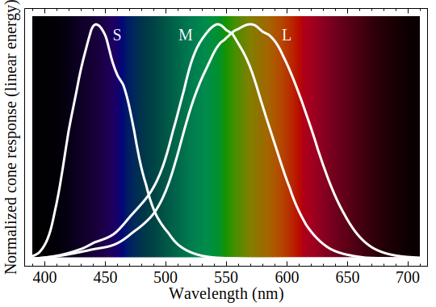
    <figcaption>人类视锥细胞对单色光谱刺激的归一化反应光谱，波长为纳米。</figcaption>
</figure>

这三种视锥细胞的归一化的频响曲线如上图。所谓频响（频率响应）指的是视锥细胞对各个波长的光的敏感度，也就是光的颜色对于视锥细胞的刺激能力。人眼中共有三种不同类型的视锥细胞，它们对光的波长的反应各不相同。具体来说：

- S型视锥细胞（short-wavelength cones，也称蓝色光感受器）对可见光的波长最短的部分做出反应，对紫色到蓝色的光较敏感；
- M型视锥细胞（middle-wavelength cones，也称绿色光感受器）对可见光的波长在中间部分做出反应，对绿色的光较敏感；
- L型视锥细胞（long-wavelength cones，也称红色光感受器）对可见光的波长最长的部分做出反应，对黄色到红色的光较敏感。

根据这个我们可以知道，假设每种细胞输出都是标量，那么我们要表示颜色也至少需要三个分量，三个原色。 然后直接用 L/M/S 细胞的输出的数值来表示颜色就已经用非负值表示所有人眼可以区分的颜色了。因此 LMS 颜色系统主要用于描述人类视网膜中的三种不同类型的视锥细胞对不同波长光的敏感度，它可以准确地描述人类视网膜中的颜色感知。在视觉心理学、医学等领域，LMS系统被广泛应用。

然而，在色彩科学中，人们更多地使用其他颜色空间，如 CIE XYZ 颜色空间。这是因为 CIE XYZ 颜色空间能够更好地描述光的亮度和色度，并且更符合色彩测量和色彩管理的需求。CIE XYZ 颜色空间是为标准化色彩测量和色彩管理而设计的，可以精确地计算不同颜色之间的差异和色彩变换，因此它在许多领域被广泛应用，如计算机图形学、印刷、电影制作等。

<figure style="text-align:center">
    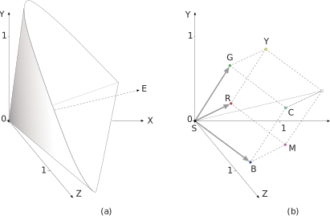
    <figcaption>CIE XYZ 色彩空间</figcaption>
</figure>

XYZ 色彩空间是由三个假想的原色 X、Y、Z 定义的，所有可见的颜色都位于一个三维锥状区域内（见图 CIE XYZ 色彩空间 (a)），选择这三种颜色是为了使所有可见的颜色都能被描述为纯正成分的总和（这个色彩空间分布于第一象限），其中 Y 成分对应于一个颜色的感知亮度或明度，它的原点是黑点（a）图中的 S，E 是表示中性（灰色）颜色的轴。如果将 RGB 色彩空间映射到 XYZ 空间则是如（b）图所示的一个立方体。

如前所述，XYZ 色彩空间的亮度沿 Y 轴增加，从位于坐标原点的黑点 S 开始（X=Y=Z=0）。色相与亮度无关。例如，白色是明亮的颜色，而灰色被认为是不太亮的白色。换句话说，白色和灰色的色度是一样的，而明度不同。因此在 XYZ 色彩空间中，色相与 Y 值无关。为了方便地描述相应的 "纯 "色相和饱和度，CIE系统还定义了三个色度值：

$$x = \frac{X}{X+Y+Z}$$
$$y = \frac{Y}{X+Y+Z}$$
$$z = \frac{Z}{X+Y+Z}$$

其中 $x+y+z=1$。那么在归一化以后，表示某一个颜色只需要两个参数，比如 `x` 和 `y`，且 `x` 和 `y` 都是 `[0, 1]` 范围内，且由于 `z >= 0` ， `x + y <= 1`。那么上述的公式就描述了从 X、Y、Z 坐标系到三维平面 $X+Y+Z=1$ 的中心投影，其中原点 S 是投影中心。如下图所示：

<figure style="text-align:center">
    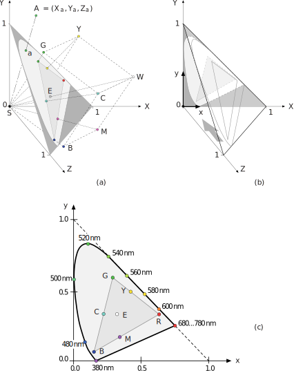
    <figcaption>CIE x, y 色度图</figcaption>
</figure>

因此，对于任意的 XYZ 空间中的色点 $A=(X_a, Y_a, Z_a)$，相应的色度坐标 $a=(x_a, y_a, z_a)$ 是通过将线 $\bar{SA}$ 与  $X+Y+Z=1$ 相交得到的。那么最终 x,y 色度图只需要去除 $Z$ 分量 $z_a$ 即可得到，而这个结果就是著名的马蹄形 CIE x, y 色度分布图（见图 (c)）。马蹄形的区域里面表示着所有可见的颜色，其中上边沿一圈是各种波长的单色光对应的点。

如上图所示 RGB 三种颜色就是色彩原色（color primaries），由这三个点构成的三角形内的色度都可以用三原色的不同配比组成。同理，CMY 三原色框选出来的三角形区域中的颜色也可以用这三原色通过不同配比表示。这是由颜色的可线性叠加的性质造成的，也就是说任意从马蹄形区域中选三个不共线的点，就可以做三原色，表示三点框出来的三角形内的所有颜色。所以三原色是不唯一的。

#### 视频中的色彩原色

由于 CIE XYZ 色彩空间包括了人类视觉系统可以看到的所有颜色，因此在视频标准中使用到的色彩空间也可以在 CIE x,y 色度图中找到对应的范围。

##### Rec. 601 标准

<figure style="text-align:center">
    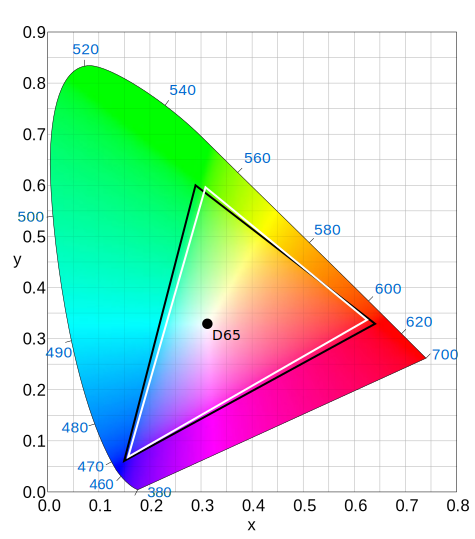
    <figcaption>Rec. 601 色度图。625 线（PAL 和 SECAM）显示为黑色；525线（NTSC SMPTE C primaries）显示为白色</figcaption>
</figure>

**Rec. 601** 标准，也就是标清 SDTV 用的颜色空间。可以看到，这个标准下，有两组原色，黑色框的顶点是 PAL 制式的原色，而白色框的顶点为 NTSC 制式的原色。对于制作 Rip 来说这个标准通常只会在 DVD 介质遇到。对于动画来说，特别是日本动画，一般是 NTSC 的标准。（注：这里的 NTSC 用的色域是由 Rec. 601 定义的，与下文 Rec. 709 用的 *primaries* 是一致的。但不同于我们一般说的 NTSC 1953 色域。NTSC 1953 要更古老。）

##### Rec. 709 标准

<figure style="text-align:center">
    
    <figcaption>Rec. 709 色度图</figcaption>
</figure>

**Rec. 709** 标准，高清 HDTV 用的颜色空间。他的色彩范围如图所示。HDTV 和 SDTV 是这样判断的：

```python
if width <= 1024 and height <= 576:
  SDTV = True
elif width <= 2048 and height <= 1536:
  HDTV = True
else:
  UHD = True
```

这里是个比较奇怪的点，HD 的定义是 1024 长 **或者** 576 高以上的，两个条件满足一个即可。也就是 480p 的 DVD 是 SD，用 601 标准；BD 里面 720p 或者 1080p 是HD，（1080p 又称作 FHD full HD）用 709 标准。 之所以只规定宽和高中的一个，是考虑电影的黑框
1280 宽的电影，由于长宽比超过 16:9，高度一般不足 576。切记不是必须 1024x576 或者以上才算 HD。

##### Rec. 2020 标准

<figure style="text-align:center">
    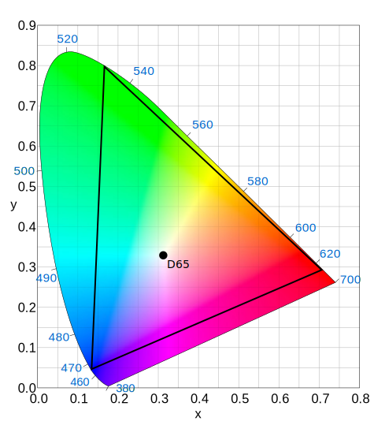
    <figcaption>Rec. 2020 色度图</figcaption>
</figure>

**Rec. 2020** 标准，超高清 UHDTV 使用的颜色空间。

如上文所述：只要是 2048 宽或者 1536 高以上，就可以判断为 UHD。Rec. 2020 这个框就明显大得多了，不过可惜目前还没有多少显示设备能完全覆盖这个区域。由于 Rec. 2020 的覆盖面积很大，目前实际上基本还在用 P3 范围，没有用到接近 Rec. 2020 范围边界的颜色。UHD 的标准确定为 Rec. 2020 是为了给将来做好准备。

不同的标准色彩原色不同，特别是 Rec. 601 本身就有两种，实际运用的时候记得小心区别。

此外，因为 XYZ 是线性空间，所以不同 *primaries* 之间可以线性映射，以保证在不同设备下颜色的一致性。

#### 白点

实际的 *primaries* 是个四元组，除了三个顶点（原色）的 x,y 坐标之外，还需要指定白点的位置。 形象地说，不同光照下颜色是不同的，而表示着光照条件的就是白点。白点有着不同的标准，比如 E 系列标准照明体，是频谱内全是平的，虽然理想，但是你现实中看电视绝对不是这种光照条件。我们平时常见的的 D 系列是模拟日光下的情况，例如常用的 D65 标准源大约相当于晴天室外正午时的光照，对应色温约为 6504 K。

### 传输特性 transfer characteristics

前面讨论的 RGB 颜色其实都是用 `[0, 1]` 范围内的实数表示的。计算机显然不能真的表示实数，虽然浮点数可以近似表示实数，但是用浮点数来表示视频中的颜色效率非常低，我们还是希望用整数来表示。因此需要将连续的实数转化为整数，这个步骤被称为量化（quantization）。

这个步骤看起来似乎并不是非常复杂。假设人类可以分辨的最低亮度是 1，那么我们直接记录它的倍数来表示更高的亮度。为了提高精度我们甚至可以假设这个能分辨的最低亮度是 10。像这样的量化，我们称之为*线性量化*。对应的颜色一般叫*线性光颜色*，表示数值与光的能量成正比（线性）关系。

不过实际用起来有一个问题，就是人眼可以区分的亮度范围很广，在不同的亮度下的分辨能力却不同，也就是说，人眼对亮度的感受并不是线性的。以 8-bit 视频为例，如果在这么广的范围平分 256 个区间量化为对应的数字，会导致高亮度的区域，相邻亮度级之间区别不大甚至根本没有。低亮度区域则区别过大，丢失了很多本来可以区分的亮度级。

所以为了更加好地利用可用的数值范围，我们使用非线性量化，低亮度区域相邻数值间的实际亮度差较低，高亮度的则大得多。
在这里描述量化后的数值与实际光的能量之间的对应关系函数就叫 *transfer*。这个词或许大家觉得陌生， *transfer* 在 DSP (digital signal processing) 中是传递（函数）的意思，是一个系统的输入和输出之间的数学关系，它描述了输入信号经过系统后产生的输出信号的变化规律。

熟悉视频的读者可能会对“gamma 校正”这个名词更熟悉。早期这种线性与非线性光的映射操作叫 gamma 校正。这是因为在显像管电视时代，输入电压跟输出的亮度之间的关系大概是个 $Out = In^{gamma}$ 的关系。当时使用的 gamma 值大约为2.4，随后工程师发现这样的输入输出关系基本上与人眼感受到的亮度是对应的。所以现在的 transfer 会使用类似的公式，但是具体的参数有所不同。

综上所述，线性光与非线性光之间的桥梁就是传输特性。

一般我们做视频处理都是直接用非线性光做，这才是一般大家提的 RGB。为了严谨起见，如果需要特地区分，非线性量化会在对应变量加上 `'` 表示。比如 `R'G'B'` 表示非线性量化的 RGB，特点是每个数值之间对人言来说亮度差异几乎一致。而不带角标的是线性的，跟物理上的能量直接对应。

### 矩阵系数 matrix coefficients

视频的 matrix coefficients（矩阵系数）是指在将 RGB（红绿蓝）颜色空间转换为 YUV（亮度、色度）颜色空间时，所使用的转换矩阵系数。

#### YUV 色彩空间

在介绍矩阵系数之前，还需要引出 YUV 色彩空间的概念。

<figure style="text-align:center">
    
    <figcaption>视错觉演示图</figcaption>
</figure>

当远看这张图时，你会发现它看起来像是一张彩色的图片，但当你近看这张图片就会发现，这张图整体为黑白色，只是在关键的位置加了非常零星的彩色点表示对应区域的颜色。尽管这个点间距极大，人眼依然会倾向于感觉对应的整片区域都是那个颜色。像这样的视错觉现象被称为色彩同化。原因是，人眼对亮度的分辨率异常敏感，相比之下，对颜色的分辨率就低得多。

如果我们要在有限的文件体积内压缩图片或视频，它的颜色信息就相对不如亮度信息重要。因此在视频编码时，考虑到数据压缩，我们选择用一种可以分离开亮度和“色度”（或者说颜色）的颜色编码。通过分离亮度和色度信息，就可以尽可能地去保留前者，有选择地通过损失后者的方法做到提高数据的利用率。换句话说就是在保证人能够观察到相同内容的前提下，减少数据量。这个编码就是 YUV，也有叫 YCbCr。

#### YUV 与 RGB

以 Rec. 709 标准为例，是这样一个转换方式:

$$
\begin{bmatrix}
   Y' \\\
   U \\\
   V \\\
\end{bmatrix} = 
\begin{bmatrix}
   0.2126 & 0.7152 & 0.0722 \\\
   -0.114572 & 0.385428 & 0.5 \\\
   0.5 & -0.454153 & -0.045847 \\\
\end{bmatrix}
\begin{bmatrix}
   R' \\\
   G' \\\
   B' \\\
\end{bmatrix}
$$

这个公式的含义是 YUV 可以通过 RGB 做一个线性操作得到。换句话说，YUV 也是另一种三“原色”，只不过 YUV 都不对应真实的颜色。Y 表示的人眼可见的亮度信息，而 UV 则表示纯颜色信息。 YUV 也可以通过先行操作转换到 RGB：

$$
\begin{bmatrix}
   R' \\\
   G' \\\
   B' \\\
\end{bmatrix} = 
\begin{bmatrix}
   1 & 0 & 1.5748 \\\
   1 & -0.187324 & -0.468124 \\\
   1 & 1.8556 & 0 \\\
\end{bmatrix}
\begin{bmatrix}
   Y' \\\
   U \\\
   V \\\
\end{bmatrix}
$$

前文介绍过， RGB 都是 [0, 1] 之间的实数，那么根据 Y'UV 转换到 R'G'B' 的公式可以发现：Y'UV 的数值范围分别是 [0, 1] [-0.5, 0.5] [-0.5, 0.5]。对上述公式稍加变换即可得到如下的内容：

$$
\begin{aligned}
Y' &= 0.2126R' + 0.7152G' + 0.0722B' \\\
U &= 0.5390(B' - Y') \\\
V &= 0.6350(R' - Y')
\end{aligned}
$$

Y' 直接用 R'G'B' 表示，UV 则换了一种等价的表示方式。这里 U 和 V 分别是 B' / R' 与 Y' 的差，最后乘一个系数使得最后范围是 [-0.5, 0.5]。因此 UV 这里也叫色差信号，分别用 U/Cb 表示（B'-Y'），和 V/Cr 表示（R'-Y'）。

注：在上述表达中，仅出现了 `Y'` 并没有出现 `U'` 或者 `V'`。这是因为 Y 是亮度，非线性量化的物理值，但 UV 在理论上是与亮度无关的，无需经过 gamma 校正。

#### matrix

可以看到 YUV 和 RGB 互转是通过一个矩阵乘法进行的，这个矩阵就叫 **matrix** 。不同的标准转换矩阵不同，Rec. 601 和 Rec. 709 的差异尤其明显，当你使用了错误的转换矩阵就会发生偏色。RGB 转 YUV 与 YUV 转 RGB 的俩个矩阵互为逆矩阵，所以一般只指定一个，用 **matrix** 统称。

### 色彩范围 color range

在前文中提到的 Y'UV 均为浮点数，但是视频却是以整数表示的，色彩范围就是浮点量化成整数时候所用的整数的范围。

以8-bit视频为例，Y 的值以 0-255 对应 [0, 1]。这样的对应关系被称为 `full range` 或者 `PC range`。而视频中更为常用被称为 `limited range` 的色彩范围。

> limited range 还有一个叫法叫 studio range，但在 VS 里面一般是统一称为 limited range。

以 8-bit 为例，在 `limited range` 中 Y 的实际范围是 [16, 235]， UV 的范围是 [16, 240]。其中 128 是 UV 的中点 0，16 表示 -0.5，240 表示 0.5。

#### limited range 的意义

有些读者可能会在这里产生疑问：我们用非线性量化是为了尽可能高效利用数值的范围，但这里却“浪费了”最高和最低的两段数字。

在低端不使用的 16 个数字，学名叫 `footroom`，高的那段叫 `headroom`

> HDI 标准中确实使用这部分不能用的数字表示 sync 信号。

不使用这两段数字的主要理由如下：

1. 一个实际的传感器输出的信号必然伴随着随机噪声（白噪声），这些噪声（能量）可正可负。如果我们要求输出的 0 点就是 0，就意味着正噪声可以表示，负噪声一律变成了 0（截断）。这意味着平均的噪声不再是 0，0 点实际偏高了。因此 `footroom` 是必须保留的。
2. 在数字信号处理过程中，很多处理算法是不能保证输出的范围跟输入匹配的。很有可能在过程中发生 `overshoot`（过冲，高于输入上限）和 `undershoot`（低于输入下限）。对于这种情况，通常只需要使用 `clamp`，将超过上下限的数值钳位到对应的极值。但是很明显的，这是一个非线性的操作，这就会引入额外的噪声。`footroom` 和 `headroom` 的意义在于可以连续多个处理后一次性做这个 `clamp` 操作，以此避免多次引入非线性噪声。（这个操作可以近似理解为做四则运算的时候，多保留几位有效数字，最后再通过一次四舍五入得到需要的精度，而不是每做一步都做一次四舍五入）

#### Range 的换算

虽然 YUV 视频一般是用 `limited range`，但是也有例外情况是 `full range`。以下是一个基于 8-bit 视频的公式：

$$Y_{limited} = round({219\over255}*Y_{full}) +16$$

当然，在实际操作中在进行转换时应当使用更高的精度，那么在转换过程中出现的四舍五入导致的误差才可以被忽略。在 VS 的操作中可以将 8-bit 源先转换成 16-bit 源再进行后续处理。

对于不同位深度的视频，以 8-bit 转 10-bit 为例：8-bit limited Y [16,235], UV [16,240]，转换到 10-bit limited，Y就是 [16⋅4, 235⋅4] 或者说 [64, 940]，UV 则是 [64, 960]。

> full 和 limited 在提高位宽 k bits 的时候的行为是不同的，limited 直接乘以 2^k 即可，但是 full 则要做一个完整的重映射，比如 8bit full Y 到 10bit full Y，需要做一个 `1023 * Y8 / 255` 的映射，不是直接乘以4了。

UV 从 full range 转换到 limited range 有一个额外的注意点：limited range U/V 有奇数个数，正好 0 点两边是对称的，full range U/V 一共有 256 个数值，刨去 0 之外不是偶数，所以左右不对称了。因此根据选择，这个转换可以拥有两个相似但不等价的公式。而为了避免这个情况，可以在浮点数下运算，再四舍五入。

> full range UV 的时候有两种转换方式，因为 128 两侧的数字不一样多，但是 limited 的时候两侧是一样多的，浮点转回去的时候 就是 224*U + 16.

### 总结

这里稍微总结一下关键的必须理解的几个有关颜色概念：

1. 色彩原色（color primaries）：RGB 里面的三原色和白点的位置，决定了可表示的颜色的范围。
2. 传输特性（transfer characteristics）：线性光和非线性光之间的纽带，形式为 $Out = In^{gamma}$ ，所以传统上也叫 gamma 校正。
3. 矩阵系数（matrix coefficients）：视频编码实际用的 YUV 颜色与显示用的 RGB 之间的转换矩阵。
4. 色彩范围（color range）：YUV 编码时每个分量所使用的亮度和颜色取值的范围。

不同的视频标准（比如 SD 的 Rec. 601 和 HD 的 Rec. 709，UHD 使用的 Rec. 2020）会分别指定 primaries / transfer / matrix，我们在做相应的转换的时候可能需要指定所用的标准。

## 视频

一个视频文件的视频轨有很多属性，包括上文详细说明的颜色，帧率（frame rate），帧率模式（frame rate mode），扫描模式（scanning system），色度抽样（chroma subsampling），编码设置（encoding settings）等。这些属性对视频最终呈现的效果都有着很大的影响。下文将详细解释帧率/帧率模式、扫描模式、色度抽样以及编码的基本概念。

### 帧率与帧率模式

视频帧率指的是每秒钟播放的帧数，它是衡量视频流畅度的重要指标之一。通常我们看到的视频帧率为 24 帧/秒、30 帧/秒、60 帧/秒等。

帧率模式则指的是帧率变化的模式，主要有两种：

1. 固定帧率（`Constant Frame Rate`，简称 `CFR`）：视频的帧率在整个视频中保持不变，这种模式适用于大多数场景。
2. 可变帧率（`Variable Frame Rate`，简称 `VFR`）：视频的帧率会根据内容和需要，发生变化。例如，当视频画面中大部分时间静态不变，只有少数时间段需要高帧率时，就可以采用VFR模式。这样可以节省存储空间，同时保证视频画面的流畅。更多有关 VFR 的内容会在 30 fps 相关的教程中展示。

### 扫描模式

视频的扫描模式指的是视频的扫描方式，目前主流的视频扫描模式有两种：隔行扫描（interlaced scan）和逐行扫描（progressive scan）。

#### 隔行（interlaced）

隔行扫描也称为交错，它将画面分为奇数行和偶数行两个半场，每个半场称为一个“场”，奇数行的场称为顶场（top field），偶数行的场称为底场（bottom field）。它会先发送完整的一场（比如先发送 top，但这个先后顺序不是固定的），然后再发送另一场。

> 先后顺序不是固定的，是指不同视频中，先 top field 还是先 bottom field 不一定，当然一个视频里面切换是很难的，一旦开始传输了，就只能依赖上一个顺序一直传了。不过有例外的情况，也就是孤场的情况，很少见。一般是低劣的剪辑导致的。

<figure style="text-align:center">
    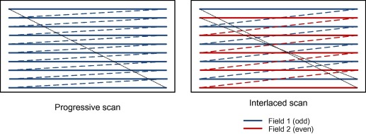
    <figcaption>逐行扫描与隔行扫描</figcaption>
</figure>

> 注：图中的线条顺序可以理解为 CRT 电子枪扫描的轨迹。可以看到右图先扫描了其中一场，扫描完成后再扫描另一场，然后交替往复。

这就导致隔行的视频，我们不用帧率 `frame rate` 来说，而是场的速度，`field rate`，是 “帧率” 的两倍。

#### 逐行（progressive）

如同字面意思，它按照每一行的顺序依次扫描并显示每一行的亮度信息。与逐行扫描相比，它的主要优点在于画面更为清晰、细节更加丰富。但由于数据量更大，传输效率相较逐行扫描要低一些。

#### 表示方式

逐行视频用 `p` 表示，比如常见的 `1080p` 表示 1080 高度的逐行视频，又比如我们经常用 24p 表示 24 fps 的逐行视频。
隔行视频则是 `i` 表示，`1080i `表示 1080 高度，每场 540 高度的视频。 而如果用帧率表示，`i` 需要用场的速度来表示，也就是`60i`，表示 60 场每秒或 30 “帧” 每秒的视频。

#### 隔行扫描的特性

从上面的说明来看，似乎隔行视频只是先采集一张图然后分成两场分开传输，但这只是其中一种可能称为 PsF（progressive segment frame）。而实际的隔行或者交错视频，两场的采集时间不同。换句话说，以 `60i` 为例，每 1/60s 采集一场，这里的采集可以认为是摄像头曝光一次。因此当你遇到一个交错视频时，就会看到拉丝的现象、这是因为物体运动较快，由于采集时间不同，上下场的内容无法对齐。

隔行视频在早期模拟电视的时候是必须的，当时的黑白电视使用隔行扫描显示画面。由于视觉暂留的存在，其实人在 CRT 上看60场每秒的视频比30fps的视频要连贯。这是由 CRT 的长余晖特性导致的。

### 色度抽样（chroma subsampling）

无论图片还是视频中的每一帧，都是一个矩形的像素阵组成的，每个像素用 RGB 或者 YUV 表示其颜色。就像前文对 YUV 的介绍，由于人对亮度的感知比对色度的感知更为敏感，因此用相同的采样数来表示亮度和色度会浪费大量的带宽和存储空间。视频削减UV的码率最主要的方式是通过 `chroma subsampling` 色度抽样（或称为下采样）的技术做的。（UV 统称是 `chroma`，Y 则叫 `luma`）。换句话说，多个像素共用一个 UV 的值。再换句话说，通过色度抽样技术，让 UV 的分辨率低于 Y 的分辨率，正好对应了人眼的亮度分辨率高于色度分辨率的特性。

> VS里面可能会简称 css

<figure style="text-align:center">
    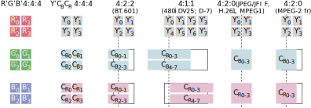
    <figcaption>色度抽样</figcaption>
</figure>

值得注意的是，看这张图的时候，需要想象上中下三行其实叠在一起的。最左边 `2x2` 的四个像素，分别对应 `2x2 R'` `2x2 G'` `2x2 B'` 这是正常的大家熟知的形式，没有做`subsampling`。右边的 `YCbCr 444` 则是直接把 `RGB` 转换 `YCbCr` 但是依然没有下采样。接下去的几种都是下采样的方式。

这里先说明一下`4:4:4`这种数字的含义：`I:J:K` 三个数，假设第一行 `I` 个像素，因为 `Y` 不会下采样，所以会有 `I` 个 `Y`，第二个 `J` 表示这一行有多少个 `UV`，再下一个 `K` 表示下面一行 `I` 个像素又编码了几个 `UV`。

> 注：这里 `UV` 是以一对为单位的，意思是一个 `U` 一个 `V`。
> 一个 `UV`、一个 `UV` 对、一对 `UV`，描述的是相同的事物。

- `4:4:4` 代表4个像素的行，第一行编码了 4 个 `UV`，第二行也编码了 4 个 `UV`。所以这两行 `YUV` 总共 8 个 Y，8 个 `UV`，没有下采样。

- `4:2:2`表示 4 个像素的行，第一行编码两个 `UV`，第二行再编码两个 `UV`。相当于假设是 2 个像素的行，第一行共用一个 `UV`对，第二行共用一个 `UV`对，也就是图里面示意的样子
- `4:1:1` 代表一行 4 个像素，第一行与第二行均为 1 个`UV`。
- `4:2:0` 的意思是一行 4 个像素，第一行 2 个`UV`，第二行没有再编码`UV`了。于是两行共 8 个像素里面 只编码了 2 个`UV`对，换句话说，`2x2`的 4 个像素共享一个`UV`对。`4:2:0` 并不表示具体 `Cb/Cr`采样在哪里，只是表示多少个`Y`对应多少个 `Cb` 多少个 `Cr` 而已。图中为了表示多个像素共享一个`Cb/Cr`，所以把对应的框框画大了。

一般来说，制作 BDRip 只有两个 css 需要遇到，分别是 444 和 420。422 一般只有母带会用。

#### 色度位置（chroma location）

在进行色度抽样时，根据视频帧中的色度分量的放置位置，可以衍生出不同的色度位置。`chroma location` 也被称为 `chroma placement` ，一般缩写为 `chromaloc` 或 `cplace`。

如色度抽样的示意图所展示的，`4:2:2`，`4:1:1`, `4:2:0` 中出现的虚线代表 `Y` 与 `UV` 的对齐关系。所以同样是 `4:2:0`  的色度抽样，就存在两种类型的 `chroma location` 。左侧的是 `JPEG/MPEG-1 chroma location`，`Cb`/`Cr` 对齐的是 2x2 像素的中点。右边的叫 `MPEG-2 chroma location`，`Cb`/`Cr` 对齐的是左边一列的中点。可以从名称中发现，第一种色度位置是用于 `MPEG-1` 和 `JPEG`；第二种是 `MPEG-2` 以及后续的视频编码标准（比如 AVC 和 HEVC）使用的。两种 `chroma location` 看似差别不大（0.5 像素的偏差），但实际上有着肉眼可见的区别。比如 `chroma shift` 类的瑕疵就可能是使用了错误的 `chroma location` 导致的。

细心的读者可能会发现在 `MPEG-1 cplace` 中，`Cb` 中心点与实际下采样之前 `2x2` 个 `Cb` 的中心点都不重合；相对的 `MPEG-2` 的 `Cb` 中心点其实与原本的第一列的 `Cb` 的中心点是重合的。当中心点重合时计算量会小一点，因此当进行插值运算将下采样的结果恢复为 `4:4:4` 时，这种 `MPEG-2` 的排列方式更好。

虽然上图的像素表示为一个方框，但理论中的像素可以认为是采样的是中点所在无穷小的点位置的**值**。虽然实际当中， 不管是采集设备还是显示设备，实际像素是有限面积的，但是这都是表示近似的概念。为了更好的理解像素，下采样等概念，下面再举一个例子：

<figure style="text-align:center">
    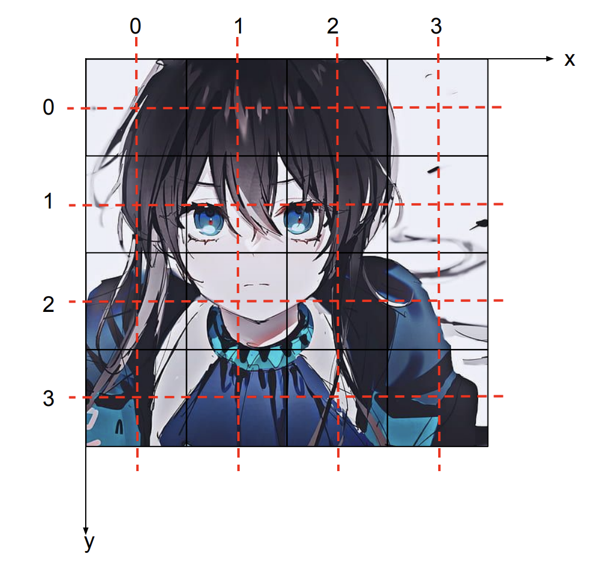
    <figcaption>sampling grid</figcaption>
</figure>

我们以扫描为例来说明，你可以认为你有一个标记有均匀排列的 $N \times M$ 个点的阵列的透明薄膜， 覆盖在要扫描的图片上，然后你读取每个点底下那个点的颜色值，作为对应的像素的值。实际上我们说的像素，只有红色横线和竖线相交的 16 个点。这里面的采样点就是图中的 16 个整数坐标点，采样点是无穷小的点。

然后我们再来说 `cplace`。以上图为例，假设是 $4\times4$ 的采样点，那么 Y 的采样点就在红线的交界处。444 下采样的时候，`Cb` 和 `Cr` 的采样点也跟 `Y` 的位置重合。假如是 420 下采样，则一共有 4 对采样点，假设这里考虑 420 JPEG/MPEG-1 下采样，则可以得到如下的 `Cb` 和 `Cr` 采样点：

<figure style="text-align:center">
    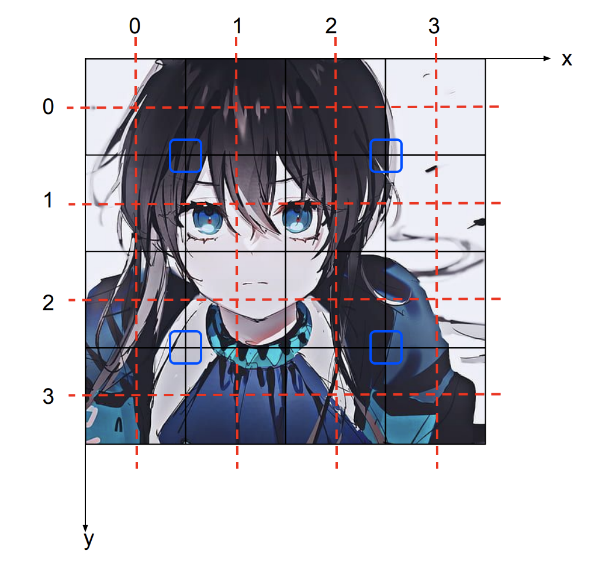
    <figcaption>sampling grid 420 JPEG/MPEG-1</figcaption>
</figure>

420 JPEG/MPEG-1 下 `Cb` `Cr` 采样点坐标： (0.5, 0.5), (0.5, 2.5), (2.5, 0.5), (2.5, 2.5)，坐标**并不是整数**。另一种 420（MPEG-2）下 `Cb` `Cr` 采样点坐标： (0, 0.5), (2, 0.5), (0, 2.5), (2, 2.5)。刚才的 X-Y 坐标系就是 `sampling grid`。

有了 `sampling grid` 的概念之后，很多图像变换就可以用这个概念解释，比如图片放大和缩小，这里不做展开。

此外，对于这种非整数位置的采样点，其数值是通过函数插值确定的。比如一维函数中最简单的差值——线性插值，即相邻的点中点的值就是与之相邻两点的值的平均值。比如说，(0.5, 0.5) 这个点的值，就可以用相邻四个整数点的值的平均来估计。

### 视频编码的基础概念

现在我们来说说视频编码中的基础概念。前面我们讲了视频编码使用 YUV 来存放颜色，这样 `css` (`chroma subsampling`) 就可以减少一部分数据量。但是视频中的冗余信息显然不只如此。

<figure style="text-align:center">
    
    <figcaption>I/P/B帧</figcaption>
</figure>

以这个吃豆豆的 4 帧视频为例。豆豆不断从右侧移动进来。

- 首先黄色的部分每帧都是一模一样的，所以视频后面几帧是可以直接复制前面一帧的内容，这就可以再节约一部分码率。

- 不过对于豆豆来说，这种直接复制前面一帧的对应区域的办法就行不通了。虽然豆豆是一样的，但是相邻帧的位置有变化。对此视频编码一般有运动预测或者运动补偿。也就是后一帧不光可以引用前一帧相同部分的像素，也可以引用其他部分的一个块的值。

  这样第二帧就完美了：白色的背景，黄色的从第一张图直接复制，豆豆是第一张图的虚线区域往左挪一点。这里一帧引用其他帧的内容我们就要 `ref`（`reference`），被引用的帧就被称作 `reference frame` 。

- 第三帧问题又来了。屏幕上四个豆豆，前面的帧都只有3个。我们假设四个豆子各不相同，那么这第四个是没办法用前面的帧来替换了，我们就束手无策只能在这帧重新编码一下这个内容了么？对于最早期的视频编码标准来说，确实是如此。不过细心的读者可能会发现第四帧就有这第四个豆子。假设我们能未卜先知，是不是可以用第四帧来编码第三帧呢？这就是是第四帧到第三帧的反向的箭头。可能读者会存在疑问：视频是按顺序播放的，我们怎么知道下一帧的内容？这是因为视频虽然按顺序播放，但是不一定是按顺序解码的。我们可以先编码第四帧，然后再编码第三帧，播放时也是先解码第四帧，随后解码第三帧，在播放时，调整显示的顺序。

  这里就引入了两个时间戳的概念，由于这种利用未来预测当下的存在，视频存在两种时间戳 `dts` 和 `pts`。`dts` - `decode timestamp`；`pts` - `presentation timestamp`。`dts` 是解码器必须解码一帧的时间，这里图中第四帧的时间在第三帧之前。`pts` 是一帧需要展现到屏幕的时间戳，1、2、3、4，是依次递增的。

#### I/P/B 帧

- 图中这四帧，第一帧是完整编码的，我们称之为 `I帧`, `intra-coded frame` ，又称作 `key 帧`。表示这帧不依赖其他帧，可以独立解码。
- 第二帧只依赖过去的帧的内容，我们叫 `P 帧`，`predicated frame`。如前文所说，这早期的视频编码只有这一种预测帧，所以 P 就被占用了。
- 按照前文的叙述，第三帧这种同时依赖前面第二帧和后面第四帧也一样是通过预测得到的，但是无奈 P 这种类型已经占用，为了区别于前文所提的仅向前预测的帧，所以发明了一个新词，叫 `B 帧`，双向预测帧 `bipredicated frame` 。这就是 I/P/B 帧的概念。

#### GOP & IDR

就像前文所说，I 帧总是可以被独立解码，而 P/B 帧必须参考其他帧。除非转场，由于视频的帧之间都会存在可以互相引用的内容，这些 P/B 帧可能会引用 I 帧以前的内容。这在顺序播放时并不会成为障碍，但如果需要跳转，则需要从这一帧所参考到的 I 帧开始逐级解码，很容易引起无法拖动进度条的现象。为了解决这个问题，视频编码器会在适当的时候插入一个可以用来开始解码的特殊的 I 帧，这种帧叫 `IDR` , `instantaneous decoder fresh`。

在遇到 `IDR` 帧时，解码器可以立即丢弃前面已经解码的所有帧，直接从该 `IDR` 帧开始解码。这是因为 `IDR` 帧代表在该帧以后的内容不会引用该 `IDR` 之前的帧。

<figure style="text-align:center">
    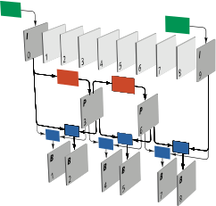
    <figcaption>GOP 结构 IBBPBBPBB</figcaption>
</figure>

两个 I 帧之间的这些帧，包含第一个 I 帧，但不包含第二个，我们称之为 `GOP` （`Group of pictures`）。上图是一个可以表示为 `IBBPBBPBB` 的 GOP 结构，箭头表示参考关系。从图中可以看出，在第 6 帧（P 帧）以后的两个 B 帧均参考了第 9 帧（I 帧），这种 GOP 中的帧可以参考其他 GOP 的情况被称为`open GOP`。相对的，如果这两个 I 帧均为 IDR，则由于 IDR 帧的特殊性， GOP 中的帧既不能向第一个 IDR 帧以前的内容参考，也不可以向下一个 IDR 帧以后的内容参考，那么这个 GOP 就被称为 `closed GOP`。

<figure style="text-align:center">
    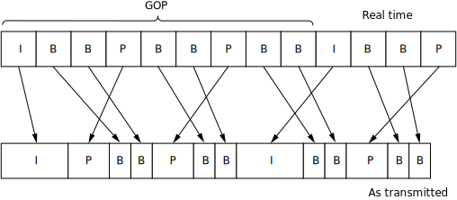
    <figcaption>GOP 结构传输</figcaption>
</figure>

上图是 GOP 的实际传输情况。第一个 GOP 的最后两个 B 帧是在第二个 GOP 的 I 帧之后传输的。对于这种情况，解码器如果从第二个GOP开始解码，会忽略中间的两个 B 帧（他们甚至可能无法解码，因为是 B 帧，可能依赖上一个 GOP 的帧）。此外，细心的读者可能会注意到：第二个条中表示一帧的方块的长度其实表示了帧的数据的相对尺寸的，可以看到 I 远大于 P ， P 远大于 B。所以一般视频里 I 的数量最少，P 其次，B 最多。

根据上文提出的概念，`closed GOP` 内的帧只能互相参照，不能参照这个区间之外的内容，这就是可以完整切割并保证播放的最⼩单元。所以，在不重新编码的前提下，视频的切割（⽐如 mkvtoolnix），⼀定是从⼀个 IDR 开始切割，切割到另⼀个 IDR 之前⼀帧，或者末尾。

## 视频文件

这一节将会剖析视频文件，分析其构成。

### 容器

看过[科普](https://vcb-s.com/archives/2726)的应该了解到**容器**的概念了，现在一定明白 `mkv` 比 `mp4` 画质好这种说法非常荒谬。

现实中我们遇到的视频，一般是 `mp4`、`mkv/webm`、`mov `甚至 `avi`、`wmv` 这些后缀的文件，对于这些文件格式，我们称为**容器(container)**，意为承载其他东西的文件。

为什么需要容器呢？因为视频 raw 一般无法独立使用，绝大多数情况要搭配声音播放。以 VCB-S 的 BDRip 为例，多条音轨也很常见，主音轨之外可能还有评论音轨。有些甚至还有字幕轨道。这些复杂性就意味着需要一个足够灵活的“容器”来承载这些轨道。

### 轨道

一般我们将容器中承载的数据分为轨道，比如**视频轨**，**音频轨** ，**字幕轨**（章节信息不是轨道，是独立的。）

### 结构

以最常用的 `mkv` 格式为例，具体剖析视频文件的构成。`mkv` 文件可以通过 [mkvtoolnix-gui](https://mkvtoolnix.download/) 的 `info tool` 工具来看视频文件结构。

<figure style="text-align:center">
    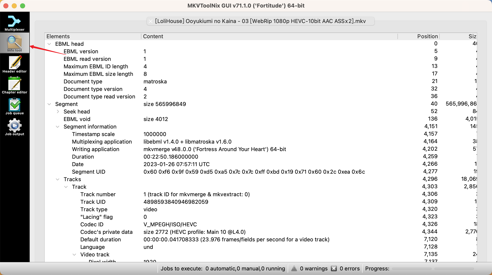
    <figcaption>mkv info tool</figcaption>
</figure>

顺带一说 `Matroska` 容器，这个名字来源是 `Matryoshka doll`，也就是俄罗斯套娃，或许也在暗示这个格式的特性。

<figure style="text-align:center">
    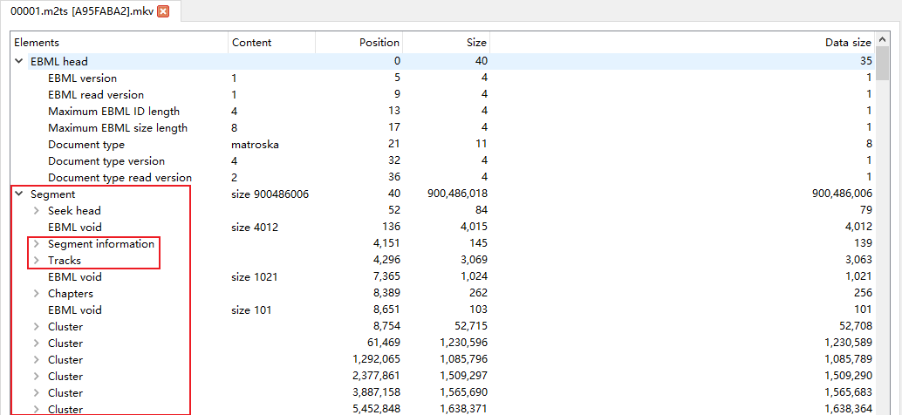
    <figcaption>mkv 结构</figcaption>
</figure>

一个 mkv 的结构大致如图所示，上文说过 `mkv` 名字来源于俄罗斯套娃，其实一个 mkv 里面分 `segment`，每个 `segment` 才包括 `track`。`segment` 才是我们一般意义上说的一个视频（包括音频视频等等），因此可以发现，mkv就是在做这样的套娃操作。其中 `segment info` 和 `tracks` 就是最重要的 `metadata` 了。

#### Segment information

<figure style="text-align:center">
    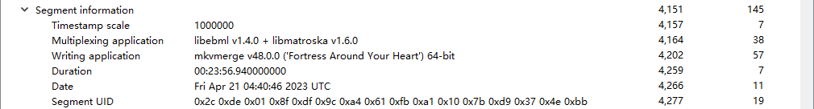
    <figcaption>mkv segment information</figcaption>
</figure>

`Segment info` 主要包括一些在 `mediainfo` 里看到的应用程序的名字版本/混流的时间戳等等。

`timestamp scale`，它表示了 mkv 里面时间戳的精度，单位是 ns。这里的数字是 1M 对吧，说明 mkv 里面时间戳精度只有 1 ms。这就解释了为什么比如说 ass 特效，也只有 ms 级别的时间精度。当然理论上 scale 是可以改的，从单位 ns 也可以看出标准是非常灵活的，但是实际上 mkvtoolnix 默认值就是 1M scale。

`segment UID `是个 UUID，用于唯一标志一个 `segment`，这个如果你要用 mkv 的高级用法(e.g. [Ordered Chapter](https://www.nmm-hd.org/bbs/thread-1178-1-1.html))可能会遇到。

> 虽然 mkv 的标准中保留了多个 segments 的可能性，但正常的视频文件仅含有单个 segment。

#### Track

<figure style="text-align:center">
    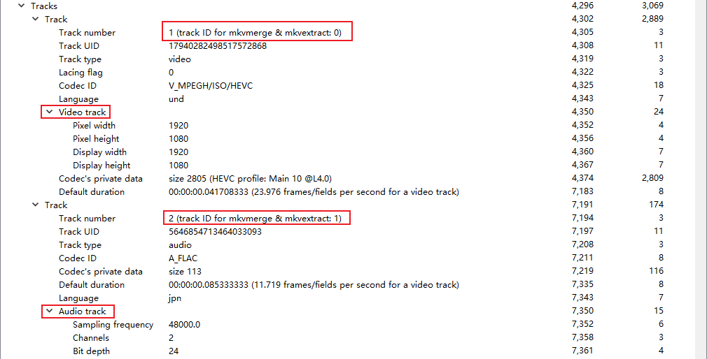
    <figcaption>mkv track information</figcaption>
</figure>

`Tracks` 里面包含这个文件里面的视频轨音频轨的信息。

`Track number` 这里注意，有个从 0 开始还是从 1 开始的问题，这里也列出来了工具用 0 开始的`track number`。

#### Cluster

mkv 的核心数据被记录在这里：

<figure style="text-align:center">
    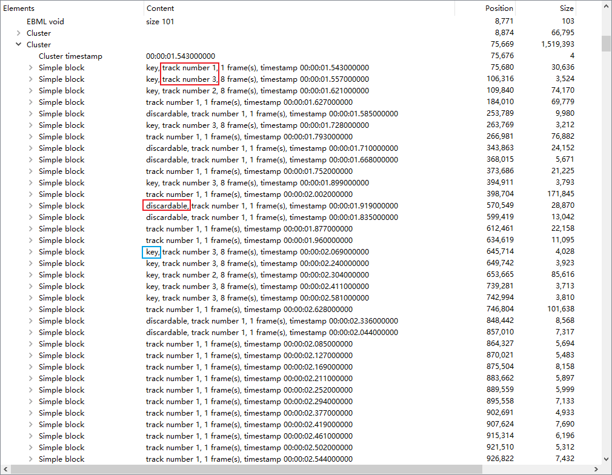
    <figcaption>mkv cluster information</figcaption>
</figure>

这里可以观察到：

1. mkv 里面不同 `track` 的数据是交错在一起存储的，一个 `cluster` 表示一小段时间对应的所有轨道的数据，`cluster` 一般是 mkv seek 的目标。也就是最不济也可以根据时间戳 seek 到对应的 cluster。

   这里面概念较多，其中 `discardable` 这个概念不是很重要，不被引用的帧都是 `discardable`。这是表示如果播放器在定位到一个`cluster`之后，然后想通过逐帧解码来定位到某个具体的帧，`discardable` 的帧可以不解码直接跳过。`key` 表示是前文提过的 I 帧。

2. 这里可以看出 `track1`（视频）、`track2`（音频）都是分 `frame` 存放的。然后你有时候用 `mkvmerge` 切割时会发现，pcm 音频明明是可以完美按照 `sample` 切割的，但切割后却会出现 audio delay？就是这里的 `frame` 在作怪。`mkvmerge` 只能按照整数个 `frame` 来切割（音视频都是如此），即使是 `pcm` 音频。

> 这里会发现部分 timestamp 并不是按照顺序出现的，这个就是因为 GOP 在传输过程中不同帧解码顺序的需求造成的，具体内容参见 GOP 节。
>
> `framing` 与视频的帧（frame）不是一个概念，是通信协议上的 `frame`。所有音视频编码都是分 `frame` 来编码的，比如视频是帧为单位，音频则是以几十到一百多 ms 为单位做一个 `audio frame` 来压缩，目前暂时可以认为是能够独立解码的最小单位。

#### Cues

<figure style="text-align:center">
    
    <figcaption>mkv cues information</figcaption>
</figure>

在一堆 `clusters` 之后是 `cues`。这个是帮助播放器 `seek` 的。给出了若干时间对应到 `segment` 的文件起始偏移量的数据。播放器加载了这个表格，对着 `timestamp` 做个二分搜索，找到最近的之前一个时间戳所在的 `cue`，然后就定位到了对应的 `cluster`。这就解释了为什么 `raw` 视频（直接通过 x264/265 等编码器编码生成的文件）是不能 `seek` 的。但是 `mkv` 却可以快速地任意 `seek`。

#### Tags

<figure style="text-align:center">
    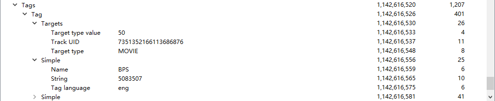
    <figcaption>mkv tags information</figcaption>
</figure>

mkv 的最末尾有一个 `Tags` 段，这里面记录了 `mediainfo`，可以看到总时长、帧数、BPS（bits per second）之类的信息。mkv 的 tag 系统比 mp3 等的强大得多，有兴趣的可以自行阅读 [MKV Spec](https://www.matroska.org/technical/tagging.html) 和 mkvmerge 的文档。

#### Chapter

<figure style="text-align:center">
    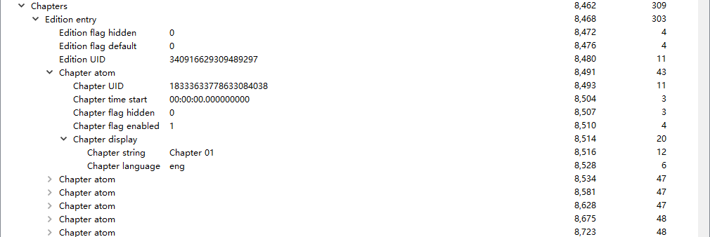
    <figcaption>mkv chapter information</figcaption>
</figure>

Chapter 记录了章节的时间，名称，语言等信息，这些内容可以与 `mediainfo` 中看到的章节信息一一对应。

