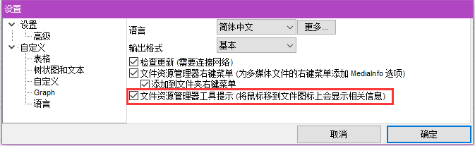
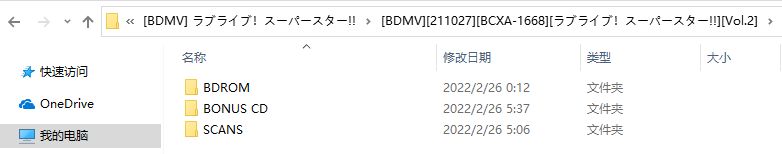
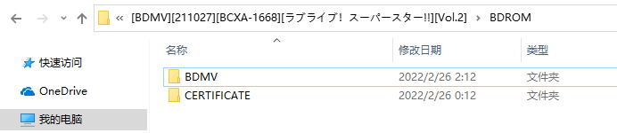
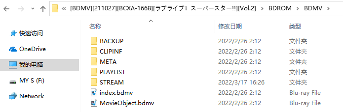
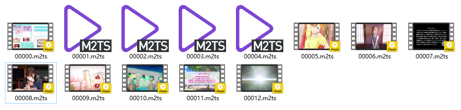
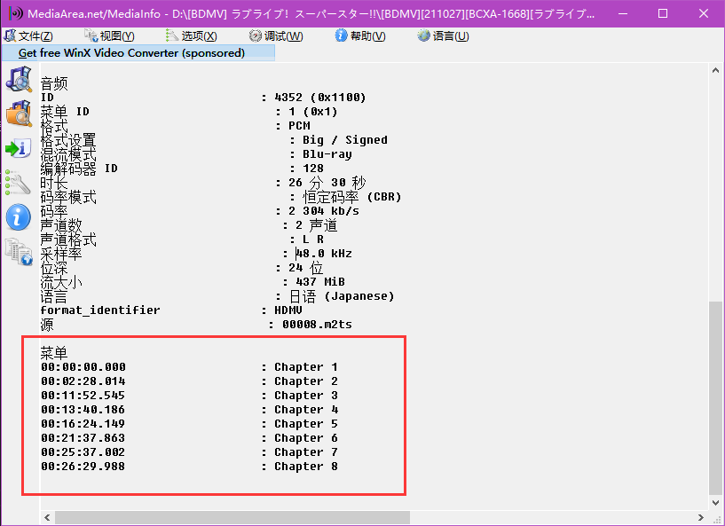

# 第二章 一切的起点——认识BD

## 0. 前期准备

在学习如何制作 BDRip 之前，我们首先来认识一下 BD 结构。这里我们以 Love Live! Superstar!! 第一季的第二卷原盘作为例子，你可以在这里下载 [https://nyaa.si/view/1502837](https://nyaa.si/view/1502837)。当然你也可以使用手里其他 BD 原盘，他们大同小异，没有本质区别。

确保你已经安装好 MediaInfo，你可以在这里下载 [https://mediaarea.net/zh-CN/MediaInfo/Download/Windows](https://mediaarea.net/zh-CN/MediaInfo/Download/Windows)。我们推荐使用安装版，并开启以下功能。



这样把鼠标移动到媒体文件上就可以快速显示其简要信息，帮助我们判断内容。

## 1. BDMV结构

BD 全称 Blu-ray Disc，不法分子通过 MakeMKV 之类的软件将其破解，并抓取成 PC 可以直接读取的形式——BDMV。

通常遇到的原盘，其根目录结构应该如下，包括：BD 根目录(BDROM)、特典 CD(BONUS CD)、扫图(SCANS)。其中特典 CD 和扫图可能不存在，也可能合并进 BDROM 目录。



BDROM 目录应当包括两个子目录：BDMV、CERTIFICATE。CERTIFICATE 与数字版权以及制作商有关，我们可以直接忽略它。



BDMV 则是原盘的主体部分：CLIPINF 以及 bdmv 文件规定了原盘如何播放，BACKUP 是其备份；META 中包括描述原盘信息的 xml 文件以及 logo 图片，由于图片分辨率不高，我们一般弃之不用；PLAYLIST 主要存储章节文件；STREAM 则是蓝光视频所在的地方。



另外，有些时候也会见到 AUXDATA、BDJO、JAR 等目录，对蓝光结构感兴趣的同学可以自行进一步研究蓝光规范和工作原理。对我们来说关注的只有两个，一个是 PLAYLIST，还有一个是 STREAM。

## 2. STREAM文件夹

STREAM 文件夹里有各种 m2ts 文件，有可以播放的视频文件，也有无法生成缩略图的文件。这些文件从 00000 开始编号，以不一定连续的数字依次排列。



以星团这张原盘为例，这些文件分别是：

- 00 Menu（菜单），这是一个比较特殊的特典，每张原盘都有，是原盘播放时的菜单页面。
- 05、06 正片，通常一集 24 分钟的正片大小为 7GiB 左右，可以通过体积快速找出正片。
- 08 真人特典，这类内容往往体积较大。
- 09、10 该系列特殊的 ED 特典。
- 07、11、12 版权警告、温馨提示、制作商 logo。
- 01、02、03、04 无法播放，利用 mediainfo 快速查看，发现只有 PGS 字幕。当然实际上他们并不是通常意义上的图形字幕，而是 Menu 的文字画面或者动态效果。

## 3. 有效内容

并不是 STREAM 文件夹内所有内容都需要制作，只需要制作其中的有效内容。我们这样定义有效内容：跟当前番剧有关联的所有内容。

按照这个定义，没有出现番剧相关信息的制作商 logo、版权警告（如 07、12）就不属于有效内容，制作时候不用带上。01、02、03、04 没有视频或者音频，无法制作，可以直接舍弃。当然严格意义上它们属于有效内容，丢弃有些可惜。在后续课程中我们将介绍提取并利用这部分内容的方法，在有爱的情况下可以选择性地使用。在通常情况下，直接丢弃也没有问题。剩下的 00、05、06、08、09、10，毫无疑问都属于有效内容范畴，这个比较容易判断。

现在问题来了，大家判断下，11 这个温馨提示是否属于有效内容？

我们判断它属于有效内容，原因是：它的背景画面是番剧中的场景。

所以判定其实很松，只要有一点相符，那就带上。被扔掉的，一般就是，换个其他番剧（哪怕是同一家制作商）带上，也毫无违和感的。

另外有时也会遇到，一个番剧的原盘里带有另一个番剧的广告之类的特典，这在早期的原盘和非日版的原盘中比较常见。这种情况，我们可以直接丢弃。

## 4. 文件格式

我们现在把 05 正片拖进 mediainfo 里，选择 视图-文本 查看详细信息。

可以发现视频是 AVC(H.264) YUV420P8 编码，这是最常见的 BD 视频格式。一些上古原盘可能有 MPEG2 格式，最新的 UHD 原盘可能会有 HEVC(H.265) YUV420P10 格式，而杜比视界（Dobly Vision）原盘则可能有双视频轨道。

再来看音轨，这里是 PCM 格式，常见的还有 DTS-HD MA、TrueHD、DTS、AC3 等。

另外这个正片还有 PGS 字幕轨，比较少见，如果有字幕轨我们都会带着。

## 5. PLAYLIST文件夹

现在我们回到 PLAYLIST 文件夹，会看到一堆 mpls 文件。每个 mpls 文件指明了一个播放单元，每个播放单元可以由 1 或多个 m2ts 文件组合而成。

用播放器直接打开 mpls 文件，看看会发生什么？potplayer、mpc-be 可以直接播放整个播放单元的内容，mpv 表示无法播放。

其实 mpv 也是可以播放 mpls 的，不过需要使用命令行操作。
```
mpv bd://mpls/{mpls number} --bluray-device={path to bdrom}
```
mpls number 指定要播放的 mpls 编号，蓝光原盘的路径指定到 BDROM，即 BDMV 的上一级目录。

当然，嫌麻烦的同学也可以再装个 mpc 或者 pot 来看 mpls。

将 mpls 拖到 mediainfo 里可以查看这个播放单元含有的所有 m2ts 的信息。常见的情况是，一张原盘里的两集正片在 mpls 里会连在一起。同时我们也可以看到章节信息，但是这里可能只显示第一个 m2ts 的章节信息。



那么如何完整获取章节信息呢，需要用到唯一指定章节处理工具——ChapterTool，这将在下一节教程中详细介绍。

## 6. 特殊内容

最后讲一下原盘里比较特殊的内容。首先是 Menu，除了上面例子里这种和一般视频没什么区别的 Menu 之外，还有一帧式的 Menu。

这种 Menu 只有一张图，播放时一闪而过，容易被当成无效内容而忽视。当存在这种 Menu 时，有可能存在独立的只有音轨的 m2ts，要注意检查。

这里也提醒大家，一定要用 mediainfo 检查所有 m2ts，确保没有遗漏有效内容。

总结下，Menu 大概分为这几类：
- (动态画面+BGM).m2ts
- (静态画面+BGM).m2ts
- 裸图.m2ts
- 裸图.m2ts + BGM.m2ts

这几种我们会有不同的处理方式，将在后续教程中详细介绍。

还有一个比较特殊的内容是画册，你会看到几十甚至上百个只有一帧的 m2ts，它们是官方提供的一堆色或者不色的图片。Sonny Boy 原盘就是一个典型，里面有数百张图片，当时我们大受震撼。对于这些图片，截取为无损 png，作为特典带着就行，后续教程会给出批量处理的方法。
