# 第三章 神一样的工具们

BDRip 的制作流程，大致上可以概括为：抽流 - 压制 - 封装。在本章节，我们便循着这一流程，展示各个环节所需要的工具，并详细介绍它们的用法。希望通过这一章节的内容，让大家在宏观上理解一个蓝光原盘从着手制作到封装为成品的全部过程，对 BDRip 的制作能有一个全面整体的认识。

## 0. 前期准备

本章节用到的工具众多，就不在这里一一展示，放到具体小节再详细介绍。你可以先通篇浏览，将需要用到的工具提前下载安装好。

目前绝大部分的工具都有带图形界面的 Gui 版本，使用上基本不存在障碍。不过我们仍然会介绍其命令行程序的使用方法，因为有时命令行程序更加方便，可以满足一些特殊的需求，并且对于批量处理更加简单高效。如果你还不熟悉命令行的打开方式，赶紧上网百度一下吧。

我们推荐下载 VCB-Studio 的压制生产力工具 OKEGui，你可以在[这里](https://github.com/AmusementClub/tools/releases/tag/2022H1.2p)下载到已经打包好的版本，下载 OKEGui_portable_22H1.2p-8.1.0_lite.7z，解压即用。我们暂时不会介绍 OKEGui 的使用方法，因为它比较复杂，只有熟练掌握压制流程之后才能更好地理解其用法。在 OKEGui\tools 中集成了许多实用的命令行工具，基本能够满足本章教程的大部分需求。

我们推荐将所有工具放到一个文件夹下，然后将该文件夹加入到环境变量中，这样可以在命令行中快速调用。你可以在附录中查看设置环境变量的方法。

## 1. 抽流

抽流，就是把媒体文件中的视频、音频、字幕、章节等分别提取出来，成为单独的文件，便于之后进行压制等处理。


### (1). BD的抽流

上一章我们讲了 BD 的结构，视频、音频、字幕位于 m2ts 文件中，而章节单独存放在 mpls 文件中。m2ts 的抽流通常使用 eac3to，这是一个由 madshi 编写的命令行小工具，没错就是那个 madVR 的开发者 madshi。

eac3to 有一个方便的 GUI，叫做 HD DVD/Blu-Ray Stream Extractor，它作为一个工具集成在 MeGUI 中。你可以在这里下载 MeGUI：[https://sourceforge.net/projects/megui/](https://sourceforge.net/projects/megui/)。

打开 MeGUI，上方菜单选择 【Tools】-【HD Stream Extractor】。

注意这个 Settings，其实是个按钮，需要勾选上 show encoding option(s)。

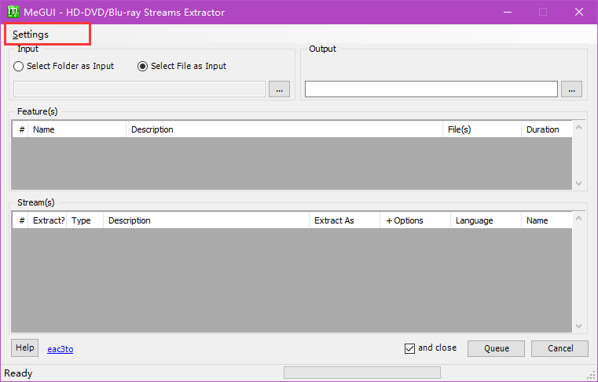
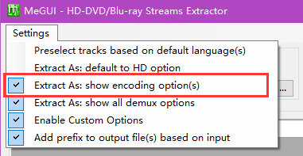

在输入部分选择 m2ts，就可以看到能够抽取的轨道。

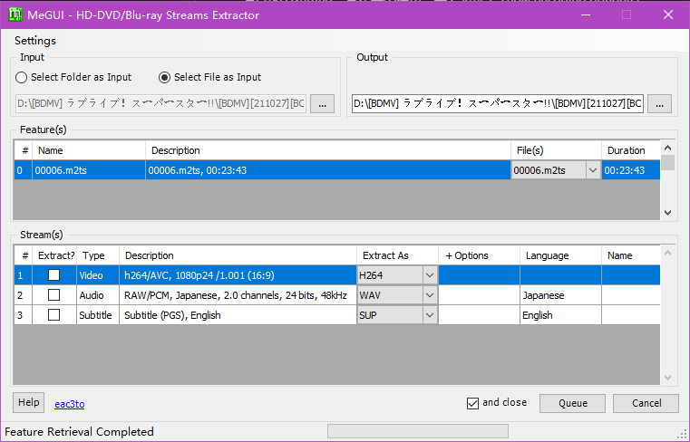

#### 视频轨的抽取

在 Extract As 处可以选择输出格式，视频轨可以抽取为 mkv 或者裸视频流 h264，一般抽取为 h264 即可。实际上，一般我们不需要提取视频轨，因为大多数工具可以直接从 m2ts 文件中获取视频。

#### 音轨的抽取

原盘的音轨有 PCM / TrueHD / DTS-HD MA 等无损格式，也有 AC3 / DTS 等有损格式。按照 VCB-Studio 规范，对于无损音轨，提取为 flac 格式；对于有损音轨，提取为原本格式。

#### 字幕的抽取

原盘有时会有 PGS 图形字幕，抽取为 sup 即可。

需要注意的是，不能使用 ffmpeg 进行抽流。因为 eac3to 会做一些额外的，但是非常有用的检查。

比如它会检查音轨的真正 bitdepth。有些原盘标注的是 24bit PCM，但是实际的有效精度只有 16bit。这时 eac3to 会抽取为 16bit。

还比如有些原盘的音轨有延迟（delay），但是部分播放器对 delay 的支持不是很好，为了避免播放出现问题，VCB-Studio 规范要求消去 delay。eac3to 会自动检查 delay，并重新调整为无 delay。

#### eac3to的命令行操作

最后补充一下 eac3to 的命令行用法，命令行会有一些更灵活的用法。

可以使用这个命令查看 m2ts 的各轨道信息。
```
eac3to "path\\to\\m2ts" -progressnumbers
```
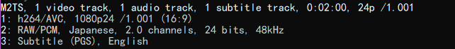

如果你的 m2ts 保持了原盘目录结构，eac3to 还可以检测到其章节，不过有时即使保持原盘目录也会检测失败。

当我们确定好需要抽取的轨道后，就可以使用以下命令抽取相应轨道。
```
eac3to "path\\to\\m2ts" id: "path\\to\\outputfile.format"
```
其中 id 是要抽取的轨道的编号，后面指定输出文件路径和名称，文件后缀名非常重要，它指定输出格式，不过 eac3to 只支持某些后缀，写错会显示 not supported。

以上面图片中的 m2ts 为例，抽取视频轨。注意不能写 .avc，会报错。
```
eac3to 00000.m2ts 1: 00000.h264
```
抽取音轨，可以直接抽取为 flac，也可以抽取为 wav。
```
eac3to 00000.m2ts 2: 00000.flac
```
抽取字幕，注意 PGS 字幕的后缀为 sup。
```
eac3to 00000.m2ts 3: 00000.sup
```

除了抽取单个 m2ts 的简单用法，eac3to 命令行还有一些高级用法，在后面的小节会进一步介绍。


### (2). 章节的提取

eac3to 虽然可以从 m2ts 检测并抽取章节，但是存在一些问题。我们更推荐使用 ChapterTool 来从 mpls 提取章节。ChapterTool 是 TautCony（本组第二代队长，人称TC）写的一个小工具。
[https://github.com/tautcony/ChapterTool](https://github.com/tautcony/ChapterTool)

打开 ChapterTool，把 mpls 拖进去可以看到。

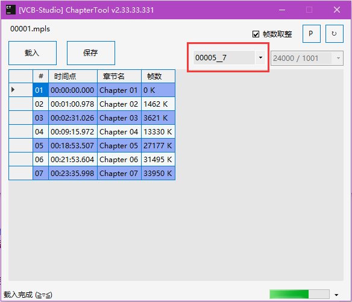

注意右上角红框中的信息，它告诉了这个章节对应的 m2ts 编号和章节数量。看到这里你应该明白，m2ts 的编号和 mpls 的编号并没有任何联系。对于含有多个 m2ts 的 mpls，每个 m2ts 都有独立的章节，可以在这里的下拉框进行切换。

ChapterTool 提供了很多信息，比如说章节的数量、各个章节的时间戳、章节名、帧号。可以看出，这里的帧号是 0-indexed。帧号的计算方法，需要大家掌握。
```
对于恒定帧率的视频，帧号 = round(帧率 * 时间戳)
```
比如这里的 chapter 03，时间戳是 02:31.026，帧率在右上角可以看到，为 24000/1001，那么帧号 = round( (24000 / 1001) * (2 * 60 + 31.026) ) = round(3621.002997) = 3621

由于时间戳精度的问题，一般计算出来是个小数，但是会非常接近某个整数。如果你计算出比如在 x.5 附近，那你就要思考一下是不是算错了。

ChapterTool 给我们的其实是取整后的结果，不勾选右上角的帧数取整就可以看到计算的原始结果。

ChapterTool 也提供了章节的编辑功能，章节名、时间戳、帧号都是可以直接编辑的，另外也有删除增加章节的功能。偷偷提示，在按钮上右键可以看到一些隐藏功能。

按照 VCB-Studio 规范，
- 如果最后一个章节的时间戳是视频结束，或者离视频结束差一两秒的黑屏，需要删除该章节
- 第一个章节的时间戳必须是 00:00:00.000
- 如果只有开头的章节，那么该视频不需要附带章节
- 章节名可以是从 01 开始按顺序排列的 Chapter xx，也可以填写原盘中的章节名。

确认章节没有问题后，点击保存，生成用于封装的 txt 格式章节。

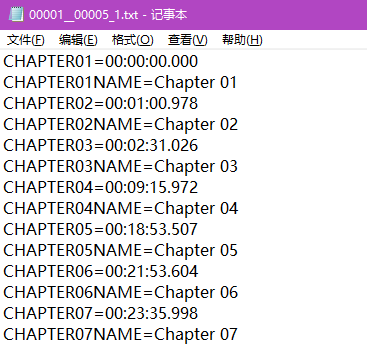

在保存之前可以通过右上角的 P 按钮，预览将要生成的章节。

ChapterTool 的功能远不止以上这些，大家可以阅读 [Wiki](https://github.com/tautcony/ChapterTool/wiki) 了解更多，后面的教程还会多次提到 ChapterTool。


### (3). 菜单按钮的提取

还记得之前那些无法播放的 m2ts 吗，我们当时说它们是菜单的按钮或者动画，这里就来教大家如何提取这些内容。

我们使用的是这个工具：[https://github.com/SAPikachu/igstools](https://github.com/SAPikachu/igstools)。

这个工具依赖于 python，安装稍微有点麻烦。需要注意的是，它的 readme 很久没更新了，落后于实际功能。

这里以 portable 版 python 为例，介绍如何安装并使用 igstools，对于安装版的 python 也是类似的。如果你已经下载了本章开头提到的工具包，请找到 OKEGui\tools\vapoursynth\python.exe 的路径；如果你还没有下载工具包，还等什么，赶紧回到本章开头去下载吧。

通过以下命令安装 igstools：
```
"path\\to\\python.exe" -m pip install pypng

"path\\to\\python.exe" -m pip install https://github.com/SAPikachu/igstools/archive/master.zip
```
安装好以后，通过以下命令拆包 m2ts：
```
"path\\to\\python.exe" -m igstools "path\\to\\xxxxx.m2ts"
```
拆包成功的话，会在 m2ts 目录下看到一堆 png 图片。通过这些图片可以获取到原盘菜单播放时的一些信息，比如有哪些特典、正片的章节名等等。这样你可以了解原盘的内容，不至于遗漏一些特典，以及可以根据章节名补充完整章节信息。

一些压制组比如 ANK-Raws 会选择将拆包出的图片打包作为特典附带。而按照 VCB-Studio 规范，菜单按钮的处理完全属于可选内容，直接忽略不管也没有问题。

原盘中的 Menu 以及其按钮一般有两种情况，Menu 中有文字，按钮提供文字特效、动画效果、以及额外的弹出文字窗口；Menu 中只有背景，其他内容全在按钮中。对于第一种情况，我们建议直接忽略按钮；对于第二种情况，可以选择性地处理。

如果是一图式的 Menu，可以打开 PS，将按钮直接覆盖到 Menu 上。这个处理不算复杂，提取出的按钮都是与 Menu 分辨率相同的带透明度的图片，PS 里直接覆盖即可。少女歌剧小动画的 Menu 就采用了这种处理。

如果是动态 Menu，将按钮制作为 PGS 字幕，在播放时切换字幕轨道来展示动画效果。超炮S3 的 Menu 就采用了这种处理。总监 Akarin 制作了一个方便的工具来制作 PGS 字幕，用法会在后续教程中介绍。

最后再次强调一遍，菜单按钮完全是可选内容，实际上非常不推荐在这上面花费时间，本节教程的目的是教会大家提取按钮，方便了解原盘视频内容。


### (4). mkv的抽流

首先下载安装唯一指定 mkv 处理工具，MKVToolNix。你可以在这里下载最新版：[https://mkvtoolnix.download/downloads.html#windows](https://mkvtoolnix.download/downloads.html#windows)。如果你已经装好 OKEGui，也可以直接使用 tools 中的稳定版 MKVToolNix。

mkvtoolnix-gui.exe 提供了图形界面的 mkv 处理程序，但是没有包含抽流工具 mkvextract.exe 的功能。因此这里推荐使用第三方的辅助 gui 程序，你可以在这里下载：[https://sourceforge.net/projects/gmkvextractgui/](https://sourceforge.net/projects/gmkvextractgui/)。

如果你使用的是安装版 MKVToolNix，你可以把 gMKVExtractGUI 解压到任何地方，它会根据注册表找到 MKVToolNix 的位置。如果你使用的是 portable 版 MKVToolNix，那么需要解压到 MKVToolNix 根目录下。

打开 gMKVExtractGUI，把 mkv 拖进去。

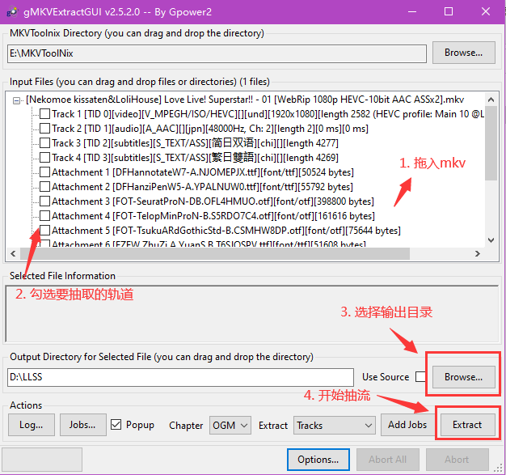

gMKVExtractGUI 也支持批量拖入 mkv，拖入之后依次选择要抽取的轨道即可。

另外，mkv 的视频和音轨也可以用 eac3to 抽取，但是 PGS 字幕不要用 eac3to 抽。

一般 mkv 中的 PGS 字幕是经过 zlib 压缩过的，而 eac3to 并不会解压，而是直接提取出来塞到 sup 文件里，这样提取出的 sup 文件无法正常播放。

处理方法有很多，手动解压再封装，或者封装时指定不做压缩。但是最好的方法还是，mkv 里的 PGS 字幕就老老实实用 mkvextract 抽。


### (5). mp4的抽流

- 把 mp4 丢到 MKVToolNix 里
- 转成 mkv
- 抽 mkv

不开玩笑，mp4 的抽流没有什么特别好的办法。


## 2. 压制

在抽取完需要的各轨道之后，就需要对视频和音频进行压制，或者更准确一点，编码（encode）。

### (1). 视频的压制

视频，一般都是要经过有损压制。压制过程可以分为预处理（pre-process）和重编码（encode）。

预处理就是通过 VapourSynth 或者 AviSynth 读取视频，对画面进行各种处理；重编码则是将处理过后的视频画面进行编码、压缩，以将视频体积减小到合适范围。

以 VapourSynth 为例，整个压制过程靠 VapourSynth 的 vspipe，结合 x265 或者 x264 编码器，通过管道（pipe）连接来完成。

```
vspipe.exe --y4m "xxx.vpy" - | x265.exe --y4m -D 10 --output "xxx.hevc" -

vspipe.exe --y4m "xxx.vpy" - | x264.exe --demuxer y4m --output-depth 10 --output "xxx.h264" -
```
y4m 是 YUV4MPEG2 的简称，是一种无压缩的视频格式，它自带了分辨率、帧率、像素格式等有效信息。

x265 编码器，用 `--y4m` 表示接收格式为 y4m，-D 10 开启 10bit 压制，`--output` 指定输出文件名。

x264 编码器，用 `--demuxer y4m` 表示接收格式为 y4m，`--output-depth 10` 表示输出 10bit，`--output` 指定输出文件名。

x265 编码器可以从这里获取编译好的：[https://github.com/AmusementClub/x265/releases](https://github.com/AmusementClub/x265/releases)。

这个是基于 Yuuki 版，再经过娱乐部优化的版本。

x264 基本上没得选，基本只能 tmod：[https://github.com/jpsdr/x264/releases](https://github.com/jpsdr/x264/releases)。

当然如果你装了 OKEGui，也可以直接使用里面的 x265 和 x264。

你可能会比较困惑，vpy 脚本以及编码器参数该如何编写，不用着急，后续教程的绝大部分章节都将详细讲述这两方面内容。现在你只需要对这个流程有一个大致了解即可。


### (2). 音频的压制

在压制音频之前，我们需要先做另一件事，音轨检查。

音轨检查需要检查：1.是否为空音轨，2.是否为重复音轨。

蓝光原盘里有空音轨或者重复音轨这种事情极其常见，并且即使是空音轨，它的码率也和普通音轨完全一样，仅凭外表无法分辨。

最常见的情况是，部分集数有评论音轨，部分集数没有。早期原盘为了统一格式，所有集都是双音轨，那么没有评论音轨的集数怎么办，要么填一条空音轨，要么重复主音轨。这俩在原盘里码率都是一样，空或者重复对制作商来说没有区别，哪种情况都有可能。

判断空音轨很容易，在播放器里前后拉一遍，完全没有声音的就是空音轨，当然确保你此时打开了系统声音。

重复音轨的判断就比较麻烦，因为你不知道是否只有某些地方做了改变，而其他地方完全相同。比较典型的是《魔法少女小圆 叛逆的物语》，晓美焰黑化的那段配音，有正常版，还有个音轨专门换成了病娇版，其他的部分完全一样，你不看介绍都不知道就那么一分钟的配音不同。

判断两条好像一样的音轨是不是真的重复，以前靠肉眼看频谱，现在已经有自动化工具了，会在后续教程中介绍给大家。


之后就是对音轨进行编码。

按照 VCB-Studio 规范，对于不同内容的音轨，有不同的编码要求。

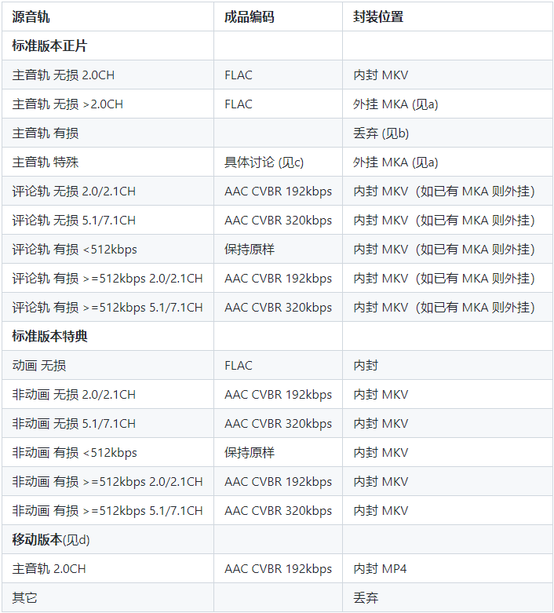

更详细的说明可以参考[整理规范](https://github.com/vcb-s/VCB-S_Collation/blob/master/specification.md)。

简单来说，如果原盘中为无损音轨，正片和特典的主音轨需要 flac 编码，而评论轨和真人特典的音轨需要 aac 编码；如果原盘中为有损音轨，在码率不太高时保留原样，码率较高时转为 aac 编码。

flac 编码，实际在我们使用 eac3to 抽取时就可以直接抽取并转码为 flac（使用的是最高压缩等级）。如果你抽取为 wav，也可以手动转为 flac。

```
flac --compression-level-8 -o output.flac input.wav
```
`--compression-level-8` 指定压缩等级为最高（8），`-o` 指定输出文件名。更详细的命令行参数可以查阅文档：[https://xiph.org/flac/documentation_tools_flac.html](https://xiph.org/flac/documentation_tools_flac.html)。

aac 的编码，我们选择 qaac 编码器，模式选择 cvbr，码率根据情况选择 192kbps 或者 320kbps。

为什么选择 cvbr 以及码率为什么选这两个值，并没有什么特别的考虑，只是选择了约定俗成、大家都没有太大异议的一套规范。当然你也可以选用 tvbr。

qaac 的命令行参数
```
qaac -i -v 192 -q 2 --no-delay -o output.aac input.flac
qaac -i -V 127 -q 2 --no-delay --ignorelength -o output.m4a input.wav
```
`-v` 参数指定 cvbr 模式的目标码率，`-V` 参数指定 tvbr 模式的目标质量。使用 wav 输入的时候推荐打开  `--ignorelength`。

你可以在这里下载 qaac：[https://github.com/nu774/qaac/releases](https://github.com/nu774/qaac/releases)。

qaac 依赖于 Apple 的 CoreAudioToolbox 组件，所以你需要安装 iTunes，如果你不想安装 iTunes 的话，可以在 qaac.exe / qaac64.exe 的同目录下建立一个 QTfiles / QTfiles64 文件夹，并在其中放置与之匹配的 32 位 / 64 位依赖。QTFiles 的获取可以使用 [makeportable](https://github.com/nu774/makeportable)，也可以直接下载别人导出完的：[https://github.com/AnimMouse/QTFiles](https://github.com/AnimMouse/QTFiles)。

如果你想让 qaac 支持 flac、WavPack（.wv） 等格式的输入，则需要在根目录放置与 qaac 位数相匹配的依赖，可以参照 [https://github.com/nu774/qaac/wiki/Installation](https://github.com/nu774/qaac/wiki/Installation) 进行配置。以 flac 为例，你可以去 [https://www.rarewares.org/lossless.php](https://www.rarewares.org/lossless.php) 下载一个 libFLAC 的 dll 文件，以 libFLAC_dynamic.dll 或 libFLAC.dll 命名放置在 qaac 的根目录下。


最后额外介绍一点 32bit 音轨无损编码内容。

普通无损音轨位深为 16bit，Hi-Res 常见为 24bit，而一些最新的 Hi-Res 则有 32bit。32bit 又分为 32 位整数和 32 位浮点。幸运的是，目前蓝光原盘里我们还看不到这些烦人的 32bit 音轨。

flac 虽然有对 32 位整数格式的规范，但并没有编码器实现，至于 32 位浮点则完全不支持。

qaac 支持 alac 无损编码，能够支持 32 位整数格式的编解码，编码命令请自行查阅 qaac 文档。

一个对 32bit 音轨支持较好的格式/编码器为 WavPack，同时支持 32 位整数和 32 位浮点。你可以在这里下载并查阅其用法：[https://www.wavpack.com/downloads.html](https://www.wavpack.com/downloads.html)。


## 3. 封装

压制完了视频，按规范转完了音频，准备好章节和字幕，就可以开始封装（混流）了。

### (1). mkv的封装

封装 mkv 使用的是之前提到过的唯一指定 mkv 处理工具 MKVToolNix。打开mkvtoolnix-gui.exe，将需要封装的轨道依次拖入，按图中所示操作。

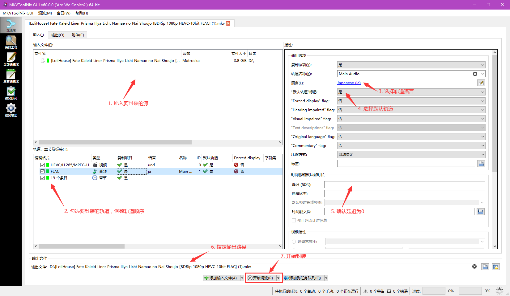

拖入第二个输入文件时，会出现以下弹窗，选择【作为输入文件添加到当前混流设置】。

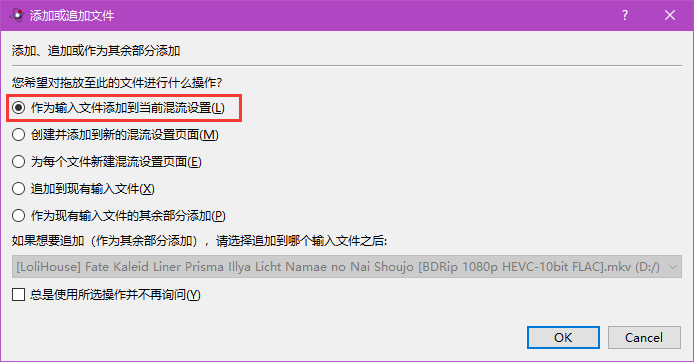

有时章节不能直接拖入，可以按以下方法添加章节。


按照 VCB-Studio 规范，封装的轨道顺序为：视频轨、主音轨、评论音轨、字幕、章节。其中视频轨无需设置语言，保持为 und（Undetermined）即可。音轨和字幕都需要设置语言，一般为 ja（Japanese）。章节也需要设置语言，如果采用 Chapter xx 形式，设为 eng（English），如果填写了原盘日文章节名，设为 ja（Japanese）。

视频轨和主音轨的“默认轨道”标识设置为“是”，其他音轨以及字幕设为“否”。

外挂音轨的情况也按类似方式封装，输出时后缀名指定为 mka。

另外需要注意一点，保证各轨道没有延迟（delay）。

#### mkvmerge的命令行操作

最后补充一下 mkvmerge 的命令行用法，可以更灵活地进行批量封装。

```
mkvmerge --output {output_file} \
         --language 0:und --default-track 0:yes {hevc_file} \
         --language 0:jpn --default-track 0:yes --track-name "0:Main Track" {audio1_file} \
         --language 0:jpn --default-track 0:no --track-name "0:Audio Commentary" {audio2_file} \
         --chapters {chapter_file}
```
其中 `--language` 设置轨道语言，前面的 0 指定输入文件的轨道 id，这里每个输入文件都是只含有一个轨道，因此只有 0。如果输入文件是 mkv 这样有多条轨道的文件，通过 id 选择需要处理的轨道。`--default-track` 设置默认轨道，需要注意的是，新版本的 mkvmerge 默认所有轨道都是默认轨道（旧版本是默认否），因此对于需要设置为否的轨道，也要显示指定为否。`--track-name` 设置轨道名称，对于多音轨情况可以选择性地命名来进行区分。

更多的设置和详细参数请查阅 mkvmerge 文档。


### (2). mp4的封装

mp4 推荐使用 L-SMASH 进行封装，总监 EFS 给它写了一个方便的 GUI，可以在这里下载：[https://github.com/amefs/lsmash-muxer-gui](https://github.com/amefs/lsmash-muxer-gui)。

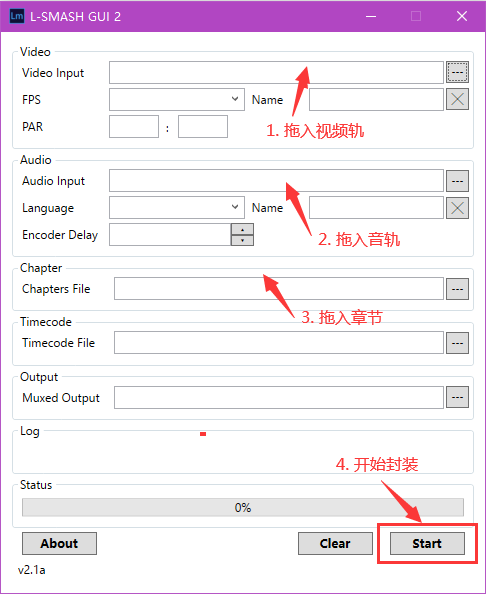

由于 VCB-Studio 制作流程中对于 mp4 的制作规格较低，因此只支持有限的封装方式。

另外 ffmpeg 或者 MeGUI 的 mp4 封装工具也可以用来封 mp4，不过可靠性较差，一般不建议使用。

虽然 L-SMASH 比较可靠，但是其对于源的要求也较高，如果源是由 BD 压制出来的，那么 L-SMASH 是一个最好的选择；如果源是 web 或者录播等，那么使用 L-SMASH 反而可能出错。而且 L-SMASH 只支持封装 AVC、HEVC、VC1 的视频编码格式以及 AAC、DTS、E-AC-3、AC-3、MP3 等常规音频编码格式，如果你需要封装 VVC、AV1 等新生编码视频格式或者 OPUS 等音频格式就需要使用其他的 mp4 封装工具了，比如 gpac 的 mp4box，你可以从 [https://www.videohelp.com/software/MP4Box](https://www.videohelp.com/software/MP4Box) 获取。


## 4. 检查

完成封装后，压制工作就完成了大半，不过先别急着上传，还需要做一些最后的检查。

### (1). 花屏检查

压片过程中，由于机器频率过高，或者脚本出现问题，或者遭到来自宇宙的高能粒子打击，成品可能损坏花屏，因此需要对比检查成品画面。

我们使用的工具是 RPChecker，可以在这里下载：[https://github.com/vcb-s/rp-checker](https://github.com/vcb-s/rp-checker)。

首先在上方右键选择【使用 PSNR(VS)】模式，请不要使用默认的 ffmpeg 模式，其结果相当不可靠。VS 模式需要把 vapoursynth 加入环境变量，vapoursynth 已经集成在 OKEGui\tools 中，加入环境变量的方法可以参考附录。

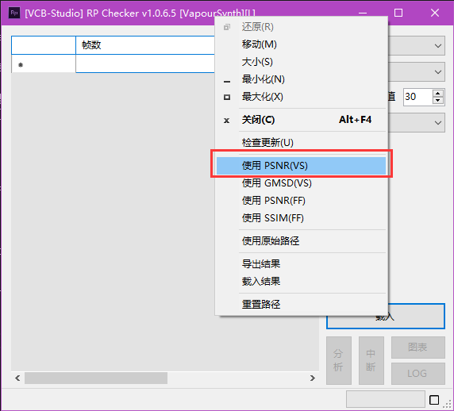

点击【载入】进入载入界面，左边放入对照组（原盘），右边放入压制成品，开始对比。

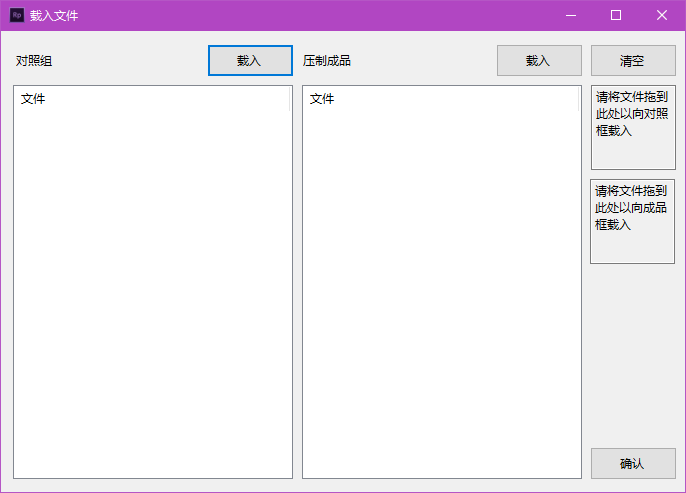

对比完成后，如果全为绿色，则检测通过；如果有红色的帧，则可能存在问题，需要定位到相应位置实际播放检查。

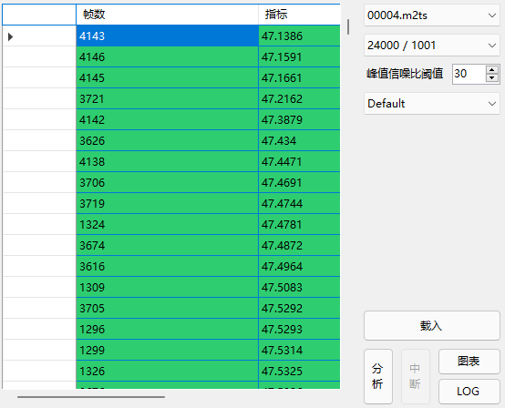

### (2). CRC32

确认视频没有花屏，音频没有错漏，字幕和章节都带上了之后，就可以着手上传，将压制成品递交给整理组。

我们需要用到 RapidCRC 这个工具，打上 CRC32。

使用方法比较简单，所有文件拖进去，点击【CRC into Filename】。

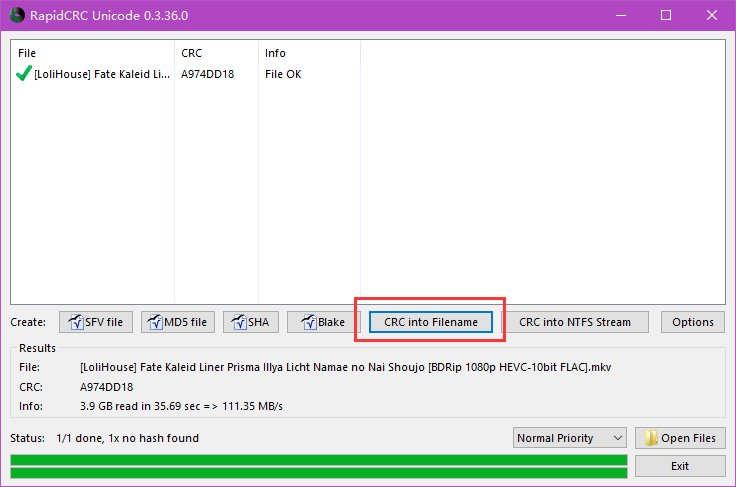

当你收到一堆打了 CRC 的文件时，也可以把它们拖进来，工具会告诉你是否正确。


## 5. 合并与切割

上面提到的制作流程都是基于原盘里是一个视频对应一个 m2ts 的情况，实际还会遇到两种特殊情况：一个 m2ts 里含有多个视频，称为连体盘；多个 m2ts 组成一个视频，称为肉酱盘。

连体盘常见于早期蓝光原盘，经常是一卷里的 2 或 3 集正片连体位于同一个 m2ts 中，现在可能会在泡面番的正片或者普通番的 PV 集 CM 集之类的特典中遇到。对于连体盘我们需要进行切割，拆分为每集一个 mkv 文件，然后再按上面的制作流程进行压制。

肉酱盘也常见于早期蓝光原盘，现在基本上只会在原盘提供有字/无字双版本正片，以及极少数特典中遇到。对于肉酱盘我们需要进行合并，把分散在多个 m2ts 中的内容合为一个 mkv 文件，然后再按上面的制作流程进行压制。


### (1). 肉酱盘的合并

#### 使用eac3to合并

肉酱盘中一个视频分散在多个 m2ts 里，由 mpls 将他们连接起来。我们可以通过 eac3to 来查看视频都由哪些 m2ts 组成。
```
eac3to "path\\to\\mpls" -progressnumbers
```
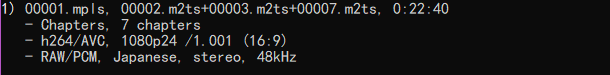

这个 mpls 就是由 00002、00003、00007 这三个 m2ts 依次连接而成。接下来可以按照与抽取单个 m2ts 类似的方式，指定轨道 id 来抽取合并之后的轨道。以抽取音轨为例，使用以下命令：
```
eac3to 00001.mpls 3: 00001.flac
```

eac3to 也支持直接拼接 m2ts，对于上面的情况，如果我们只需要保留 00002 和 00003，而将 00007 丢弃掉，那么可以通过以下命令实现。
```
eac3to 00002.m2ts+00003.m2ts 3: 00001.flac
```

#### 章节的合并

eac3to 可以从 mpls 中抽取合并后的章节，不过抽取出的章节的章节名为空，需要手动填写，比较麻烦。因此更推荐使用 ChapterTool 来进行章节和合并。

打开 ChapterTool，把 mpls 拖进去。对于具有多个 m2ts 的 mpls，可以在右上角下拉框选择各个 m2ts 的章节。右键下拉框，可以看到【合并章节】的选项，点击就可以将各个 m2ts 的章节合并起来，之后保存为 txt 即可。

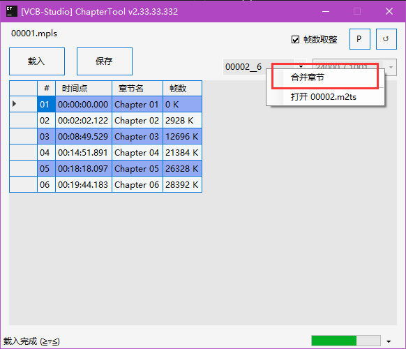

#### 使用MKVToolNix合并

一些新的研究发现，对于少数情况（比如视频开头有 1s 黑帧并且第一个章节点指示为 1s 时间戳），MKVToolNix 的合并结果更为准确。MKVToolNix 会分析视频位流，并对一些不规范的位流做出修复，因此现在我们更推荐使用 MKVToolNix 进行合并。

MKVToolNix 合并方法非常简单，将 mpls 直接拖入 MKVToolNix，然后混流为 mkv 即可。

第一次拖入 mpls 时可能会询问是否扫描其他播放列表，将其设为默认从不扫描即可。

MKVToolNix 也可以合并章节，不过需要注意，确保这里的章节命名模板设为【Chapter \<NUM:2>】，而不是【第 \<NUM:2> 章】。

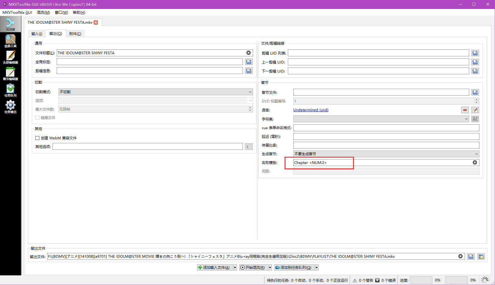


### (2). 一般的物理合并

MKVToolNix 也支持一般的物理合并，通过追加合并（append）功能实现。

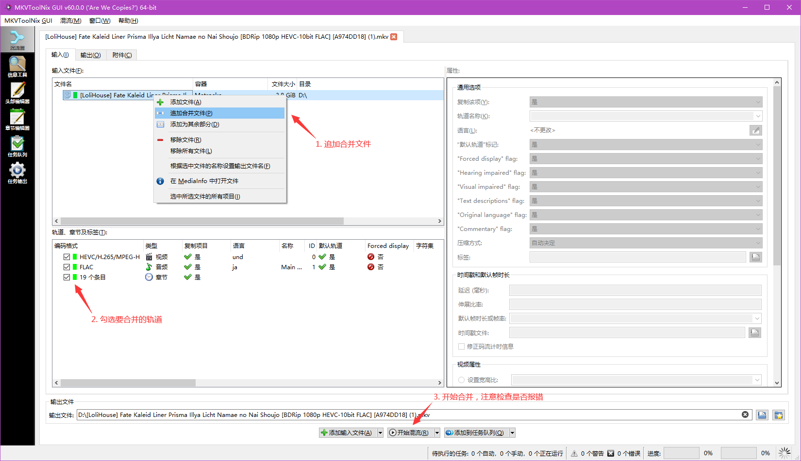

MKVToolNix 添加文件，有三种方法：
- 添加文件，指作为独立轨道加入，一般在混流多个轨道时使用。
- 追加合并，指把添加的各个文件解封装，合并位流，再重新封装。合并多个 hevc 或者 avc 的 raw 文件，或者合并多个 mkv，都是使用这个功能。
- 添加为其余部分，指把添加的各文件的比特流直接前后拼接在一起，只有像 DVD 那样，将视频按固定大小直接切分，每个部分无法独立构成完整视频的情况才会用到。一般不会使用这个功能。

追加合并这个功能，可以把多个视频和音频连在一起。章节没办法追加，因为章节无法确定总长度。所以一般不勾选章节，或者需要自己特殊准备。

追加合并成功的条件比较苛刻，只能多个 mkv 一起合并，或者多个 raw 文件一起合并，而不能 mkv 和 raw 文件交替合并。另外对于视频和音频的格式，甚至一些编码参数都有要求。

特别需要注意的是，不要合并 flac，MKVToolNix 无法处理 flac 的文件头，合并出来的音轨会非常奇怪。因此对于需要合并 flac 的情况，先抽取出来转为 wav，合并之后再转为 flac。

当格式不匹配，混流会报错，注意检查。哪怕没有出现报错，也需要手动播放再确认一遍合并的效果。来回拖动进度条，仔细观察连接部分是否有花屏等。


### (3). 连体盘的切割

连体盘一般使用 MKVToolNix 按章节切割。将连体盘的 mpls 拖入，切换到输出页面，选择切割模式【在章节之前】，将鼠标移到章节编号栏上可以看到说明。

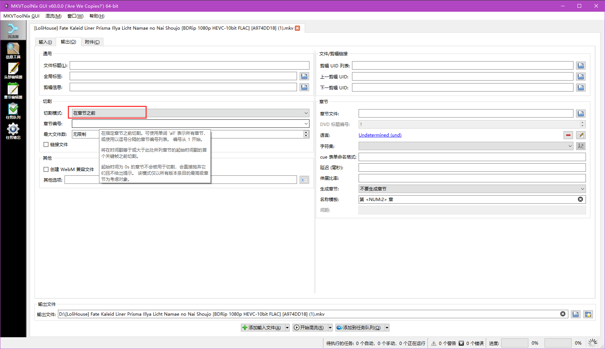

这里需要填写作为切点的章节序号，各个切点用逗号分开，章节从 1 开始编号，如果给出 n 个切点，那么会得到 n+1 个输出。

在切割之前，我们需要播放连体的视频文件，确定每个部分开头的章节序号，早期原盘常见为两集或者三集正片连体，我们需要找到第二集和第三集起始的章节。

以偶像大师的原盘为例，正片三集连体，这是它的章节。我们播放后发现，第二集开始于章节 07，第三集开始于章节 13。我们在切割的章节编号栏填入：07,13（注意不要有空格）。这样就把 01-06 切分为第一集，07-12 切分为第二集，13-最后切分为第三集。

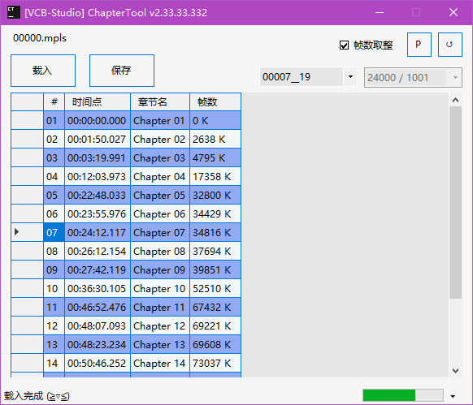

这样切出来的第二集和第三集的章节会存在一些问题，需要我们手动修正章节名称。

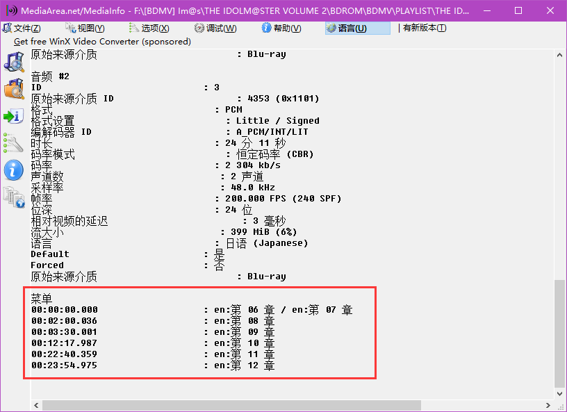

另外需要特别注意的是，如果切割章节点的帧不是关键帧，那么会选择章节点之后最近一个关键帧作为实际切割点，这样切出来的结果和我们预想的就会存在偏差。不过按照蓝光规范，章节点保证为关键帧；同时 VCB-Studio 的成品，也保证章节点为关键帧，可以放心大胆地切。


### (4). 一般的物理切割

MKVToolNix 除了按章节切割，也支持按帧切割。切割模式选择【按帧/场编号分段】，分段栏需要输入形如 start-end 的帧号范围。这里的帧号从 1 开始计数，需要在我们通常使用的 0-indexed 帧号上加 1。首尾切点的帧都将包含到输出中。


以这个章节为例，如果我们想切出 Chapter 02 到 Chapter 03，那么实际需要的帧为 2638-4795，最后别忘了整体加 1，应该填写 2639-4795。

与按章节切割类似，如果你指定的首尾帧号不是关键帧，那么会自动移动到最近的关键帧作为实际切点。

由此我们也可以知道，视频的物理切割，只能精确到关键帧。非关键帧的切割，必须依靠重编码来完成。

识别关键帧的方法，除了前面提到的按章节点以外，还可以通过 VapourSynth 直接观察每个帧的类型，具体方法等到 VapourSynth 章节再具体讲述。

另外需要注意的是，MKVToolNix 不支持对 flac 的切割。遇到音轨是 flac 的情况，先将 flac 抽取出来，转为 wav，再封装成新的 mkv 进行切割。flac 转 wav 可以使用 flac 命令行工具。
```
flac -d -o output.wav input.flac
```

音频的切割并不依赖于关键帧，我们可以使用 ffmpeg 对其进行精准到毫秒（实际是精确到 sample）的切割。
```
ffmpeg -y -i {input_audio} -map a:0 -ss {trim_begin} -to {trim_end} -acodec copy -y {output_audio}
```
{trim_begin} 和 {trim_end} 填入起始和结束的时间戳，格式为 hh:mm:ss.mss 或者 ss.mss。

一些音频编码器，比如 flac、qaac 也支持对输入音频的一部分进行编码而不用提前切割，具体参数设置可以自行查阅文档。

如果切割 aac 音轨，输出最好选用 mka，以避免切割产生的 delay 造成影响。


## 6. 练习

本章涉及的工具众多，操作复杂，这里提供一些简单的练习，希望大家能熟悉工具的使用。

### (1)

在你手上的原盘中任选一集正片，按照本章流程，抽取视频、音频、章节、字幕（如有），视频不做处理，音频和章节按照规范进行处理，最后封装成 mkv。

做完这一步，恭喜你，你已经掌握了一种最简单的 BDRip 制作方法，仅仅将原盘的有用信息提取出来而不做其他处理，一般地我们将其称为 BDRemux。

### (2)

一般一集 TV 动画可以分为：OP、A Part、B Part、ED、Preview 等部分。任选一集 VCB-Studio 的成品正片，从 A、B Part 之间切分为两个 mkv。

### (3)

将(2)中得到两个 mkv 合并为一个，然后与原始的视频进行 rpc 检查。


## 附录 设置环境变量

首先，假设我们将工具放在 C 盘下名为 mypath 的文件夹中。当然你也可以将其放在其他盘符其他位置。

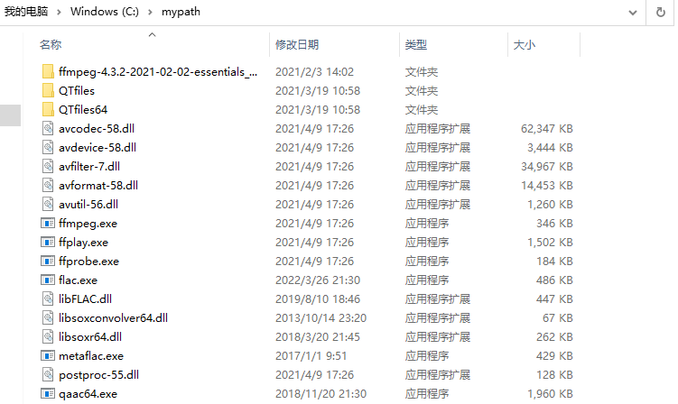

右键我的电脑，选择【属性】。在打开的设置页面最右侧（某些版本中是最左侧）中选择【高级系统设置】。

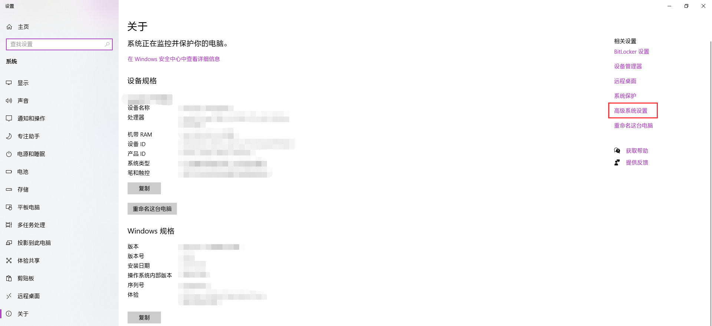

在弹出的窗口中选择【环境变量】。

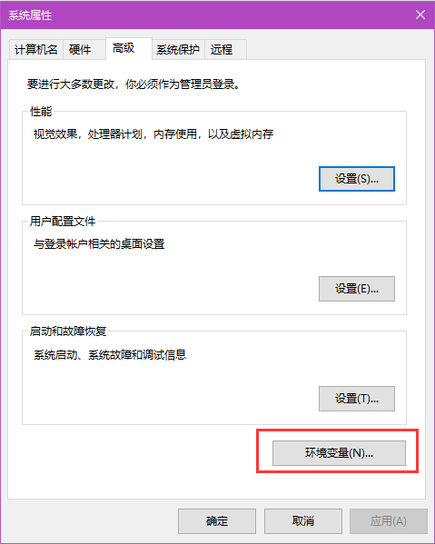

然后在上方的用户变量中选择【Path】一栏进行编辑，新建一个 C:\mypath 条目。

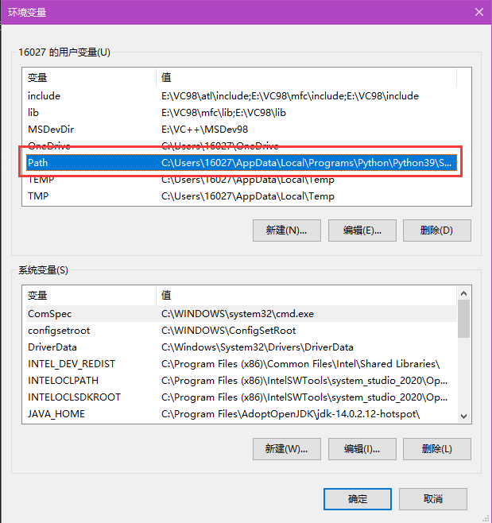
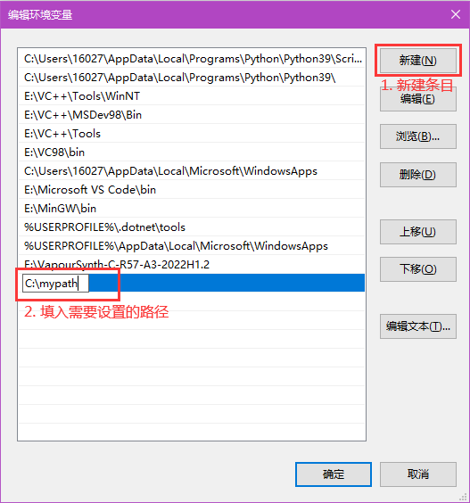

最后重新打开命令行，输入 flac 或者 ffmpeg 之类的命令来检测是否生效。
