# 第五章 VapourSynth基础

BDRip 的核心是预处理（Pre-Process），没有经过预处理的画质调教，压片就只是单纯的数据压缩罢了，永远不可能有画质提升。历史上，最早的预处理软件是 AviSynth（简称 AVS），然而由于年代久远，其许多设计理念和功能都有较多缺陷，现在逐步被新一代的预处理软件 VapourSynth（简称 VS）替代。本章就来讲解VS的基本构成，介绍预览工具和脚本，并从中学习 VS 基本语法和功能。

## 1. VS简介

VapourSynth，简称 VS，官网是 http://www.vapoursynth.com/。你可以在 [Github](https://github.com/vapoursynth/vapoursynth/releases)上下载最新版本，包括安装版和便携版。

VCB-Studio 目前使用的 VS 则是娱乐部版，全称 VapourSynth-Classic，简称 VSC。你可以在[这里](https://github.com/AmusementClub/vapoursynth-classic/releases)下载最新版。

VSC 源于 VS 社区的一次重大分裂，VS 项目开发者在 R55 引入了全新的 API4，这导致严重的兼容性问题。API4 的 VS 虽然能够同时支持新的 API4 滤镜和旧的 API3 滤镜，但却不支持 API3 脚本，而这些多年传承的脚本才是 VS 发展的精髓，这对于追求稳定生产环境的 VCB-S 来说是不可接受的。

另一方面，VS 开发者在 API4 还引入了大量破坏性弃用，以迫使用户和滤镜开发者转向 API4。同时还采取先进的 user driven testing，让普通用户积极参与到新版的验证与反馈工作中。

基于以上复杂情况，总监 Akarin 创立了 VSC，同时兼容 API3 与 API4 脚本，全力保证生产环境的向后兼容性。此外 VSC 兼具前后两代 VS 之长，既有 API4 的低内存开销，又有 API3 的高处理速度。

有了 VS 本体，问题还没有完全解决。上述这些 VS 本体只含有少量的内置滤镜，这显然是远远不够的。收集滤镜和常用工具脚本是一件复杂繁琐的事，这里我们提供了一套打包好的便携版 VSC，含有大部分常用滤镜和脚本：[https://github.com/AmusementClub/tools/releases](https://github.com/AmusementClub/tools/releases)。


打开 VS 目录，我们可以看到 VS 本体的一堆 dll 和 python 环境。VS 本体和滤镜都是由 C++ 编写，而它暴露给用户的接口则是 python 的。我们可以通过 python 编写 VS 脚本，然后通过 VSPipe 运行脚本获得输出。你可以认为 VS 是 python 的一个库，也可以认为 VS 里含有 python。

`vapoursynth64` 目录下是 VS 滤镜，`coreplugins` 是内置滤镜，`plugins` 是第三方滤镜。对于我们提供的 VSC 包，AI 滤镜相关的模型和运行环境等也放在 `plugins` 目录。

同时，我们提供的包里的 python 还内置了 pip，可以方便地安装额外包。

将这一整套内容打包为便携包不是一件容易的事，事实上在上古时期，VS 基本都是通过安装来使用，这带来了严重的版本管理问题。

目前我们使用总监 SaltyChiang 开发的打包工具 [VapourSynth-Portable-Maker](https://github.com/AmusementClub/VapourSynth-Portable-Maker) 来完成打包工作，对打包有兴趣的同学可以看看。


## 2. VS预览

有了 VSPipe，其实我们就已经可以运行脚本输出处理结果，但我们更希望可以实时修改脚本并看到滤镜的效果，这就需要一个预览器。

### (1). VapourSynth-Editor

预览器在很长时间里只有一个，`VapourSynth-Editor`（简称 vsedit, vse），https://github.com/AmusementClub/VapourSynth-Editor。vse 是一个 IDE，可以在里面编写 VS 脚本，并进行预览、测试、调试等。它提供了少量的高光和代码补完功能，但不是很完善，只对滤镜起作用，对脚本函数则没有作用。

vse 需要依赖 VS 运行，而且原版 vse 优先选择注册表中的 VS 而不是用户指定的 VS，当系统中有多个 VS，或者曾经使用过安装版 VS，那你几乎永远无法知道它使用的是哪个 VS。当然目前娱乐部版已经修复了这个问题，它会优先找同目录的 VS，即开即用。

一般来说，VS 脚本文件都是 python 脚本，为了区分，我们用 `vpy` 作为后缀名。

这里有一个简单预览脚本：

```python
import vapoursynth as vs
from vapoursynth import core
import havsfunc as haf
import mvsfunc as mvf

a = "00010.m2ts"
src8 = core.lsmas.LWLibavSource(a)
src8.set_output()
```

先看前四句，熟悉 python 的应该知道，这是在载入库。
第一句载入 vapoursynth 本体，并简称为 vs。
第二句载入 vs 的 core，core 的概念比较抽象，不妨认为就是一种固定格式。
这里可以换为等价的写法：
```python
core = vs.core
```

一些早期的脚本可能会写成：
```python
core = vs.get_core()
```

这在 VSC 中仍然能运行，但 get_core 即将弃用，不要这么写。

第三四句，载入 mvf（mawen1250写的工具合集）和 haf（holy写的工具合集），这是日常做番最常用到的工具。

再看后三句，这里细节很多，我们一个一个分析。

首先 `a = "00010.m2ts"`，这是指定视频源文件的路径。
一般写脚本的时候要避免这种单个字母的无脑命名。
但本组约定俗成采用 a 代指输入文件，注意在这之后的 OKE 中会用到。

这里使用的是相对路径，需要保证 00010.m2ts 和vpy脚本在同一目录下。
如果要使用绝对路径，可以这样：`a = R"E:\Anime\00010.m2ts"`。
这里被 R 引号圈起来的是一个 Raw String，所见即所得，可以避免复杂的转义问题。
不然你就得写：`"E:\\Anime\\00010.m2ts"`。

第二句 `src8 = core.lsmas.LWLibavSource(a)`，这是使用源滤镜 `lsmas` 载入视频，获取一个在 vs 里称为 clip 的变量，并命名为 `src8`。
除了文件名之外的变量，一般需要有一定意义，方便解读。
通常我们用 `src` 指代源，8 表示精度，原盘一般都是 8bit。
而最后的输出结果，则用 `res` 指代。

从这一行我们也能看出 vs 滤镜的使用规律，是 `core.<package_name>.<filter_name>(...)` 的形式。
这里 lsmas 就是 package_name，而 LWLibavSource 就是 filter_name。
脚本函数（比如上面提到的 mvf 和 haf）的使用则有些不同，是 `<package_name>.<function_name>(...)` 的形式，这一点我们会在后面看到。

最后，使用 `set_output()` 将读入的视频输出。

现在我们尝试使用 vsedit 来运行脚本。

如果你的滤镜载入正确，vsedit 应该可以高亮显示滤镜名称.
在上方工具栏选择 `Script - Check script`，或者按 `F6`，就可以检查脚本是否能正常输出。
如果是第一次读取某个视频文件，LWLibavSource 会生成一个后缀为 `lwi` 的索引文件，便于以后再次读取视频。
源文件越大，需要的时间越多，对于好几个 GB 的蓝光原盘需要等待几分钟。SSD 硬盘的话会快很多。

没有脚本没有问题，可以在 vsedit 下方看到如下信息。

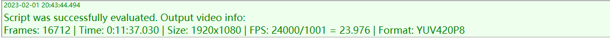

否则会告诉你存在什么问题。

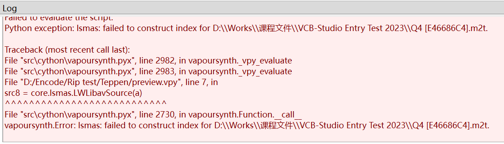

输出的信息，包括：总帧数、时长、分辨率、帧率、像素格式。

注意 vs 里帧数是 0-indexed 的，比如这个视频的帧数就是 0-16711，一共 16712 帧。
帧率 24000/1001=23.976，这个数字要牢记，这是日本动画的典型帧率。
最后像素格式 YUV420P8，说明这是 YUV 色彩空间，420 下采样，数据位深为 8bit。

检查完了这些，就可以用 `Script - Preview`，或者按 `F5` 来预览实际画面。

它会打开一个预览窗口，其中包含许多方便的功能。
上方窗口可以拖动浏览整个画面，键盘上的前后键可以调整到上一帧或者下一帧。

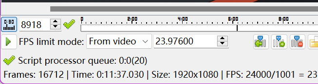

左下角，可以点击进度条跳转到目标帧，也可以输入帧号定位。按三角形可以播放，旁边可以调整播放帧率。

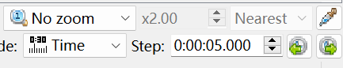

右下角，点击画笔可以开启取色功能。鼠标移到画面上可以在左下角显示像素的 YUV 值以及渲染后的 RGB 值。
右下角还有放大镜 zoom 的选项，切换到 `fixed radio` 可以按倍数放大缩小，方便观察。可以选择缩放算法，`Nearest` 或者 `Bilinear`。Nearest 是完全没有运算，只是单纯复制粘贴的缩放方法，将原来的 1 个像素变成 4 个，9 个，16 个...
注意不要用 Nearest 进行缩小或者非整数倍的放大，锯齿非常恐怖。
Bilinear 是使用插值进行缩放，它是最简单的线性插值，所以一般也不会引入额外的副作用。现在我们通常都用 Bilinear 放大进行观察。

前面取色的时候我们看到，输出的 YUV 实际被渲染为 RGB 呈现，这是 vsedit 自动帮我们做了。但是 vsedit 做的精度不佳，所以我们通常在脚本里手动转为 RGB 进行预览。

我们把脚本改为：
```python
...

src8 = core.lsmas.LWLibavSource(a)
res = mvf.ToRGB(src8)
res.set_output()
```
再预览看看，有什么区别。
可以发现现在格式变为 `RGB24` 了。
注意这里调用 mvf，跟调用滤镜的区别，前面已经提到过了。

下面，找一个 10-bit 的视频（比如本组压制的成品），用同样的脚本再预览，看看有啥区别。
可以发现现在格式变为 `RGB30` 了。
然后再改为 `src8.set_output()` 看看，可以发现格式变为 `YUV420P10`。
所以 LWILibavSource 读取源的时候，是准确的读取了源的全部精度。

当然实际上 vsedit 渲染时，还是采用 RGB24，这可以利用取色器看到。
这是合理的，因为大部分人的显示器仍然还是 8bit。

因此我们预览输出时，习惯是无论什么精度的源，都输出 8bit RGB。
这可以通过 `res = mvf.ToRGB(src8, depth=8)` 或者 `res = mvf.Preview(src8)` 来实现。
这也是日常截图最标准的方法。


### (2). VapourSynth-Preview

`VapourSynth-Preview`（简称 vspreview, vsp）是近两年兴起的另一个预览器，区别于 vsedit 的独立程序，vsp 是由 python 编写的模块，因此可以直接集成到 python 环境中。

vsp 的初始 repo 已经不再维护，因此目前版本繁多。我们使用的娱乐部版（也是 portable 包中集成的版本）：[https://github.com/AkarinVS/vapoursynth-preview](https://github.com/AkarinVS/vapoursynth-preview)。另一个活跃的版本，iew 版：[https://github.com/Irrational-Encoding-Wizardry/vs-preview](https://github.com/Irrational-Encoding-Wizardry/vs-preview)。

注意 iew 版与 VapourSynth-Classic 并不完全兼容，如果你有兴趣尝试一些新功能，可以使用这个兼容 VSC 的版本：[https://github.com/SaltyChiang/vs-preview/tree/no-vstools](https://github.com/SaltyChiang/vs-preview/tree/no-vstools)。

vspreview 可以直接通过 pip 安装，参考上述 repo 的说明。目前 portable 包中已经预先安装好，可以通过下述命令使用（注意把 `python` 换成完整路径）：

```
python -m vspreview xxx.vpy
```

成功的话会弹出类似 vsedit 的预览窗口。

与 vsedit 不同，vsp 本体只是一个预览器，而不是一个 IDE，因此只能预览脚本，而无法编写脚本。为了方便使用，通常需要配合其他文本编辑器或者 IDE，下面介绍一个基于 `VSCode` 的开发环境搭建方案。

#### VSCode

1. 安装 `VSCode`，并在扩展商店里安装 `Python` 和 `Pylance` 扩展。
2. 将本章 `.vscode` 目录的文件复制到 VSCode 用户配置目录 `%APPDATA%\Code\User\`。如果用户配置目录已经有同名文件，不要覆盖，将相应内容复制到原有文件中。
3. 修改 `keybindings.json` 中的 python 路径，改为你的 VapourSynth 对应的 python 路径。

#### VapourSynth

1. 安装 VapourSynth-Preview。可参考上述 repo 的说明，如果使用我们的 portable 包则不必再安装。
2. 安装 [VapourSynth-Plugins-Stub-Generator](https://github.com/SaltyChiang/VapourSynth-Plugins-Stub-Generator)。这是由总监 SaltyChiang 开发的小工具，用于在 VSCode 里支持代码补全。同样，portable 包中已经集成，不必再安装。
如果首次安装，运行 `python -m vsstubs install`，如果使用 portable 包，运行 `python -m vsstubs update`。注意以后每次增加滤镜都需要重新 update。

以上，我们就配置好了全部所需内容。现在使用 VSCode 打开 vpy 脚本（或者所在文件夹），如果配置成功，可以看到脚本高亮和语法补全信息。接下来可以使用 `Ctrl+F6/Ctrl+F5` 进行类似 vsedit 的 F6/F5 的脚本检查/预览。不过这里的脚本检查只检查是否正常运行，不提供 vsedit 那样的 clip 信息。

我们的配置还提供了额外两个功能：`Ctrl+F7`，相当于 vs info，打印输出 clip 的信息；`Ctrl+F8`，相当于 vs benchmark，计算输出 clip 的所有帧，可以测试脚本速度。


vsp 的基本功能与 vsedit 差别不大，但更加易于使用。

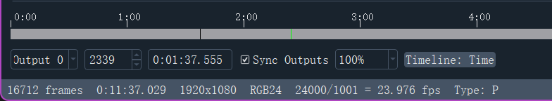

左下角，最底下一栏显示 clip 信息，与 vsedit 类似，这里多了一个帧类型信息，可以看到这一帧为 P 帧。
上面一栏，从左开始，`output` 按钮选择输出节点，后面 `sync outputs` 选择是否在节点间同步，这个功能我们后面再说。
第二个按钮指定帧号，第三个指定时间戳，后面 100% 的按钮选择缩放倍率，vsp 里默认是 Bilinear 算法。最后 `Timeline` 可以切换时间轴按时间戳显示还是按帧号显示。

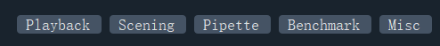

右下角 5 个功能，每个功能都可以独立开启或关闭，我们一个一个说。

1. Playback

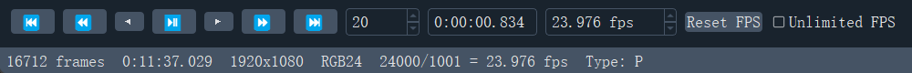

就是各种播放选项，中间按钮播放/暂停，可以在最后边控制播放速度，选择 `Unlimited FPS` 可以最高速度播放，实际速度取决于输出 clip 所用滤镜和最后渲染的速度。

播放键左右依次，一个箭头的是以 1 帧为单位后退/前进，两个箭头的是以右边指定的帧数为单位后退/前进，三个箭头直接转到第一帧/最后一帧。

2. Scening

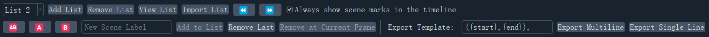

在时间轴上做标记，在分段或者采样典型场景的时候会很有用。

`List` 表示一组标记，时间轴只能同时显示一组标记，但可以在多组之间切换。`Add List` 创建一组标记，然后可以在下方一栏添加标记。
`AB` 直接标记当前帧，并添加到 List。`A` 将当前帧标记为起点，`B` 将当前帧标记为终点，A、B 联合使用可以标记一段区间，然后点 `Add to List` 加入到 List 中。

最右边的按钮可以导出当前 List 的所有标记，可以手动调整导出格式，导出后存放在剪切板里，找个地方粘贴即可。

3. Pipette

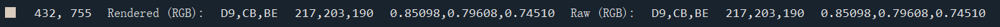

这个功能相当于 vsedit 的取色器，鼠标移到画面上可以在左下角显示像素的 YUV 值以及渲染后的 RGB 值。

从左到右依次为：坐标 `(x, y)`，渲染后 RGB 值，输出 clip 原始像素值。
视频里的坐标轴以左上角为原点，横向向右为 x 轴正向，竖向向下为 y 轴正向。
原始和渲染后的像素都有 3 组表示，第一组是 16 进制的量化值，第二组是 10 进制的量化值，第三组是浮点值。

vsp 采用 vs 滤镜来渲染输出 clip，不像 vse 那样有较大精度问题，因此一般可以直接 set_output 输出，不用转为 RGB。

4. Benchmark

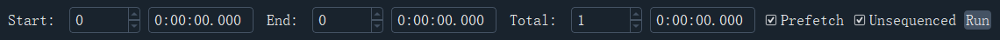

就是跑测试输出，与之前说的 Ctrl+F8 快捷键相比，可以更精确地指定输出的帧数范围。

5. Misc


`Reload Script` 如果你更改了脚本，可以按这个重新加载。
`Save` 导出 vsp 设置，比如前面提到的部分选项，它可以记忆下来，下次打开直接启用。当然一般不需要这个功能，因为 vsp 会自动保存到脚本所在目录的 `.vspreview` 目录下。
`Copy Frame` / `Save Frame as` 可以复制/保存当前帧截图，右边可以设置导出文件名。

好了，经典版 vsp 的功能就讲这么多，前面提到的一些改版，有兴趣的话可以自行研究它们的新功能。


### (3). 对比脚本

对比脚本，顾名思义就是用来对比源和压制成品的脚本。

下面是一个简单的对比脚本：

```python
import vapoursynth as vs
from vapoursynth import core
import havsfunc as haf
import mvsfunc as mvf

a = R"D:\VCB-Studio Entry Test 2023\Q4 [E46686C4].m2ts"
src8 = core.lsmas.LWLibavSource(a)
src8 = mvf.Preview(src8)
src8.set_output(0)

b = R"D:\VCB-Studio Entry Test 2023\Q4_AV1 [41A7EDDA].mkv"
rip = core.lsmas.LWLibavSource(b)
rip = mvf.Preview(rip)
rip.set_output(1)
```

现在用 vse 预览试试，在键盘上按数字 0、1 来切换两个输出。
如果你试图切换到不存在的节点就会。
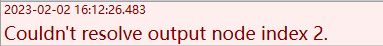

这里在 set_output 时使用了不同的输出节点。在以前，只有 0 节点（也是不指定输出节点时的默认值）能被预览输出，而 vspipe 始终只能输出 0 节点的 clip。预览器 vsp 首先支持了多节点预览输出，之后 vsedit 也添加了相应功能。

vsedit 的输出节点与键盘数字是绑定的，也就是最多只能有 0-9 号共 10 个节点可以使用，并且 vsedit 要求必须至少有 0 节点。
当然，你可以输出到更高数字的节点，脚本仍然可以运行，但无法在 vsedit 中预览到。

作为多节点输出的开创者，vsp 对这一功能的支持更加完善。
vsp 的输出节点不与键盘数字绑定，而是按照脚本中 set_output 出现的先后顺序，依次对应到键盘数字：1、2、3...
同时也不要求一定有 0 节点输出。

不使用键盘数字 0 作为第一个可以优化没有小键盘时的体验，输出节点数字不绑定快捷键可以避免不停修改节点值。当然 vsp 也不支持过多的节点数，超过 10 个节点只能在左下角的下拉框中切换。不过你可以自行修改 vsp 的配置，因为它是一个 python module，你可以自由修改其功能，比如绑定节点数字，比如扩展更多键位。

之前略过的一个按钮，`sync outputs`，可以选择让所有输出节点指向同一帧，或者各自维护一个当前帧号。


在上古时期，没有多节点输出的时候，是用 `Interleave` 滤镜来进行对比预览的。试着在上述脚本最后加上下面两行，观察结果。

```python
res = core.std.Interleave([src8, rip])
res.set_output(2)
```

可以发现输出帧率翻倍，帧率也翻倍，变成了 47.952 fps。
实际上滤镜是在一秒内把源和成品的帧都给塞进去了，偶数帧（0, 2, 4...）来自源，奇数帧（1, 3, 5...）来自成品。
这样可以通过前后键，反复观察源和成品的画面区别。

Interleave 支持输入一个 clip 列表，把里面的 clip 依次交错输出。自然你也可以将多个 clip 一起交错对比，但是多于两个的时候有诸多不便，首先你无法直观从帧号判断这帧来自哪个 clip，其次越过一些帧对比，比如将 1 和 3 进行对比时无法快速切换。
当然现在是好时代了，可以通过多节点输出自由地进行对比。


## 3. VS文档阅读和参数传递

### (1). 文档阅读

今后我们将遇到各种各样的滤镜，虽然代码补全可以帮助我们知道它的参数，但具体每个参数的含义和用法，还是需要查阅相关文档。

VSC 的文档链接如下：[https://amusementclub.github.io/doc/](https://amusementclub.github.io/doc/)。

其中包括 VS 相关的 python 数据结构文档，内置滤镜的文档以及 VSPipe 的用法等。

第三方滤镜，一般都有单独的 Github repo，你需要善于搜索。一般可以先去娱乐部看一下，大部分常用滤镜都有相应 fork。


先来看前面提到的 `Interleave` 滤镜，[https://amusementclub.github.io/doc/functions/video/interleave.html](https://amusementclub.github.io/doc/functions/video/interleave.html)。

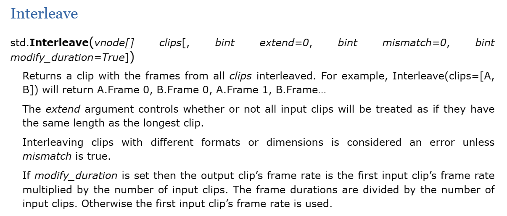

滤镜的包名 `std`，说明是标准内置滤镜。
再看滤镜参数，第一个必选参数是 `vnode[]`，即多个 clip 组成的列表。后半部分由 \[\] 扩起来的，是可选参数，包括 `extend, mismatch, modify_duration`，都是 bint，也就是 0/1，或者 False/True。它们的功能 doc 里都有说明，不需要掌握，平时根本用不到。


### (2). 参数传递

VS 中的参数传递有多种方式：关键字传递、位置传递、混合传递。

1. 关键字传参 keyword argument

比如：
```python
core.std.Interleave(clips=[src, rip], extend=0, modify_duration=1)
```
哪个输入对应哪个参数，直接用参数名写出来。这样可读性很高，也不容易出错。另外，现在有代码补全，也不需要手打参数名。

2. 位置传参 positional argument

比如：
```python
core.std.Interleave([src, rip], 0, 1, 1)
```
从左到右将输入依次赋给各个参数。写起来最简单，但可读性很差，要翻 doc 才知道各个参数都给的什么值。

3. 混合传参

顾名思义就是混合前两种方式。python（和几乎所有编程语言）都规定，函数参数的必选项在前面，可选项在后面。因此习惯前面常用的参数用位置传参，后面不常用的参数使用关键词传参。注意位置传参只能放在前面，不能和关键字交替使用。

比如：
```python
core.std.Interleave([src, rip], modify_duration=1)
```
这里需要注意的是，VS 滤镜和 python 函数（比如mvf提供的函数）的处理是不一样的。
对于 VS 滤镜，它会先将所有关键字参数赋值好，然后将位置参数从左到右依次赋给**还未赋值**的参数。

比如：
```python
core.std.Interleave([src, rip], 1, extend=0)
```
这个调用会先将 extend 赋为0，然后 [src, rip] 赋给 clips，最后一个参数，按位置将赋给 extend，但发现以前已经赋值过了，因此会赋给第三个参数 mismatch。

但是 python 函数并不会这么处理，如果关键字传参和位置传参对同一参数赋值，会报出语法错误。

比如：
```python
mvf.ToRGB(res, 10, matrix="709")
```
这个调用会报出对同一位置赋值的错误。

4. dict传参

这其实是关键字传参的一种变体，用一个 dict 描述关键字，然后用 dict 传入参数。

比如：
```python
kwargs = {"depth": 10, "matrix": "709"}
res = mvf.ToRGB(src, **kwargs)
```

5. 滤镜串联

VS 滤镜都是由 clip 作为第一个参数，在连续调用时可以串联，省去输入第一个参数。

比如：
```python
res = core.lsmas.LWLibavSource("00001.m2ts").rgvs.RemoveGrain(20)
```
这等价于：
```python
src = core.lsmas.LWLibavSource("00001.m2ts")
res = core.rgvs.RemoveGrain(src, 20)
```
串联滤镜可以连接任意多个，除了第一个要写 core，后面的滤镜都不用写，直接跟在前一个滤镜的后面写滤镜名就行。同时，后面串联的滤镜也不用写第一个 clip 参数。

但是对于 python 函数，mvf 那种，就没有这样的写法，只能老老实实分为多行调用。

或者像下面这样：
```python
res = mvf.Preview(core.lsmas.LWLibavSource("00001.m2ts"))
```


## 4. 视频属性和帧属性

### (1). 视频属性 clip property

clip 对象，在 VS 里是 VideoNode 类。文档在：[https://amusementclub.github.io/doc/pythonreference.html#VideoNode](https://amusementclub.github.io/doc/pythonreference.html#VideoNode)。

这里常用的就是前几个属性，包括：视频格式 `format`，宽度 `width`，高度 `height`，总帧数 `num_frames`，帧率 `fps` 或者用两个整数表示的 `fps_num` 和 `fps_den`。

可以使用
```python
print(clip.format)
```
运行时在终端里打印这些信息。当然，vsedit 是看不到的。

我们可以使用 `text.ClipInfo` 滤镜在画面上打印 clip 信息。
```python
res = res.text.ClipInfo()
res.set_output(0)
```
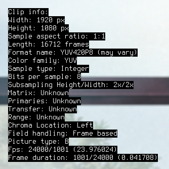

### (2). 帧属性 frame property

除了 clip 对象，还有一个需要关注的，帧对象，在 VS 叫做 VideoFrame 类。文档在：[https://amusementclub.github.io/doc/pythonreference.html#VideoFrame](https://amusementclub.github.io/doc/pythonreference.html#VideoFrame)。

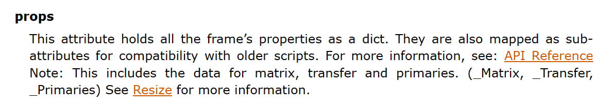

这里我们主要关注的是 `props` 属性。
可以通过 `text.FrameProps` 滤镜在画面上打印每帧的 props 信息。
```python
res = res.text.FrameProps()
res.set_output(0)
```
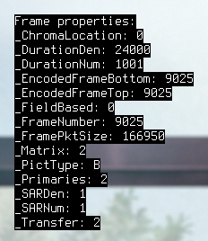

其中重要的属性包括：`_PictType, _ChromaLocation, _ColorRange, _Matrix, _Primaries, _Transfer, _FieldBased`。

根据文档给的链接，我们看到它们的具体定义。

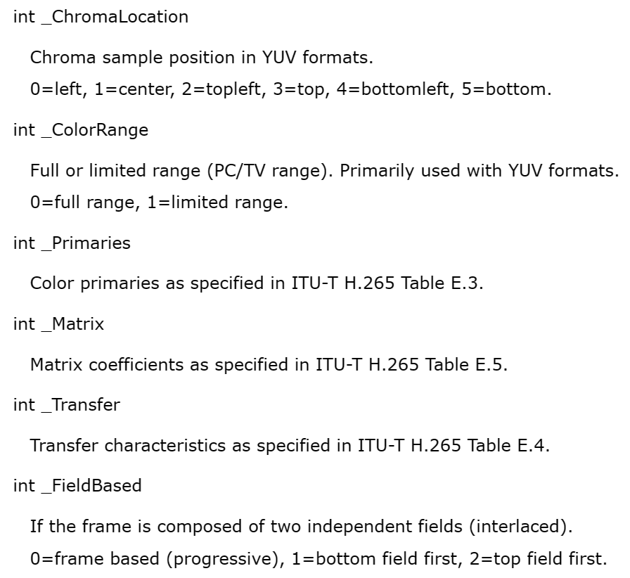

`_PictType`，帧类型，包括 `I/B/P` 帧。

`_ChromaLocation`，色度平面的对齐方式，最常见的，也即是 MPEG-2 标准的左中对齐为 `left=0`。

`_ColorRange`，数值范围，这里很反直觉的是，`full=0`，`limited=1`。事实上除了 frame props，其他地方都是 `full=1`，`limited=0`。另外文档也给出了具体的计算公式。

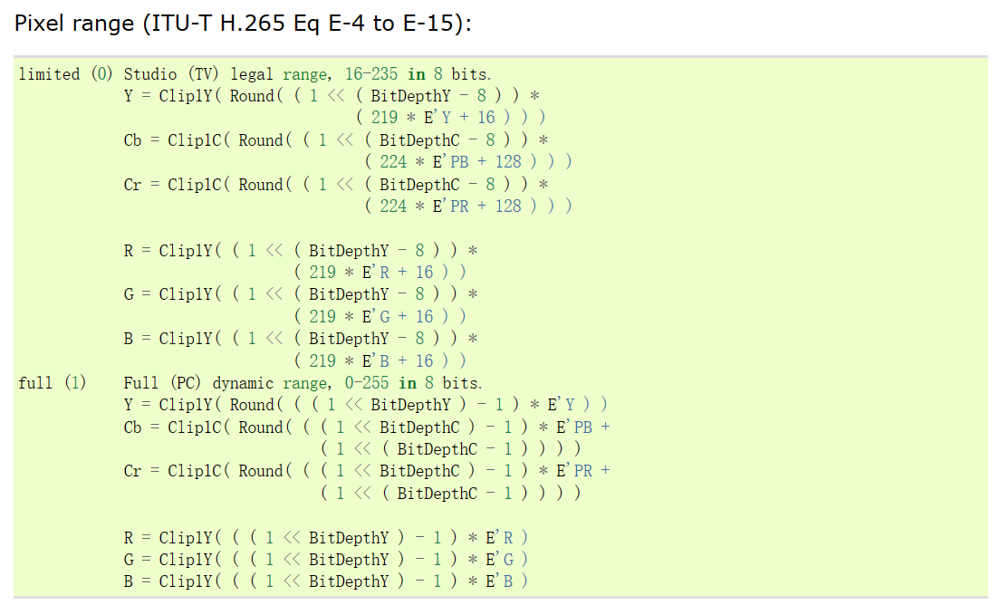

`_Matrix, _Primaries, _Transfer`，需要记住 `709=1`，`601=6`，其他的用到时查文档。

`_FieldBased`，场类型，0 逐行，1 底场优先，2 顶场优先。这个属性会在之后的 30fps 课程中用到。


在实际操作中，我们可以手动更改这些 frame props。

设置/删除 frame props 的用法如下：
```python
res = core.std.SetFrameProps(res, _Matrix=1)
res = core.std.RemoveFrameProps(res, "_Matrix")
```


## 5. VSPipe的使用

`VSPipe` 是运行脚本，输出视频的核心工具。文档在：[https://amusementclub.github.io/doc/output.html](https://amusementclub.github.io/doc/output.html)。

1. 输出给 x265 进行压制
```
vspipe.exe --y4m script.vpy - | x265.exe --y4m -D 10 --output "output.hevc" -
```

2. 输出 y4m 文件
```
vspipe.exe --y4m script.vpy output.y4m
```

3. 只计算各帧但不输出（用于测试脚本速度）
```
vspipe.exe script.vpy .
```


## 6. 练习

### (1)

熟悉 `vsedit`、`vspreview`、`vspipe` 的使用。

### (2)

阅读文档并学习以下滤镜的用法：`BlankClip, AddBorders, StackVertical, StackHorizontal, AssumeFPS, Minimum, Maximum, Reverse, Transpose, Turn180`。
