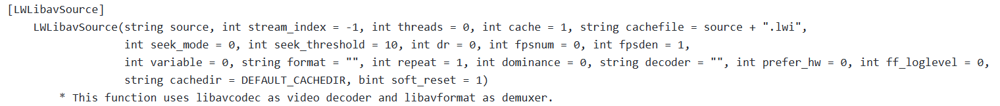
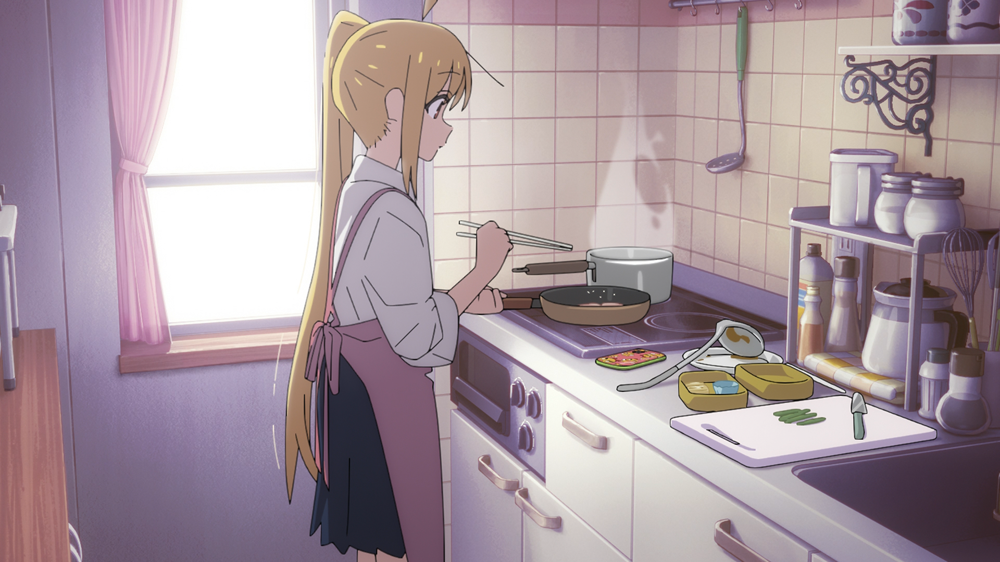
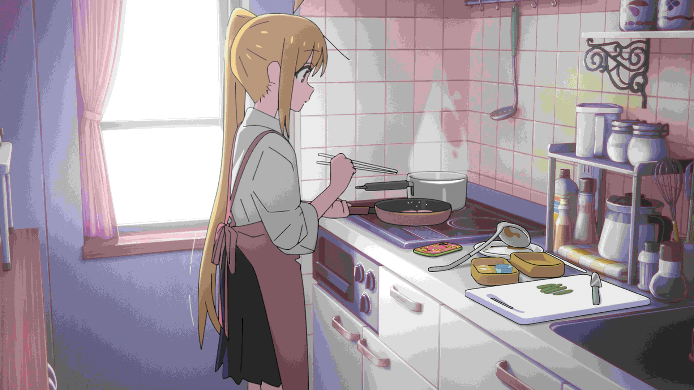
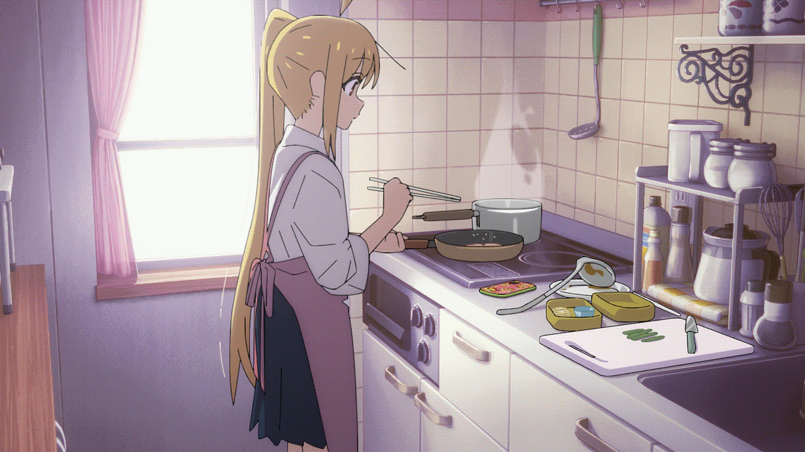
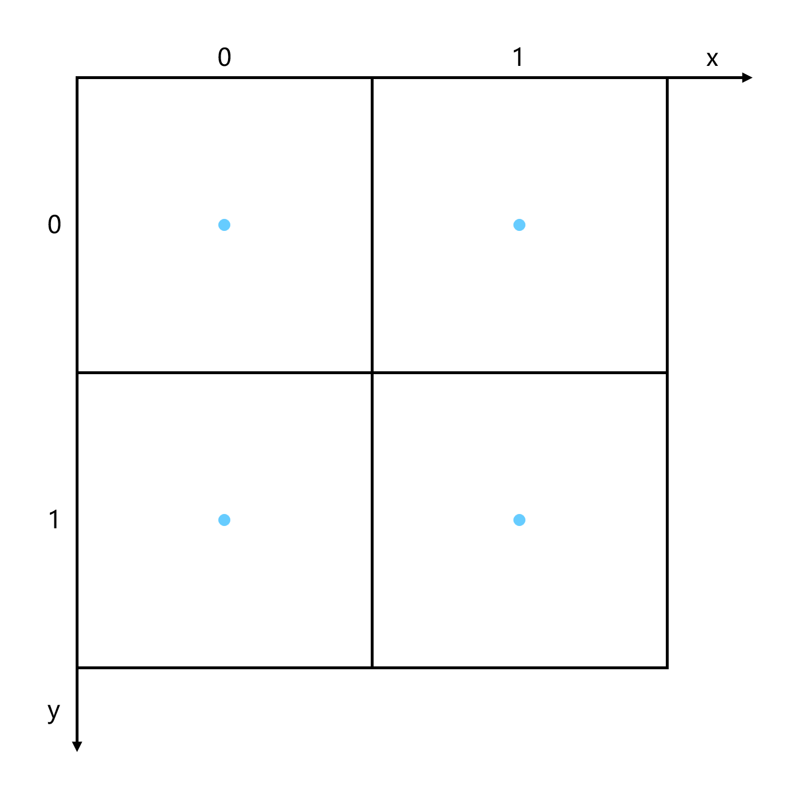
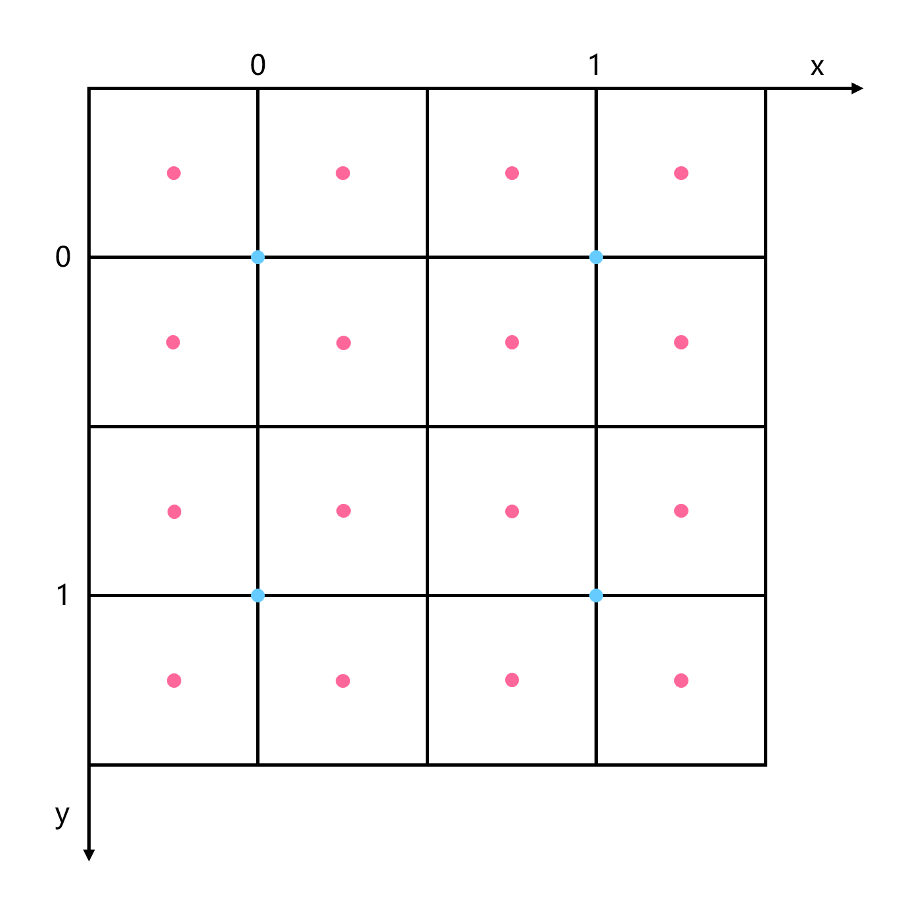

# 第六章 VS基础滤镜

本章在上一章的基础上，讲解常用的VS基础滤镜。

## 1. 源滤镜

源滤镜是读取视频源文件并进行解码的滤镜。源滤镜非常重要，其准确性直接关系到整个视频处理流程的可靠与否。

### (1). lsmas

lsmas 全称 L-SMASH-Works，是目前最准确的源滤镜。其 VS 版本的文档在：[https://github.com/AkarinVS/L-SMASH-Works/tree/master/VapourSynth](https://github.com/AkarinVS/L-SMASH-Works/tree/master/VapourSynth)。

lsmas 目前提供了两个滤镜：`LibavSMASHSource` 和 `LWLibavSource`。最常用的是 `LWLibavSource`，支持各种类型的输入，在第一次读取时会生成 `lwi` 文件。其次是 `LibavSMASHSource`，只支持 mp4 输入，但不需要生成 `lwi` 文件。

LWLibavSource 有诸多参数，但大多数情况只会用到第一个 `source`，指定输入文件路径。`format` 参数可以将源转为指定的像素格式，但一般不会使用，都是交给专门的滤镜处理像素格式转换。`fpsnum` 和 `fpsden` 参数可以将源转为指定的帧率而保持视频长度不变，在输入源帧率与目标不匹配时，会进行抽帧和插入重复帧。这在处理一些帧率混乱的源，比如来路不明的 web 流媒体源时可能有用，当然前提是视频平均帧率和目标帧率相差不大。`repeat` 用于交错源，将在后续章节中介绍。`prefer_hw` 可以使用硬件解码，但任何时候都不要使用这一功能，一是硬解不可靠，二是软解速度大于硬解速度。



lwi 文件需要我们特别关注，这是一个文本文件，记录了各帧的信息，便于准确快速 seek 解码。

每一帧的信息为以下格式：

```
Index=0,POS=343715,PTS=625,DTS=375,EDI=0
Key=1,Pic=1,POC=15,Repeat=1,Field=0
```
`PTS` 呈现时间戳，即帧呈现到屏幕上的时间；`DTS` 解码时间戳，即解码器必须解码这一帧的时间。这两者的单位取决于 lwi 开头部分的 TimeBase 参数，1/1000 表示单位为 1 毫秒，因此你可以通过 PTS 和视频帧率，算出每一帧对应的帧号。lwi 中各帧按照 DTS 从小到大排列。  
`KEY` 表示是否为关键帧 IDR，1 代表是 IDR，可以从这帧开始独立解码。`Pic` 表示帧类型，1 代表 I 帧，2 代表 P 帧，3 代表 B 帧。
根据 lwi 的帧信息我们可以判断 GOP，从一个 KEY=1 的 IDR（含）到下一个 KEY=1 的 IDR（不含）就为一个 GOP。

严格来说 KEY=1 表示 RAP（random access point），比 IDR 更进一步，表示可以从这帧开始完全重新解码。IDR 表示后续的帧不会再依赖前面的帧，但是并不保证不需要前面的数据。实际解码中，除了帧数据还有一些全局或半全局的参数，学名 VPS（video parameter set）和 SPS（sequence parameter set），它们为编码器提供一些必要的设置参数。lwi 的 key=1 说的是包括了 SPS 的 IDR 帧，因此可能发现有些 IDR 帧是 Key=0。


### (2). ffms2

ffms2 全称 FFmpeg Source 2，是另一个广泛使用的源滤镜。[https://github.com/FFMS/ffms2](https://github.com/FFMS/ffms2)。

基本用法如下：

```python
src = core.ffms2.Source("00001.m2ts")
```

我们一般不会使用 ffms2，因为不如 lsmas 准确，只有遇到极少的 lsmas 出错的情况才会使用它进行对照。ffms2 也会生成类似的索引文件，后缀为 `ffindex`，但是生成索引时不显示进度条，这是其另一大缺点。


### (3). imwri

imwri 全称 ImageMagick Writer-Reader，区别于前两者，imwri 是一个专用于图片的滤镜。[https://amusementclub.github.io/doc/plugins/imwri.html](https://amusementclub.github.io/doc/plugins/imwri.html)。

基本用法如下：

```python
src = core.imwri.Read("01.png")
```

事实上 lsmas 也可以读取图片，并且对于 JPG 这种 YUV 格式的，会保留原始数据，而 imwri 则将输入全转为 RGB。

但是 lsmas 有一定的局限性，不支持奇数高的 YUV420 格式图片。对于 YUV420 格式的图片，由于色度半采样，理论上是不支持奇数高的，图片制作时一般是增加一个不可见的行使其对齐来编码。lsmas 解码时只输出有效的奇数行，而后续其他滤镜都不支持这种奇特的格式，导致无法预览。

另外 imwri 还提供了 `Write` 滤镜，可以简单地批量导出图片。


## 2. 基础视频操作滤镜

### (1). Trim / Splice

视频的分割与合并，在 VS 里通过 `Trim` 和 `Splice` 滤镜来完成。

https://amusementclub.github.io/doc/functions/video/trim.html

Trim 一般通过下面方式使用，指定切割的起始帧和结束帧，区间是左闭右闭。
```python
std.Trim(clip, first, last)
```
如果你写 `std.Trim(clip, 0, 100)`，那么会切出 0-100 总共 100-0+1=101 帧。

在 python 里还可以使用`[]`的语法糖来进行切割，写法是`[first: last+1]`，注意这里是左闭右开。  
如果你写 `clip[0: 100]`，那么会切出 0-99 总共 100-0=100 帧。


https://amusementclub.github.io/doc/functions/video/splice.html

与切割相对的是合并 Slice，通过下面方式使用。一般要求它们的属性全部一致，包括画面大小，像素类型。帧率可以不一致，不过 VS 处理可变帧率是个麻烦事，后续章节会讲。
```python
std.Splice([clip1, clip2, clip3])
```
也有对应的语法糖，`clip1 + clip2 + clip3`。简单易懂，因此实际使用更推荐后一种方式。

如果希望合并多个相同 clip，可以使用乘法。`clip * 3`，就是将视频重复三次。  
这等价于 `Loop` 滤镜：`core.std.Loop(clip, times)`。


### (2). Interleave / SelectEvery

`Interleave` 滤镜，上一章已经讲过，可以将多个视频交替输出。与之相对的是 `SelectEvery`，按照一定的步长，选取部分帧。

https://amusementclub.github.io/doc/functions/video/selectevery.html

选取所有偶数帧：
```python
std.SelectEvery(clip=clip, cycle=2, offsets=0)
```
选取所有奇数帧：
```python
std.SelectEvery(clip=clip, cycle=2, offsets=1)
```
也有对应的语法糖：`clip[::2]` 和 `clip[1::2]`。


### (3). Crop / AddBorders

视频的裁剪，在 VS 里通过 `Crop` 滤镜来完成。

https://amusementclub.github.io/doc/functions/video/crop_cropabs.html

有两种用法：
```python
std.Crop(clip, left, right, top, bottom)
std.CropAbs(clip, width, height, left, top)
```
`Crop` 指定左右上下分别裁剪多少像素。`CropAbs` 先指定裁剪后视频的宽高，然后指定左上分别裁剪多少像素。

Crop 一般用于裁剪黑边，比如原生 4:3 的视频，加黑边加到 1920x1080，那么有效部分是 1440x1080。

用 Crop 可以写为：
```python
cropped = core.std.Crop(src, left=240, right=240)
```
也可以用 CropAbs 写为：
```python
cropped = core.std.CropAbs(src, 1440, 1080, left=240)
```


https://amusementclub.github.io/doc/functions/video/addborders.html

与裁剪相对的，我们也可以使用 `AddBorders` 来加黑边。

比如给 1440x1080 的视频加黑边到 1920x1080。
```python
addborders = core.std.AddBorders(src, left=240, right=240, color=[16, 128, 128])
```


### (4). ShufflePlanes / SplitPlanes

对视频平面进行操作，使用的是 `ShufflePlanes` 和 `SplitPlanes` 两个滤镜。

https://amusementclub.github.io/doc/functions/video/splitplanes.html

https://amusementclub.github.io/doc/functions/video/shuffleplanes.html

我们知道 YUV 和 RGB 都有三个平面，可以使用 SplitPlanes 将其拆分。
```python
Y, U, V = core.std.SplitPlanes(src)
```
这也可以通过 ShufflePlanes 得到。
```python
Y = core.std.ShufflePlanes(src, 0, vs.GRAY)
U = core.std.ShufflePlanes(src, 1, vs.GRAY)
V = core.std.ShufflePlanes(src, 2, vs.GRAY)
```

观察这些单个平面，会发现它们都以灰度图显示，我们可以通过下述方式观察单个平面的效果。
```python
mid = core.std.BlankClip(src, color=[128, 128, 128])
clipU = core.std.ShufflePlanes([mid, U, mid], [0, 0, 2], vs.YUV)
clipV = core.std.ShufflePlanes([mid, mid, V], [0, 1, 0], vs.YUV)
clipU.set_output(2)
clipV.set_output(3)
```

这个例子也显示了 ShufflePlanes 的复杂用法，`clips` 和 `planes` 两个参数都可以是列表。planes 的元素数量表示了结果 clip 的平面数量，其中第 i 个元素表示从 clips 列表第 i 个 clip 获取平面的序号。  
以 `clipU` 为例，`planes=[0, 0, 2]` 表示输出有 3 个平面，第一个平面取自 mid 的 0 平面，第二个平面取自 U 的 0 平面，第三个平面取自 mid 的 2 平面。

这种用法也允许 clips 的元素数量少于 planes 元素数量，此时 clips 将会由其最后一个元素填充至与 planes 元素数量相等。如下面这个例子中，`clips=[Y, mid]`，实际等价于 `[Y, mid, mid]`。  
另外，观察这个 `clipY` 结果会发现与单独预览Y的结果一致，因此实际中观察 Y 的效果只需抽取单个平面即可。

```python
clipY = core.std.ShufflePlanes([Y, mid], [0, 1, 2], vs.YUV)
clipY.set_output(1)
```


## 3. 精度转换

### (1). 高精度与Range

#### Range

在第一章我们了解了 range 的概念，即量化像素数据的取值范围。range 可以分为 `limited range` 和 `full range`。RGB 一般总是 full range，而 YUV 一般总是 limited range（除了 jpg 图片、YCgCo）。

我们知道，8bit 下 limited range 是：
```
Y  [16, 235]
UV [16, 240]
```
10bit 下 limited range 是：
```
Y  [16*2^2, 235*2^2] = [64, 940]
UV [16*2^2, 240*2^2] = [64, 960]
```

一般地，range 通过如下方式定义：
```
limited:
Y   [16*2^(bit-8), 235*2^(bit-8)]
UV  [16*2^(bit-8), 240*2^(bit-8)]

full:
YUV [0, 2^bit-1]
```

这样 16bit 下 limited range 是：
```
Y  [4096, 60160]
UV [4096, 61440]
```

数据在不同精度和不同 range 间以浮点值作为不变量进行转换，可以总结转换公式为：
```
dst_value = (src_value - src_zero) / (src_max - src_min) * (dst_max - dst_min) + dst_zero
```

不难证明，在目的和源的 range 都为 limited 时，可以通过乘/除以 `2^(dst_bit - src_bit)` 来进行转换。

#### VS精度转换

通常视频都是 8bit 或者 10bit，而在 VS 中经常会使用更高精度比如 16bit 来进行处理。

VS 中用来转换精度的有 fmtc 和 zimg 两个工具，前者是使用 `fmtc.bitdepth` 滤镜，后者是使用 `resize` 系列滤镜。

fmtc 全名 format conversion tools，文档在这里：[https://amusementclub.github.io/fmtconv/doc/fmtconv.html](https://amusementclub.github.io/fmtconv/doc/fmtconv.html)。

假设输入源为 8bit，用 fmtc 转为 16bit 的写法为：

```python
src16 = core.fmtc.bitdepth(src8, bits=16)
```
当然，也可以通过 `fulls` 和 `fulld` 参数显式指定输入和输出的 range。如果不指定，输出 range 总是等于输入 range，而输入 range 通过数据类型来猜测，YUV 总是猜测为 limited range。

resize，VS 的内置滤镜，文档在这里：[https://amusementclub.github.io/doc/functions/video/resize.html](https://amusementclub.github.io/doc/functions/video/resize.html)。

虽然名字叫 resize，但实际却是 VS 中的瑞士军刀，集成了包含缩放在内的多种功能，这里我们用到的是转换精度的功能。

同样假设输入源为 8bit，转为 16bit 的写法为：
```python
src16 = core.resize.Bicubic(src8, format=vs.YUV420P16)
```
resize 可以通过 `range` 和 `range_in` 参数显式指定输入和输出的 range。与 fmtc 不同，在未指定 range 时，resize 会优先通过 frameprops 来决定 range。

顺便一提，在 resize 的参数中，有 `_in` 后缀的指输入，没有 `_in` 后缀的都是指输出，这些参数都通过一个 magic number 来指定。同时，resize 还提供了一套 `_s` 后缀的参数，可以使用字符串来指定。对于 range、matrix 这类需要指定 magic number 的参数，我们都强烈建议使用字符串形式，或者使用 magic number 对应的 enum 来指定，以提高脚本的可读性，防止出错。

除了直接使用以上两个滤镜，还可以通过 `mvf` 中的 wrapper 来进行转换。
```python
src16 = mvf.Depth(src8, depth=16)
```
在未显示指定 `fulls` 和 `fulld` 时，`mvf.Depth` 通过输入视频格式来猜测 range，对于 YUV 和 GRAY，总是猜测为 limited，其他格式为 full。

#### VS中的format表示

GRAY 和 RGB 都是采用 `GRAY+X`、`YUV+X` 的形式，这里 X 可以是一个数字，表示整数类型的位宽，也可以是一个字母，表示浮点类型的位宽。H 表示 half，半精度浮点数，fp16。S 表示 single，单精度浮点数，fp32。

YUV 则有些区别，采用 `YUV+css+P+X` 的形式。css 表示色度下采样，常见有 444、422、420 等。P 表示三个平面的存放方式为 planar YUV，即三个平面分开存放。最后 X 与 GRAY 和 RGB 相同，可以是代表整型位宽的数字，也可以是代表浮点类型的字母。

需要注意的是，fmtc 和 mvf.Depth 中指定的 bit 数，默认 16 表示 int 16，而 32 表示 float 32。

#### YUV overflow / underflow

通常我们遇到的 YUV 视频都是 limited range，但如果有这样一个视频，其内容是 full range 的，却被标成了 limited range，会发生什么？  
这时超过 limited range 范围的部分将被截断在 limited range 的极值上，全部变成一种颜色，分辨不出其中的细节了。

这种现象就被称为 YUV 越界，又叫 YUV overflow / underflow。超过最大值，称为上溢，overflow；超过最小值，称为下溢，underflow。  
实际中上溢和下溢可以同时发生，也可以分别独立发生。一般来说，上溢单独发生的情况要远多于其他情况。

在VS中，我们通常用 `core.hist.Levels()` 滤镜观察是否发生越界。

```python
res = core.hist.Levels(src8)
res.set_output(0)
```
可以看到，在画面的右侧出现了三个直方图，从上到下分别表示 YUV 三个平面的像素值分布情况。每个直方图的横坐标是像素值，从左到右是 0 到 255；纵坐标是该值对应的像素数量。

图像中间没有阴影的区域，表示 limited range，两端的阴影区域，表示超过 limited range 的区域。如果我们发现，直方图超出中间而到达两端的区域，就说明发生了越界。

在原盘的 OP 和 ED 部分，可能会有少量越界，这大多是后期添加的 staff 字幕带来的，白色字幕可能会越界几个像素，到达 240 左右。这种情况一般不需要处理，事实上我们反而会利用字幕颜色越界的特性来框选它们。

对于现在的新番，YUV 越界很少在动画正片中出现，但是时常在三次元特典中发生，一般习惯拿到三次元特典上来先检查 YUV 范围。如果发现视频中大段出现亮度越界的现象，那就需要提起注意，这个视频很可能有 range 问题。

判断确实发生了越界，就需要进行处理，将数据范围从 full 压缩到 limited。为了保证这一操作的精度，通常会在 16bit 下进行。在 VS 中，`Levels` 滤镜专门用来处理越界问题。

假设一个视频发生了亮度 overflow，可以使用以下方式修复：
```python
src16 = core.fmtc.bitdepth(src8, bits=16)
src16 = core.std.Levels(src16, min_in=16 << 8, max_in=255 << 8, min_out=16 << 8, max_out=235 << 8, planes=0)
```
当然，实际情况中你需要分别判断 overflow 和 underflow 是否发生，并找到它们溢出的最大值。


### (2). 降精度与Dither

经过一系列高精度的处理，在最后输出给编码器时，我们需要将精度降为 8bit 或者 10bit。通过之前的转换公式我们知道，从高精度降为低精度时，多个高精度值会被转为同一个低精度值，这样在相邻颜色间就会形成明显的分界线，或者说色带。

为了效果明显，我们使用 8bit 降为 4bit 来展现这一过程，这里使用 round（四舍五入）来处理。
```python
src4 = mvf.Depth(src8, depth=4, dither=1)
```




可以看到降低精度后的图片出现了很多明显的色带，这是我们难以接受的。  
为了解决这种色带问题，很自然的想法是，加点噪声，让相邻颜色之间的台阶看起来没那么陡峭。  
这种引入类似噪声的方法，就称作抖动（dither）。

最简单的抖动算法，`ordered dither`，又叫 Bayer matrix，在 fmtc 和 mvf 里是 `dmode=0`。



现在我们可以看到，色带问题得到了极大的改善。仔细观察，则会看到画面上充满了规则排列的点状图样。

这种 dither 过程中引入的丑陋噪点也被叫做 dither pattern，它们在进一步缩放后会更加明显。平时 QQ 聊天中，在那些被压缩过的缩略图上，经常可以看到这种现象。

ordered dither 虽然丑陋，但有这些好处：  
1.算起来很快  
2.很难被编码器抹平  

我们通常会利用它很难被抹平的特点，将它用在 8bit 低码率成品的暗场中，防止出现色带。


那么有没有更高质量的 dither 算法呢，当然是有的，最常使用的是 `error diffusion` 误差扩散。

fmtc 中提供了很多 error diffusion 的变体，差别不大，一般使用 `dmode=3`，最经典的 error diffusion，这也是 fmtc 和 mvf.Depth 的默认算法。


## 4. 初等Resizer

Resizer 是滤镜中的瑞士军刀，它能处理多种基础视频操作，也在一些高级处理手段中发挥重要作用，这些我们会在后续章节中逐渐看到。在本章我们仅关注 Resizer 最基本的用法，视频缩放。

VS 中使用 resizer 有 fmtc 和 zimg 两个工具，前者是使用 `fmtc.resample` 滤镜，后者是使用 VS 自带的 `resize.*` 系列滤镜。

https://amusementclub.github.io/doc/functions/video/resize.html

https://amusementclub.github.io/fmtconv/doc/fmtconv.html#resample

### (1). resizer的副作用

可以看到，这些滤镜里面提供了很多不同的算法，为了更好地使用它们，我们需要了解这些算法的优势和劣势所在。

大部分 resize 滤镜都逃不过这三种副作用：模糊（blurring）、锯齿（aliasing）、振铃（ringing）。

#### 模糊（blurring）

模糊很好理解，就是缩放后画面变糊了。

可以通过下面这段代码感受模糊的效果，其中 `upscale_0` 是使用 nearest 算法，单纯复制原来的像素，锐利度几乎不变，而 `upscale_1` 使用 bilinear 算法，通过线性插值得到结果，图像有明显的模糊现象。
```python
upscale_0 = core.resize.Point(src8, src8.width*2, src8.height*2)
upscale_1 = core.resize.Bilinear(src8, src8.width*2, src8.height*2)
upscale_0.set_output(0)
upscale_1.set_output(1)
```

大部分时候我们总是不希望画面变糊的，但是在放大 UV 平面的时候我们就可以用一些比较糊的滤镜。原因是，UV 平面本就信息量不高，而编码器还会疯狂剥削 UV 平面，导致有时候 UV 平面质量很差。这时候使用一些锐利的放大滤镜，反而会放大 UV 平面的瑕疵，而用一些模糊的滤镜可以“一糊遮百丑”。

另一方面，UV 平面的锐利度其实对观看体验的影响不大。观察下面这段代码的结果，对比 `u1` 和 `u2` 可以发现色度平面被严重模糊，而对比 `res1` 和 `res2` 则发现最后呈现结果区别很小。因此，拉伸 UV 平面基本没必要选用特别锐利的滤镜，区别实在不是很明显。
```python
res1 = src8
res2 = core.rgvs.RemoveGrain(src8, [0, 20, 20])
u1 = core.std.ShufflePlanes(res1, 1, vs.GRAY)
u2 = core.std.ShufflePlanes(res2, 1, vs.GRAY)
res1.set_output(0)
res2.set_output(1)
u1.set_output(2)
u2.set_output(3)
```

#### 锯齿（aliasing）

锯齿很好观察，使用 nearest 进行非整数的缩放，满屏幕都是锯齿。
```python
upscale = core.resize.Point(src8, src8.width*1.75, src8.height*1.75)
upscale.set_output(0)
```

#### 振铃（ringing）

至于 ringing，通常出现在比较锐利的 resizer 中。选用清晰度较高的源，使用 Lanczos 之类锐利的滤镜，可以看到线条周围一圈发亮的东西，就是 ringing。
```python
upscale = core.resize.Lanczos(src8, src8.width*2, src8.height*2, filter_param_a=2)
upscale.set_output(0)
```

### (2). 图像的缩放

通常人们会认为数字图像是由一堆相同大小的正方形像素块组成，这种观念实际上是错误的。实际上，我们应该把图像看做一块连续的平面，而像素是其上没有大小只有坐标的采样点。只要采样的数量足够多，那我们就可以用这些分立的点表示整幅图像。

缩放图像，则应该理解为图像平面本身没有变化，而只是增加或减少采样点数量，或者说密度。

以下面这幅图像为例，现在有 4 个像素，坐标分别是：`(0,0), (0,1), (1,0), (1,1)`。



现在我们希望将图像的宽高都放大两倍，最终有 16 个像素。按照中心对齐，现在这些像素的位置如下图红点所示。



可以发现这些新像素在原来坐标系下处于小数坐标的位置，而这些位置是没有准确值的，因此我们只能通过周围已知像素，猜测这些位置的值，这被称为插值（interpolation）。

插值有两个关键点，一是 `taps`，即选取周围多大范围的已知像素；二是 `weight`，即这些选中的像素的权重是多少。

`taps` 很好理解，就是选取范围的半径，选取的周围像素越多，“猜测”就越可能准确。但同时，涉及的像素越多，计算也就越慢。

`weight` 也容易理解，比如图上 `(1,0)` 和 `(1,1)` 位置的像素到 `(0.25, 1.25)` 采样点的距离不同，它们所占的比重自然也是不一样的。

在实际中，我们使用 `kernel` 来描述以上性质。kernel 是一个曲线，它的横坐标表示已知像素到采样点的距离，纵坐标表示在这个距离上，该像素贡献的权值。taps 也在曲线上有所表现，超过 taps 范围的像素没有贡献，因此曲线恒为 0。

https://amusementclub.github.io/ResampleHQ/kernels.html

可以通过这个网页查看各种 kernel 的形状，将鼠标移到曲线下方的 kernel 名字上可以显示对应的 kernel 曲线，同时也可以在最下方的直方图上看到各个 kernel 对应的 blurring、sharpness、ringing 三种性质。不过需要注意的是，这里讲的 kernel 性质是数学上的定义，和我们前面讲的视觉上的概念还有些区别。

最后，我们通过这张图来形象地说明 2 维图片的插值过程。  
如图所示，先是在横向上进行插值，算出中间点，然后纵向上再利用这些中间点，进一步插值算出目标点。  
这一过程体现出，横向和纵向的插值是完全独立的，事实上，我们甚至可以在两个方向使用完全不同的算法。  
另外，这幅图也展示了，不同 taps 的插值算法会利用到的周围像素范围。


### (3). resizer的使用

接下来我们就结合 kernel 曲线，依次介绍常见的 resizer。

#### Point(Nearest)

首先是 `nearest`，最常见的算法之一，它可以说没有插值，只是单纯采样最近的像素。这里没有提供它的 kernel 曲线，但根据性质描述应该不难画出。由于它只采样最近的像素，显然是 `1-taps` 的。

```python
core.resize.Point(clip, width, height)
core.fmtc.resample(clip, width, height, kernel="point")
```

#### Bilinear

`bilinear`，中文名双线性。它分别对x和y方向各做了一次线性插值，因此得名双线性。观察 kernel 可以看出其线性的性质，同时可以看出它是 `1-taps` 的。

双线性特点是计算快，不那么锐利，有些锯齿，没有 ringing，各方面比较平庸。

```python
core.resize.Bilinear(clip, width, height)
core.fmtc.resample(clip, width, height, kernel="bilinear")
```

#### Bicubic

`bicubic`，中文名双立方。区别于 bilinear 的线性插值，bicubic 在每个方向选取最近的四个点，用三次多项式插值计算，因此得名双立方。

bicubic 有两个专有的参数，`b` 和 `c`。大致可以理解为 b 越大越模糊，c 越大越锐利。这两个参数在 resize 函数里叫 `filter_param_a` 和 `filter_param_b`，在 resample 函数里叫 `a1` 和 `a2`。

```python
core.resize.Bicubic(clip, width, height, filter_param_a=b, filter_param_b=c)
core.fmtc.resample(clip, width, height, kernel="bicubic", a1=b, a2=c)
```

bicubic 中不同的 bc 组合有不同的性质。在提出 bicubic 算法的那篇论文里，作者用不同的 bc 参数组合做了很多图，然后让图像处理的专业人士去评价，得到以下结果。


blur 和 ringing 我们前面讲过，这里的 anisotropy，各向异性，指的是横竖方向和斜的方向，这个滤镜的效果出现了明显不同，导致看起来会有锯齿的感觉。

最终，论文作者推荐了 `b=1/3, c=1/3` 的参数，也就是以两位作者名字命名的 `Mitchell-Netravali` 算法。

还有一些比较经典的取值，比如 `Catmull-Rom`，`b=0.0 c=0.5`。过去经常在处理 chroma 时使用。

`softcubic`，指一系列参数，满足 `b=x, c=1-x`，就叫 `softcubic(100*x)`。其中 `softbubic100`，`b=1.0 c=0.0`，又称为 `b-spline`。

#### Spline

`spline` 系列，taps 是可调的。它的命名原则是，如果一个 spline 是 n-taps 的那么它叫 `spline((2n)^2)`。

spline16 是 2-taps，spline36 是 3-taps，spline64 是 4-taps。

spline 系列比较柔和，出 ringing 较少，常用于 downscale。

```python
core.resize.Spline36(clip, width, height)
core.fmtc.resample(clip, width, height, kernel="spline36")
```

#### Lanczos

`lanczos` 系列，taps 也是可调的。如果一个 lanczos 是 n-taps 的那么它叫 `lanczos(n)`。

lanczos 较为锐利，通常也会带来比较重的 ringing。过去常用 lanczos4 配合 non-ringing 用于放大。

在 resize 函数中通过 `filter_param_a` 指定 taps，在 resample 函数中通过 `taps` 参数指定 taps。

```python
core.resize.Lanczos(clip, width, height, filter_param_a=n)
core.fmtc.resample(clip, width, height, kernel="lanczos", taps=n)
```

#### Gauss

高斯滤镜，名字来源于其 kernel，这个曲线是按高斯分布（正态分布）画的。

resample 里可以使用 gauss，resize 则没有该滤镜。滤镜有两个参数，`a1` 和 `taps`。`a1` 是 0-100 的实数，与高斯分布的 sigma 相关，越小越模糊。`taps` 指定需要采样的像素范围，由于高斯分布曲线是向两端无限延伸的，因此需要确定实际采样的半径。

gauss 通常用于配合其他滤镜，比如配合 lanczos 做n o-ringing 的放大，这会在后续课程中提到。

```python
core.fmtc.resample(clip, width, height, kernel="gauss", a1=100, taps=n)
```

#### nnedi3

最后介绍一个实际中广泛使用的神经网络放大滤镜，`nnedi3`。

https://github.com/dubhater/vapoursynth-nnedi3

这个滤镜最开始其实不是用来放大的，而是用于反交错的。它的作用是在每两行像素中插入一行，也就是说，原始版本的 nnedi3 只能把原图的高变成两倍。

假如想放大宽，那么需要把图竖起来送进 nnedi3，可以利用 `std.Transpose()` 滤镜。

在 VS 中，调用 nnedi3 进行倍高是这样：
```python
core.znedi3.nnedi3(clip, field=1, dh=True)
```

需要注意的是，手动倍高进行放大会产生 chroma shift 问题，这会在后续课程进行介绍。目前推荐的用法是，使用 `nnedi3_resample.py` 这个 wrapper，它将 nnedi3 封装成和其他 resizer 类似。在 nnedi3_resample 里面，`width` 和 `height` 不再需要是两倍，脚本会将输入用 nnedi3 2/4/8...倍拉到比较合适的大小后，再调用传统的 resizer 拉到目标尺寸。

```python
import nnedi3_resample as nnrs
upscale = nnrs.nnedi3_resample(clip, width, height, mode="znedi3")
```


## 5. 字幕滤镜

字幕滤镜按照渲染标准不同分为 `VSF` 系和 `libass` 系。前者以 VSFilter 这一经典字幕滤镜为基础，遵循传统的事实标准。libass 则是近年来新起的 ass 标准。

在压片中具体使用哪个，需要根据具体情况来确定。对于老字幕，只有 VSF 一种选择；而对于较新的字幕，需要询问字幕组，保证和字幕组制作字幕时使用的一致。

### (1). VSF系字幕滤镜

VSF 系一般使用 `xy-VSFilter`，它的 VapourSynth 版本是：[https://github.com/HomeOfVapourSynthEvolution/xy-VSFilter](https://github.com/HomeOfVapourSynthEvolution/xy-VSFilter)。目前包括原版和 VapourSynth 版都不再有人维护，但是不影响我们继续使用。

使用方法为：
```python
xyvsf.TextSub(clip clip, string file[, int charset=1, float fps=-1.0, string vfr=''])
```

有些字幕会用到复杂特效，需要 `VSFilterMod`：[https://github.com/sorayuki/VSFilterMod](https://github.com/sorayuki/VSFilterMod)。

这个 VSFilterMod 也可以给播放器使用，但是注意只有少量特效能实时播放。因此你和字幕组合作时，得提前问清有没有需要 VSFilterMod 的特效，如果有，请他们尽量在外挂字幕中去除。一些可以实时播放并且不影响其他字幕滤镜渲染的特效，则可以保留，但是注意在发布时提醒观众。

一些主攻 Live 的字幕组，可能会大量使用无法实时播放的特效，这时可以选择制作两个版本：无字幕视频+外挂去特效字幕，内嵌特效字幕视频。

使用方法为：
```python
vsfm.TextSubMod(clip clip, string file[, int charset=1, float fps=-1.0, string vfr='', int accurate=0])
```


### (2). libass系字幕滤镜

libass 系字幕滤镜没得选，只有 `assrender`：[https://github.com/AmusementClub/assrender](https://github.com/AmusementClub/assrender)。

使用方法为：
```python
assrender.TextSub(clip clip, string file, [string vfr, int hinting=0, float scale=1.0, float line_spacing=1.0, float dar, float sar, bool set_default_storage_size=True, int top=0, int bottom=0, int left=0, int right=0, string charset, int debuglevel, string fontdir="", string srt_font="sans-serif", string colorspace])
```
顺带一提，assrender 可以设置 `fontdir` 参数，从指定目录获取字体，而 VSF 必须安装字体才能渲染。
