# 第七章 视频编码器基础

首先，编码器是一项系统工程，其中每一环都可以拿出来当一门大学课程用，也有无数的论文去给视频编码这项技术去增加技术的可能性，所以这里的编码器教学目标是让大家能听明白，知道编码器的参数是干什么的，我想要怎么做的时候去改什么参数。

教程内容会涉及到不少概念，大家不需要特别深入去理解，在这个阶段会修改编码器参数，知道怎么用就行了。

首先，大家一定先要弄清楚一个概念，x264 和 H264，x265 和 H265 的关系。

H26x 是**标准**，x26x 是**实现**。

标准定义了视频流的结构，数据流的存放等框架性内容。  
实现则是你我都在用的编码器程序。  

任何符合 H26x 规范的编码器实现，它输出的视频流一定能够被任何符合 H26x 规范的解码器解码。

所以今后请务必区分 H264，x264 等的区别，以及接下来讲的时候也别搞混了。

## 基本概念

### 帧内编码 (Intra-frame coding)

其实讲视频编码，实际上还是得从 I, P, B 帧说起，这三种帧是如今普及率最高的 H264 所使用的帧类型。

视频编码一切的一切，基础的基础，所有东西都引用它，我们从 I 帧讲起。

实际上 I 帧就是存储的一张完整的图片。

由于在视频编码过程中需要对一张完整的图片进行编码。  
于是乎也出现了 HEIF, AVIF 等规范，他们就是利用了 HEVC，AV1 所规定的*帧内编码*技术带来的提升，从而做到极高的压缩率。

但是我们还是追根溯源，从单张图片的老祖宗说起，JPEG。

JPEG 干的事情，现在的编码器对画面处理的时候全都会做。

首先，***色度半采样***大家也都知道了，我们通过将 RGB 转换成 YUV，直接去掉了大量的信息。  
这里的信息，是指最基础概念的，0 和 1。

然后，JPEG 将图片分为了无数个 8x8 的小块。  
每一块都是 64 个像素。  

我们对 JPEG 做了一个操作 - ***DCT***：***离散余弦变换***  
DCT 干啥的可以不用理解，也可以理解为空间换时间的傅里叶变换，将离散的输入变到频域空间。  

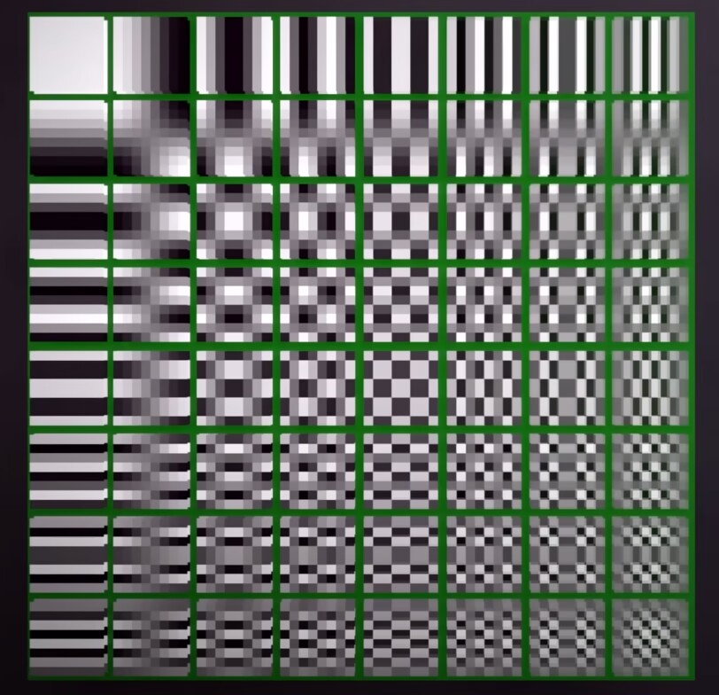

我们通过这张表，可以将任何 8x8 的小块，通过记录每个格子用了多少次，来获得一个 8x8 的矩阵，这个矩阵能拿来重建一切 8x8 的像素。  

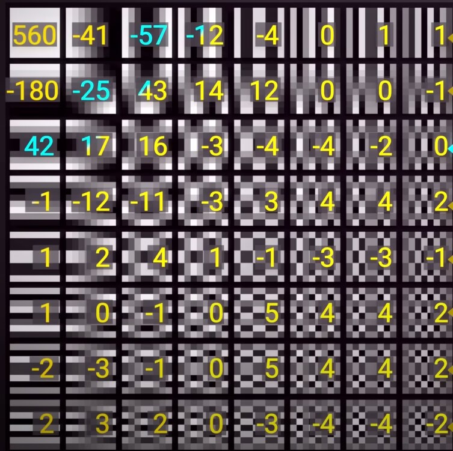

然后我们获得了一个包含一个 8x8 格子的 dct 结果。  

我们将结果通过除以另一个表格，这个表格叫做*量化表*。

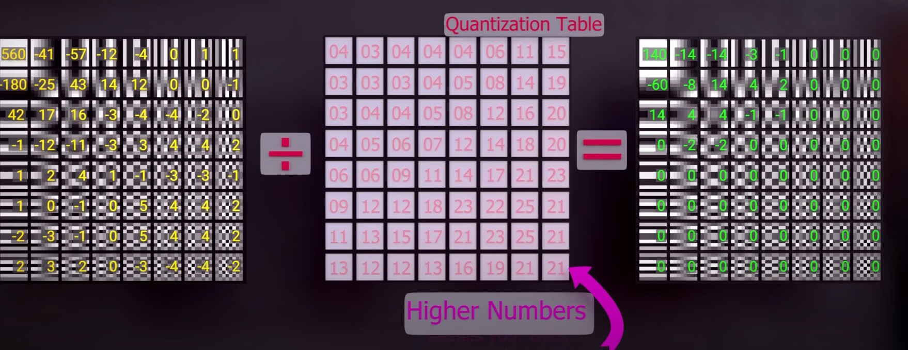

就能获得一个 ***量化*** 后的矩阵。  

这时候可以发现左上角有数字，右下角没有数字，因为我们通过*量化*去除了高频数据。  

这时候在使用*霍夫曼编码*，*熵编码*等方式，我们就能将 8x8 的一个格子变得非常小，成为简短的很小的一段数据。  

这就是 *色度半采样* - *变换* - *量化*  

过程中，我们去除了高频数据，留下了低频数据。  

但是，所有的过程都围绕 8x8 的格子展开，当*量化表*非常激进，我们去除了大量的数据之后，每个 8x8 格子之间的差异就会被拉大。  

于是，我们就看到了低码率视频最常见的一种 Artifact: **Blocking**

其实如果你搞过一些 Hi-Fi 的话，纠结无损音频是不是真无损，也是看频谱图的高频有没有被保留，原理是相似的。  

实际上我们做的事情，就是把人对这些不是很敏感的高频数据给全抹了。  
运用这项技术，再加上*运动侦测*。  

我们就有了最基础的，视频编码器。

### 帧间编码 (Inter-frame coding)

作为视频编码器，我们需要在时域上，寻找相似的地方，并且把这些相似的地方标记出来，去找别的帧引用。

怎么分割动与静，怎么将画面细节拿出来，方案一直在进化，标准一直在提升。

当初的 MPEG2，分割是最无脑的分割。


也就是，纯分块。  

每一个最小的小方格，大小就是 8x8。

这样无脑分块是无法有效寻找动态内容的。  
效果较为一般，但是符合当时的算力水平。  

进化到 H264 时代，就多了一点点细节。

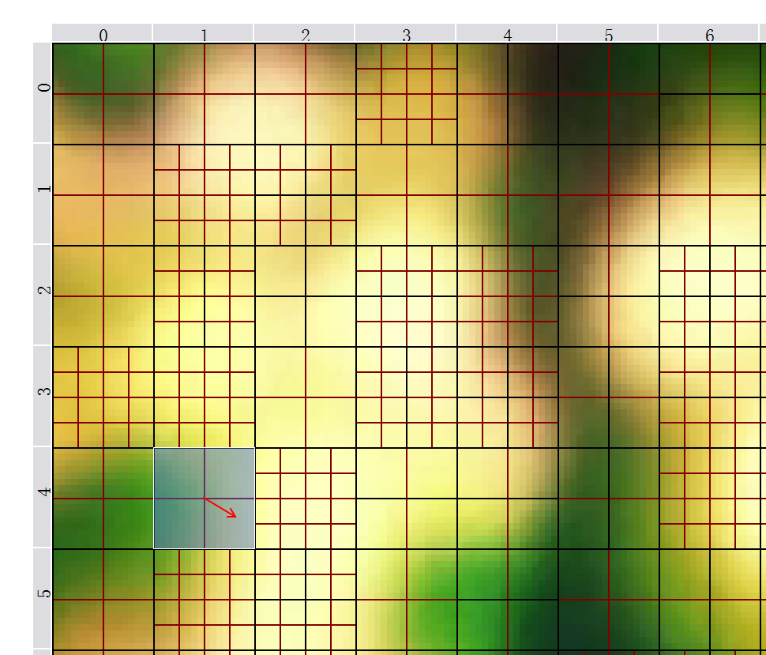

我们可以分 8x8，也可以分 4x4。  
与此同时，我们还可以对每一个 16x16 的块，单独给一个 *qp*。  
> QP - Quantization Parameter  

*qp* 是啥，量化值，还记得 JPEG 的*量化表*么？  
其实就是差不多的东西。

给的 *qp* 越**高**，被抹掉的高频信息就越多。  
也意味着更可能出现视频编码的 Artifact，包括了模糊，Blocking 等。  

而再次进化到 H265，

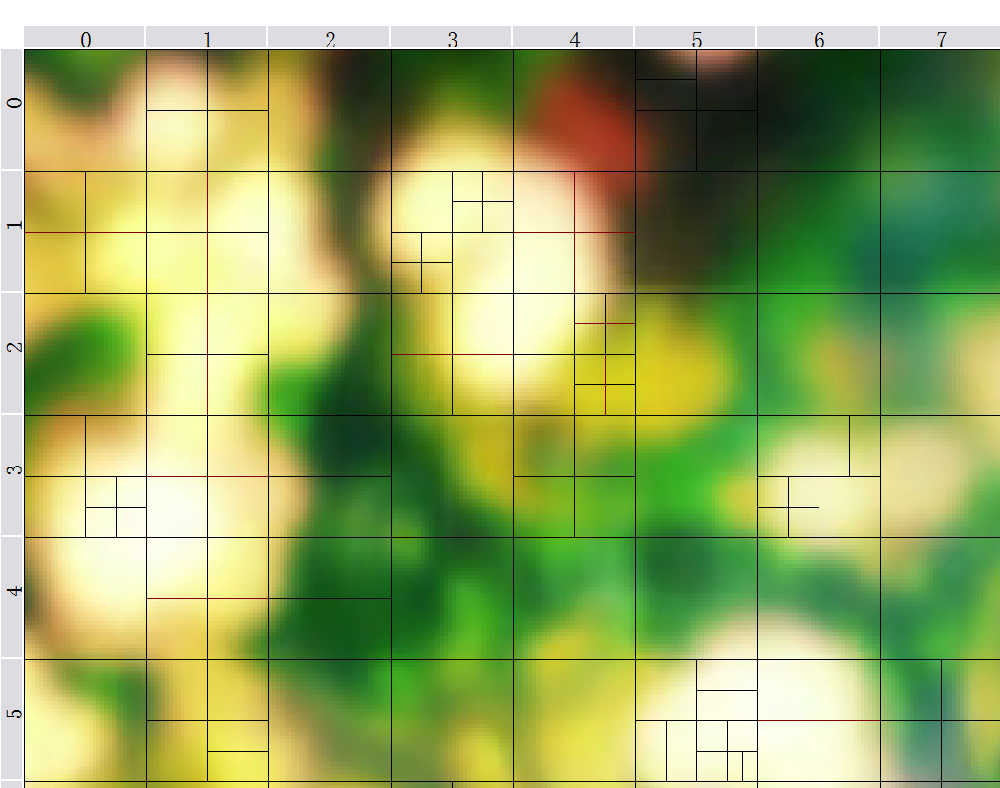

块的分割变得更加自由，最小单位也变得灵活，出现了 `Rect`，`Amp` 这样的分割  
> `rect` - rectangular motion partitions  
> `amp` - asymmetric motion partitions  

（上图没有开 `amp`）

详细的分块，使得寻找动和静的分割变得更容易。

同时，H265 的最小变换单元变成了 *TU*，它的大小是可变的。  
> TU - Transform Unit  

也就是说，
1. 我们能对 4x8，8x8 等一系列大小块，动态分配 *qp*，  
2. 我们能将画面分割更碎，给每个 *TU* 一个 *qp*，也意味着计算量将变得非常地可怕。

> PS: MPEG2 里，你看到的整个视频基本上所有的块都是一个qp值

对于 H264 来说，最大的一个格子，叫做一个*宏块* (Macroblock)，大小是定死的 16x16。

而 H265 中，它可以是 16x16, 32x32, 64x64。

所以，帧内编码，是所有视频编码器的**底力**之一，  
而帧间编码，则是视频编码器的另一个**底力**。

## x264 参数解析

接下来我们开始讲 x264 的命令行参数时，会从 **底力** - **骗力** - **预算** - **杂项** 四个方面来讲

如果大家有 MeGUI 的话，可以打开，在 x264 configuration 里，拥有一个 GUI 的配置界面，里面囊括了几乎所有 x264 编码器可以调整的参数。 

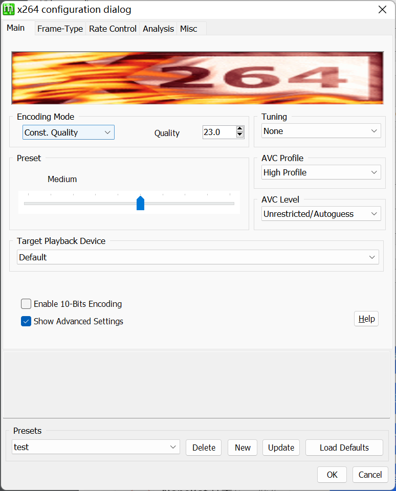

> 记得勾选 Show Advanced Settings

### 基础参数

打开的第一页，其实就涵盖了最简单的，**预算**，**底力**，**骗力**设置

- 底力

    什么是底力？
    
    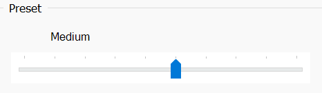
    
    `--preset <string>`  

    x264 / x265 都有这样的 preset，它决定了你愿意花多大力气，去做*帧内编码*，*帧间搜索*，*率失真优化*。  
    当然，开的越高，边际收益也越低。

    尽管已经 2023 年了，`veryslow` 也已经是随便跑的参数了，但是也没人会想去开那个 `placebo`。  

    > 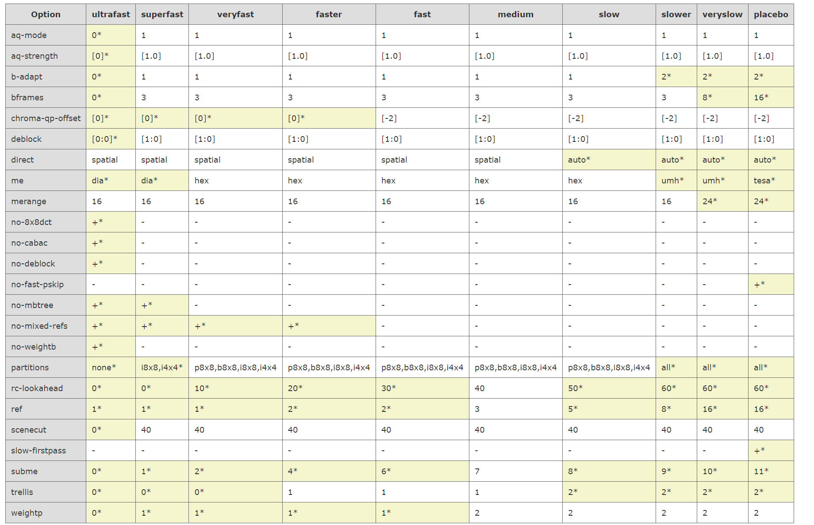  
    > https://dev.beandog.org/x264_preset_reference.html

    这是每个 preset 对应的，编码器底力部分设置值。

- 骗力

    而骗力，就有些微妙了。

    因为有损压缩这事情，无时无刻都在追求一件事，  
    骗你它是无损的，你看不出。

    怎么把有限的预算分配在合理的区间，让你尽可能的看不出，就是骗力。

    但是骗力并不是全自动的，不同的视频类型需要的参数也非常不一样。

    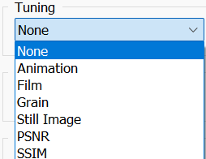
    
    `--tune <string>`  

    尽管 x264, x265都有名曰 `Animation` 的 *tuning*，但是它是为古早制作的美漫准备的。
    
    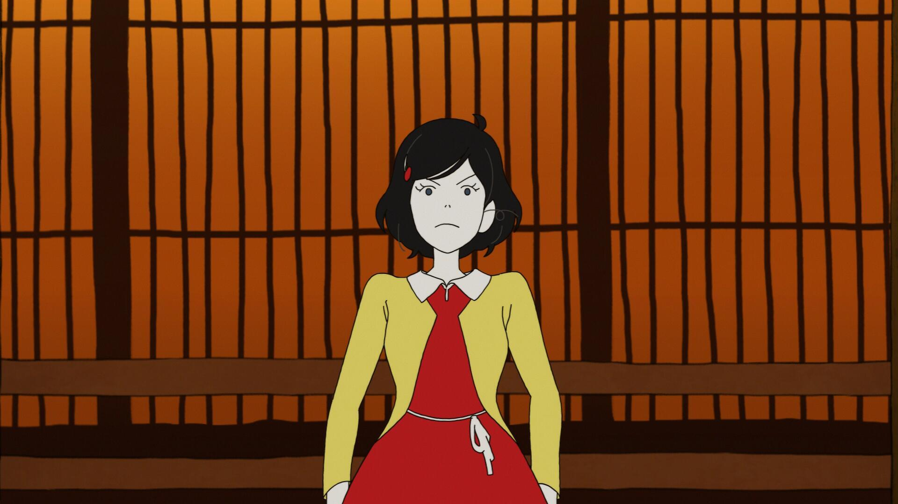  

    特点就是线条少，大面积纯色，这和我们编码的日本动画差距极其巨大。

    所以用这样的骗力预设，可能会把所有码率预算用在不该用的地方，导致看起来非常糟糕。

    所以当时非常普遍使用的，是类似 `film` 这样万金油的 *tuning*。

- 预算

    再然后，就是预算了：
    
    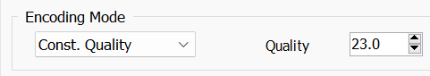  

    这告诉编码器，我有多少预算，视频可以多大

    这些不同模式的背后都一套复杂的算法，例如 `crf` 的目标是，给每帧分配一个固定的质量目标，每帧的 *qp* 目标都会有所不同。  
    它结合了人的视觉心理学，估算一个代表视频质量的指标。

    而下面的 `1pass` `2pass` `3pass`，
    
    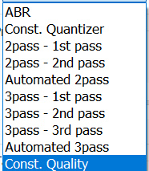 
    
    则是 `VBR` ，我指定一个总的码率预算多少。

    `2pass` 的意义是，编码器先对原视频进行一次分析，  
    并且根据分析给出大致的 *qp* 参考，并且在第二次的时候去详细计算。  
    保证我能够在总预算帽里，实现时域上的预算分配合理。  

    `ABR` 呢，额。。。总之，别用。  
    只有一次编码，通过经验估算下一帧大概要多少 *qp*，给一个毛估估的 *qp*。

    当*量化*变得不精准时，你就知道，你搞砸了。  
    因为，无论是 I, P, B，都记录着，*变换* - *量化*过的，**块**

    **块**是所有编码器的核心，**块**的好坏，很大程度上决定了视频的好坏。

- 杂项
 
    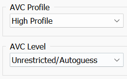
    
    而页面上的这部分，则是属于编码器的杂项部分，之一（
    
    这部分和解码相关，以前有为了兼容 psp 之类的设备特意出的版本。  
    当然了，2023 年了，这块可以无视了。

这是最笼统的介绍 x264 的参数大概能干什么，
下面我们继续深入来看。

### 参数细项

#### Frame-Type

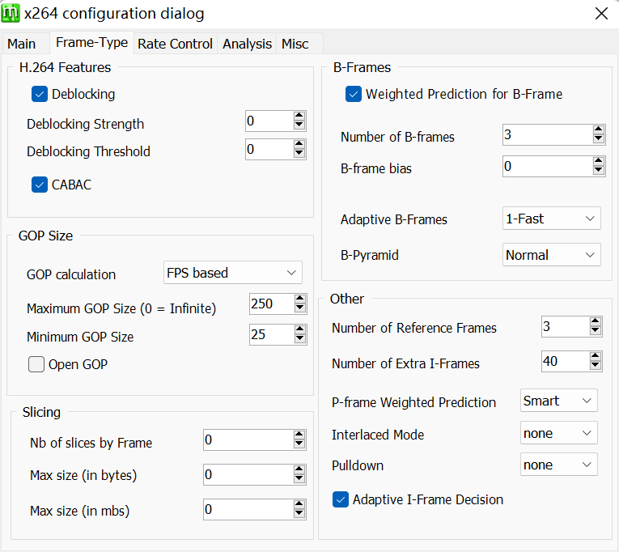

- GOP Size

    我们先来看这一段
    
    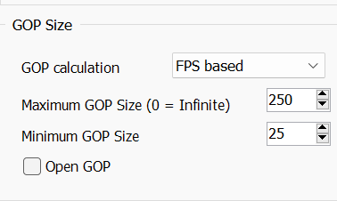

    因为前面的教程讲过 GOP 的概念，这里就不深入了。  

    其实这里只需要注意下面的 `Maximum GOP Size`。  
    它指的其实是 x264 命令行中的 `--keyint`，  
    代表多少帧之后要强制插 IDR 帧，它是一种特殊的 I 帧。  
    这样能保证你调戏进度条的时候，起码不会卡半天。  

    试想如果一个视频是一个超大的 GOP，那你拖到任意一个地方，都需要从头开始解码。  

    曾经的 b 站，有不少视频都是不能调戏进度条的，就是因为他们设置了超大的 `keyint`，  
    导致你拖视频进度条要卡很久或者跳到老远的地方开始播放。  

    针对番剧，我们一般给 10 秒，也就是 240 帧，  
    所以就是 `--keyint 240`。

    但是这个 `240` 不可能不变的，  
    如果视频长度 11 秒，你给个 `240`，那其实也挺幽默的。

    所以，请根据视频长度自己给一个合适的值。  

    而 `--min-keyint` 则是决定了两个 IDR 帧之间最小值，一般我们给 `1`。  
    如果图像一帧一大变，我们允许一帧一个 IDR。

    我们随便找个 x265 的编码最后统计结果。
    
    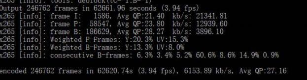

    I 帧很贵，而 `keyint` 又不能太大也不能太小，这是我们要平衡的地方。

- Deblocking & CABAC

    先看 deblocking  
    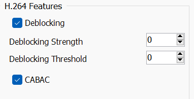
    
    `-f, --deblock <alpha:beta>`  

    它分为两个值，它们是*平滑强度*和*搜索阈值*  

    x264 / x265 都有对应的设置，虽然在我们 bdrip 的时候，几乎不会出现 blocking，  
    我们才会默认给`-1:-1`这样的保底参数。

    但是在 高 crf / 低码率 下，还是需要开到 `0:0` 甚至 `1:0`。

    deblock 本身的效果其实是由**阈值**和**强度**两块组成。  

    而这个**阈值**，并不是我们花大力气去计算原始帧和编码后结果的差，  
    而是取巧去算**块**与**块**之间的 *qp* 差。
    
    *运动向量*的*编码单元*参数如果差很多，那就有 block 的可能  
    > 运动向量 （mv - motion vector）  
    > 编码单元 （cu - coding unit）  

    差越多，平滑强度越强，  
    一般不推荐第二个值给到 `-1` 及更小，因为这样可能我们会漏掉出块的地方。  

    而 `CABAC` 则是 x264 / x265 都在用的，最好用的二进制算术编码，  
    它是将每个*块* *变换*-*量化* 后的结果做压缩的技术。  
    具体不展开，是针对纯 0 和 1 数据做的压缩，和视频无关（  

- B-Frames

    接下来我们看到这一块
    
    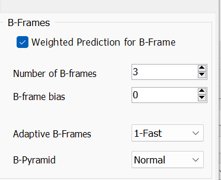

    首先上面的打勾，是 `--weightb`，  
    通过进行加权预测，降低渐入渐出中块之间的误参考。  
    一般都是开的。

    `Number of B-frames` 对应 `--bframes`，设置了连续最多的 B 帧数量，  
    对于动画来说，动静分离的很开，很容易 B 帧占比异常大。  

    但是连续的 B 帧，会导致块的参考次数非常的多。  
    一层一层参考下来，就有网络图片一次次压缩出现包浆的意味。  
    但是开小了，压缩率就不理想了，  
    所以我们一般给 `10` 上下。  

    `Adaptive B-Frames` 对应了 `--b-adapt`。  
    是设立 B 帧算法，值为 `0`（不设 B 帧），`1`，`2`。  
    数字越大算法越慢效果越好，  
    所以我们就开 `2`（  

    `B-Pyramid` 是一种给左右参考的 B 帧，  
    实际上是特殊的 B 帧，它能够帮助我们实现更长的 B 帧，所以一般也得开。

- Other

    再看这里，涉及到了*动态搜索*时，参考的帧的数量。
    
    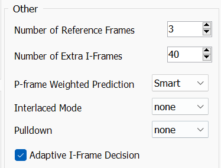  

    这玩意儿其实也决定了 H264 视频的解码难度，  
    曾经这玩意儿一旦开高，大量设备没法硬解。  
    > 当然现在是2023年（

    而实际上 `--ref` 给到 `6`-`8`，就已经完全足够了。  
    如果开太高，可能会出现错误的搜索结果，取了错误的块导致编码质量下降。  
    同时，开的高，计算量也会线性增加，效果又不是特别大。  

    `Number of extra i-frames` 对应了 `--scenecut`
    是 x264 判断场景变化灵敏度的，这个其实说法很多，一般默认设置不会引起画面问题，那就别动。  

    `P-frame Weighted Prediction`  
    也就是 `--weightp`，和 `--weightb` 类似，一般都是拉满。

    `interlace` 和 `pulldown`，这是其他部分会讲到的内容，这里只是说一下，这是对交错源的设定，用了这个会给视频加上标记，播放的时候能够当交错片源播放。  

    `Adaptive I-Frame Decision`，其实是要不要开启 `Adaptive I-Frame Decision` 的开关，没有关掉的理由，我们需要更准确的渐变场景搜索。
    关掉的话就是对应 `--no-scenecut`。  

#### Rate Control

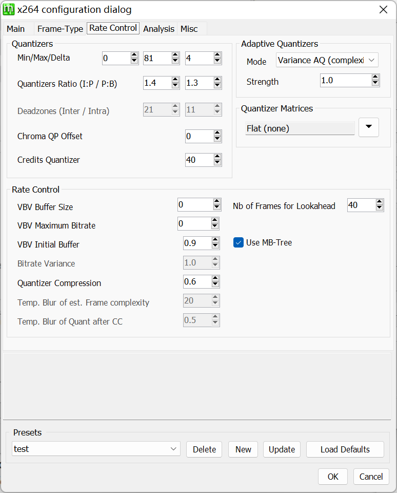

`rate-control` 其实顾名思义，控制视频码率的地方。  
而视频码率，又是量化程度决定的。  
还记得最开始说的么，如果你给个超夸张量化，满屏幕全是块，码率当然会低。  

- Quantizers

    量化部分就决定了怎么取量化，
    
    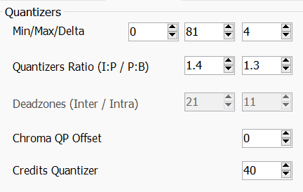  

    `Min/Max/Delta`，分别决定了整个视频 *qp* 的最低/最高/帧间 *qp* 最大插值。  
    如果我们给的比较高 `crf`，又怕出现真烂帧，会考虑压低 `--qpmax`。  
    > 对应 `--qpmin` / `--qpmax` / `--qpstep`

    下面的 `ratio`，分别是 `--ipratio` 和 `--pbratio`，  
    他们代表了，P 帧对 I 帧，B 帧对 P 帧，*qp* 值的变化。  
    因为有帧间块引用的存在，所以我们可以给 B 和 P 帧整体一个较高的 *qp* 目标，也不影响整体画面。  
    但是，如果出现了连续的 B 帧，B 帧又自己引用自己，  
    同时被引用的 B 帧 *qp* 值也很高的话，连续 B 帧就会出现肉眼可见的劣化。  
    而动画特性又决定了连续 B 帧机会非常多，  
    所以做动画相关的内容时，我们会压低这个比例，高质量编码会给 `pbratio` `1.2`，`ipratio` `1.3`。  
    顺带默认 `ipratio` 是 `1.4`, `pbratio` 是 `1.3`。

    `Chroma QP Offset` 就比较有意思，这个值代表 UV 平面相对 Y 平面，*qp* 值的 offset。  
    > 对应 `--chroma-qp-offset`

    本来 UV 就已经被大砍一刀（指色度采样），你还给加把火不太合适。  
    当然，如果你在编码 YUV444 的视频源的时候，你大可以给个 `2`-`4`。  
    420 就算了，x265 也有类似的设置，我们一般都给 `-2`。  

- Rate-Control

    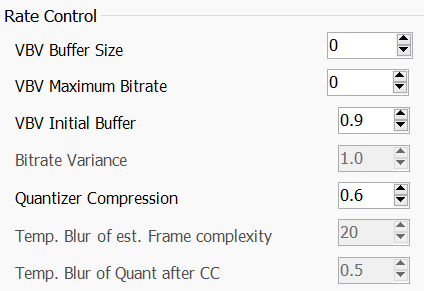

    `VBV` 两个码率，是用来限制最高码率的。  
    > 对应 `--vbv-maxrate` `--vbv-bufsize`  

    如果你压的动画有大量屑特效，  
    类似高密度头皮屑噪点，里氏 9 级地震级别镜头摇晃，  
    如果你不加限制，这些屑场景能轻松吃掉你码率预算的非常大一块。  
    > 比如一部叫后街女孩的屑番（

    这些场景，大可不必追求 “暂停画质”，给个上限非常有必要，  
    毕竟你也看不清。  
    当然，如果给的太低，出现超长噪点回忆杀，再叠加 B 帧连续参考劣化，  
    大家看视频都见过画面一开始还行越放越烂，
    就是因为连续参考还超高 *qp*。  
    所以还是慎重，看情况行事。  

    而 `VBV Initial Buffer` 就不用动。  
    > 对应 `--vbv-init`  

    `Quantizer Compression` 则是又一个很重要的东西，但是解释清楚也需要重达几公斤的参考资料。  
    简单来说，通过一系列迭代算法形成一个 *qp* 值的曲线缩放，`--qcomp` 给的越高，x264 越倾向于 *qp* 选择一视同仁，无论动静一律给差不多的 *qp* 值。  
    但是人眼，在大自然进化的过程中，天生就对动态的东西极为敏感，  
    静态的东西只要他不动，基本就当看不见。  

    `qcomp` 越低，x264 会给高动态场景越高的 *qp* 值，让动态画面烂完。  
    这个值的取值，任然是看你，默认给的 `0.6`。  
    如果做什么打斗多的番，  
    可能还是给高一点，战斗场景不容易烂。  
    反过来日常废萌番给个默认值完全够了。  
    当然就是，你觉得重要那就多给点咯，`0.7`，`0.75` 都是可以给的。

- MB-tree

    又到了x264的重头戏环节，`MB Tree`。
    
    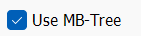
    
    > 关掉的话对应 `--no-mbtree`  

    x264 的块，叫做 *MacroBlock*，  
    在一个时间范围内，会有不同的帧可以被引用到某个块上，  
    也有可能是块引用块，  
    数据结构上就变成了一棵树。  

    为了防止反复参考导致的问题，树越靠上的节点可以让 `qp` 值稍微低一些，  
    上梁正了下梁不太可能歪，`qp` 值就可以给高一些。  
    块被参考的越多，那它的`qp`就越低。  

    当然这是 *MB tree* 最笼统的解释。  
    反映了好钢用在刀刃的思想，被引用的越多，那本体质量越高引用的质量就越高。  

    但是，好钢容易生锈，在低 `crf` 下，大家的质量都很高了，这时候你去开这个，反而会导致画面问题。  

    在 `crf 16` 朝上，`mbtree` 效果就不错，因为码率这时候还是比较吃紧的。  
    总之如果码率预算非常高，我们就不需要它。  

    当然，现在 x264 的使用基本就是字幕组的内嵌了，  
    内封外挂也已经使用 hevc。  
    可能不会遇到真的需要 x264 做编码的情况。  

- lookahead

    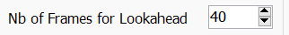
    
    这个则是 `--rc-lookahead`，一般来说是编码往前看多少帧，来查未来开销。  
    这是判断 `vbv`, `MB Tree`, IBP 帧的参数。  

    不能低，但是开太高也没啥用。  
    一般给 `80` 到 `0.5*keyint` 左右。

- Adaptive Quantizers

    这是一个很重要的参数。

    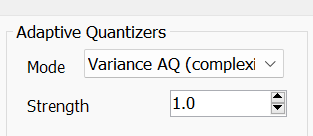  
    
    `aq` 是防止平面过度量化的功能，用被量化程度去进行 *qp* 值的补偿，上面的 `mode` 中我们有 `0`-`3` 四个选项可选，其中 `0` 为关闭，`1` 为平面内的简单分配，`2` 为进行*帧间 aq-variance* 计算，允许跨帧进行调整，一般我们用的最多的就是 `3`，针对暗场做优化，因为人眼对暗场的敏感度比亮场高很多，同时色块和色带也常出现于暗场，低码率下尤为明显。

    所以一般都会给经典的 `--aq-mode 3` `--aq-strength 0.7`。  
    如果整体画面码率充足，`crf` 开的很低（`15` 以下），给 `--aq-mode 1`，`--aq-strength 0.8` 也是不错的选择。

    `--aq-mode 2` 会强调动态和高频部分，平面码率会被削（整体视频码率也就低了），开了很容易平面上出瑕疵，所以如果想开，最好喂视频之前就把平面抹抹干净，并且给 `0.9` 及以上的 `strength`。

#### Analysis

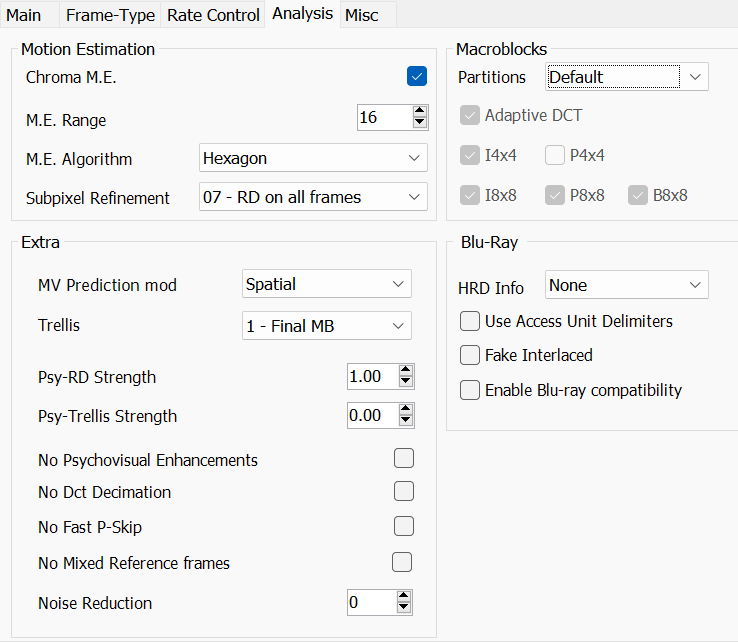

- Motion Estimation

    Analysis 这一页，正如其名，主要突出的是一个*动态分析*。  

    ME，即 Motion Estimation，顾名思义，就是分析帧间动态信息，并且抽象动态内容，节省码率。  

    `Chroma me`，动态搜索查不查 UV 平面，默认是开启。  
    我们希望找到越多越好的匹配。  
    > 不启用的话对应 `--no-chroma-me`
    
    `M.E. Algorithm`，即动态搜索的方式。

    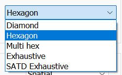
    
    分别对应的是`--me <dia,hex,umh,esa,tesa>`。

    从左到右计算开销逐渐增大，搜索额外收益逐渐递减。  
    一般只推荐从 `umh` (multi hex) 之后的算法 。 

    搜索算法细节这里不详述，但是如果你想开 x264 软件编码直播，建议开到最多 `hex` 或者 `umh`。  
    `esa` 和 `tesa` 是偏向暴力搜索的办法。

    `M.E. Range` 这个参数又很有意思，它的取值需要和视频帧率以及分辨率相关。
    `--merange` 在 x264 和 x265 里，都是决定动态搜索算法的搜索范围的。

    如果你的视频分辨率低，`merange` 可以适当降低；  
    如果你的视频帧率高，`merange` 也可以适当降低，因为高帧率视频里帧与帧之间变化小。  
    理论上 24 和 60 你可以给砍半 `merange` 都没问题。

    同时，我们习惯 1080p 给 `32`，720p 给 `24`，这个参数开越高越慢的同时，也会有找不到更优的动态向量，寻找错向量的可能性。  
    所以开大也是没啥必要的。  

    当然了，画面动态大的打斗片，多给点总是没错的。  

    `Subpixel Refinement` 也就是 `--subme <integer>` 则是另一个话题，在动态的画面里，任何东西的移动是不太可能是整数像素移动的。  
    同时，你也不可能拿矩形的像素去显示完美的圆。  
    这就是子像素存在的意义。  
    > 毕竟像素并不真的是一个个矩形，而是一个个固定间隔的无限小的采样点  

    所以，我们会使用 SATD 等算法，去计算参考块和参考源的差异，计算子像素级别的块内区别。  
    但是细节不表，这玩意儿也是个开越大算法越狠效果越好但收益越少的东西。  
    遵循已经 2023 年 cpu 算力提升大到一定程度的原则，  
    怕就别开，开就开满，我们给 `10` 完事（

- Extra

    接下来两个参数非常重要。

    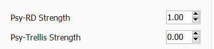  

    这是 `--psy-rd <float:float>` 的参数，它们被称为“心理学优化参数”。  
    也就是骗力的大头。  
    之一（

    第一个参数是心理学优化的强度，开高能保留画面纹理；  
    第二个参数可以相对多保留噪点细节。  

    但是这部分，都是“感性”的认知，它影响了 x264 中宏块 *qp* 值的分配，达到骗过你的眼睛的效果。  
    这背后具体的算法和公式又是几公斤参考材料才能解释明白的了。  

    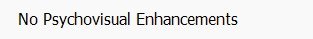
    
    顾名思义，关闭 `psy`。  
    除非你在做无损编码或者超低 `crf`，  
    不然还是开着 `psy` 好。

    `--no-fast-pskip` 根据官方的说明，可以防止高 *qp* 下出现色带，  
    默认我们要给开了。  

    `No Dct Decimation` 按照官方文档，是影响 dct 量化精度的玩意儿，我们一般不要去动它。  
    > 对应 `--no-dct-decimate`  

    `No Mixed Referenced Frames`，是关闭混合溯块，按字面意思是不会在一帧里同时出现向前和向后参考，但是实际上什么效果还没有人具体验证。  
    但是关闭之后，一定会增加误参考的概率，所以这是个速度换质量的设置，没事也没必要开。  
    > 对应 `--no-mixed-refs`  

- Macroblocks

    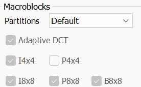
    
    这里没什么可选的，因为不同大小的宏块编码器能不能用，是定义在 profile 里了，同样的，2023年了，解码 H264 视频早就不是问题了。
    
#### Misc

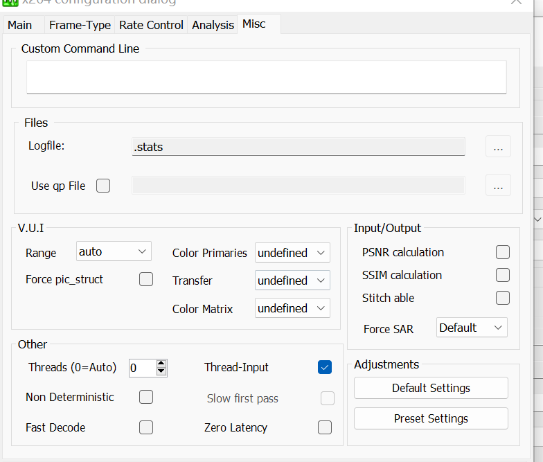

misc 就是杂项，你想加点额外参数不想去用 gui 调可以直接这里 (Custom Command Line) 打，会覆盖 gui 的东西。

- Files

    `logfile` 是 2pass 的时候记录 pass 信息的。  
    > 对应 `--log-file <string>`

    `use qp file` 则是你可以用一种叫 qp file 的东西，告诉编码器我想要哪一帧，这一帧你就得给我编码成 I/B/P 帧，  
    并且可以告诉编码器这一帧我的 *qp* 目标是多少。  
    注意的是，这里是帧的 *qp* 目标。它影响的，是一帧里每个**块**的 *qb* 分配  
    > 对应 `--qpfile <string>`
    
- VUI

    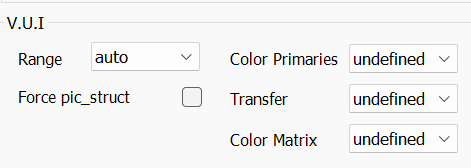

    VUI 是搞色彩转换的，实际上编码器啥都不会做，就给你最后输出视频打个 tag，播放器读到了会按照 tag 办事。

    这一块标准和规范其实前面的教程也讲了，就不多说了。  
    动漫新番和蓝光的编码，基本可以无脑 `--range tv --colorprim bt709 --transfer bt709 --colormatrix bt709`  

    但是如果你遇到了 DVD，尤其是什么 BD 特典送的 DVD 之类的。  
    小心……

### 总结

其实讲到这里，x264 的 *底力* - *骗力* - *预算* - *杂项* 参数都讲的差不多了。

*底力*部分，包括了动态搜索的算法 `--me`，搜索范围 `--merange`，以及 `--b-pyramid` 等的开关。  
代表你愿意花多少算力去增强搜索，块的本体压缩能力。  

*骗力*部分，包括了 `aq`，`psy` 等失真优化算法。  
用以在有限的预算内，将**块**的量化程度控制在合理的水平，  
保证好钢用在刀刃上。  

*预算*部分，包含了 `crf`，`vbr 2pass` 等控制码率的手段，也包含了 `qcomp` 这种是否为了动态场景调整 *qp* 的选项，也有 `vbv` 等给每帧一个预算帽的设置。  
可以解构的说，视频编码器在 x264 这里，就是有较合理切分块，合理分配块的量化水平骗过人眼，通过动态搜索在帧间引用块和添加新块信息的一整套系统。  

对于常用的 webrip 编码来说，我们会给：

```
--preset veryslow --crf 21 --deblock 0:-1 --keyint 240 --min-keyint 1 --bframes 8 --ref 8 --qcomp 0.7 --rc-lookahead 70 --aq-strength 0.7 --me tesa --psy-rd 0.6:0.15 --no-fast-pskip --colormatrix bt709 --aq-mode 3
```

这只是一个通用的参数，但是如果要用 x26x 去做 bdrip，没有最完美什么番都能用的参数，只有最合适的参数。

需要注意的是，今天我一直在说，**块**，*量化*，直到如今这仍然是主流编码器的所谓“三板斧”，接下来的 x265，我们会迎来更多的**块**的讲解。

编码器的参数调试及研究至今，从感性的认识每一个参数干什么，到科学的明白背后的公式和含义，是一项不小的进步，深入理解参数的意义能够帮助我们更准确的去调整参数达到想要的目的。

但是，编码器的参数，是相互制衡的，你不可能不给驴吃饭还让驴猛跑，我们最终需要调试出的，是文件体积，画面分配，压制速度上的平衡，拿捏那个平衡的点异常重要。

编码器的参数其实讲起来很空，随便挑个动画选个 10 秒 240 帧用不同参数压，就能有更深刻的体会。

多上手是更推荐的选择。

## 拓展阅读

JPEG DCT, Discrete Cosine Transform (JPEG Pt2)- Computerphile  
https://www.youtube.com/watch?v=Q2aEzeMDHMA  
https://www.bilibili.com/video/BV17v411p7gV  

How are Images Compressed? [46MB ↘↘ 4.07MB] JPEG In Depth  
https://www.youtube.com/watch?v=Kv1Hiv3ox8I  
https://www.bilibili.com/video/BV1TZ4y1S7iG  

在开始讲 x265 之前，建议大家先看看拓展阅读的部分。

## 基本概念 2

接下来大家可以判断一下，这张图里，哪些是高频部分，哪些是低频部分，还有哪些可以被称为中频部分？  


<details><summary>参考答案</summary>

其实最简单来说，第一眼不会注意到的复杂细节都是高频，包括了人流，广告牌  
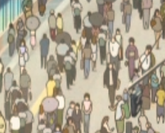


中频部分，包括了中间道路，以及规则重复的建筑物外墙  


低频则是大面积的纯色，天空部分  


</details>

在从 MPEG2 到 H264 再到 H265，其实最大的核心提升是增加了动静分割的能力。  

也就是，科学划块。

同时也科学地分割了高低频的内容，  
使得帧内和帧间的块参考变得更容易。  

相对于 x264 简单的分割，并且每个*宏块*有一个单独的 *qp* 来说，  
H265 提供了 *CTU*-*CU* 的划分，并且在 *CU* 中，出现了 *PU* 和 *TU* 两个概念。  
> CTU - Coding Tree Unit  
> CU - Coding Unit  
> PU - Prediction Unit  
> TU - Transform Unit

*CTU* 就如同 H264 中的 *Macroblock*，是视频编码的最大单元。

*cu* 则是经过算法搜索之后进行分割的单元。

H265 提供了远比 H264 规范多的多的划分大小，同时出现了 *rect* 和 *amp*。
> rect - rectangular motion partitions  
> amp - asymmetric motion partitions  

*pu* 是最小的单元，叫做*预测单元*，是编码完成后可以用作参考的*块*。  
*pu* 的划分使得*帧内*与*帧间*参考更容易发现相似内容。

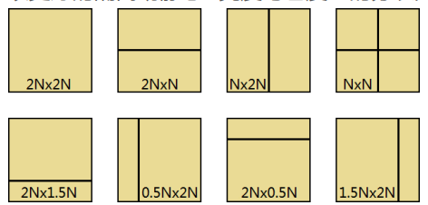

而 *TU*，是*变换单元*，是*量化*过程中的最小单元。  
*TU* 的划分不与 *PU* 对齐，也就是说，*TU* 可以跨多个 *PU*。

这也使得 H265 能够将 *qp* 值的分配，也精确到了高低频，动与静。  

细粒度使得我们能将预算更合理的分配，骗术的增强也使得合适底力下目视效果更好。  

## x265 参数解析

> x265 完整参数选项可以直接 `--fullhelp` 查看，不同版本的编码器可能有各自不同的选项。这里按 x265 Kyouko 3.5 给。    
> 其次参考 x265 官方 master 分支的[说明文档](https://x265.readthedocs.io/en/master/cli.html)。  

### 分块

+ `--ctu, -s <64|32|16>`

    在 x265 中，控制最大单元的参数是 `--ctu`，它决定了最外层的这个格子是 64x64，32x32 或者 16x16。  

    ctu 开的越大，平面的涂抹也越严重，速度也越慢，但是有损压缩效率越高，
    值得一提的是， x265 的默认 preset，其实是偏向 4k 级别高分辨率视频给的  
    所以 `ctu 64` 对于 4k 视频完全没问题，是非常必要的。  

    但是做 1080p 无论 bdrip 还是 webrip，我们都会给 `32`。  
    `ctu 64` 下，cu 的划分会耗费更多计算量，并且 cu 更倾向于变得更大。  
    这使得给 cu 下更大 TU 的 *qp* 值给的不是很精确，看起来就是糊。  

+ `--min-cu-size <64|32|16|8>`

    同时又有一个 `--min-cu-size`，限制了最小 cu 大小。  
    默认是 `8`，建议不要动，如果为了速度才会给更大。  

    它限制了最小 cu 大小，简化了 cu 划分的计算步骤，但是让 pu / tu 划分变更大。  

+ `--rect` / `--amp`

    x265 的速度黑洞。  
    他们决定了 pu 的不对称划分，用很~多~计算量去换码率和画质的参数。  

    一般来说，画面复杂，离子特效多，我们会考虑开 rect，利用它提供的更好的分割能力使得我们能找到潜在的匹配块。  
    但是还是那样，如果是没啥经费，日常废萌番，不开总是没错的。  

### 分块量化

+ `--limit-tu <0..4>`

    然后到了量化部分，有`--limit-tu`，它控制了早退 tu 分块的算法。  
    取值 `0`-`4`，分别是越来越强的早退算法。  

    tu 分块如果不精确，那么画面可能会出现量化涂抹，  
    因为高频 pu 如果被划进了一个大 tu 统一做量化，你可以想象到你会有损失。  
    但是这玩意儿对速度影响也很大。  

    压 webrip，开个 `3` 完全没问题，如果你电脑烂，开到 `4` 也行，  
    但是 bdrip，建议开 `0` 吧。

+ `--rdpenalty <0..2>`

    这个参数，则是另一面，取值是 `0`-`2`。

    它强制 tu 分块，保留细节，降低涂抹。  
    如果你用了 `limit-tu 3`/`4`，可以考虑开 `--rdpenalty 2`。

    同样的，噪点多容易被抹，也可以考虑开这个。  
    但是，分 tu 更细不代表我们能把码率控制更低，相反的，动这些参数可能会反而提高码率，具体情况还是根据片源不同自己测试。

+ `--tu-intra-depth <1..4>`, `--tu-inter-depth <1..4>`

    这俩参数，是空域/时域内，tu 分裂次数的上限。  
    如果压 webrip，可以考虑开 `2`，正常 bdrip 就 `3` 或者更多就直接开 `4`。

+ `--max-tu-size <32|16|8|4>`

    默认是 `32`，更大的 tu 大小能提高压缩率。  
    一般不会去动，不如直接改 `ctu`。  

H265 引入的更详细的分块，x265 里也提供了相应的参数设置，这些参数一定程度上决定了分块上的底力  

### 帧间编码搜索

+ `--subme, -m <0..7>`

    和 x264 一样，x265 也有子像素运动补偿，`--subme` 也是速度黑洞  
    由于 x265 本身计算量更大，所以一般动画我们给 `4`，想拥有更好的线条表现可以考虑开 `5`。

+ `--ref <1..16>`

    动态搜索方面，`--ref` 一般我们都会给 `3`-`4`。  

    由于 x265 的分割和块的溯源搜索能力更强，  
    我们不需要开很高的 `ref`，就能溯到很多块。
    
    这也是速度黑洞，对动画来说 `4`-`5` 完全足够，  
    如果是大量一图流的视频，你给 `1` 完全 OK。  

+ `--max-merge <1..5>`

    决定溯块向量搜索中一种搜索算法的被选数量。  
    用很多时间换溯块成功率，也就是反映到压缩率上的参数。

    如果你 cpu 很阔，或者体积预算吃紧，你可以给 `4`。  
    默认 `2` 完全足够，开个 `3` 意思意思也不是不行（  

+ `--early-skip`
    
    加速开关，影响的溯块中不同算法的先后顺序，一般不会去开。

+ `--me <integer|string>`
    int|str
    -|-
    0|dia
    1|hex
    2|umh
    3|star
    4|sea
    5|full
    
    决定了帧间动态搜索的算法，一些 x264 有的 x265 也有。  

    追求快就用 `umh`，一般只会开 `star`。  
    `sea`，`full` 都是暴力穷举类型的算法，开了纯属冬天太冷想要取暖用的。

+ `--merange <integer>`
    
    和 x264 类似，1080p 下 `32` 足矣，4k 下可以考虑给到像 x265 preset 默认的 `57`。

    同样的，开太大可能会降低压缩率，因为大的 `merange` 搜索范围可能会搜索到错误的参考。

+ `--analyze-src-pics`
    
    允许动态搜索查找片源帧，也是属于电费开关，实际效果并不显著。  
    不建议开。  

### 帧内编码搜索

帧间编码搜索部分讲完了，来讲讲帧内编码。  

相比 H264，H265 规范在帧内编码上下足了功夫，  
新增了大量的搜索算法。  
所以我们才会看到 HEIF 逐渐成为了现在很多设备使用的图片压缩算法。

这块算法非常复杂，就不详述了。  

+ `--fast-intra`

    能控制这些算法的参数，首先是 `--fast-intra`

    这个选项默认在 `rd` <= `4` 时开启。  
    是涉及帧内编码时，判断夹角模式进行跳过，搜索更少的角度。  

    一般咱不动，靠修改 `rd` 去控制。

+ `--b-intra`

    是让 B 帧中的一个大编码单元 *Slice* 也在帧内进行查找的模式。

    很慢，但是如果追求压缩率可以开。

+ `--no-strong-intra-smoothing`

    这个参数，其实对画面影响很低，因为触发帧内搜索时强力平滑的条件很苛刻。  
    推荐带上这个参数，使得编码器使用其他方法去进行平滑操作。  

x265 可控制的底力部分差不多就是这么多，大部分都是影响分块精度，搜索精度，很多参数都会和编码速度息息相关。

### 率失真优化

说到骗力， x265 的率失真优化其实和 x264 一脉相传。

+ `--psy-rd <0..5.0>`

    就是类似 x264 中 psy 的第一个参数。  
    一般视动画纹理，给 `1` - `2.5`。

+ `--psy-rdoq <0..50.0>`

    这个有些复杂，因为它和 psy 的效果是有一些联动影响。

    其实这玩意儿，可以理解为你想保留的细节大小，  
    你想保留的越小，就给更高。  

    > preset slow, slower, veryslow 的默认值为 1.0

+ `--rdoq-level <0|1|2>`

    `rdoq-level` 则是总体控制*率失真优化*影响量化分块的深度。  
    设为 `2` 的时候，*率失真优化*会影响到最小 4x4 单元的量化计算。

    一般都会给 `2`，比较慢，但对纹理和细节比较友好。  
    因为对细节的量化把握更为细致。  

    但是反过来，这同时也会影响平面的表现，  
    所以有的时候 `rdoq-level` 也会给 `1`。

+ `--aq-mode <0|1|2|3|4|5>`, `--aq-strength <0..3.0>`
    
    其实和 x264 一模一样，直接参考 x264 就行  

    x265 的 `aq-mode 4` 其实现在 x264 也有了，这个 aq 模式简单来说，会摧毁平面，但会给更多码率线条和纹理和暗场。  
    除非你追求压缩率，喂给编码器的东西也有针对性处理防止出现 Artifact，不然别开（

    > x265 [Kyouko mod](https://github.com/AmusementClub/x265/releases/tag/Kyouko-3.5-AC) 3.5-AC 版本开始比起官方多了一个 5

+ `--hevc-aq`

    这个新加的参数还是玄学 aq，我们的试验比较少。

    同时新版本 x265 还有 `--aq-motion`，根据动态信息结合 aq 去调整 aq 的强度  
    也是新参数，大家可以试验一下。

+ `--qg-size <64|32|16|8>`

    是支持自适应量化的最小 cu，默认 `64` 速度很快，但是会影响量化精度。

    我们自适应量化不就是为了更好的分配量化的值嘛，  
    所以一般给 `16` 或者 `8`。  

+ `--cbqpoffs <-12..12>`, `--crqpoffs <-12..12>`

    这俩，其实就是调整色度平面的量化 qp offset。

    同样的，一般给 `-2` 或者 `-3`，因为色度半采样之后本来就已经很惨了。

+ `--rd <1..6>`

    x265 引入了 rd、模式决策、整合搜索信息还加一道重新分配分块、参考、跳过、量化方案。  

    而 `--rd` 决定了*率失真优化*参与模式决策的程度。

    给 `4` 足够，`5` 会非常慢，但是影响一些帧内编码参数等原因，成品码率会变小，画面也不会有太大的问题。

    bdrip 给 `5`, webrip 给 `4`。  
    bdrip 也可以给 `4`，因为 `5` 真的很慢。  
    压制的电费也是电费（  

+ `--limit-modes`

    和帧内编码有关，会大幅削弱 `rect` 和 `amp` 效果，开了 `rect`/`amp` 可以开这个，但是会微微降低画质。  

    毕竟你都开了 `rect`，心都一横了还给你个后悔药吃，  
    多少不太地道（  

+ `--limit-refs <0|1|2|3>`

    是限制分块参考性，默认 `3` 就不要动了。  
    主要影响分块。

+ `--rskip <0|1|2>` 

    比较微妙，判断分 cu 后要不要继续分块，一般不会动。

    实际上大家可以自己去试试 `0` 和 `1` 在噪点高的源和干净源里的差距。

+ `--tskip-fast`

    跳过 4x4 tu 变换过程中的一些算法，对画质影响其实不大。  
    可以考虑开一开。

率失真优化的部分，影响了块的 *qp* 分配，以及影响了画面的分块，这一块对我们画质的影响很大。

### 码率控制

接下来讲预算部分吧。

+ `--crf <0..51.0>`

    和 x264 一样，webrip 其实 `18`-`21` 都能给。

+ `--qpmin <integer>` `--qpmax <integer>`

    和 x264 一模一样。

+ `--rc-grain`

    这个参数，是在重噪点源里防止 *qp* 判断被超高噪点带偏导致体积问题的。  
    如果你想保留噪点，那这玩意儿效果不高。

+ `--qcomp <0.5..1.0>`
    
    和 x264 近似，同时它也受 x265 版 *mbtree* —— *cutree* 的影响。  
    用法也和 x264 以及 x264 的 *mbtree* 是否开关差不多。  

    一般给 `0.65`，打架番给个 `0.7`。

+ `--rc-lookahead <integer>`

    和 x264 的 `lookahead` 类似，给 `80` 足够，多给会慢，但是效果又不会好很多。

+ `--no-cutree`

    这个，和隔壁关 *mbtree* 差不多，  
    低 `crf` 下可以考虑开，`15` 以下。

+ `--ipratio <float>` / `--pbratio <float>`

    同 x264 ，这里也不说了。

+ `--vbv-bufsize <integer>` / `--vbv-maxrate <integer>`

    限码，和 x264 也是相似。  
    
    一般都是给 `bufsize` 稍小于 `maxrate`。

+ `--lossless`

    x265 也有提供无损压缩的方式，跳过分块, 动/帧/参搜索, 量/自适量化，体积非常大，想用基本就是 `--preset ultrafast --lossless`。  

    毕竟你都 lossless 体积超大了，用 `ultrafast` 也无所谓，反正都不要压缩率了。

abr / vbr 就跳过了，和 x264 基本一致。

### 杂项

杂项这里，其实就是不好分类的参数就都在这讲吧。

+ `--sao`, `--limit-sao`, `--no-sao`

    x265 里引入了一项新的补偿画面劣化的算法，他就是 `sao`。  

    针对**强量化**，高 `crf`，低码率的预算里，建议开 `--sao`  
    `crf 21` 以上可以开。  

    `21`-`18`，可以开 `--limit-sao`。  

    `17` 及以下建议 `--no-sao`。  
    `sao` 对较低 `crf` 时反而会让画面变糊，引入更多问题。

+ `--deblock <int>:<int>`

    和 x264 一样，bdrip 给 `-1:-1`，webrip 给 `0:-1` 或者 `0:0`。

+ `--bframes, -b <0..16>`

    和 x264 一样，我们给个 `8`-`10`。

+ `--min-keyint <integer>` / `--keyint <integer>`

    也和 x264 一样，决定 IDR 帧的插入。

+ `--no-open-gop`

    前面的教程也说过，为了兼容性还是开它。

+ `--scenecut <integer>`

    和 x264 一样，默认就行。

+ `--hist-scenecut`

    这个新加的参数，我自己试下来对于转场判断是效果挺好的。  
    这个参数我建议开着。  

+ `--pools <integer,...>`

    由于 x265 更吃性能了，这里多讲一句 `--pools`，  
    实际上和 x264 的 `--threads` 一样。

    由于 x265 的分块更灵活，可并行能力更大，基本上能吃满整个 cpu，不像 x264 基本吃不满我的 5950x。  
    如果你有 epyc / 多路系统，那可能要在使用的时候在这个设置上注意一下（  
    由于家境贫寒我还没用上过。

+ `--pmode`  

    使用帧内平行搜索，能更大程度吃满 cpu，但是会导致搜索线程之前信息不共享之类的问题降低画质。  

    **别开**

+ `--pme`

    平行动态搜索，其实如果核心大于 16 可以考虑开。

    > `pmode` 和 `pme` 不管影响不影响画质，但是其用于多线程协同的开销分分钟比增加的效率还大，跑不满最好多开而不是开这两个选项。

+ `--colorprim <integer|string>` `--colormatrix <integer|string>` `--transfer <integer|string>` `--range <full|limited>`

    和隔壁 x264 一样，也就是输出的时候打个标签，  
    动漫新番和蓝光的编码，基本可以无脑 `--colorprim bt709 --colormatrix bt709 --transfer bt709 --range limited`

    > 详细选项看 `--help`

## 一些调参思路

这里提供 x265 的 preset 表

> 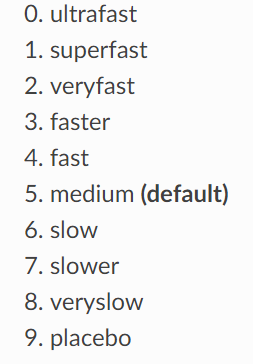  
> 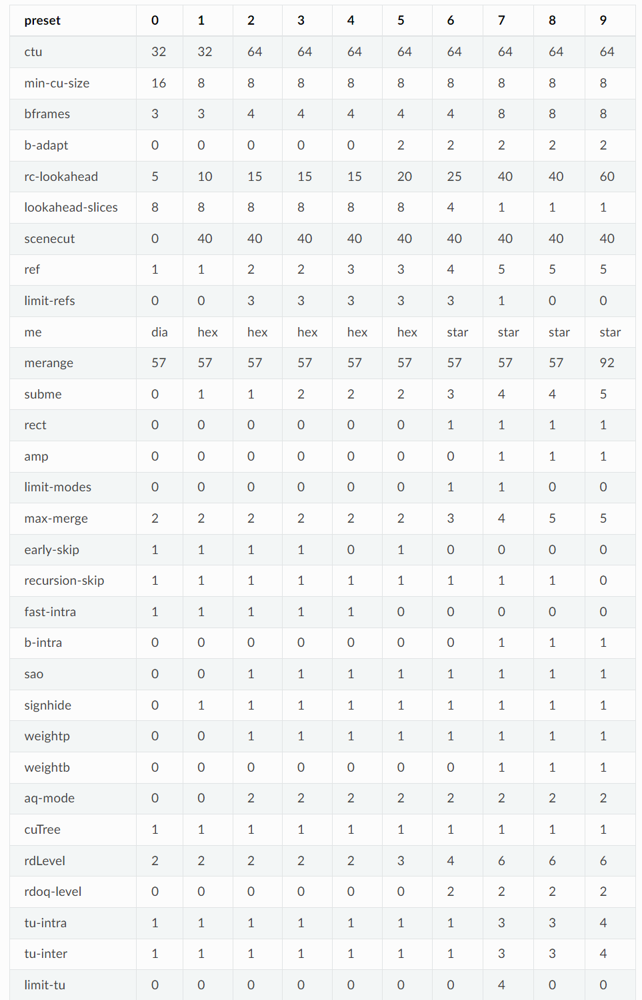  
> https://x265.readthedocs.io/en/master/presets.html

可以看到 x265 其实非常面向高分辨率视频去做适配，`preset` 的 `merange` 都给的超大。

并且 `preset` 都是以压缩率为优先的，我们一定会去做更多修改。

发个做某番 bdrip 的参数吧。  
`--preset veryslow --crf 14 --qcomp 0.72 --qg-size 16 --rect --amp --ctu 32 --rskip 0 --limit-tu 0 --tu-intra-depth 4 --tu-inter-depth 4 --me star --subme 5 --no-rc-grain --b-intra --merange 32 --no-open-gop --min-keyint 1 --ref 5 --keyint 240 --ipratio 1.2 --pbratio 1.3 --bframes 8 --aq-mode 3 --aq-strength 0.7 --rd 5 --deblock -1:-1 --colormatrix bt709 --rc-lookahead 80 --range limited --psy-rdoq 0.5 --rdoq-level 1 --psy-rd 2.0 --cbqpoffs -3 --crqpoffs -3 --no-strong-intra-smoothing --no-sao`

分块方面的开销做到了非常高，由于这番预算不少，画面复杂，并且有电影感，为了保留画面噪点做了一些更改  
当然，上面的参数真的非常，非常慢。。  

再丢个通用点的 bdrip 参数：  

`--deblock -1:-1 --preset slower --limit-tu 0 --rskip 0 --ctu 32 --crf 16 --pbratio 1.2 --cbqpoffs -3 --crqpoffs -3 --no-sao --max-tu-size 16 --qg-size 16 --me 3 --subme 5 --merange 32 --b-intra --no-amp --ref 5 --weightb --keyint 240 --min-keyint 1 --bframes 8 --aq-mode 3 --aq-strength 0.8 --rd 5 --psy-rd 1.7 --psy-rdoq 0.8 --rdoq-level 1 --rc-lookahead 80 --scenecut 40 --qcomp 0.65 --no-open-gop --vbv-bufsize 42000 --vbv-maxrate 35000 --no-strong-intra-smoothing --transfer bt709 --colorprim bt709 --colormatrix bt709 --range limited`

再丢个 webrip 的：  
`--preset veryslow --crf 18.5 --qcomp 0.65 --qg-size 16 --no-rect --no-amp --ctu 32 --limit-tu 3 --tu-intra-depth 3 --tu-inter-depth 3 --me star --subme 4 --no-rc-grain --merange 32 --no-open-gop --min-keyint 1 --ref 5 --keyint 240 --ipratio 1.2 --pbratio 1.3 --bframes 10 --aq-mode 1 --aq-strength 0.75 --rd 5 --deblock -1:-1 --colormatrix bt709 --rc-lookahead 80 --range limited --psy-rdoq 0.5 --rdoq-level 2 --psy-rd 1.5 --cbqpoffs -2 --crqpoffs -2 --no-strong-intra-smoothing --no-sao`

要注意的是，这个 webrip 的也是番剧有一些特色，同时我个人习惯 webrip 不留噪点，抹的比较干净丢编码器。

实际上，在写脚本调试过程中，我们经常会遇到预览时候：嗯，很不错，这波稳了。  
丢进 x265 之后，成品却表现十分糟糕。

所以匹配输入预处理和编码器参数也是很重要的，只不过这个就有点看经验了。  

最后，编码器的参数，通用的参数只是通用，只有结合自己对参数的理解，多实践操作，多试错，才会做出最好的 bdrip 结果。  

## 总结

回顾整个编码器的部分，我们要首先知道的是编码器的变换量化搜索大概原理，熟悉底力-骗力-预算的参数设定。

同时，认清画面的低频-中频-高频部分，  
也就是动画里色块，纹理，线条和其他高频成分。  

知道如果编码器吐出来的东西哪里压的不行，该怎么去调整，从参数到预处理。  

编码器的理解与认识，随着一代一代人压制经验的完善以及对原理理解的深入，已经到了较为完善的地步。

所以希望大家在做 bdrip / webrip 压制时，能想起调整大概会要调哪块，多多试验多多测试，更重要的是，要结合自己对画面的理解去合理分配码率，找出体积和画面的平衡点。  

能看出画面问题的火眼金睛也要多锻炼多做番才行。
