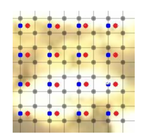
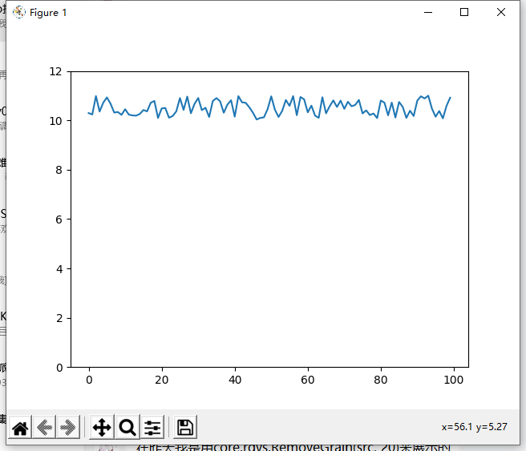
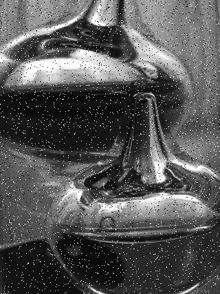
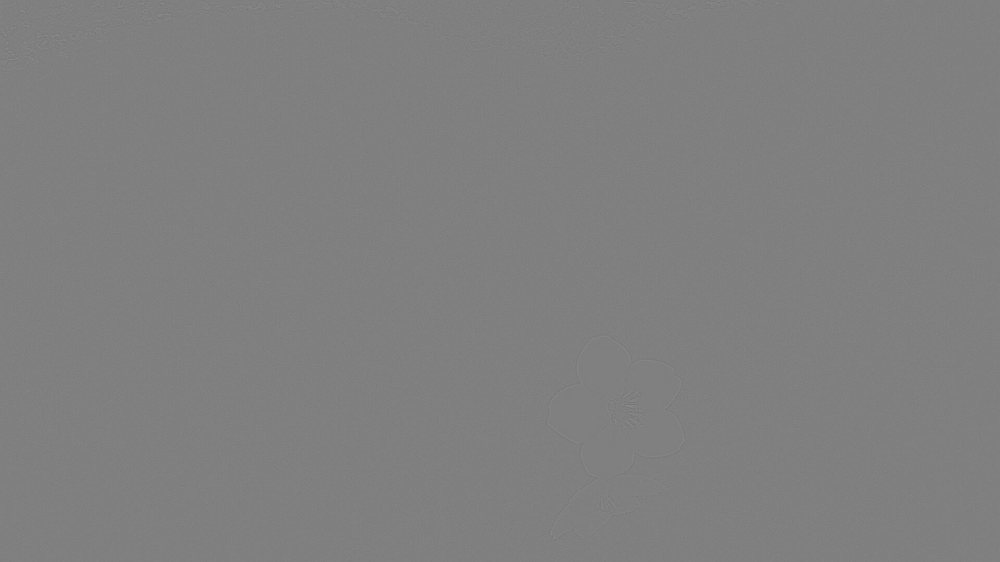
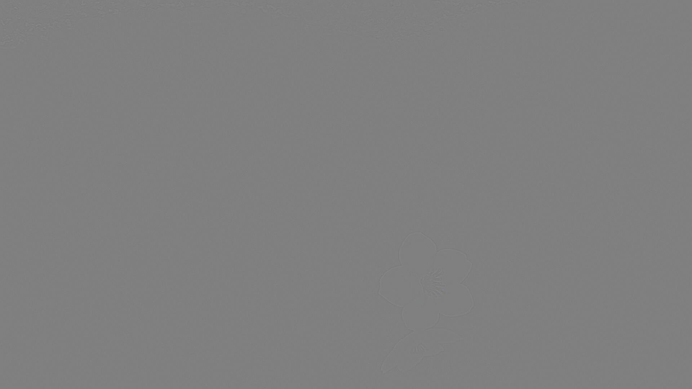
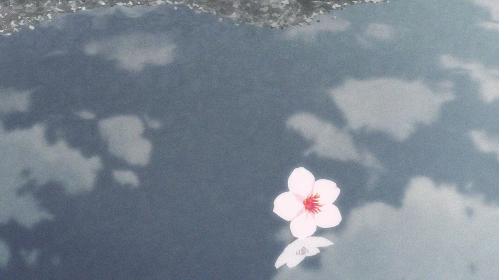
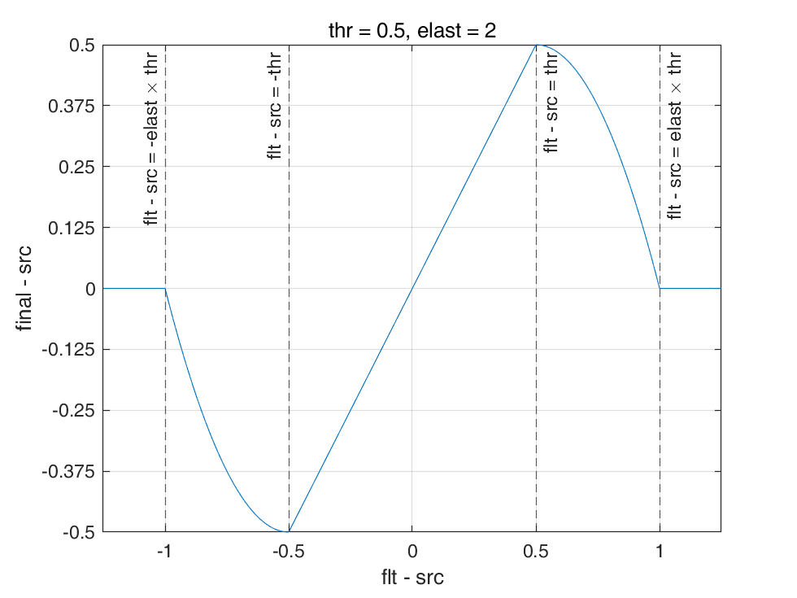
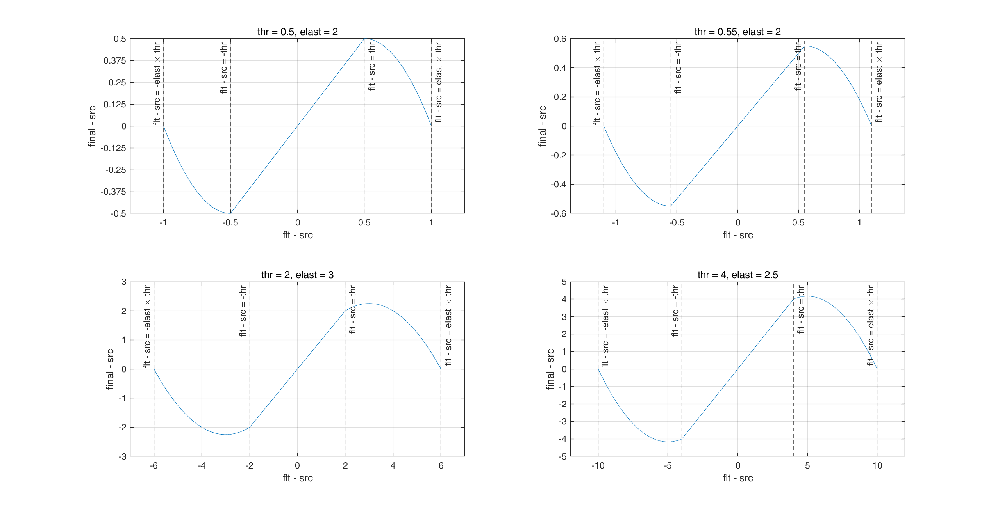

# 第八章 VS视频处理基础
这一章，我们将会用一些基本工具对画面进行一些简单操作，并且利用他们的组合初步领会预处理的思路。
## 1. Resizer应用
首先登场的是两位老朋友：[`fmtconv`](https://amusementclub.github.io/fmtconv/doc/fmtconv.html) 和 [`zimg`](https://amusementclub.github.io/doc/functions/video/resize.html?highlight=resize#resize)，复习一下，调用他们分别使用`vs.core.fmtc.xxx`和`vs.core.resize.xxx`。
### 平移和裁剪（shift & crop）
此处我们使用到的参数有以下几个：`zimg`对应的参数是`src_left`/`src_top`/`src_width`/`src_height`。`fmtconv`中对应的函数是`fmtc.resample`，参数分别对应`sx`/`sy`/`sh`/`sw`。这四个参数表示，输出结果对应着原图中的这样一个长方形区域——它左上顶点坐标是 $(src\\_left,src\\_top)$，宽为 $src\\_width$，高为 $src\\_height$。如下图所示：


图中较大的长方形框是原始图像，较小的长方形框——也即**采样区域**，对应结果图像。  
所以，如果想将图像向右平移10.5个像素，同时向下平移20个像素——此时我们的小方框顶点应该位于 $(-10.5,-20)$，所以对应的写法是`resize.Spline36(src_left=-10.5, src_top=-20)`。同样的，我们还可以使用这个方法进行裁切，比如原图是 $1920\times1080$，我想上切10像素，下切20像素，那么就是`resize.Spline36(src_top=10, src_height=1050)`。

那么，假如“小方框”的某一条边落在“大方框”之外（所以前者其实可以比后者大，图中的“大” “小”只是为了便于理解）会怎么样呢？这里两个滤镜的行为出现了差别，超出边缘的像素，`zimg`会以图像的边缘作为对称轴，镜像补全；而`fmtconv`会重复边缘的像素来补全。

### 尺寸变换（resize）
此即图像的放大和缩小，或者说改变采样点（像素）的数量。滤镜依旧是上面所说的两个，`zimg`使用`width`/`height`指定输出图像的尺寸，`fmtconv`对应的是`w`/`h`。该操作将上面提到的**采样区域**（即由`src_left`/`src_top`/`src_width`/`src_height`指定的）缩放到`width`x`height`大小。

### `fmtconv`的逐平面处理

在使用`fmtc.resample`时，`sx`/`sy`/`sh`/`sw`可以传一个数组进去，数组依次指定指定3个平面的参数，例如`fmtc.resample(sx=[-1,0,1])`。假如数组长度为2，比如`sx=[-1,0]`，那么第2、3平面共用数组内第二个参数。

除此之外，`fmtconv`还有`planes`这个参数，也是传一个数组，具体含义doc里有写：
>This array decribes how each plane should be processed. It’s similar to the y, u and v parameters in Masktools 2.
>+ −65535
to +0.5: All the pixels of the plane will be set to −x (the opposite of the specified value). The range depends on the output data type. Remember, in floating-point YUV, the chroma planes range from −0.5 to +0.5.
>+ 1:	The plane will not be processed. This means that the content of the output plane is pure garbage.
>+ 2:	The plane of the input clip will be copied and possibly cropped. Areas out of the input picture are left unprocessed (garbage). Range (full or TV) conversions are ignored.
>+ 3:	The plane will be processed (default).

所以，假如你发现一个视频有 chroma shift，又不想把平面都拆出来，处理完再拼回去，那么你可以用`fmtc.resample(sx=0.3, plane=[2,3,3])`来仅仅处理色度平面。

### Matrix转换

这个其实没啥好说的，`fmtconv`用`fmtc.matrix`和`fmtc.matrix2020cl`，参数的意义在doc里写得都挺明白。`zimg`则是整合到了各个采样滤镜中，用`matrix_in`/`matrix`来指定输入和输出，不过这俩参数只能传数字，更推荐的写法是用`_s`结尾的参数`matrix_in_s`/`matrix_s`传入字符串，看得更加清晰。

### Transfer转换

除了`fmconv`用`fmtc.transfer`之外，用法和上面没啥区别。。。但是有几个需要注意的地方：

+ `zimg`的`709`实际上是`bt1886`，和`fmtconv.transfer`中的`1886`对应，而不是`709`。
+ **注意range**，这一点要特别注意，因为`fmtconv`中默认输入输出都是 `full range`。于是假如你传进去一个`limited range` 的Y平面，然后没指定`fulls=False`，结果就错了。
    
### Gamma awara-resize
    
下图是一些 Transer的曲线，这里我们从图上直观地理解一下：横轴代表计算机里储存的数，纵轴代表实际的显示亮度，可以很明显地发现：
+ 这些曲线都不是线性的（废话）。
+ 他们都是下凹的，也就是说暗场给了更多的数字来表示。


那么我们想象一下，假如说我们在用双线性算法缩小图像的时候，在 `full range 8bit`下，有两个像素：0和255，那么在他们中点插值的像素值将会是128，我们姑且认为我们将这两个像素合并成了一个，那么按理说，视觉上应该是得到中性灰。但是由于 transfer 曲线将0-255中更多的数字给了暗场，所以得到的 128 会比中性灰更暗。其他的 kernel 大同小异。这么做的后果是图像的对比度会下降，比如这张图：


直接缩到1/4大小，会得到：


可以明显感觉灯光的对比度低了。诚然，resizer自带的low-pass效应是一点，tranfer压缩是另一点。

那么怎么办呢？我们可以将图像转到线性光下，再做resize，然后转回transfer压缩的效果。还是那张图，如果在线性光下做：


vs中，可以这样写：

```python
gray = core.std.ShufflePlanes(src16, 0, colorfamily=vs.GRAY)
gray = gray.fmtc.transfer(transs="709", transd="linear", fulls=False, fulld=False)
gray = gray.fmtc.resample(1280,720)
gray = gray.fmtc.transfer(transs="linear", transd="709",fulls=False, fulld=False)
UV = src16.fmtc.resample(1280,720)
down = core.std.ShufflePlanes([gray,UV],[0,1,2], vs.YUV)
```

我们来一句句看：
```python    
gray = core.std.ShufflePlanes(src16, 0, colorfamily=vs.GRAY)
gray = gray.fmtc.transfer(transs="709", transd="linear", fulls=False, fulld=False)
```
这是把源的Y平面拿出来，再丢给fmtc.transfer，从709的transfer压缩，转为线性光。

```python
gray = gray.fmtc.resample(1280,720)
gray = gray.fmtc.transfer(transs="linear", transd="709",fulls=False, fulld=False)
```

在线性光下做好缩放后，再转回带transfer压缩的效果。
```python
UV = src16.fmtc.resample(1280,720)
down = core.std.ShufflePlanes([gray,UV],[0,1,2], vs.YUV)
```
正常缩放UV，跟处理后的Y平面混合。

实际上709的tansfer压缩是在RGB下做的，受到YCbCr矩阵影响，chroma上其实还是有部分Luma信息 ，只用Y'做转换不太准确。你可以看到UV计算，是基于transfer压缩后的RGB。如果RGB本身是未压缩的线性光，UV的值会有改变；虽然YUV的机制保证了它改变的不大。理想的YUV机制，应该完全消除掉亮度在UV平面的影响，也就是对亮度进行统一的变换。UV的值不应该改变（注意它是亮度做差）。这是理想中情况，现实中很难做到。

### Chroma subsample 与 Chroma placement
    
前文提到过，YUV空间下的色度平面中心可能会出现和亮度平面不一致的情况（Chroma subsample），利用resizer可以对这些不同的采样进行转换。如果是无脑调用滤镜的话，`zimg`用`format`参数指定输出的格式（同时也就指定了色度采样类型），`fmtconv`则使用`css`单独表示输出的色度采样类型。即使有这些看上去很方便的工具，但我们还是要打开黑匣子——如果给你一个YUV420的视频，让你手动放大UV，转成YUV444，你要怎么操作？

上文所提到的两个resizer，默认是中心对齐的放大，例如：

原本的3个像素采样位置是 $[2, 4, 6]$，中点为4；放大后采样位置变成了 $[1,2,3,4,5,6,7]$，中点还是4。

如果YUV420是MPEG1的cplace。那么你直接可以将UV放大到两倍：
```python
a = "xxx.jpg"
src8 = core.lsmas.LWLibavSource(a)

Y = core.std.ShufflePlanes(src8, 0, vs.GRAY)
U = core.std.ShufflePlanes(src8, 1, vs.GRAY).resize.Lanczos2(Y.width, Y.height)
V = core.std.ShufflePlanes(src8, 2, vs.GRAY).resize.Lanczos2(Y.width, Y.height)

res = core.std.ShufflePlanes([Y, U, V], [0, 0, 0], vs.YUV)

res.set_output()
```

那么如果是MPEG2的cplace呢？Y和UV是左端对齐：

Y的采样位置—— $[1,2,3,4,5,6]$，中点是3.5；

UV的采样位置—— $[1,3,5]$，中点是3。
此时，如果我们还是按照中心对齐，将UV放大到2x，那么UV的采样位置变成了 $[0.5,1.5,2.5,3.5,4.5,5.5]$（中点还是3）。
那么该怎么办呢？

来看下面这张图：



所有黑点，是Y的采样位置；蓝色的点，是MPEG2下，UV的采样位置；红色的是MPEG1下的位置；我们希望调整到红色。那么就需要把UV，向右移动Y的尺度下的0.5像素，这0.5像素就是红点和蓝点之间的距离；那么在UV的尺度下，这0.5就变成了0.25。所以如果是MPEG2的cplace，在resize的时候：
```python
a = "xxx.jpg"
src8 = core.lsmas.LWLibavSource(a)

Y = core.std.ShufflePlanes(src8, 0, vs.GRAY)
U = core.std.ShufflePlanes(src8, 1, vs.GRAY).resize.Lanczos(Y.width, Y.height, src_left=0.25)
V = core.std.ShufflePlanes(src8, 2, vs.GRAY).resize.Lanczos(Y.width, Y.height, src_left=0.25)

res = core.std.ShufflePlanes([Y, U, V], [0, 0, 0], vs.YUV)

res.set_output()    
```

与此类似地，我们不仅可以把UV拉上来，还可以把Y降下去：
```python
Y = core.fmtc.resample(src16, src16.width/2 , src16.height/2, sx=-0.5)
down = core.std.ShufflePlanes([Y,src16], [0,1,2], vs.YUV)
```

上面这两行，如果活用`fmtconv`的话可以变成一行：
```
down = core.fmtc.resample(src16, 960, 540, sx=-0.5, planes=[3,2,2], css="444")
```

以上就是Chroma subplace转换的基本方法，计算平移参数的技巧以后还会反复使用。

## 2. Blurring

### RemoveGrain

Blurring，意为模糊，这里介绍一个新的基础滤镜——`RemoveGrain`，调用它的方式是`vs.core.rgvs.RemoveGrain()`，他是avs的`RgTools`在vs中的移植，可以在[这里](http://avisynth.nl/index.php/RgTools)找到他和其他同样在`RgTools`里的滤镜doc。下面来讲讲模糊的基本方法。

#### 平均值模糊（Average Blur）



上面这些起起伏伏可以看作是噪点，所谓降噪，就是要把它抹平，那么最简单的，把所有点的值做个平均填回去：


好，非常平,马赛克大概就是这么做的，把某一区域所有像素的值取个平均。我们在vs中也可以做类似的事情，`core.rgvs.RemoveGrain(src, 20)`。它做的是：把某个像素取值变成 它和周围8个像素的平均值，这里一共有9个像素参与了计算。比如极端一点的情况，某个像素是10，周围8个像素是1，那么经过`RemoveGrain(20)之后，这个像素就变成了2`。

这种操作太糊了，我们想要一个稍微弱一点的模糊。最简单的想法：我把中间那个像素的权重提高一点，这就是`RemoveGrain(11)`。具体权重的取值是：

$$
\begin{bmatrix}
\frac{1}{16} & \frac{1}{8} & \frac{1}{16} \\
\frac{1}{8} & \frac{1}{4} & \frac{1}{8} \\
\frac{1}{16} & \frac{1}{8} & \frac{1}{16}\\
\end{bmatrix}
$$

就是说中间的像素乘以1/4、加上中心十字的四个像素乘以1/8、加上四个角的四个像素乘以1/16。
把权重加起来是1，说明这是个unbiased的操作。可以用vs试试`RemoveGrain(11)`，看看是不是要比20清晰一点。类似的还有:`RemoveGrain(19)`：
权重是：

$$
\begin{bmatrix}
\frac{1}{8} & \frac{1}{8} & \frac{1}{8} \\
\frac{1}{8} & 0 & \frac{1}{8} \\
\frac{1}{8} & \frac{1}{8} & \frac{1}{8}
\end{bmatrix}
$$

可以想见这个会比20还要糊。
以上三种，叫Average Blur，用平均值进行模糊。既然可以用平均值，我们不难想到另一个经常和平均值一起出现的中位数。
    
#### 中位数模糊（Median Blur）

中位数，同样的，我们可以取一个像素和周围八个像素总计9个像素的中位数。这就是RemoveGrain(4)。另外还有三个采用这种思路的模糊滤镜，分别是1，2，3。首先我们把周围8个像素的值排序，我们把mode的值叫做a，要是中间像素的值在排序中，比第a大的值还要大，就把它换成这个第a大的值；如果比第a小的值还要小，就把他换成这个第a小的值。
比如：

$$
\begin{bmatrix}
5 & 9 & 3 \\
7 & 2 & 6 \\
1 & 4 & 8
\end{bmatrix}
$$

然后我们的mode设置为1，2并不比1小也不比9大，什么都不会发生。mode为2，2正好是第2小的，什么都不会发生。mode为3，2终于比3要小了，所以中间2会变成3。变成：

$$
\begin{bmatrix}
5 & 9 & 3 \\
7 & 3 & 6 \\
1 & 4 & 8
\end{bmatrix}
$$

同理，那么`mode`为4，2就会变成5。然后不难证明，假如`mode`是4，中间那个像素永远会变成中央加周边总共9个像素的中位数。从刚才这个流程里我们可以看到，随着`mode`从1到4，原来在9个像素里面比较小的2逐渐变大了，也就是说模糊的效果逐渐加强了。

然后，`RemoveGran`的`mode`参数是可以接受数组的，最多不超过`src`的平面数目，假如不足`src`的平面数目的话，那么滤镜会自动把`mode`扩展成一个长度为3的数组。例如`src`有三个平面，`mode`是1，那么滤镜会自动把`mode`扩展成一个长度为3的数组`[1,1,1]`，假如`mode`是`[20, 1]`那么滤镜会会把它变成`[20,1,1]`，总而言之就是重复的是数组最后一个数。这三个数对应着`RemoveGrain`会用什么样的`mode`去对`src`的三个平面做模糊。例如`[20, 1, 1]`，就意味着对Y平面用20，对UV平面用1。

#### 中值模糊 vs 中位数模糊

Average Blur & Median Blur 这两大类的滤镜的适用范围不太一样。比如下面这个极端情况：

$$
\begin{bmatrix}
0 & 0 & 0 \\
0 & 100 & 0 \\
0 & 0 & 0
\end{bmatrix}
$$

用 RG4 会把中间的100直接变成0；用 RG20 则会把中间变成11。

再比如这里有一根线：

$$
\begin{bmatrix}
0 & 10 & 0 \\
0 & 10 & 0 \\
0 & 10 & 0
\end{bmatrix}
$$  

假如用 RG4 的话，中间会变成0，表现为特别细的线会直接被抹掉，这也就是中位数模糊不太适用的场景。

还有一种很特殊的噪声，称为椒盐噪声，像这样 ~~撒盐图中差可拟~~：



RG4会直接把它抹平，RG20还会残留一点。而这种情况下我们一般倾向于抹平，所以中位数模糊是很合适的：


假如用平均值模糊的话，会变成这样：


比较丑陋。

但就像刚才提到，在普通的图像中中位数模糊对于画面的破坏是比较大的，因此总的还是突出一个综合考虑。然后[`havsfunc`](https://github.com/HomeOfVapourSynthEvolution/havsfunc)里面，就有这么一个综合考虑的滤镜，`MinBlur`，会选取两种方式中破坏较小的那种，并跟上一些后处理，具体可以看其中的代码。

#### 自定义平均权重

对于以上提到的平均值模糊，对图像处理熟悉的同学会发现其实就是用一个 $3\times3$ 的核（kernel）进行卷积，如果我们想自己设定权重该怎么办呢？可以用[`vs.core.std.Convolution()`](https://amusementclub.github.io/doc/functions/video/convolution.html?highlight=conv#std.Convolution)，用`matrix`参数传入卷积核，会比`rgvs`快一些。
    
### USM（Unsharp Mask）

#### clip的简单运算    
我们可以对两个clip进行一些简单的运算：拥有相同帧序号的相同平面之间，进行逐像素的运算——这自然要求两个clip之间的格式和分辨率要是相同的。这里举一些滤镜来实现：

##### [`vs.core.std.Merge(clipa, clipb, weight)`](https://amusementclub.github.io/doc/functions/video/merge.html?)：

这里表示对`clipa`和`clipb`进行线性的融合，结果可以表示成 $(1-weight) \times clipa + weight \times clipb$ 。比如`weight=0`时，结果就是`clipa`；`weight=1`时，结果就是`clipb`；

##### [`vs.core.std.MakeDiff(clipa, clipb)`](https://amusementclub.github.io/doc/functions/video/makediff.html)以及[`vs.core.std.Mergediff(clipa, clipb)`](https://amusementclub.github.io/doc/functions/video/mergediff.html)：

这两个滤镜分别表示 $clipa-clipb$和 $clipa+clipb$，注意，和`std.Merge()`不同，这里相加减可能会超出整数的范围。所以假如你传入的是整数类型的clip，做减法的时候`std.MakeDiff()`会加上一个中点的偏置，比如8bit视频会加上128；做加法的时候`std.MergeDiff()`会减去一个中点的偏置，比如8bit视频会减去128。当然这并不能完全解决超出范围的问题，不过好在我们直接做差的视频一般是比较相似的，所以一般没事，如果你实在不放心，可以转成浮点再做。
#### 分离噪点层

会对clip进行简单的运算后，我们来进行一组操作：首先对 src 进行一个 RG11 ,可以想见，结果比较糊、噪点比较少，就叫 blur；然后用`MakeDiff`做 $src-blur$ ，就得到了噪点层—— blur 和 src 的差异。
    
#### Unsharp Mask

然后，我们将这个噪点层——它包含了原图比较多的高频信息，用`MergeDiff`加到 src 上，这就是最简单且副作用爆炸的锐化：Unsharp Mask。这玩意儿的副作用包括但不限于：ringing，aliasing，爆炸的噪点。这玩意儿就是photoshop的usm。但也是有好处的，黑色的线条看起来更黑了，纹理更清晰了，这也是我们后续所有锐化手段的基础。我们需要对它做各种限制，希望尽量保留下它的锐化效果又能消除多余的ringing之类的东西。

### SBR

现在手上有一张重噪点的图：


画面中还有一朵看起来比较清晰的花，现在我们对它RemoveGrain，得到blur：


噪点看起来平滑了很多，但是花也被搞糊掉了，我们用这两张图做一个usm：



出了这么个东西，可以看到，原来花的那个位置有个比较明显的轮廓，然后整体看起来有噪点，那么我们对这个clip做一个RemoveGrain：



看起来噪点减少了，但花的轮廓还在，我们把这个clip加回到之前的blur，最后得到的是这样一张图:



可以看到整体的模糊效果减小了，这就是最基础的限制blur滤镜强度的一个方法。然后因为是限制blur滤镜的，实际上也意味着在用usm做锐化的时候，我们也可以限制锐化的强度了。

## 3.Repair

这一节要引进一个新的滤镜——[`vs.core.rgvs.Repair(clip, ref, mode)`](http://avisynth.nl/index.php/RgTools/Repair)， 我们一般用 mode 1~4——mode N 表示，clip 的某个像素，倘若超出 ref 对应像素及其周围8个像素中 $[第N小,第N大]$，这个范围，那么就取 ref中，这九个像素的 第N小/第N大。这个感觉和`RemoveGrain`有点像——RG做的是：每一个像素，相比于自己周边8个像素，不要太过分；`Repair`做的是，clip 的每一个像素，相比于 ref 的9个像素，不要太过分。这种操作经常用于可能引入突兀瑕疵的 clip。

### Deringing 

知道了 Repair 有这个功能，我们就来看看它为啥可以做 de-ringing。

一条 2px 宽度的黑色线条，如果周边都是灰色的像素。那么扁平化了看，像素的值是：

$[128, 128, 128, 16, 16, 128, 128]$

中间两个16是黑色，周边是128的灰色。ringing发生的时候，会变成这样：

$[128, 128, 160, 16, 16, 160, 128]$

直观的看就是裹着线条的像素值变得更剧烈了。Repair做的，就是看 clip 的每个像素，是不是值偏高或者偏低，比如 160，对应源周边的像素，要么是128要么是16，显然已经高了，就把它限制为最高值，如果不超过范围就不处理，跟RemoveGrain一样。

### Non-ringing upscale

non-ringing 的做法，就是取一个 sharp 的作为 clip ，取一个没有ringing，soft的作为 ref ，然后做一个repair：
```python
sharp = core.fmtc.resample(down, 1920, 1080, kernel="lanczos", a1=4)
soft = core.fmtc.resample(down, 1920, 1080, kernel="gauss", a1=90)
up = core.rgvs.Repair(sharp, soft, 1)
```

有读者可能会担心，这么做，会不会让 Lanczos 本身锐利的一面被削弱，实际观感更接近 soft 的 Gaussian。这点大家可以试试，实际用起来，取`a1=90`左右，观感是最平衡的。

### RG Dering

resize 的时候可以这样 de-ringing，平时呢？
拿到一个有ringing的源，也只要制造一个soft，然后`Repair(src, soft)`就行。
这就是RG Dering:
```python
soft = RemoveGrain(src, [20, 11])
Repair(src, soft)
```

### 利用Repair 限制USM：

USM，这东西还有个意想不到的用途：就是编码前用个什么 RG11 这种light-kernel给锐化一下，压出来的成品，vmaf分会高的离谱。也是好事吧，毕竟人眼非常喜欢 usm。最后，千万别对老番烂番直接用。。。因为 USM 会把烂在哪里放大了给你看：它会把很多瑕疵放大，让锯齿、ringing、blocking 显露得非常明显。

怎么限制它的副效果呢？一个方法就是用Repair，Repair(sharp, src)。这就是ModerateSharpening。

ModerateSharpening会把ringing去掉很多，但是留下的锯齿很明显。所以实际生产也没人用。。。non-the-less这是一个Repair的好用法。

### Contra-Sharpen

Contra-Sharpen一般是，做了一些带有blurring性质的操作后，比如抗锯齿，比如降噪，画面看起来变模糊了。我们想对画面做一个锐化，补偿一下锐度损失，但是又不希望这个锐化使得画面看上去比源更锐利。如果源是 src，你一番处理后成了 flt，比如做了个高质量降噪。可能多数场景，flt 锐利度比源下降了 5%，少数场景下降了 20%。（比划一下，具体怎么量化我也不知道。。。）你如果一波USM，雨露均沾的，把锐利度提升了15%。少数场景的确几乎回到了之前的水准，但是多数场景就比之前还锐利，咋办？我们希望限制一下，锐利度提升，不要超过 flt 比起 src 下降的尺度。也就是，锐化时候，打上去的 diff，不要比 $src-flt$还过分。即：
```python
blur = RG(flt, 20)
diff_for_sharp = flt - blur
diff_src_flt = src - flt
```

然后我们希望，对于每个像素确保：
$|flt-blur| <= |src-flt|$

然后： $sharp = flt + (flt-blur)$

这个思路原原本本实现，需要借助Expr做像素级计算，但是用Repair可以近似实现：
$|flt-blur| <= |src-flt| (max\ of\ 3*3)$

这就是 contra-sharp的思路 。我们结合代码来看：
```python
nr16 = core.bilateral.Bilateral(src16, sigmaS=1.5,sigmaR=0.015, algorithm=2)
noise = core.std.MakeDiff(src16,nr16)
blur = core.rgvs.RemoveGrain(nr16, 11)
diff = core.std.MakeDiff(nr16,blur)
diff = core.rgvs.Repair(diff,noise,1)
res = core.std.MergeDiff(nr16,diff)
```

1. 
    `nr16 = core.bilateral.Bilateral(src16, sigmaS=1.5,sigmaR=0.015, algorithm=2)` 这是调用Bilateral算法（当年avs没有好的降噪滤镜用，这是一个还行的工具了）进行高质量降噪；
2. 
    `noise = core.std.MakeDiff(src16,nr16)` 这是分离噪点，也就是 $src-flt$；

3. 
    ```python
    blur = core.rgvs.RemoveGrain(nr16, 11)
    diff = core.std.MakeDiff(nr16,blur)
    ```
    这是获取锐化用的diff；

4.
     `diff = core.rgvs.Repair(diff,noise,1)` 这就是确保，锐化用的diff，每个像素的改动，不要超过(源-锐化)对应位置9个像素的最大改动。近似的可以认为是对应像素位置，降噪而损失的锐利度；
5.
     最后，`res = core.std.MergeDiff(nr16,diff)`。把限制过的diff层加回去，完成锐化。

这个实现方式并非严格的保证锐化程度不超过源，而是用了一个近似，允许一定程度放大锐化强度。原则上锐化强度不该超过像素自身损失，现在是允许不超过周边3x3像素的损失，即 locally restricted 而非 pixel-wise restricted。所以这东西说是补偿，其实还是略微在源的基础上放大了一些锐利度，因为早期TAA（常用的抗锯齿）滤镜最后就给你来这一手，所以经常给人以“抗锯齿会让线条变得更锐利”的错觉。

## 4.LimitFilter
上一节提到，Repair根据周边像素的相对大小来限制 ref 和 src 的区别不能过大。LimitFilter则是比较像素本体数值，跟一个阈（yù）值，以及允许的弹性程度作比较。最早来自于avs的dither package，现在则是一般用`mvf.LimitFilter`。用法`mvf.LimitFilter(flt, src, thr, elast)`。其中， `flt` 是要处理的clip；`src`是原始的clip；`thr`是一个阈值，表示8bit下，flt 和 src 可以差别多大。通常取值在0.5~3.0左右，表示8bit下允许偏移这么多。小数不用担心，内部运算精度是16bit的；`elast`，是弹性值，我们随后说。

这里举个简单例子来说明它的作用表现，假设src的某个像素是50,`thr=0.5, elast=2.0`:

1. $|flt-src|<=thr$，直接保留。比如说 flt=49.8 或者 50.4，那么不做调整；
2. $|flt-src|>thr\times elast$，直接取值 src。比如说 flt=48.9 或者 51.7，那么直接设置为 50；
3. $thr < |flt-src| < thr \times elast$ ， 结果会被连续地调整到 $[src-thr\times\frac{elast^2}{4 \times (elast-1)}, src+thr\times\frac{elast^2}{4 \times (elast-1)}]$ 之间: $final = src + (flt - src)\times\frac{thr\times elast - |flt-src|}{thr\times elast - thr}$。

比如 flt=49.1，调整结果大约为 49.8；flt=50.6，调整结果大约为 50.5。

综合以上，在`thr=0.5, elast=2.0`时，我们可以画出这个图：



可以看到在`thr=0.5, elast=2.0`下。滤镜保证 $|final-src|<=0.5$。

$elast <= 2$ 的时候，有个很巧的结论，就是 $|final - src| <= thr$。如果调整后出现 $|final - src| > thr$，则一定是 $elast > 2$ 才会出现。（你可以通过一些简单的计算证明这个结论）

这里再贴上一些不同参数下的曲线以供比较：




除此之外，LimitFilter还有一些例如`ref`的参数，因为一般用不到且原理大差不差，就不交代了，下面给出`mvf.LimitFilter`的完整计算过程。
```
## Algorithm for Y/R/G/B plane (for chroma, replace "thr" and "brighten_thr" with "thrc")
##     dif = flt - src
##     dif_ref = flt - ref
##     dif_abs = abs(dif_ref)
##     thr_1 = brighten_thr if (dif > 0) else thr
##     thr_2 = thr_1 * elast
##
##     if dif_abs <= thr_1:
##         final = flt
##     elif dif_abs >= thr_2:
##         final = src
##     else:
##         final = src + dif * (thr_2 - dif_abs) / (thr_2 - thr_1)
```

### LimitFilter 与 USM

第一个用途，我们可以用LimitFilter来限制USM的副效果，例如`LimitFilter(thr=3.0, elast=4.0)`。上节提到了 ModerateSharpening——`Repair(usm, src, 1)`。事实上用 LimitFilter 效果更好，可以选择控制的参数也更多。不只是处理锐化，AA、dering，以及很多破坏性处理，它都能处理得很好。Repair 一个缺点是只能处理 flt 比 src 更“突兀”的，而LimitFilter两个方向都能处理。你既可以用它来限制类似 blurring、debanding 这类 smooth 滤镜的破坏力，也可以用它来限制 sharpening，line-darkening 这种 enhance 滤镜的副效果。

### LimitFilter 与 Deband

Dither Package当年引入这个东西，主要是为了做 Deband（去色带） 的。它是一个叫做 GradFun3 滤镜的组成部分。它们处理色带的方法是：用一个强力的，大范围的，高精度的smooth滤镜先轰一遍，把色带轰平了，然后用 LimitFilter 抢救细节。因为色带所处的平面，轰一下改变很小，很可能在给定的 thr 之内；但是线条、纹理等细节，轰一下改变就很高了，可以用 LimitFilter 来还原成 src 或者接近 src 的数值，这是当年一种做 deband 的方法。

另一种，是基于上古滤镜，flash3k_yuv_deband（f3kdb）。f3kdb 没这么多花花肠子，就是找得准，然后轰。有关 Deband 的内容后续会有专门的章节，这里我们仅仅拿出一套参数来充当展示。

`dbed = core.neo_f3kdb.Deband(src,8,48,48,48,0,0,output_depth=16)`这是一个使用f3kdb，进行Deband的例子，具体参数的设置和含义先按下不表，我们先认为这个操作去掉了banding（色带）

此时 f3kdb 可以看做一个精准的smoothing kernel，图像经过这么一整变得更加平滑，我们把它跟LimitFilter结合起来

```python
dbed = core.neo_f3kdb.Deband(src,8,48,48,48,0,0,output_depth=16)
dbed = mvf.LimitFilter(dbed,pre_db,thr=0.5,thrc=0.6,elast=1.5)
```

注意这里`thrc=0.6`，是chroma平面的thr。一般 Deband 的 $thr \times elast$ 不超过2，因为大多数色带就只是1级别的差距，不会很大。而如果像 USM 那样，目的是限制线条， $thr \times elast$ 就会给的很高，比如 3 x 4=12。

### LimitFilter 融合线条与非线条

这个需求最早是avs时代，mawen1250 写 nnedi3_resize16 的。天才mawen1250，早在 madVR 用 nnedi3 拉升之前，就设想出可以用nnedi3，这个本职为倍高的滤镜，做一个高质量的upscaler。问题是，nnedi3当时运算精度为8bit，8bit的精度处理线条部分没问题，处理平面部分就很恶心了。低精度的resize很容易在平面引入肉眼可见的色带，咋办？两条路：
1. 用8bit精度处理完后接一个deband；这样可行，但是，deband本身是个很复杂的操作，参数不太好给；
2. 线条部分用8bit，平面部分用16bit的常规resizer（avs时代已经有Dither_resize16做高精度resize）。反正平面部分拉升，算法好不好都没有啥区别。然后，根据线条框一个mask（区分线条平面），线条部分采取8bit高质量拉升，平面部分采取16bit高精度拉升。

后者是旧版nnedi3_resize16的做法。这个做法是没问题的，效果也很好，就是。。。慢。最后，mawen想到了一招：

```python
edge = nnedi3(src8).to_16_bit()
nonedge = resize16(src16)
```

这两个clip，平面部分虽然精度有差别，但是差别非常小，也就是数值1左右的范围.如果两个clip差别在1.0以内，我认定这块是nonedge；如果差别在1.5以上，我认定这是edge。区别在这中间，不要紧，只要保证过渡连续性就好。这完全可以用LimitFilter实现：

`LimitFilter(nonedge, edge, thr=1.0, elast=1.5)`

用了这个方案后性能提升非常多。到了vs时代，滤镜内部精度都上浮点数了，这个 trick 自然没有再用的必要。但是这是在masktools之前，一个很有用的，对线条，对平面分别处理，然后巧妙的融合两者的做法：

`LimitFilter(nonedge, edge, thr=1.0~2.0, elast=1.5~2.0)`。

事实上，deband本身可以看做，对平面做 deband（nonedge=dbed），对线条不做处理（edge=src）：`LimitFilter(dbed, src, thr=1.0, elast=1.5)`。
