# 第九章 初级视频瑕疵修复

瑕疵处理是视频压制的一个核心课题。不论是 vcbs 还是其他压制者，很多会在发布页上写一点吐槽，说明自己做了些什么处理。然而，为什么压制者需要处理瑕疵呢？

首先是观感的影响。“瑕疵”是一个很直觉的感受，我们即使不从一个科学的角度定义，也可以判断片源是否具有瑕疵。同样的，我们也能直觉地比较瑕疵“修复前”和“修复后”的改善。

其次是编码的问题。假如“瑕疵”无法被肉眼在播放时察觉，我们是否应该修复呢？站在压制者的角度上，这个问题的答案通常是 Yes。原因是压制的本质是二次压缩，对于在第一次编码时引入的瑕疵，在第二次编码时会被当做输入来处理。结果就是瑕疵通常占用了不必要的空间，又或者在二次压缩时遭到强化。 

瑕疵修复是必定有副作用的。为了消除瑕疵，可以对画质做出多大的牺牲呢？

这个问题并没有一个标准答案。画质的牺牲和瑕疵处理的完全度是一个取舍的关系。取舍的程度实际上就是每位压制者的核心烦恼。而瑕疵处理手段则决定了取舍的效率。本章会带大家了解多种瑕疵处理手段的效果和副作用，相信大家学完本章后会对这个问题有更深的体会。


## 1. 降噪 Denoise

### (1). addnoise

在讲降噪 denoise 之前，先讲一下加噪 addnoise。

```py
import vapoursynth as vs
from vapoursynth import core

blank16 = core.std.BlankClip(width=1920, height=1080, color=[32768], format=vs.GRAY16)
blank16.set_output(0)

addnoise16 = core.grain.Add(blank16, var=10.0)
addnoise16.set_output(1)

addconstnoise16 = core.grain.Add(blank16, var=10.0, constant=True)
addconstnoise16.set_output(2)
```

我们最常用的加噪滤镜叫 `core.grain.Add`。  
在实际使用上，我们基本只会更改 `var` 和 `constant` 这两个参数。  

在上面这段代码里，`0` 号输出时一个灰色的空白片段。  
大家尝试播放一下 `1` 号和 `2` 号输出。  

`1` 号的 `constant` 的预设值为 `false`，所以 `grain.Add` 预设是生成动态噪点的。  
当设为 `true` 时则生成静态噪点。  

参数 `var` 则定义了噪点的强度，这里设成 `10` 是为了让噪点比较容易目视。  
当我们为 bdrip 加噪保护细节的时候，通常 `var` 会设置在 `0.5` 左右。  
静态噪点也不常用，因为容易造成毛玻璃的感觉。  

### (2). RG20
<!-- TODO: upload -->
本章所需的样例视频放在 Release 的 sample.7z 中，如无特殊说明，后续示例脚本的视频源均取自这里，请在运行时修改为你本地的实际路径。

```py
import vapoursynth as vs
from vapoursynth import core

a = R"Z:\00007.m2ts"
src8 = core.lsmas.LWLibavSource(a)
src16 = core.fmtc.bitdepth(src8, bits=16)

src8.set_output(0)

nr16A = core.rgvs.RemoveGrain(src16, mode=20)
noise16A = core.std.MakeDiff(src16, nr16A).std.Expr(['x 32768 - 10 * 32768 +','32768'])

nr16A.set_output(1)
noise16A.set_output(2)
```

运行上述脚本，切换至第 1466 帧，我们用这帧作为例子解说。  
观察一下 `0` 号输出和 `1` 号输出，有需要的话可以放大一点看。

可以看到，这是一段制作很烂的 BDMV 片源，细看可以发现的部分有噪点，然后整体有色带，色带部分我们先无视。  
RG20 可以移除噪点，但是有让线条变糊的副作用，如果切换到输出 `2`，会显示的更为清楚。


对降噪前后的画面进行 diff 后我们得到噪点层 (grain layer / noise layer)。  
在脚本里面，我们通常用 nr16 代表降噪后的输出，noise16 代表噪点层，16 代表 bit depth。

这里我们加了一句 `.std.Expr(['x 32768 - 10 * 32768 +','32768'])` 来选择性增强和观看 Y 平面的噪点。  
观察这副噪点层的话，我们可以有几个观察：

1. RG20 的确将噪点分离了，在平面上我们可以清楚看到噪点的模样。

2. 噪点层出现很明显的线条轮廓，这代表 RG20 将线条的“锐度”分离了出来，并加到噪点层去。这个现象明显是不理想的。

3. 如果比对输出 `0` 和 `1` 是比较难察觉的，后面的森林的一些纹理细节也被分离到噪点层了。在左上角，我们可以看到隐约树和光点的轮廓。

总的来说，观察 2. 和 3. 属于 RG20 的副作用。其副作用之大，相信大家都能判断 RG20 不可能直接用于降噪。

那么这里问大家一个问题：如果是一个理想的 denoiser, 它的噪点层看起来会是怎样的呢？是不是应该跟 addgrain 的效果很相近呢？

假设图像的噪声是均匀的话，是的。理想的 denoiser 不应该看到任何轮廓，而是只提取出图像的噪声部分。大家评价降噪效果的好坏可以从尝试这一点入手。

### (3). Bilateral

接下来我们用下一个降噪滤镜，Bilateral Filter。

Bilateral Filter 是一个很经典的滤镜了, [wiki](https://en.wikipedia.org/wiki/Bilateral_filter) 上有详细的描述。早期也曾经被用在 BDRip 上。

请往下追加这段代码：

```py
nr16B = core.bilateral.Bilateral(src16, sigmaS=3.0, sigmaR=0.02)
noise16B = core.std.MakeDiff(src16, nr16B).std.Expr(['x 32768 - 10 * 32768 +','32768'])

nr16B.set_output(3)
noise16B.set_output(4)
```

这里我们先选用预设的参数，`sigmaS=3.0, sigmaR=0.02`，  
大家可以观察一下噪点层，看看比起 RG20 有没有什么改进的地方。  
> 实际操作，你可以快速切换 `1`/`3`, `2`/`4` 号输出来比对

首先第一个发现，线条的锐利度 Bilateral 的确保留得更好。

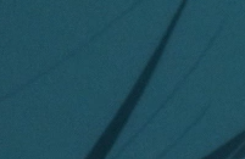
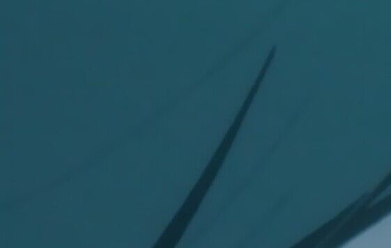

然而，Bilateral 对纹理的细节保护不好，而这种弱线条是一个很好的例子。

除了这两点以外，我们还能看到右上角树的轮廓更清晰了。

然后就是平面上，大家应该能看到 Bilateral 分离出来的噪点要比 RG20 “多” 或者 “强”。  
> 这点大家可以放大到 400%，切换 `2`、`4` 来看

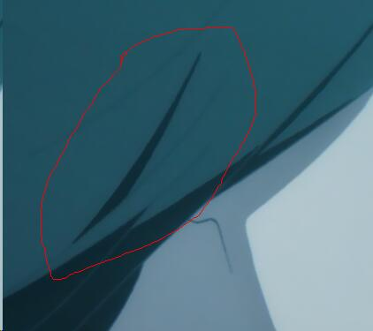

而最后一个有趣的发现是这里。比对一下源和 Bilateral 的话，大家会发现线条变锐利了。

这是 Bilateral 的一个算法上的缺陷。（这个缺陷对应 staircase effect 或者 gradient reversal 的其中一个，详细就不讲了）

大家可以尝试改一下 `sigmaR=0.02` 这个参数，改成 `0.01` 或者 `0.03` 试试。

> 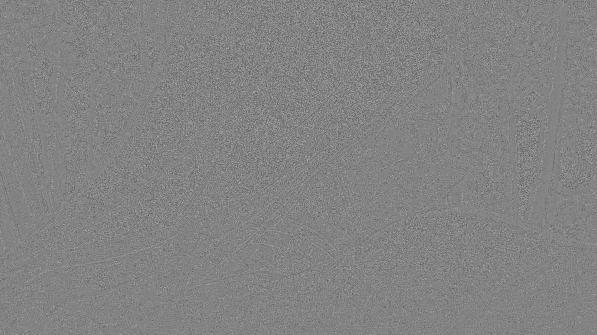  
>
> `sigmaR=0.01`

> 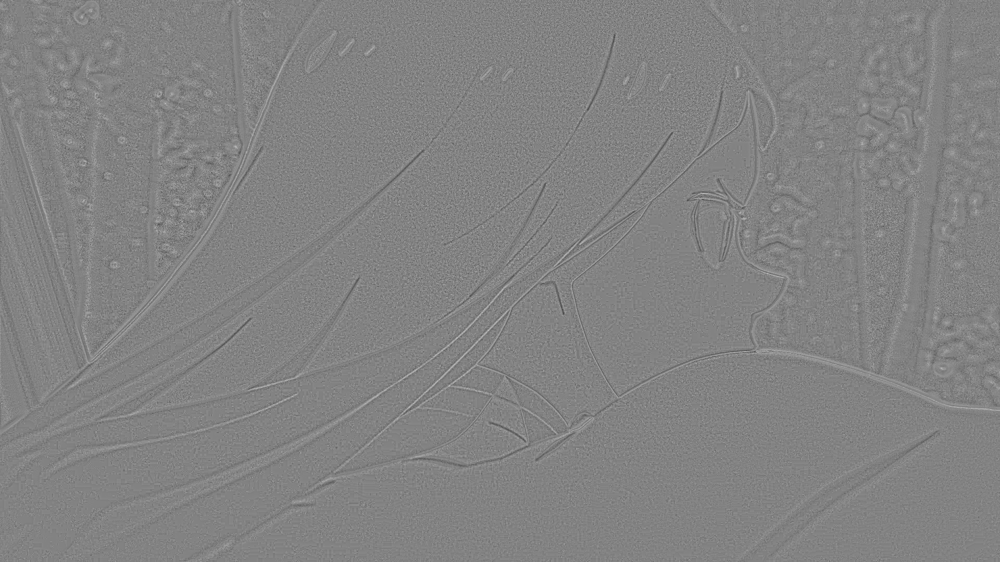  
>
> `sigmaR=0.03`

在降噪滤镜里，用 *sigma* 开头的参数通常**控制降噪的力度**。

Bilateral 比较关键的是 `sigmaR`。  
大家如果比较 `0.01` 和 `0.03` 的话，会发现平面噪点的强度是差不多的，但是线条轮廓的强度差别很大。

这里反映一个关于降噪滤镜调参的要点：**sigma 参数是需要调节的**。

1. 太小的 sigma 无法完全分离噪点层，

2. 很高的 sigma 虽然可以完全分离早点，但副作用会不成比例的提升。

所以需要摸索一个刚好不大不小的。这个最佳的大小是按照源的噪点的强度来定义。

因为 Bilateral 对纹理的损伤大，所以有更好的替代品后，我们就不再用它降噪了。

不过由于 Bilateral 能够选择性糊掉纹理而不怎么动线条，我们可能会在其他地方用到它。

### (4). dfttest

接下来要讲的是两个实际压制会用得上的降噪滤镜：`dfttest` 和 `nlmeans`。

先讲的是 dfttest，文档在[这里](https://github.com/HomeOfVapourSynthEvolution/VapourSynth-DFTTest)。

请往下追加这段代码：

```py
nr16C = core.dfttest.DFTTest(src16, sigma=8, tbsize=1)
noise16C = core.std.MakeDiff(src16, nr16C).std.Expr(['x 32768 - 10 * 32768 +','32768'])

nr16C.set_output(5)
noise16C.set_output(6)
```

由于它的实现涉及到 dft, 参数非常多，复杂，长，难以理解。  
基础的使用上只需要调整 sigma 就可以了。

我们这里选用预设的 `sigma=8`, 另外设 `tbsize=1`, 关闭 dfttest 的时域降噪功能。

实际使用上建议维持 `tbsize=1`，因为 dfttest 的时域降噪有些特殊情況。

观察一下输出 `5` 和 `6`，噪点层（输出 `6`）会隐约看到头发的线条轮廓，但是其他纹理就几乎看不到了。

而且如果切换回 nr16（`5` 号输出）和源（`0` 号输出）之间对比，线条的锐度差异就已经是很微小的差别了。

重要的是，假如我们丢弃了这个分离出来的噪点层，对 nr16 进行一点点补偿性锐化，那么在肉眼看来，我们就是成功的移除了噪点瑕疵，而保留了线条锐度和纹理细节。

然后，大家可以试着切换不同的帧看看。  
举个例子，可以看 1988 帧，一个夕阳下的场景。  
<!-- 1944 2025  -->
比对 Bilateral 的 `4` 号输出和 dfttest 的 `6` 号输出，你会发现 dfttest 的噪点层仿佛保留了所有噪点，但是排除了近乎所有的纹理线条细节。

> 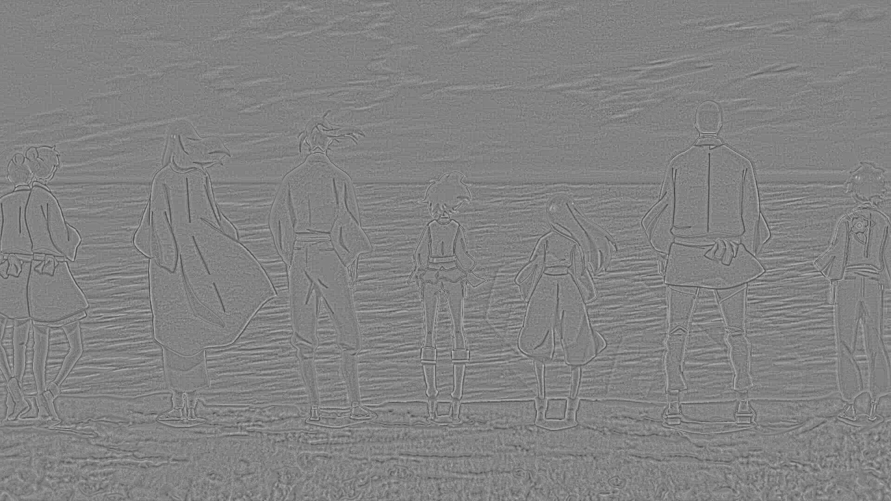  
>
> `Bilateral`

> 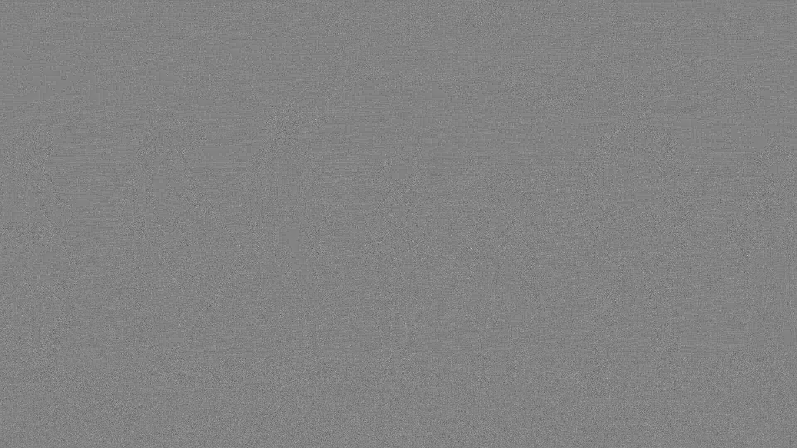
>
> `dfttest`

接下来切换到另一个场景, 2060 帧。  
这个是一个天空和云的画面，可以观察一下蓝天的噪点和白云的噪点，看起来有什么差别。

从 dfttest 的噪点层（`6` 号输出）可以看到：蓝天的噪点比较粗糙，两者噪点有点粗细不同的感觉。

同一个画面下，其实噪点模样通常是不一致的。  
在 2060 里，有些噪点比较细致，有些比较粗造（看起来像一堆重叠的方块，不是一个个独立的点）

如果切换回 1988，这里的分别就更明显了。可以看到噪点呈大方格装的感觉，根本不是“噪点”。

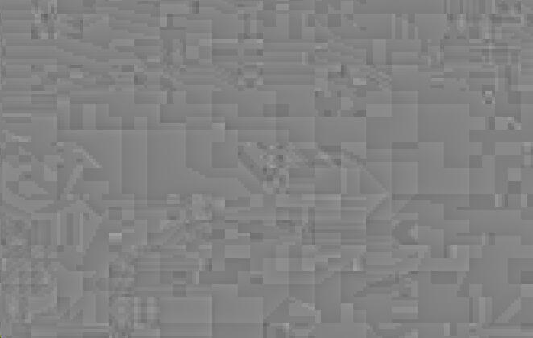

这个观察反映出另一个要点：在我们接触到的大部分压制源上，**噪点（噪声）跟 addgrain 的差别非常远**。

这证明了 denoise 并不是 addgrain 的一个逆操作。

我们通常可以这样假设：  
制作方使用了类似 addgrain 的操作，在经过第一次编码后，噪点丧失了原有的形态。  
我们在压制处理时，就需要移除这些“残留物”，以防他们影响观感，或者占用码率。

现在 dfttest 我们选用了 `sigma=8`，而作为课后练习，大家可以试试 sigma 取多少才更适合这份素材。

### (5). nlmeans

接下来，我们来尝试本章要介绍的最后一个降噪滤镜，nlmeans。

这里选用的是 `nlm_ispc`, 由 vcbs 总监 Mu 写的一个 nlmeans 算法的实现: [vs-nlm-ispc](https://github.com/AmusementClub/vs-nlm-ispc)。  
详细的调参可以参考[这里](https://github.com/Khanattila/KNLMeansCL/wiki/Filter-description)。

请往下追加这段代码：

```py
nr16D = core.nlm_ispc.NLMeans(src16, d=0, wmode=3, h=3)
noise16D = core.std.MakeDiff(src16, nr16D).std.Expr(['x 32768 - 10 * 32768 +','32768'])

nr16D.set_output(7)
noise16D.set_output(8)
```

这里相比预设更改了几个参数：  
 - `d=0` 代表关闭时域降噪。  
 - `wmode=3` 比预设的 `wmode=0` 效果更好，建议用 `3`。  
 - `h` 是降噪的力度（虽然没有 sigma 在名字里），预设的 `1.2` 太弱，为了适配这片子这里加到 `3`。  
大家初期使用的话，只更改 `h` 就差不多了。

按照上面，大家可以比对一下 dfttest 和 nlmeans 的输出（主要看噪点层，输出 `6` 和 `8`）。
> 提示一个对比的方法，`core.std.MakeDiff(noise16C, noise16D).set_output(9)`

nlmeans 大体上是一个比 dfttest 更能保护纹理线条的 denoiser。

我们继续以 1466 帧为例子，比如说在这发亮的轮廓部分，nlmeans 甚至选择了完全不降噪（噪点层数值为 `128`）。

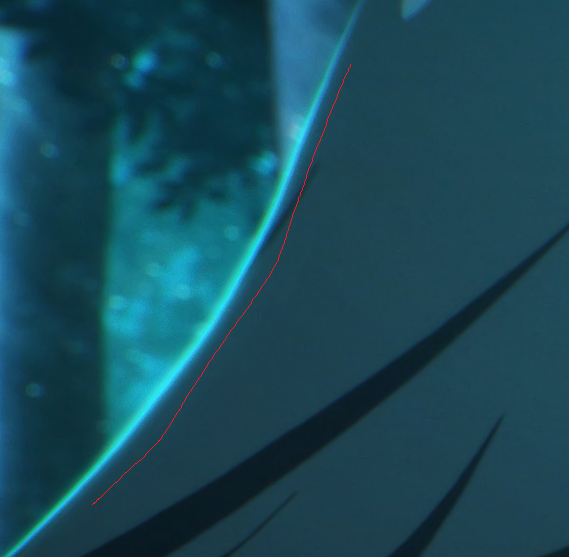

比起 dfttest，nlmeans 也避开了一下低频，像波浪般的细节，只是移除了更细的噪点部分。  
> 在刚才的 `9` 号输出可以看得更清楚

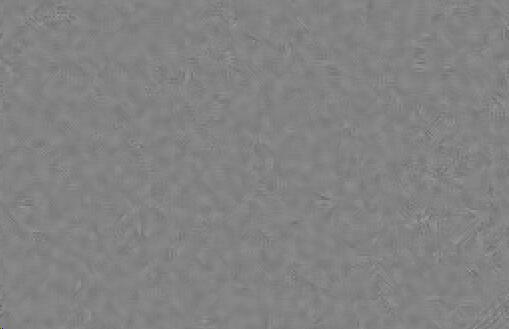

所以在实际操作上，特别是 webrip，有很多总监喜欢用 nlmeans。

初阶的降噪技巧就到这里，总结一下，我们提到了：

1. RG，Bilateral, dfttest, nlmeans 这 4 种循序渐进的 denoiser

2. 如何透过观察噪点层判断降噪效果的好坏

3. 理解到在实际片段中，噪点的形态不止一种，也跟 addgrain 的模样大相径庭

实际应用中还有更先进的降噪算法，比如目前广泛使用的 BM3D、甚至一些 AI 降噪滤镜，不过这些属于高级降噪内容，就不在本章的范围之内了。

Bilateral, DFTTest 和 nlmeans 都有 GPU 加速实现：  
https://github.com/WolframRhodium/VapourSynth-BilateralGPU  
https://github.com/AmusementClub/vs-dfttest2  
https://github.com/AmusementClub/vs-nlm-cuda  

nlmeans 还有一个更老的实现 KNLMeansCL，不过由于 openCL 环境的可用性难以保障，现在更推荐用 vs-nlm-cuda 或者 vs-nlm-ispc 进行替代。  
调参可以仍然参考 KNLMeansCL 的 [Wiki](https://github.com/Khanattila/KNLMeansCL/wiki/Filter-description)。


## 2. 去色带 Deband

### (1). 重温色带

首先重温一下色带的现象，我们一般容易在一些低位深源的暗场颜色过渡区域看到色带。

这里有两个要素，第一个是颜色过渡，第二个是低位深源。

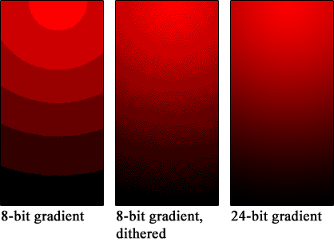

  

在有颜色渐变的地方，无论亮场和暗场都容易出现色带。  

如果用图来显示，一个渐变区域可以画成这样：  

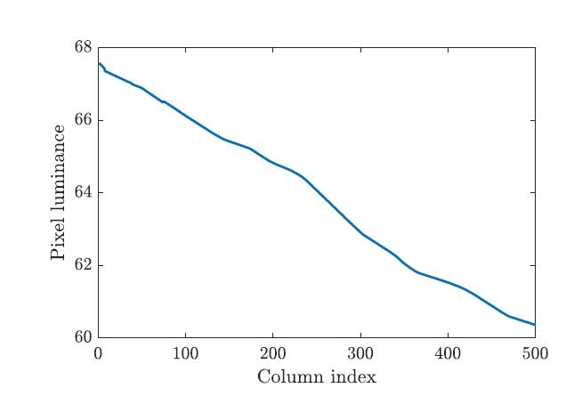  

X 轴是空间，而 Y 轴是像素的亮度。  

但是由于源的位深有限制，在编码后这条斜线会变成阶梯状：  


每个阶梯对应一个整数的像素亮度。  
当位深越低，阶梯之间的间隔就越大。  
在达到某一个大的间隔后，人眼就能察觉并辨认为色带了。

既然低位深容易产生色带，那么位深要到多少才不容易/不会有色带呢？  
有人可能会说 10bit 是被认为是不容易出色带的，但是为什么呢？

实际上这是个陷阱题。  
8bit 容易出色带，10bit 不容易是基于经验的观察。  
实际上无论位深有多高，阶梯是必定会出现的，只是间距会有差别。

我们关注的纯粹是“以一般人类视觉而言，不容易察觉到色带的状况”。

在 bt.709 色域下，工程师总结出 10bit-YUV 不容易产生人眼能察觉的色带。  
而如果我们换成 HDR 色域的话，由于颜色范围的增大，通常被认为需要 12bit-YUV 才足够。  
> 位深不变的话，数量还是那么多，但范围大了，精度就变差了，所以可能需要提高位深来弥补。

所以这里是第一个重点：**色带处理的目标实际上是要骗过人的眼睛**。  
小色带是必定会存在的，只要无法被肉眼察觉就可以。  

接下来，我们说一下在维持位深不变的情况下，防止色带的原理。  
这个方法我们统称为 *dithering* (抖动)。

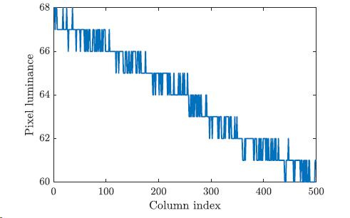  

如果在刚才的图上面表示，dither 大概看起来像这样。  
透过在阶梯的两侧加入一些“上下抖动”的变化，我们让肉眼误认这是一段连续的颜色变化。  

  

实际效果就如上面红黑色的图一般。  

然而，加入抖动的副作用是，抖动本身看起来就像一些噪声，会让图像看起来有些粗糙。  
这个可以用下图很好地说明。  

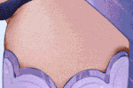  

在这张 gif 里面，可以观察一下肉色的部分。  
我们可以隐约看到三种肉色的变化，但是由于抖动的存在，看上去就像是连续的渐变色+上面有很重的动噪。  
这种 dithering 有一个统称，叫 *random dithering*，意思是加进去的抖动有随机性，看起来像是噪声。

而在下一幅 gif, 这里加入的是另一种形式的抖动，叫 *ordered dithering*。  
大家会察觉到有一层难看的网格状噪点，这就是 ordered dither 的特色。

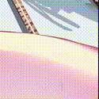  

原则来说，由于网格辣眼睛，我们会尽量选择 random dithering 作为去色带的手段。  

最后一幅的 gif，是用来说明我们日常会看到色带的情况。

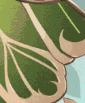  

观察左上角这里，我们会看到虽然色带附近有抖动，但抖动似乎只存在于色带的边缘部分，并没有覆盖整个颜色变化区域。

实际上，这种现象广泛出现在各种（BD）源里：  
- 尽管制作方即使加入了一点抖动，但是由于强度不足或者编码器不听话，抖动最终不足以掩盖色带。
- 另一方面，色带的边缘也不会是很漂亮的，有连贯性的边缘。

### (2). f3kdb

下面我们进入实操，新开一个 vpy，使用前面的 `00007.m2ts` 视频源，运行下面代码。

```py
import vapoursynth as vs
from vapoursynth import core
import mvsfunc as mvf

a = R"Z:\00007.m2ts"

src8 = core.lsmas.LWLibavSource(a)
src16 = core.fmtc.bitdepth(src8, bits=16)

src8.set_output(0)

nr16 = core.nlm_ispc.NLMeans(src16, d=0, wmode=3, h=3)
nr16.set_output(1)

nr16U = core.std.ShufflePlanes(nr16, 2, vs.GRAY)
nr16U.set_output(2)

# https://f3kdb.readthedocs.io/en/stable/usage.html
dbed = core.neo_f3kdb.Deband(nr16, range=12, y=96, cb=48, cr=48, grainy=0, grainc=0, output_depth=16)
dbed = core.neo_f3kdb.Deband(dbed, range=24, y=72, cb=32, cr=32, grainy=0, grainc=0, output_depth=16)
dbdiff = core.std.MakeDiff(nr16, dbed)

dbed.set_output(3)
dbdiff.std.Expr(['x 32768 - 20 * 32768 +']).set_output(4)
```

运行后切换到 777 帧，比对一下 `0`, `1` 和 `3` 号输出，观察一下有什么变化。

经过观察可以看出来，`1` 号是降噪过的 nr16，我们用了 NLMeans 对画面进行降噪。
```py
nr16 = core.nlm_ispc.NLMeans(src16, d=0, wmode=3, h=3)
nr16.set_output(1)
```

然后我们对降噪后的输入进行了强力的 deband。
```py
dbed = core.neo_f3kdb.Deband(nr16, range=12, y=96, cb=48, cr=48, grainy=0, grainc=0, output_depth=16)
dbed = core.neo_f3kdb.Deband(dbed, range=24, y=72, cb=32, cr=32, grainy=0, grainc=0, output_depth=16)
```

我们最常用的 deband 滤镜叫做 f3kdb。  
当中需要调参的参数有 4 个：`range`, `y`, `cb` 和 `cr`。  
`y`, `cb` 和 `cr` 分别对应 YUV 三个平面的去色带力度，而 `range` 是一个比较特殊的参数。


在这幅图，我们可以看到阶梯除了有高度（像素亮度）外，还有宽度。


而从这幅图，我们吸取到的教训是抖动需要覆盖整个阶梯才行。

`range` 所决定的，简单来说就是抖动需要覆盖的范围。  
视乎色带的宽度，我们会动态地调整 `range` 的大小。

另一方面，连续进行两次 f3kdb 是我们的一个惯例。  
这方法有两个好处，第一个是可以涵盖不同大小的色带，另一个是在处理大色带的时候，可以让效果看起来比较均匀。

两次的 f3kdb 通常是 `range` 小的先行，大的在后；小的去色带力度给的较强，大的去色带力度给的较弱。  
常见的 `range` 的配搭有 `8`+`16`, `12`+`24`, 或者 `16`+`31`, 选哪个视乎色带的形态。

而去色带力度的话，通常较弱的 deband 我们会给 `40`/`30`，最强的话不会超过 `100`。

在实操上，由于 deband 对一些元素的破坏力很强，我们需要很小心调节 deband 的力度。  


除了弱线条外，deband 还有一些副作用，眩光/光柱特效是常见的重灾区。

可以切换到 986 帧观察一下，可以看见伸进海里的光柱被削弱削短了。

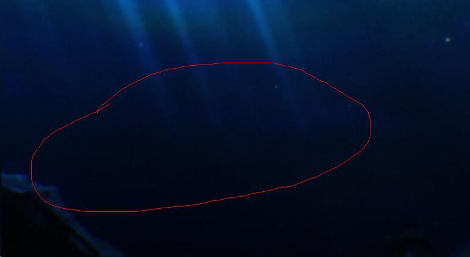

整体来说，deband 通常对夜晚的云彩，光柱特效，弱线条这些大范围但是变化小的低频信息影响最大。

### (3). Deband 后处理

接着上一节的脚本，我们回到第 777 帧，尝试把 f3kdb 的参数改成如下，看看有什么差别。
```py
range=12, y=64
range=24, y=48
```

应该能看到弱线条被保留了一部分，相反头发上多了一点粗糙感，比如原本快被磨光了的头发中间的一条线又能看见一点了。

然而，作为削弱 deband 的代价，头发下方的颜色比较深的部分似乎也有一点点色带残留。


除了调整 f3kdb 的参数外，我们还有另一个方法去限制 deband 的力度——利用 LimitFilter。

请往脚本里追加这段代码：
```py
limitdbed = mvf.LimitFilter(dbed, nr16, thr=0.55, elast=1.6, planes=[0, 1, 2])
limitdbdiff = core.std.MakeDiff(nr16, limitdbed).std.Expr(['x 32768 - 20 * 32768 +'])
limitdbed.set_output(5)
limitdbdiff.set_output(6)
```

当 LimitFilter 的 `thr` 设置为 `0.45`-`0.55`, `elast` 在 `1.5` 左右的时候，它的曲线是适合用来限制 deband 效果的。

比对一下输出 `4` 和 `6`，它们的 dbdiff, 即是 deband 前后的差。

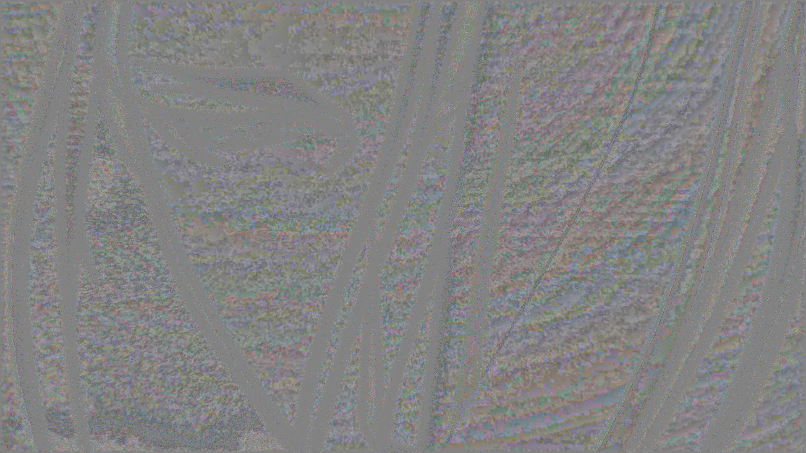

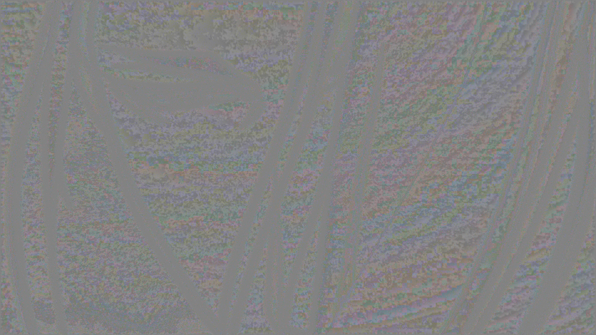

1. 变化强烈的地方得到抑制，
2. 变化没那么大（特别是颜色）被保留下来。

这反映了 LimitFilter 的一个工作原理：对小的变化保留，对大的变化抑制。

我们会选 `0.55` 的主要原因，是因为在 8-bit 下，色带两个“梯级”的差别不会超过 1。  
所以梯级两面分别给大概 `0.5` 的抖动，理论上就能很好的掩盖色带。

如果抖动的幅度大幅超过了 0.5，那证明它并不是在消除色带，而是被误判为色带的一些细节。  

大家可以尝试把 `thr` 调到 `1` 左右，这样的话，LimitFilter 就几乎完全失去作用了。

### (4). Deband 预处理

为什么我们大多数情况要先 denoise, 然后才 deband 呢？

其中一个原因是，以 f3kdb 为例的 deband 滤镜会使用 dither 避免 banding，但 denoise 这个行为会破坏抖动。  
因此 deband 后我们通常不能对画面进行 denoise 之类的低通滤镜，以免破坏 f3kdb 加入的 dither。

> 不加 dither 而直接在高位深将色带平滑掉的方法叫 GradFun3，这个会在后文提到。

另一个原因是，保留噪点的话可能会干扰 deband 的效果，这点我们用接下来的例子说明。

请大家把输入改成这个源，并切换到 1637 帧。
```
a = R"Z:\CRIMEEDGE1_00002.m2ts"
```

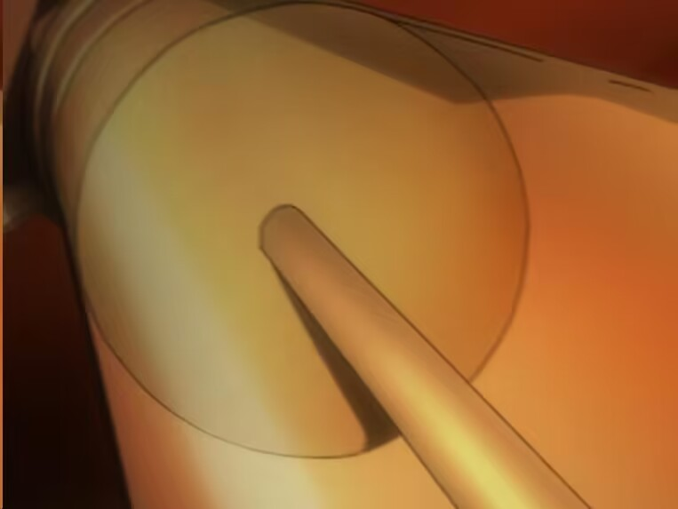  

在这个圆形部分有很强烈的色带。

接下来，将上面脚本的 f3kdb 参数换为 12,64,48,48 + 24,48,32,32，切换到 `3` 号输出，观察一下色带是否清除干净了。

可以看到，基本上都清理干净了，除了下图部分细看有点略微的残留。

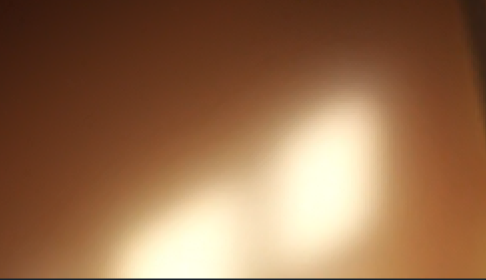

接下来，再追加下面这段代码：
```py
srcdbed = core.neo_f3kdb.Deband(src16, range=12, y=64, cb=48, cr=48, grainy=0, grainc=0, output_depth=16)
srcdbed = core.neo_f3kdb.Deband(srcdbed, range=24, y=48, cb=32, cr=32, grainy=0, grainc=0, output_depth=16)
srcdbdiff = core.std.MakeDiff(src16, srcdbed).std.Expr(['x 32768 - 20 * 32768 +'])
srcdbed.set_output(7)
srcdbdiff.set_output(8)
```

这里我们选用了 src16 而不是 nr16 作为输入，其余的参数设定都是一样的。

比对一下 `0` 号和 `7` 号输出，看看色带有没有被清除掉。

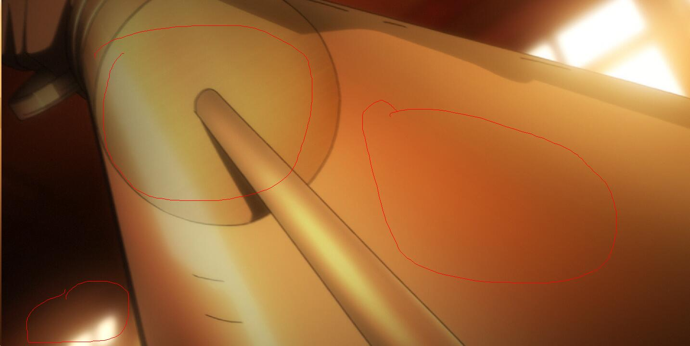  

有色带的大概是这 3 个部分。应该可以看到色带约莫是少了一点点，但整体还在，跟先 denoise 再 deband 的效果相差很远。

如果观看 `4` 号和 `8` 号的 dbdiff, 会更加明显。

denoise-deband 的 dbdiff 可以看到有一些波浪形态的变化；而 source-deband 的 dbdiff 就只能看到噪点，没有波浪形的变化。

而波浪形的变化，实际上就是 f3kdb 抵消掉色带的效果。

这部片的特色是制作方加入了很强的静噪，看上去就像有毛玻璃一样，然而这静噪下面隐藏着色带。   
这份静噪也干扰了 f3kdb 辨认噪点的能力，导致必须要先 denoise 才可以 deband。

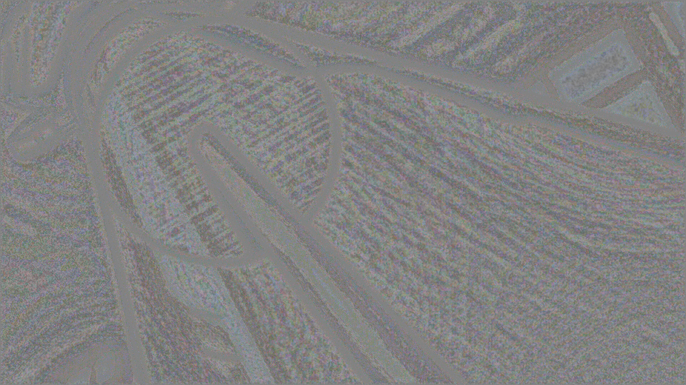


我们总结一下:

去色带处理的基本方式是：先 denoise，然后 2pass-f3kdb deband。  
这个流程我们通常称为 `nr-deband`，nr 是 noise removal 的简写。

降噪基本对于色带处理是利多于弊的。

然而 deband 处理通常会波及纹理细节，所以在调参上，deband 通常是最花时间的一个步骤，也是压制者最需要在细节和瑕疵移除之间取舍的一个处理。

### (5). 高强度 Deband —— GradFun3

本小节请大家先开一个新的 vpy，然后载入 `MINORI2_00004.m2ts`，用 474 帧作为例子。

在开始前先请大家思考一个问题，这草地看上去像色带吗？  
这个问题的回答先暂时放一边，后续再来解释为什么要这样问。

本小节介绍一个比 f3kdb 更强力的 deband 方法叫，`GradFun3`。

```py
import muvsfunc
dbed = muvsfunc.GradFun3(src16)
dbdiff = core.std.MakeDiff(src16, dbed)
dbed.set_output(1)
dbdiff.std.Expr(['x 32768 - 20 * 32768 +']).set_output(2)
```

GradFun3 本身并不是一个“滤镜”，而是一个 vsfunc，由多个小的滤镜组合。  
源码可以参考[这里](https://github.com/WolframRhodium/muvsfunc/blob/6203a71cc5aa8bba2f4f95afe3f61595f9ea0d84/muvsfunc.py#L500-L669)。

GradFun3 的调参主要依靠 `thr` 和 `elast` 两个参数。

这不是一个巧合，GradFun3 是利用了 LimitFilter 来调整 deband 效果大小。  
由于源码比较复杂，而且大部分内容这里没有涉及，所以我们这里就不详细分析了。

简化地说，GradFun3 是先利用 Bilateral 或者 DFTTest 对画面做一个模糊，然后做一个 detail/edge mask（遮罩）尝试保护纹理和线条。

那么，默参的 GradFun3 能清干净 474 帧的色带吗？  
观察后可以发现，不行。所以我们要增强一下 GradFun3 的威力。

可以看到，它的默认参数是 `thr=0.35, elast=3.0`，那么试试填一个更强的参数？

我们回顾一下 LimitFilter 的内容，LimitFilter 的特性主要是由 thr 和 thr*elast 来定义的。
 - thr 定义什么值开始有削弱效果
 - thr*elast 定义最大允许的变化值

所以在调参的时候，你可以尝试：
1. 固定 thr*elast, 然后提高 thr
2. 固定 thr 和 elast 的相对比例，两个一起提升

在 deband 的状况下，可能第一个状况比较贴合。不需要调整最大值，只需要调低 LimitFilter 的削弱效果。

所以我们先试试用 `thr=0.7, elast=1.5` 的组合，再观察一下草地的变化。  
可以看到，现在色带变得稍微不明显了一点，平滑了点，但好像还不太够。

那么再提高点 elast, 比如说 `thr=0.7, elast=3.0` 呢？

细心的同学可以看到，草坪和校舍的木纹都差不多要磨平了，但是草地中间这个分界线还是有点明显。

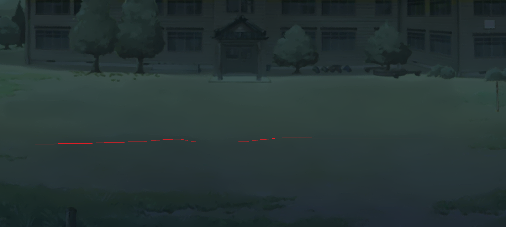  

然后切换到 1224 帧。  
在 100% 缩放下，可以发现衣服上的（光照效果导致的）色带差不多已经擦干净了，但是放大仔细看还是有点残留。  

一个简单的总结，GradFun3 总而言之是比较难调参的。  
thr 控制了 deband 最小的力度，thr*elast 控制了 deband 最大可以抹些什么。  
另外其他可以改的参数都比较多。  

GradFun3 的出场通常是要牺牲大量细节也得抹色带的状况。它的最大效果就如同上一节降噪里，单独用 bilateral 轰纹理的状况。

而另一方面，这个 MINORI 源是一个很好的参考例子，可以播一下这个片，你会发现大部分前景都是类似水彩的触感。

比如说 321 帧，这个暗一点的地面，它上面的纹理可以说是水彩的笔触，也可以说是位深不足导致类似 GIF 的色带。因此要不要 deband 就成为一个两难问题了。

这就回到了本小节开头的提问，对于这类水彩质感背景的画面，是否需要 deband 以及 deband 手段的强弱，是实际压制中需要仔细权衡的点。


## 3. 抗锯齿 Anti-Aliasing

锯齿（aliasing）这个现象想必大家都不陌生，用一个简单的图解的话，就是在斜线区域，因为像素呈方形，所以看上去像一些阶梯。

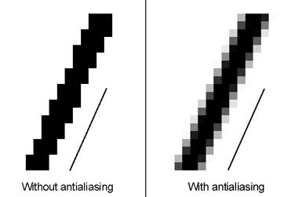

要解决锯齿需要抗锯齿（Anti-Aliasing）处理。  

Anti-Aliasing 的本质就是给梯级之间填充一些灰色，好让它在远处看起来是顺滑的，而不是一个锯子。

> 细心的同学会发现，其实色带和锯齿是很类似的现象，两者都是一个平滑斜线的信息，因为分辨率或者位深有限，而变成的阶梯状。而修正的方法是给阶梯之间填充一些“过渡性”的信息。

### (1). AA 效果

请开一个新的 vpy，运行下面这段代码，切换到 882 帧。  
观察一下 `0` 号输出，源画面什么地方有锯齿出现？

```py
import vapoursynth as vs
from vapoursynth import core
import mvsfunc as mvf

a = R"Z:\CLOCKWORK1_00007.m2ts"
src8 = core.lsmas.LWLibavSource(a)
src16 = core.fmtc.bitdepth(src8, bits=16)

src8.set_output(0)

def aa_process_eedi2(clip):
    w = clip.width
    h = clip.height
    aa_clip = core.std.ShufflePlanes(clip, 0, vs.GRAY)
    aa_clip = core.eedi2.EEDI2(aa_clip, field=1, mthresh=10, lthresh=20, vthresh=20, maxd=24, nt=50)
    aa_clip = core.fmtc.resample(aa_clip, w, h, 0, -0.5).std.Transpose()
    aa_clip = core.eedi2.EEDI2(aa_clip, field=1, mthresh=10, lthresh=20, vthresh=20, maxd=24, nt=50)
    aa_clip = core.fmtc.resample(aa_clip, h, w, 0, -0.5).std.Transpose()
    aaed = core.std.ShufflePlanes([aa_clip, clip], [0, 1, 2], vs.YUV)
    aaed = core.rgvs.Repair(aaed, clip, 2)
    return aaed
 
eedi2_aa = aa_process_eedi2(src16)
eedi2_aa_diff = core.std.MakeDiff(src16, eedi2_aa)

eedi2_aa.set_output(3)
eedi2_aa_diff.std.Expr('x 32768 - 10 * 32768 +').set_output(4)
```

这画面最明显有锯齿的是书页侧面的部分：


其余的玩偶轮廓，还有小女孩，整体都是有一个锯齿的感觉。  

会有这种感觉，主要是因为制作方并非完全没有 Anti-Aliasing。  
他们做出来的效果介乎于完全没有和做好之间（就像色带那样）。  
所以才会有“锯齿感”，但又不是完全锯齿的感觉。

然后，我们切换到输出 `3`，可以看到锯齿几乎都消失了。  

比如说书页顺滑了不少。

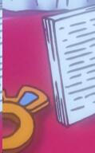

不过，作为抗锯齿的代价，我们会觉得线条变糊了一点，少了一点锐利度。

如果切换到 `4` 号输出，对比抗锯齿前后的 `aa_diff`，我们还能留意到在平面上有一点点噪点的存在。

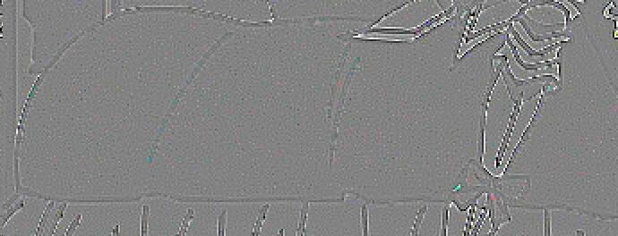

总而言之，抗锯齿的基本副作用就是：  
1. 会抹除一点点高频信息  
2. 会让线条的锐利度下降  

这两点整体来说是不难处理的：  
1 的话，可以通过先降噪，来避免 AA 损伤高频信息。  
2 的话，可以通过补偿性锐化，来补足线条失去的锐利度（而不还原锯齿）。

再延伸一下，AA 在特性上是一个很弱的 blur，或者说是一个低通滤镜。他会糊掉一点点的噪点，但是大部分的噪点和纹理细节等它都不会动。

所以在一般情况下，如果需要保留噪点的话，那就先 denoise，然后 aa，最后将噪点层 mergediff 回去便是。在丢弃噪点层（如 webrip）的状况下，AA 的副作用基本可以无视。

### (2). AA 原理

正如上面所讲，AA 需要给两个阶梯中间补足一点过渡的信息。

于是很久以前的压制者想到利用 *deinterlacing* (反交错滤镜) 来实现这个功能。

交错源的特性就是宽度被保留了，但是高度少了一半。

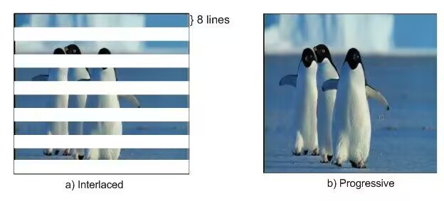

反交错滤镜的工作就是想办法把缺失的一半补回来，所以反交错滤镜的本质也是一个倍高的滤镜。  

而反交错滤镜，比起普通的 resizer 有一个额外的功能，就是它会尝试做一个“连线”的动作。  

我们假设画面有一条斜线，中间缺失的部分，是因为进行 interlacing 的时候被丢弃了。

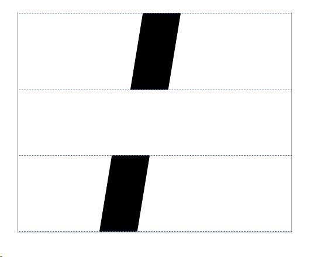  

如果是普通的 resize 的话，它会尝试延长上下的直线，导致接合的地方有一个断裂。  
这个是我们不想看到的。

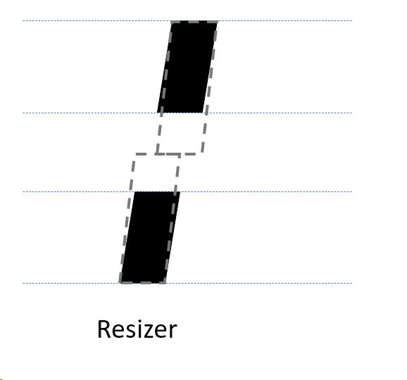

相反，如果是 deinterlacer 的话，它会尝试将黑线断开的部分连接，尝试还原一个连续的线条。  

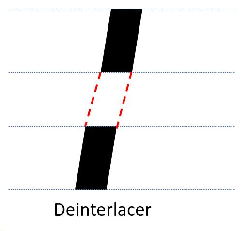

所以我们可以这样利用 deinterlacer：  
假设中间有个空隙，强行让 deinterlacer 补上。

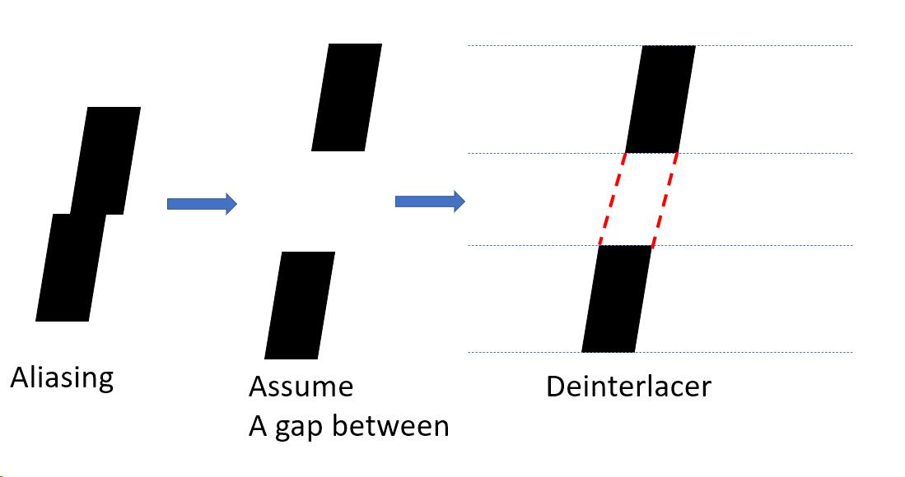

最后再缩回原分辨率，获得一个比之前少一点锯齿感的输出。

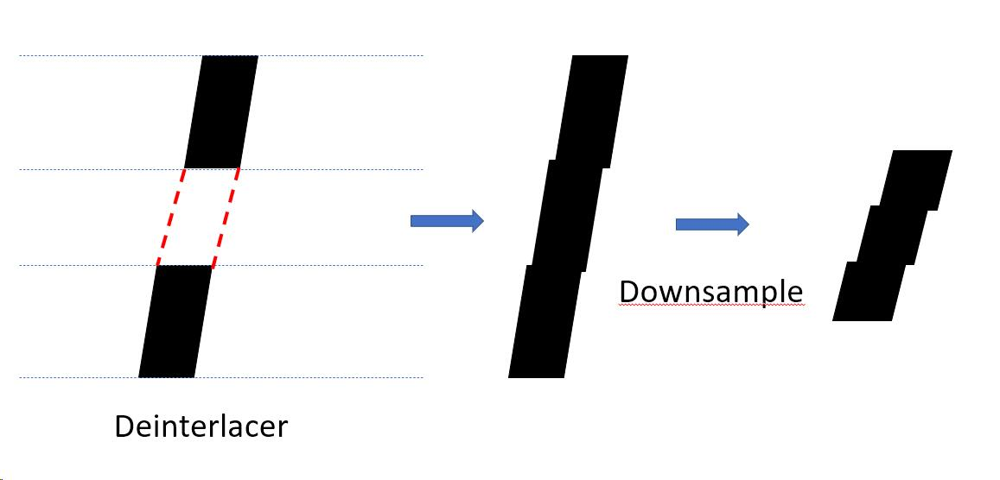  


我们说完原理，接下来就可以看代码了。
```py
def aa_process_eedi2(clip):
    w = clip.width
    h = clip.height
    aa_clip = core.std.ShufflePlanes(clip, 0, vs.GRAY)
    aa_clip = core.eedi2.EEDI2(aa_clip, field=1, mthresh=10, lthresh=20, vthresh=20, maxd=24, nt=50)
    aa_clip = core.fmtc.resample(aa_clip, w, h, 0, -0.5).std.Transpose()
    aa_clip = core.eedi2.EEDI2(aa_clip, field=1, mthresh=10, lthresh=20, vthresh=20, maxd=24, nt=50)
    aa_clip = core.fmtc.resample(aa_clip, h, w, 0, -0.5).std.Transpose()
    aaed = core.std.ShufflePlanes([aa_clip, clip], [0, 1, 2], vs.YUV)
    aaed = core.rgvs.Repair(aaed, clip, 2)
    return aaed
```

`aa_clip = core.std.ShufflePlanes(clip, 0, vs.GRAY)`  
首先，我们只提取 Y 平面进行 AA 处理。

这点非常重要：**不要随便对色度平面进行 AA 处理**。

`aa_clip = core.eedi2.EEDI2(aa_clip, field=1, mthresh=10, lthresh=20, vthresh=20, maxd=24, nt=50)`  
然后我们用一个叫 EEDI2 的滤镜进行一个倍高的处理。

EEDI2 的全称是 Enhanced Edge Directed Interpolation 2。  
它的历史比较长，性能不适合用作处理交错源，但是用作 AA 的话就非常适合。

`aa_clip = core.fmtc.resample(aa_clip, w, h, 0, -0.5)`  
然后，我们将倍高后的画面缩回原始分辨率。

`w` 和 `h` 我们已经提取了，是源的分辨率。

这里 fmtc.resmple 如果写全的话，可以写成 `core.fmtc.resample(aa_clip, w=1920, h=1080, sx=0, sy=-0.5)`

这里跟普通的缩放不一样，我们给 `sy` 设了 `-0.5`，这是为了处理 deinterlacer 带来的像素偏移问题。  
详细原理我们放在下一小节讨论。

在缩放后，我们接了一个 `.std.Transpose()`，将画面转置。

因为第一次的 EEDI2 -> fmtc.resample 只能对画面的 Y 轴进行 AA 处理，所以我们需要转置再对 X 轴进行同样的处理。

`aaed = core.std.ShufflePlanes([aa_clip, clip], [0, 1, 2], vs.YUV)`  
在处理完毕以后，我们将 AA 好的 Y 平面和原来的 UV 平面组合起来。

`aaed = core.rgvs.Repair(aaed, clip, 2)`  
最后用一个 `rgvs.Repair(2)`, 限制一下错误 AA 的可能性。

[EEDI2](https://github.com/HomeOfVapourSynthEvolution/VapourSynth-EEDI2) 可调的参数比较多，上面范例用的是一个祖传的特化 AA 效果的参数组，如今也已经是滤镜的默认值。大家可以直接应用，或者在这基础上修改。

### (3). deint 滤镜的像素偏移

为什么 EEDI 缩小的时候需要加个 `sy=-0.5` 呢？  
在回答这个问题前，我们先来探讨一下倍高滤镜的工作原理。

我们先在 vs 里随便打开一个源，转成 src16，然后加下面一段代码。
```py
double = core.eedi2.EEDI2(src16, field=1)
double.set_output(1)
 
resized = core.fmtc.resample(src16, 1920, 2160, kernel='lanczos', taps=4)
resized.set_output(2)
```
观察一下输出有什么不同，建议挑一些线条比较多的帧来观察。

放大仔细观察，会发现两个画面虽然分辨率一样（都是 1920*2160），但是有一个次像素的偏移。


为什么会存在这样的差别，我们需要介绍一下倍高滤镜的基本原理。  
这里提前插入一点交错相关的知识，如果你觉得难以理解，可以提前看下第 10 章的开头部分。

倍高滤镜的目标输入是交错源，而交错源虽然仍然以帧的方式存储，但实际最小单位却是场。顶场由第 0,2,4,6... 行组成，底场由第 1,3,5,7,... 行组成。

倍高滤镜的目标，就是将这些只有一半分辨率的场，倍高扩展成完整分辨率的帧。

在 EEDI2(field=1) 的情况下，它就认为输入的都是顶场，然后给我们补上底场的画面。

这一过程如下面所示：

```
0             0

              1

2      ->     2

              3

4             4

              5
```

不难发现这一过程中，图像的中心从最开始的 2 变成了 2.5，也就是画面整体向下偏移了 0.5px。

而对于常规的resizer，放大过程图像中心是不变的。

```
             -0.5
0
              0.5

              1.5
2      ->
              2.5

              3.5
4
              4.5
```

因此，如果我们想要将倍高后的画面修正到中心对齐，就需要加上一个 `sy=-0.5`。


上面所说都是对于单平面而言，而如果我们同时对三个平面进行 AA，那么 sy 又该如何给呢？  
可能有同学会说，AA 过程都是独立的，当然是都给 `sy=-0.5` 就行。

这个说法只对了一半，确实 AA 过程是平面独立的，每个平面都应该各自移动 0.5px。但是注意到在调用 resizer 时，所给的 shift 参数的像素距离是以 Y 平面为准的。

这意味着在 YUV420 时，虽然 UV 平面也需要移动 0.5px，但转换到 Y 平面的像素距离时，数值就发生了一定的变化，这时应该给到 `sy=[-0.5, -1.0]`。

相应的，如果是 YUV444 的情况，三个平面的像素距离是相同的，就应该给到 `sy=[-0.5]`。

### (4). 调整 AA 效果

心细的同学可以发现，上面所说的 AA 流程是完全没有可调的部分的。  
不像 deband 和 denoise，我们不能更改 AA 的力度。

而 EEDI2 的参数更多的是更改连线算法的特性，而不是 AA 本身。  
所以以前的压制者们想到通过更改 deinterlacer 来变更 AA 的效果。

除了 EEDI2 外，常用的 deint 算法还有 EEDI3、NNEDI3、以及 Sangnom（Sangnom 放在最后说）。

我们在之前的 EEDI2-AA 示例代码后面加上下面这段代码。
```py
def aa_process_eedi3(clip):
    w = clip.width
    h = clip.height
    aa_clip = core.std.ShufflePlanes(clip, 0, vs.GRAY)
    aa_clip = core.eedi3m.EEDI3(aa_clip, field=1, dh=True, alpha=0.5, beta=0.2, gamma=20.0, nrad=3, mdis=30)
    aa_clip = core.fmtc.resample(aa_clip, w, h, 0, -0.5).std.Transpose()
    aa_clip = core.eedi3m.EEDI3(aa_clip, field=1, dh=True, alpha=0.5, beta=0.2, gamma=20.0, nrad=3, mdis=30)
    aa_clip = core.fmtc.resample(aa_clip, h, w, 0, -0.5).std.Transpose()
    aaed = core.std.ShufflePlanes([aa_clip, clip], [0, 1, 2], vs.YUV)
    aaed = core.rgvs.Repair(aaed, clip, 2)
    return aaed


def aa_process_nnedi3(clip):
    w = clip.width
    h = clip.height
    aa_clip = core.std.ShufflePlanes(clip, 0, vs.GRAY)
    aa_clip = core.znedi3.nnedi3(aa_clip, field=1, dh=True, nsize=3, nns=2, qual=2)
    aa_clip = core.fmtc.resample(aa_clip, w, h, 0, -0.5).std.Transpose()
    aa_clip = core.znedi3.nnedi3(aa_clip, field=1, dh=True, nsize=3, nns=2, qual=2)
    aa_clip = core.fmtc.resample(aa_clip, h, w, 0, -0.5).std.Transpose()
    aaed = core.std.ShufflePlanes([aa_clip, clip], [0, 1, 2], vs.YUV)
    aaed = core.rgvs.Repair(aaed, clip, 2)
    return aaed


eedi3_aa = aa_process_eedi3(src16)
eedi3_aa_diff = core.std.MakeDiff(src16, eedi3_aa)

eedi3_aa.set_output(5)
eedi3_aa_diff.std.Expr('x 32768 - 10 * 32768 +').set_output(6)

nnedi3_aa = aa_process_nnedi3(src16)
nnedi3_aa_diff = core.std.MakeDiff(src16, nnedi3_aa)

nnedi3_aa.set_output(7)
nnedi3_aa_diff.std.Expr('x 32768 - 10 * 32768 +').set_output(8)
```

代码的逻辑跟 eedi2-aa 没有大变化，纯粹是将 eedi2 平替为 eedi3 和 nnedi3 而已。

大家可以比对一下 `3`, `5`, `7` 这三个输出，看看有什么差别。  
有需要的话，也可以用 `4`, `6`, `8` 这几个 aadiff 辅助。

由于 deint 滤镜本身的特性, eedi2-aa 效果通常是最糊的；  
nnedi3 出来的效果最锐，但是 aa 的力度也最弱；  
eedi3 的性质在这个源中比较难体现出来，它的效果介乎两者之间。  

实际上 eedi3 的连线能力最强，针对下图左边这种完全没有 AA 过的线条（我们称为*二值化线条*）的效果最好。

  

所以在实际使用上，比较糊的源我们会选用 eedi2-aa；作画分辨率比较高的我们会选 nnedi3-aa；而特殊情况我们会选用 eedi3-aa。

最后我们讨论下 AA 滤镜的弱点：

第一个可以参考[这里](https://bbs.acgrip.com/thread-8413-1-1.html)，正如观众提醒的，灯子旁边的下水道花了。

我们知道 deint 滤镜会有连线的作用，所以在密集的斜线中，偶然会有错连的情况出现。

AA 操作最后接的 repair(2) 主要是为了修复、弱化这种错误连线的视觉效果。

而另一个弱点的话，大家可以移动到 2159 帧，然后放大到 400%，比对一下源和 nnedi3-aa 的效果。

就算是效果最弱的 nnedi3-aa, 也对细节有明显的破坏，而且并不是什么 AA 效果，大多是变糊，变灰之类的副作用。

主要原因是，deint-AA 处理出现当初，针对的都是一些比较糊的源，原生分辨率最高可能也就 720。  

但是近年多了很多作画精细的番，示例中的 clockwork planet 我们认为它是接近 1080p 的原生分辨率。

所以一开始说到，AA 处理会带有一点点 blur 的副作用，在这里就显示的很明显了。  
虽然在 100% 下差别不算大。

因此在遇到高作画精度的番时，有时候会考虑完全不做 AA，抗锯齿的代价太大，补偿性锐化也不能将上述的细节还原。

### (5). 高强度 AA —— SangNom

先载入源 `MINORI2_00004.m2ts`，然后切换到 1224 帧，观察一下画面有什么瑕疵。

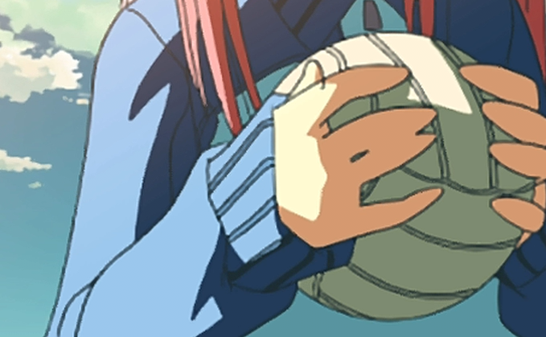

有很难看的锯齿，还有色带。

锯齿的话，大家可以试试用上面教过的 eedi2-aa。  
可以发现锯齿消除不完全，小的锯齿没了，但是大的还在。  

eedi2，eedi3 和 nnedi3 对于强锯齿效果有限。  
对付强锯齿，我们可以用 [SangNom](https://github.com/dubhater/vapoursynth-sangnom)。

SangNom 本质上也是一个 deinterlacer，会用到的参数有两个。

`aa`, 默认是 `aa=48`, 这个我们通常不用动。  
`dh`，默认是 `dh=False`。

```py
aa_clip = src16
aa_clip = core.sangnom.SangNom(aa_clip, aa=48, dh=False)
aa_clip.set_output(1)
```

观察一下输出画面的分辨率和线条的变化。  
正常的话，会感觉到有 AA 效果，但还是有锯齿残留。

一来我们只对 Y 轴进行了 AA；二来呢，大家能注意到分辨率还是 `1920*1080` 吧，不是之前用了 EEDI2 后的 `1920*2160`。

deinterlacer 普遍都会有一个 `dh` 的参数，*dh* = *double height*。  
`dh = True` 的时候，原始数据当做上半场，插值出下半场，  
而 `dh=False` 的时候呢，deint 的作用是这样的。
```
    0    0    0
    1         1*
    2 -> 2 -> 2
    3         3*
    4    4    4
    5         5*
```

首先把源分为上半和下半场，然后丢弃下半场，最后重新插值出下半场（1*, 3*, 5*）。

由于丢弃了一半的数据之后重新“制造”，所以会有抗锯齿的效果。  
但是同样的，错误插值的部分会有明显瑕疵。

大家可以试试完整版的 SangNom(dh=False) AA。
```py
aa_clip = src16
aa_clip = core.sangnom.SangNom(aa_clip, aa=48).std.Transpose()
aa_clip = core.sangnom.SangNom(aa_clip, aa=48).std.Transpose()
aa_clip = core.rgvs.Repair(aa_clip, src16, 2)
aa_clip.set_output(2)
```


可以看到整体有抗锯齿效果，但是球和手指有一些难以描述的瑕疵。

为了能让 sangnom 能用，我们需要有方法去限制他的瑕疵。

第一个方案是以前 avs 时代就流传下来的：  
 - 先利用 eedi2/nnedi3 放大到 1.5 x 1.5 倍大小
 - 然后做 SangNom AA
 - 最后缩回原始分辨率

大家运行一下看看效果如何。  
正常的话，可以看到瑕疵少了，手那里比之前表现好。

```py
w = 1920
h = 1080
uw = w * 3 // 2
uh = h * 3 // 2
aa_clip = core.eedi2.EEDI2(src16, field=1)
aa_clip = core.fmtc.resample(aa_clip, w, uh, sy = [-0.5, -1]).std.Transpose()
aa_clip = core.eedi2.EEDI2(aa_clip, field=1)
aa_clip = core.fmtc.resample(aa_clip, uh, uw, sy = [-0.5, -1]).fmtc.bitdepth(bits=8)
aa_clip = core.sangnom.SangNom(aa_clip, aa=48, dh=False).std.Transpose()
aa_clip = core.sangnom.SangNom(aa_clip, aa=48, dh=False)
aa_clip = core.fmtc.resample(aa_clip, 1920, 1080)
aa_clip = core.rgvs.Repair(aa_clip, src16, 2)
```

这里简单介绍一下代码：

`uw = w * 3 // 2`  
`uh = h * 3 // 2`  
`uw`, `uh` 这里指定了放大的幅度，正如前面说的，我们先设 1.5 倍。

`aa_clip = core.eedi2.EEDI2(src16, field=1)`  
`aa_clip = core.fmtc.resample(aa_clip, w, uh, sy = [-0.5, -1]).std.Transpose()`  
`aa_clip = core.eedi2.EEDI2(aa_clip, field=1)`  
`aa_clip = core.fmtc.resample(aa_clip, uh, uw, sy = [-0.5, -1])`  
这里的四行跟前面说的有点类似。

都是先用 EEDI2 (或者 nnedi3) 倍高，然后缩回去目标的分辨率（1.5x）并且修正偏移。

`.fmtc.bitdepth(bits=8)`  
是一个优化步骤。

大多数 deint 滤镜是设计给 8bit 输入用的，给 16bit 输入除了拖慢以外，不会有什么画质上的帮助。  
另一方面 AA 不太受位深精度影响。

`aa_clip = core.sangnom.SangNom(aa_clip, aa=48, dh=False).std.Transpose()`  
`aa_clip = core.sangnom.SangNom(aa_clip, aa=48, dh=False)`
接下来的就跟之前一样。

`aa_clip = core.fmtc.resample(aa_clip, 1920, 1080)`  
再缩回去原分辨率。

这里思考一个问题，为什么不需要给 `sy=-0.5` 呢？

<details> <summary>参考答案</summary> 因为前面 eedi2 引入的偏移已经修过了，SangNom 使用的 dh=False 并不会引入偏移。 </details>

事实上只有 dh=True 倍高的时候才会引入像素偏移，在 dh=False 丢弃半场再插回半场的情况下，并不会改变最终分辨率，也不会引入偏移。


这个 SangNom 的使用例子，能够调节的参数是 `uw`, `uh`。  

作为一个基本规则：  
AA 处理的**输入分辨率越高**，  
AA 效果的**强度越弱**。

假如我们将 `uw` 设为 `w*2`，放大 2 倍的话，可以观察到 AA 效果变弱了一点，但还是基本足够消除这画面的锯齿。  

而另一方面，SangNom(dh=False) 的瑕疵主要来自丢弃半场的特性，所以可以透过放大来缓解一部分瑕疵。  
因为可以让下半场的信息“复制”到邻接的两行里，避免了下半场信息的完全丢失。

既然多了调整分辨率这个操作，大家想象一下，有什么方法可以增强 SangNom 的 AA 效果吗？

```py
w = 1920
h = 1080
uw = w * 3 // 2
uh = h * 3 // 2
dw = w * 3 // 4
dh = h * 3 // 4
aa_clip = core.fmtc.resample(src16, dw, dh)
aa_clip = core.eedi2.EEDI2(aa_clip, field=1)
aa_clip = core.fmtc.resample(aa_clip, w, uh, sy = [-0.5, -1]).std.Transpose()
aa_clip = core.eedi2.EEDI2(aa_clip, field=1)
aa_clip = core.fmtc.resample(aa_clip, uh, uw, sy = [-0.5, -1]).fmtc.bitdepth(bits=8)
aa_clip = core.sangnom.SangNom(aa_clip, aa=48, dh=False).std.Transpose()
aa_clip = core.sangnom.SangNom(aa_clip, aa=48, dh=False)
aa_clip = core.fmtc.resample(aa_clip, 1920, 1080)
aa_clip = core.rgvs.Repair(aa_clip, src16, 2)
aa_clip.set_output(5)
```

其实可以先缩小一下源，然后再用 EEDI2 来放大，接 SangNom AA 的步骤。

这里先将源缩小到 dw * dh，比如说 0.75 倍，然后用 EEDI2 放大到 1.5 倍，就能获得比先前更强的 AA 效果。

当然除非做一些老番，强力 AA 是不会怎么用上的。  
我们讲 SangNom 是因为偶然会遇到这种，低分辨率强行 upconv 到 BD 1080P 的烂源。

那么，我们可以连续做两次 AA 来增强 AA 的效果吗？

连续多次 AA 是可以的，不过每 AA 一次，线也会更糊一些，瑕疵也更容易累积。

所以要用的小心（比如说较小的文字，书本报章之类的，很容易受到多次 AA 的摧残）。


## 4. 瑕疵修复流程

比起独立的瑕疵处理步骤，一个完整脚本还需要考虑各个步骤的先后次序和连接。

按照本章学到的内容，deband, denoise 和 AA 应该按什么次序处理呢？

AA -> denoise -> deband ?  
denoise -> deband -> AA ?

deband 如同前面说的，要放在 denoise 之后，但是 AA 就有点尴尬了。

AA 放在 denoise 前的话，可能会影响被噪点干扰（AA 有微弱的 blur 效果）。  
放在 deband 后面的话，又怕 AA 会不会干扰 deband 的 dither 效果（dither 也是一种噪声）。

所以这里更推荐先 denoise，然后分别对 nr16 进行 deband 和 AA，最后找个办法将 AA 和 Deband 两者融合回来。  
毕竟 Deband 应该只作用于平面，AA 只作用于线条，两者之间没有依赖关系。

> 在高阶处理中，就不再限于这样的顺序，因为可以通过 mask 等手段只对希望的部分进行处理。


这里分享一个 webrip 的范例脚本 [example.vpy](./example.vpy)。

Line 1-26 都是已经教过的内容。  
denoise, 2pass-nr-deband（Y 比较强，UV 弱一些）+ LimitFilter 限制效果。  
然后是一个 Y 平面的 EEDI2-AA，后接一个 repair 保底。

```py
# Merge AA and Deband
dbedY = core.std.ShufflePlanes(dbed, 0, vs.GRAY)
mergedY = mvf.LimitFilter(dbedY, aaedY, thr=1.0, elast=1.5)
merged = core.std.ShufflePlanes([mergedY, dbed], [0,1,2], vs.YUV)
```
新加的内容是这部分。

我们先抽出 deband 后的 Y 平面，然后用 LimitFilter 对两者 dbedY 和 aaedY 做一个融合。

这其实就是上一章提到的 LimitFilter 融合线条与非线条的用法，其中 dbedY 对应 non-edge, aaedY 对应 edge。

`thr=1.0, elast=1.5` 是一个参考的参数，可以将大部分 AA 效果融合到 dbedY 身上，根据实际情况也可以微调一下。

最后 ShufflePlanes 将融合好的 Y 和 UV 组合回来，完工。

脚本最后几行是配合 OKEGui 使用的代码，大家可以在后面的章节学到。

这里留一个思考题，这个范例脚本并没有加上之前教过的补偿锐化和 dering 步骤，大家可以想想看加在哪里合适。


最后，我们回顾一下本章开头问大家的问题。

> 处理瑕疵是必定有副作用的。  
> 为了消除瑕疵，可以对画质做出多大的牺牲呢？

目标是肉眼不容易察觉程度的牺牲的话，那么始终会遇到一些让人进退两难的烂源。  
回答不能有牺牲的话，要实现这点可能就要靠研发更好的滤镜和魔法了。

另外就是，接受瑕疵存在，不强行操作，只确保二次压缩不会更加恶化问题也是一个需要考虑的选项。
