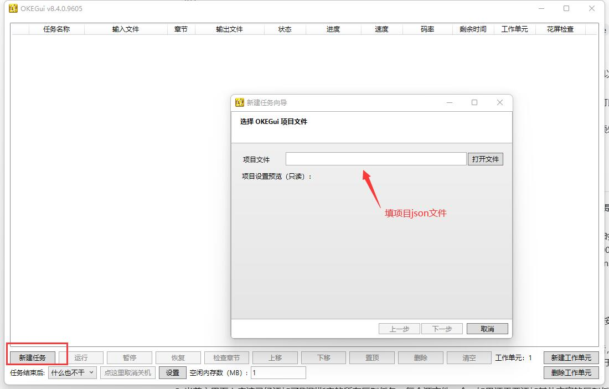
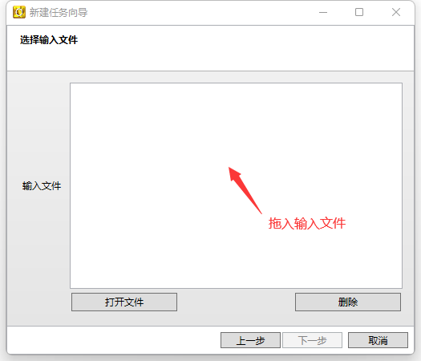
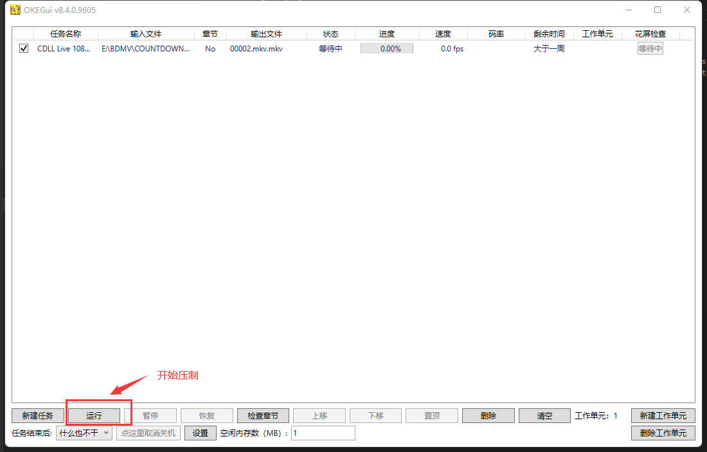
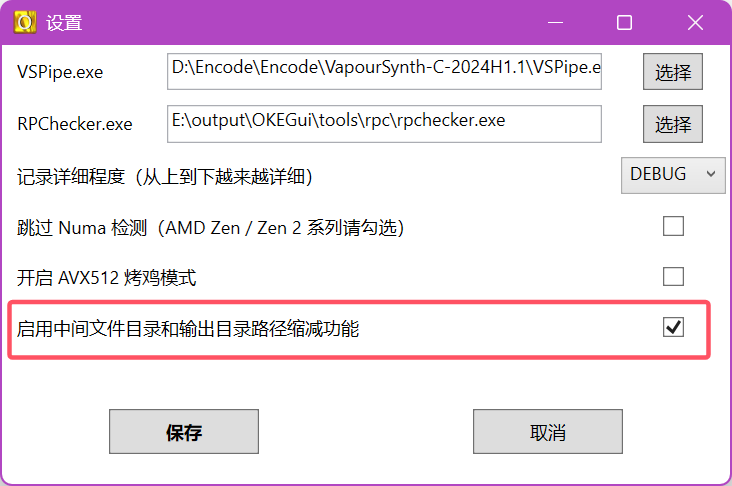
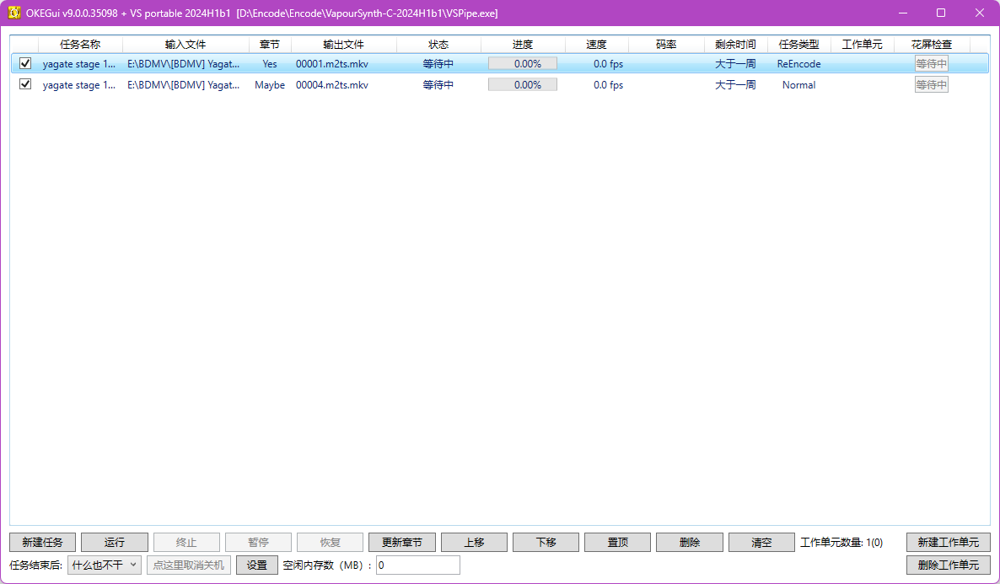

# 第十一章 OKEGui的使用

本章介绍 VCB-Studio 的压制生产力工具 OKEGui。

## 1. vpy脚本与项目配置文件的编写

VCB-Studio 的生产力工具 [OKEGui](https://github.com/vcb-s/OKEGui)，全名 One Key Encode Gui，用于全自动压片。你可以在[这里](https://github.com/AmusementClub/tools/releases)下载到已经打包好的版本，解压即用。在 OKEGui\examples 中提供了多个配置文件样例，可以作为参考。

OKE 的功能比较复杂，因此本小节只讲基本用法，剩下的高级功能放到后续小节讲解。

需要注意的是，OKE 的鲁棒性不是很好，只保证按规范进行操作的结果。

每个 OKE 任务需要总监准备 2 个文件，一个 vpy 脚本文件和一个项目配置文件。  
这 2 个文件需要放在同目录下，一般放在对应 BD 的根目录。

### (1). 预处理脚本文件（vpy）

vpy 脚本文件和正常脚本一样，但是会有几个由 OKEGui 读取的固定 tag。

#### (1) `#OKE:INPUTFILE`

这是唯一一个**必选 tag**，作用是指定输入文件。  

接下来一行必须是“变量 = 文件名”的格式，比如这样：

```py
#OKE:INPUTFILE
a = "00000.m2ts" # will be replaced
src = core.lsmas.LWLibavSource(a)
```

OKE 在执行任务的时候，会把文件名自动替换为指定的输入文件。

#### (2) `#OKE:DEBUG`

这是一个**可选 tag**，用于处理本组祖传的 debug 开关。  

```py
#OKE:DEBUG
Debug = 1
if Debug:
    res = mvf.Preview(res)
else: res = mvf.Depth(res,10)
```

写脚本的时候，`Debug=1`，输出 RGB；压制的时候，`Debug=0`，输出 YUV 10bit。

OKE 读取这个 tag，压制的时候将其替换为 `None`，保证压制时永远执行 `else` 分支。

#### (3) `#OKE:PROJECTDIR`

用来获取 vpy 脚本文件所在的绝对路径。

也是一个**可选 tag**，一般用于加载额外的脚本或滤镜。

加载名为 custom.py 的脚本：
```py
import sys
import os

#OKE:PROJECTDIR
projDir = '.'
sys.path.insert(1, projDir)
import custom
```

加载名为 `libcustom.dll` 的滤镜：
```py
import sys
import os

#OKE:PROJECTDIR
projDir = '.'
sys.path.insert(1, projDir) 
core.std.LoadPlugin(os.path.realpath(os.path.join(projDir, 'libcustom.dll')))
```

当然，需要确保额外加载的脚本和滤镜和 vpy 脚本同目录。

这个功能用的时候很少。

#### (4) `#OKE:MEMORY`

注意，这是一个**已经弃用**的**可选 tag**。

在一些旧脚本中，会见到：
```py
core.num_threads = 8
#OKE:MEMORY
core.max_cache_size = 8000
```
`num_threads` 指定运行时的线程。  
`max_cache_size` 指定运行时的内存。  

前者现在不推荐指定，让 VS 自己管理线程池比较好一点。

后者，在 VS API4 时代，已经不需要手动指定内存，都是让 VS 自动收敛。

如果设置这个 tag，OKE 会根据主界面“空闲内存数”，和现有的任务数，来设置 `max_cache_size`。


当然，现在不用这个 tag 了，“空闲内存数” 直接填任意小于 2000 的数就行。  
大于 2000 的话 OKE 会在启动任务的时候检查系统是否有那么多空闲内存，在压制中途加任务时会带来一些不必要的麻烦。

#### RP Checker

OKE 还提供 RPC（RP Checker） 功能。

在压制完成后，用成品和源跑一个 PRC，判断是否花屏 。

如果使用这个功能，需要在 vpy 脚本里输出作为 ref 的源视频：
```
res.set_output()
src8.set_output(1)
```

一般用 `src8` 或者 `src16` 即可，**源视频必须输出到1节点**。

另外还需要注意：

1. 必须有相同的帧率和帧数  
如果成品做了 IVTC/deinterlace/trim/splice 之类的操作，则为 RPC 准备的 clip 也需要做

2. 必须有相同的画面内容  
如果做了对画面改动较大的操作，例如 crop/textsub 等操作，则为 RPC 准备的 clip 也需要做

3. 分辨率和 bitdepth 不重要，因为 RPC 会自动转为与成品相同的规格

### (2). 项目配置文件（json 或 yaml）

项目配置文件，支持 json 和 yaml，下面以 json 为例。

大家可以参考 `OKEGui\examples\demo.json`，本小节只讲基础的部分。

需要注意，以下的 tag 名字是严格区分大小写的。另外 `bool` 类型的 tag 不能写 `1/0` 必须写 `true/false`。

+ `Version`

    **必须设置为 `3`**，此时会强制检查 VS 环境版本，即必须搭配我们的 portable 包使用。

+ `VSVersion`

    指定 portable VS 包的版本。

+ `ProjectName`

    项目名，可随意填写，用于在 OKE 里区分用的脚本。  
    一般写：`xx main`，`xx op`， `xx pv` 之类的。

+ `EncoderType`

    编码器类型，可以选 `x264`、`x265`、`svtav1`。

+ `Encoder`

    指定编码器路径，可以使用相对或绝对路径。  
    可以不指定，这时选用 OKE 自带的。  
    一般除非要测试新编码器，否则都用 OKE 自带的就行。

+ `EncoderParam`

    编码器参数，不需要写 `--y4m` 和 `--output`。

+ `ContainerFormat`

    压制成品封装容器，可以选 `mp4` 或 `mkv`。

+ `AudioTracks`

    这是一个列表，其中每一项表述源文件的一个音轨，源文件包含几条音轨，这个列表就必须有几项。

    每项有这些功能：

    - `OutputCodec`

        输出格式，可选 `flac`、`aac`、`ac3`、`eac3` 或 `dts`。  
        其中 `ac3`、`eac3` 和 `dts` 只能作为抽取原盘相同编码音轨使用，不支持重编码为这些格式。

    - `Bitrate`

        使用 cvbr 模式编码 aac，当输出格式为 `aac` 时有效，可以指定目标码率，默认为 `192`。

    - `Quality`

        使用 tvbr 模式编码 aac，当输出格式为 `aac` 时有效，可以指定目标质量。  
        该选项不能和 `Bitrate` 选项同时启用。当输出格式为 `aac`，但没有指定两个编码模式中的任意一个时，默认将使用 cvbr 模式，192 码率。

    - `MuxOption`

        封装格式，可选 `Default`、`Mka`、`External`、`ExtractOnly` 或 `Skip`。

        默认为 `Default`，表示随视频一起正常封装。  
        `Mka` 表示封装在 MKA 文件中。  
        `External` 表示外挂，会给文件名加上 CRC32。一般只在处理需要外挂音轨的 Menu 时使用。  
        `ExtractOnly` 只做抽取，仅用于测试。  
        `Skip` 直接不抽取。  

    - `Language`

        轨道语言，默认为 `jpn`，可选 `eng`、`chi` 等等。

    - `Name`

        轨道名称，多音轨时可以设置。  
        例如 `Main`、`Commentary`、`2.0ch`、`5.1ch` 等等。

+ `SubtitleTracks`

    字幕轨列表，其中每一项表述源文件的一个字幕，当源有 PGS 字幕时才会用。

    与音轨类似，有 `MuxOption`，`Language`，`Name` 子项。

+ `InputScript`

    输入 vpy 脚本的文件名。  
    注意，脚本文件**必须**和 json 文件放在**同一目录**下。

+ `InputFiles`

    这是一个可选的列表，其中每一项是一个字符串，用于指定待压制的源文件路径，例如 `"BDMV\\STREAM\\00000.m2ts"`。支持相对路径和绝对路径，相对路径以 json 文件所在目录为基准。

    在载入 json 时会有一个选择输入文件的步骤，如果填写了该字段，这些源文件会直接在这个界面显示出来；如果没有填写，则可以手动拖入源文件。

+ `Fps`

    脚本输出的帧率，可选 `1.0`、`23.976`、`24.000`、`25.000`、`29.970`、`50.000`、`59.940`。

    当帧率不是上述七种之一时，使用 `FpsNum` 和 `FpsDen` 指定。

+ `Rpc`

    表示是否在压制完成后执行 RPC，可选 `true` 或 `false`。  
    启用 RPC 时 vpy 脚本需要输出 ref 视频。

### (3). 单集配置文件（json 或 yaml）

单集配置文件，又称 “小 json” 文件，同样支持 json 和 yaml 格式，可以参考 `OKEGui\examples\00001.m2ts.json`。

如果说项目配置文件是描述一类使用相同处理的源，那单集配置文件就是对每个源进行更细致的配置。

单集配置文件需要放在源文件同目录，并改名匹配源文件。比如源文件为 `00001.m2ts`，同目录下单集配置文件命名为 `00001.m2ts.json`。

+ `VspipeArgs`

    这是一个列表，其中每一项是一个字符串，形式为 `"arg=value"`，表示一个参数和相应的值，例如 `"op_start=8000"`。  
    这些参数将在压制时传给 vspipe，脚本里可以把它们视为全局变量接收。

    由于这些参数仅在压制时才能看到，对于预览和调试脚本都比较困难，因此现在已经不推荐使用这项功能。  
    现在更推荐在脚本里使用 python 功能解析输入文件路径，以此区分不同输入文件，进行定制化处理。

+ `EnableReEncode` 等

    这些参数用于 Re-Encode 功能，具体见第 7 小节的介绍。

### (4). OKE运行任务

OKE 任务需要以一个完整视频为基本单位。遇到肉酱和连体，需要先转为 1 集一个 mkv 文件来压制。

用法比较简单：





如果需要多开，点击右下角“新建工作单元”。

如果载入任务出错，或者压制过程中出错，需要重新添加任务。

压制完成后，json 文件所在目录下会有一个名为 `output` 的目录。  
包含所有成品文件，如 MKV、MKA 和 MP4 等。  
如果花屏检查未通过，RPC 结果文件也将出现在 `output` 里。

OKE 还会创建 `X_` 目录，这里 `X` 是输入文件所在盘符，该目录用于保存压制过程的中间临时文件。

### (5). 路径缩减功能

为了避免不同卷 BD 的文件混淆，OKE 会根据输入文件的有效路径，在输出目录和中间文件目录里创建子目录。具体来说会先去掉 `BDBOX/BDROM/BD/BDMV/STREAM/BD_VIDEO` 等无效的通用路径，将剩余的有效路径部分作为子目录。  
比如输入文件路径为 `E:\[BDMV][ゆるキャン△ SEASON３][Vol.1-Vol.3 Fin]\[BDMV]ゆるキャン△ SEASON３Vol.1\BDMV\STREAM\00004.m2ts`，那它在输出目录和中间文件目录中的子目录将会是 `[BDMV][ゆるキャン△ SEASON３][Vol.1-Vol.3 Fin]\[BDMV]ゆるキャン△ SEASON３Vol.1`。  
这一做法虽然避免了文件混淆，但如果 BD 目录层级较多，可能导致输出目录和中间文件目录的路径十分冗长，甚至超过 Windows 的路径长度限制，进而导致部分压制工具报错。

OKE 提供了路径缩减功能，可以在全局设置里启用，当前默认就会启用该功能。注意该设置只对更改设置后载入的任务生效，当前已有的任务在载入时就已经确定了输出和中间文件路径，无法更改。



在开启路径缩减功能后，OKE 会对输入文件的有效路径进行判断，如果有效路径只有一个层级或者最后一层路径里包含有卷号信息，那么此时会只保留最后一层路径。  
其他情况会保留最后一层路径，同时在前面加上由剩余前缀路径计算得到的 CRC32 hash 值，用于避免不同 BD 间最后一级有效路径命名冲突。

通过 hash 压缩路径可能会导致最后整理文件时难以判断成品来自哪卷 BD，OKE 会在输出目录里生成一个名为 `ReducePathMap.log` 的记录文件，保存 hash 和原始路径的映射关系，可以通过这个文件来查看成品的出处。  
为了提高效率，记录文件里的映射关系条目不会进行严格的去重，同一卷 BD 的多个输入文件可能会记录下多个重复的映射关系。


## 2. OKE Gui界面使用指南



注意：本小节需要 OKE 版本 >= `9.0.0`，低版本缺少部分功能，并且某些按钮功能有问题。

### (1). OKE中相关概念解释

+ `任务 (Task)`

    从单个源（例如 m2ts）到成品（例如 mkv）的整个制作过程。OKE 主程序界面的列表里的每一行就是一个任务。

+ `工作步骤 (Job)`

    每个任务会被分解成多个工作步骤，并依次执行。  
    目前完整的执行顺序为：  

    - (1). 获取视频信息、检查脚本
    - (2). 准备时间码 / 章节文件 / qpfile
    - (3). 分析并检查音轨、字幕轨信息
    - (4). 抽取音轨、字幕轨
    - (5). 音轨、字幕轨去重去空
    - (6). 音轨转码
    - (7). MKA 封装
    - (8). 视频压制
    - (9). 最终封装
    - (10). RPC 检查

+ `工作单元 (Worker)`

    后台负责具体执行任务的线程，一个工作单元里只能同时执行一个任务。  
    工作单元的数量决定了当前可以并行执行的任务数，有几个工作单元就能允许几个任务同时进行。

+ `选中任务`

    在任务列表上点击一行使其高亮，即选中该任务。  
    所有对单个任务的操作都需要先选中一个任务。

+ `勾选任务`

    任务列表上每行开头都有一个勾选框，打钩即勾选上该任务。  
    所有批处理的操作都只对打钩的任务生效。  
    只有不在运行中状态的任务才能被勾选。

### (2). OKE Gui界面功能

+ `运行 / 终止 / 暂停 / 恢复`

    这四个按钮控制 OKE 的状态。  
    - 当 OKE 处于空闲并且任务列表有被勾选的“等待中”任务时，可以点击“运行”，启动 OKE 开始压制。
    - 当 OKE 处于运行时，将从上到下，把被勾选的“等待中”任务依次分到所有空闲的工作单元。  
    - 当 OKE 处于运行/暂停时，可以使用“终止”强行结束所有工作单元的任务。终止有小概率失败，一般再次点击即可。  
    - 当 OKE 处于运行时，可以使用“暂停”暂时停下所有工作单元的任务。  
    - 当 OKE 处于暂停时，可以使用“恢复”继续所有工作单元的任务。

+ `工作单元数量`

    工作单元数量会显示两个值，外面的是当前设定的工作单元数量，括号里的是后台运行中的工作单元数量。

+ `新建工作单元 / 删除工作单元`

    新建和删除只会更改当前设定的工作单元数量。  
    如果 OKE 处于运行状态，新建工作单元会立刻生效，找出下一个待压制任务，立刻开始执行。  
    如果 OKE 处于运行状态，删除工作单元会延迟生效。如果后台工作单元数量大于设定的工作单元数量，超过的部分会在结束当前任务后自行退出。  
    使用“终止”可以立刻清空所有后台工作单元。

+ `上移 / 下移 / 置顶`

    只对“等待中”的任务生效，可以改变当前选中任务的排序，越上方的任务会越先执行。

+ `删除`

    对非运行中的任务生效，将当前选中任务从列表中删除。

+ `清空`

    对非运行中的任务生效，将当前被勾选的所有任务从列表中删除。

+ `更新章节`

    更新当前被勾选且是“等待中”的任务的章节状态。  
    在载入任务时，OKE 会对章节状态做一个初步检测，会有如下状态：外挂章节（Yes）、MKV 源且内含章节（MKV）、有 BD 结构（Maybe）。  
    如果载入任务时忘了放置外挂章节，可以在开始压制前放置好章节，使用“更新章节”重新检测章节状态。

+ `空闲内存数`

    该功能已经弃用，建议直接填 0。


## 3. 音轨的处理

除了前一小节提到的基础音轨功能，OKE 还提供以下功能：空音轨和重复音轨的检测、可选音轨、音轨重排序、有损音轨压制、默认轨道标志的处理。

### (1). 空音轨和重复音轨的检测

OKE 可以自动检测空音轨和重复音轨，在封装成品时将它们删去。在编写配置文件时，不用判断是否是空音轨和重复音轨，都当做正常封装来处理，OKE 会自动决定是否保留。

### (2). 可选音轨

在一些新番中，往往不再使用空音轨和重复音轨来处理评论音轨的问题，而是直接使用不同数量的音轨。这就造成，一个项目配置文件无法兼容所有集数的情况。

OKE 采用可选标签 `Optional` 来处理这个问题。对于每条音轨，都可以设置 Optional 标签。如果为 true，则在原盘不存在该条轨道时直接忽略，而不报错。

以下用法可以兼容一条主音轨，和一条主音轨加上一条评论音轨的情况。

```json
"AudioTracks" : [{
    "OutputCodec" : "flac",
    "Name" : "Main Audio"
},{
    "OutputCodec" : "aac",
    "Bitrate" : 192,
    "Name" : "Audio Commentary",
    "Optional" : true
}]
```

需要注意的是，如果有多条轨道均标记为 `Optional = true`，则要求它们要么都存在，要么都不存在。

### (3). 音轨重排序

默认情况下，成品音轨的封装顺序与原盘中的顺序相同，但少数情况下这种顺序并不是我们希望的。

OKE 提供了一种重新排序的方式，对于每条音轨，可以设置 `Order`。Order 是一个非负整数，OKE 会按照 Order 对音轨进行稳定的升序排序，即更小 Order 的轨道会在前面。

默认情况下，所有音轨有最大的 Order，因此如果希望将某一音轨提到最前面，只需要设置 `Order = 1` 即可。

### (4). 有损音轨压制

OKE 支持编码音轨为 AAC，但正常情况下只对无损音轨生效，有损音轨只能保持原状。根据整理规范，对于码率 >= 512kbps 的有损音轨，需要二压为更低码率的 AAC。

OKE 提供了有损音轨压制的方式，对于每条音轨，可以设置 `Lossy` 标签。如果为 true，则当源音轨为有损编码格式时也可重编码为 AAC。

需要注意的是，并非所有有损格式都能二压。目前已经支持 eac3 格式的二压，但不支持 aac 到自身的二压。

### (5). 默认轨道标志

OKE 会自动调整各音轨的默认轨道标志，只有正常封装的第一条音轨被标记为 `yes`，其他所有音轨，包括 mka 中的音轨都会被标记为 `no`。这样可以避免挂载 mka 时同时解码两条音轨，在部分播放环境下出错的问题。


## 4. 字幕的处理

与音轨类似，对于字幕轨，OKE 提供以下功能：空字幕轨的检测、可选字幕轨、字幕轨重排序、默认轨道标志的处理。

前三个功能与音轨完全相同，字幕轨也同样支持 Optional 和 Order 标签功能，不再赘述。

关于默认轨道标志，与音轨不同，原盘的字幕轨往往是日文或者英文，因此均默认标记为 `no`，这样播放时不会自动挂载字幕轨。

除了原盘的 PGS 字幕，OKE 也能识别 ass 和 srt 字幕，但是不支持封装，只能设置 `MuxOption = Skip` 来丢弃。这一功能在压制 webrip 时会用到。


## 5. 章节的处理

OKE能够自动处理以下 3 种形式的章节：
1. 输入文件为 `.m2ts`，且保持了原盘目录结构，OKE 会自动查找对应的 mpls，并提取章节封入成品。
2. 输入文件为 `.mkv`，且其中内封了章节，OKE 会自动提取章节并封入成品。
3. 外挂同名 `.txt` 章节文件，比如输入文件为 `00001.m2ts`，同目录下有同名章节 `00001.txt`，OKE 会自动提取章节并封入成品。

当某些情况同时成立时，外挂章节的优先级更高。

除了以上基础功能，OKE 还支持：指定章节语言、重命名章节标题、根据章节设置关键帧、章节检查和修正。

### (1). 指定章节语言

默认情况下，OKE 总是设置章节语言为 eng。有时我们会手动填写章节日文标题，此时需要设置语言为 jpn。可以通过给外挂 txt 字幕添加语言后缀来实现，比如输入文件为 `00001.m2ts`，同目录下章节命名为 `00001.jpn.txt`，这样 OKE 就会读取语言标签，并在封装时设置为 jpn。

### (2). 重命名章节标题

对于连体盘，经切割后，除了第一部分，后面部分的章节标题都不是从 `Chapter 01` 开始的。OKE 支持重命名章节标题，通过 `RenumberChapters` 来设置。在设置为 true 时，所给章节会从 `Chapter 01` 开始重新命名。重命名后，章节语言会被强行置为英语 eng。

### (3). 根据章节设置关键帧

OKE 会利用章节在各个章节点处设置关键帧。具体方式为，根据章节确定章节点的帧号，生成 qpfile 给编码器，指定章节点为关键帧。

注意，这个功能会复写 qpfile 参数，因此自己在编码参数中设置的 qpfile 参数实际上无效。由于 qpfile 依赖于章节，需要特别注意章节的正确性，原则上必须在压制前修改章节，而不能在压制后修改。

### (4). 章节检查和修正

OKE 会章节作以下检查和修正：

 - 丢弃视频末尾 1 秒内的章节（一般是指向最后黑屏的无用章节）
 - 如果第一个章节时间戳为 0，第二个章节时间戳与其相差小于 100 毫秒，第二个章节会被丢弃（一般来自 mkvmerge 切割）
 - 如果触发了上一条修正，会对章节标题进行重命名
 - 章节序号重排序（对章节内容无影响，对应章节文件中 CHAPTERxx= / CHAPTERxxNAME= 这部分）
 - 如果最后章节只剩一个条目且时间戳为 0，输出成品将不带章节

OKE 会对以下情况进行提示，任务列表的章节状态会显示 Warn：

 - 视频末尾 3 秒内有章节
 - 第一个章节时间戳不为 0
 - 使用外挂章节但触发了开头章节去重

如果压制完成后发现章节状态为 Warn，一般都是存在问题，需要手动检查修正。


## 6. VFR功能

OKE 支持动态帧率（VFR）视频的压制。在压制 VFR 时，不再需要指定帧率，但是需要设置 `TimeCode` 为 true 来开启 VFR 功能。

开启 VFR 压制时，OKE 需要获取时间码文件 `.tcfile`，并在封装时写入时间码。与外挂章节文件类似，将时间码文件放到输入文件同目录并改名匹配。比如输入文件为 `00001.m2ts`，同目录下时间码文件命名为 `00001.tcfile`。

事实上，由于 OKE 的压制流程中，在实际压制前会先运行 `vspipe -i` 来获取信息，我们可以在 vpy 脚本中实时生成 tcfile。

```python
#OKE:INPUTFILE
a="00000.m2ts"
...
# VFR splice
import pathlib
path = pathlib.Path(a)
res = mvf.VFRSplice([res_a, res_b], tcfile=str(path.with_suffix('.tcfile')))
```


## 7. Re-Encode功能

注意：本小节需要 OKE 版本 >= `9.0.0`

OKE 支持重压片段 Re-Encode 功能，可以仅压制视频的部分片段，并和旧版压制成品进行合并。

Re-Encode 功能需要使用单集配置文件，以下所有参数需要写到单集配置文件里，可以参考 OKEGui\examples\00001.m2ts.json。

+ `EnableReEncode`

    设置为 `true` 时开启 Re-Encode 功能，后续所有参数仅在开启后生效。  
    载入到任务列表后，会在任务类型里显示为 `ReEncode`。

+ `ReExtractSource`

    是否重新从源文件抽取音轨、字幕轨等，默认为 `false`。

    `false` 时，所有非视频内容将从旧版压制成品继承，json 里的音轨、字幕轨配置无效。不过仍然会重新获取章节，重新获取的章节仅用于生成 qpfile。此时要求旧版压制成品必须是 mkv 格式。

    `true` 时，只有视频轨会从旧版压制成品获取，其他内容将根据 json 里的音轨、字幕轨配置重新获取，章节也会重新获取并封入成品。

+ `ReEncodeOldFile`

    指定旧版压制成品的路径，支持相对路径和绝对路径，相对路径以源文件所在目录为基准。

+ `ReEncodeSliceArray`

    这是一个列表，其中每一项是一段需要重压的区间范围。与 python 类似，区间是左闭右开。`begin` 默认为 0；`end` 可以填 -1，代表压到最后一帧。

    区间之间可以不按顺序，可以连续，但不能有重叠。无需考虑关键帧问题，OKE 会自动将区间对齐到最近的关键帧来进行压制和拼接。

    对齐关键帧可能会导致实际压制区间比指定的更宽一些，因此 vpy 脚本需要保证在指定区间之外，保持和旧版压制成品相同的处理。
